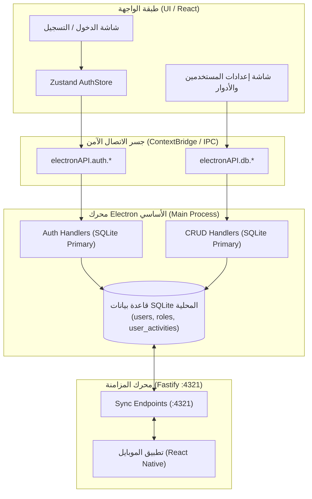

# 📄 وثيقة المتطلبات الهندسية والمعمارية (PRD): توحيد نظام المصادقة والمستخدمين والصلاحيات
> **المشروع**: AN POS | **المكونات المستهدفة**: `LoginPage`, `authStore`, `SettingsPage`, `roleRepo`, `electron/main/handlers/auth.ts`, `syncEngine`  
> **تاريخ الإصدار**: سبتمبر 2026 | **الحالة**: المرحلة الأولى مُنفذة بنجاح ✅ + المرحلة الثانية قيد التخطيط والاعتماد 📌

---

## 📌 1. الفهرس التنفيذي
1. [خلفية المشكلة وتشخيص الانفصام المعماري (Architectural Split-Brain)](#1-خلفية-المشكلة-وتشخيص-الانفصام-المعماري)
2. [المرحلة 1: الإصلاح الفوري لإنشاء الحسابات والدخول (Hotfix Delivered)](#2-المرحلة-1-الإصلاح-الفوري-لإنشاء-الحسابات-والدخول)
3. [المرحلة 2: توحيد منظومة الصلاحيات والأدوار (Roles & Permissions Migration)](#3-المرحلة-2-توحيد-منظومة-الصلاحيات-والأدوار)
4. [المرحلة 3: دمج الحسابات والصلاحيات في محرك المزامنة مع الموبايل (Sync Engine)](#4-المرحلة-3-دمج-الحسابات-والصلاحيات-في-محرك-المزامنة-مع-الموبايل)
5. [مخطط تدفق البيانات المعتمد (Unified Target Architecture)](#5-مخطط-تدفق-البيانات-المعتمد)
6. [خطة الاختبار والتحقق الشاملة (Verification Plan)](#6-خطة-الاختبار-والتحقق-الشاملة)

---

## 1. خلفية المشكلة وتشخيص الانفصام المعماري

### 🚨 أصل الخلل المعماري:
كان تطبيق **AN POS** يعاني من مسارات متوازية غير متزامنة لإدارة المستخدمين والمصادقة:
1. **شاشة تسجيل الحساب الجديد (`LoginPage.tsx`)**:
   - كانت تكتب في قاعدة بيانات المتصفح **IndexedDB / Dexie** فقط عبر `db.users.add()`.
   - كانت تحاول عمل `fetch` إلى منفذ وهمي غير موجود `http://localhost:3001/api/auth/register` (بينما خادم Fastify الفعلي يعمل على المنفذ `4321`).
2. **شاشة تسجيل الدخول (`authStore.ts` -> `api.auth.login`)**:
   - تمر عبر قنوات الـ IPC إلى محرك Electron الرئيسي وتستعلم حصرياً من **قاعدة بيانات SQLite الحقيقية** (`SELECT * FROM users WHERE username = ?`).
3. **تبويب المستخدمين في الإعدادات (`SettingsPage.tsx` / `UsersRolesTab.tsx`)**:
   - كان يقرأ ويكتب المستخدمين وكلمات المرور في **Dexie** بدلاً من SQLite!
   - الأدوار والصلاحيات كانت معزولة في `roleRepo` المرتبط بـ Dexie، وغير متزامنة إطلاقاً مع الهواتف المحمولة أو محرك المزامنة.

> 📉 **النتيجة الكارثية السابقة**: أي مستخدم جديد يسجل حسابه، أو أي كاشير يضيفه المدير من الإعدادات، أو أي كلمة مرور يتم تغييرها، كانت تضيع في فراغ Dexie، ويعجز الكاشير عن تسجيل الدخول للنظام نهائياً!

---

## 2. المرحلة 1: الإصلاح الفوري لإنشاء الحسابات والدخول (Hotfix Delivered)

تم تنفيذ هذه المرحلة بالكامل في الكود لإنقاذ الدخول الفوري:

### ما تم تنفيذه:
1. **ترقية `authStore.ts`**:
   - إضافة دالة `register(data)` إلى `useAuthStore` و `AuthState`.
   - استدعاء `window.electronAPI.auth.register(data)` التي تتخاطب عبر IPC مع دالة `registerUser` في `electron/main/handlers/auth.ts`.
   - الكتابة المباشرة في جدول `users` في **قاعدة بيانات SQLite**.
2. **تصحيح `LoginPage.tsx`**:
   - حذف الثابت الوهمي `API_BASE = 'http://localhost:3001/api'`.
   - استبدال الاستدعاء القديم بالدالة الموحدة `register(...)` من `useAuthStore`.
   - مزامنة كاش Dexie المحلي لضمان عدم تعطل أي واجهة مؤقتة تعتمد على الكاش.
3. **تصحيح إدارة المستخدمين في `SettingsPage.tsx`**:
   - **الاستعلام (`useQuery(['users'])`)**: قراءة المستخدمين من SQLite أولاً عبر `api.db.list('users')` ومزامنة الكاش.
   - **إضافة مستخدم (`addUserMutation`)**: حفظ المستخدم فورياً في SQLite عبر `api.db.create('users', ...)`.
   - **تعديل مستخدم (`updateUserMutation`)**: تحديث بيانات المستخدم في SQLite عبر `api.db.update('users', ...)`.
   - **تبديل الحالة وحذف المستخدم (`toggleStatusMutation` / `deleteUserMutation`)**: تحديث الحالة `active` / `inactive` في SQLite.
   - **إعادة تعيين كلمة المرور (`handleResetPassword`)**: تحديث الـ PIN فورياً في SQLite عبر `api.db.update('users', userId, { pin, ... })`.

---

## 3. المرحلة 2: توحيد منظومة الصلاحيات والأدوار (Roles & Permissions Migration)

### 🎯 الهدف:
نقل مستودع الأدوار `roleRepo` من Dexie إلى **SQLite** بحيث تصبح الأدوار مخزنة في جدول `roles` المركزي.

### 📐 جدول قاعدة بيانات SQLite المستهدف:
جدول `roles` موجود بالفعل في `electron/main/schema-init.ts`:
```sql
CREATE TABLE IF NOT EXISTS roles (
  id TEXT PRIMARY KEY,
  name TEXT UNIQUE NOT NULL,
  description TEXT DEFAULT '',
  permissions TEXT NOT NULL DEFAULT '{}',
  is_system INTEGER NOT NULL DEFAULT 0,
  created_at TEXT NOT NULL DEFAULT (datetime('now'))
);
```

### 🛠️ خطوات التنفيذ المطلوبة:
1. **تحديث `roleRepo.ts`**:
   - تعديل دوال المستودع (`all`, `get`, `create`, `update`, `remove`) لتستخدم قنوات IPC المتاحة: `window.electronAPI.db.list('roles')`, `window.electronAPI.db.create('roles', ...)`, الخ.
   - تحويل حقل الصلاحيات `permissions` بين كائن JavaScript وسلسلة JSON مخزنة في SQLite.
2. **حماية الأدوار النظامية (System Roles)**:
   - منع حذف أو تعديل الأدوار التي تحمل `is_system = 1` (المدير، الكاشير، البائع، المحاسب) على مستوى محرك SQLite ومستوى الواجهة.

---

## 4. المرحلة 3: دمج الحسابات والصلاحيات في محرك المزامنة مع الموبايل (Sync Engine)

### 🎯 الهدف:
تمكين أجهزة الهواتف المحمولة وتطبيق التابلت (React Native) من استلام قائمة المستخدمين وصلاحيات الأدوار بشكل مشفر ومحمي.

### 📐 التعديلات في محرك المزامنة (`syncEngine.ts` & `Fastify Server`):
1. **قنوات السحب (Pull Channels)**:
   - إضافة جدولي `users` (مع حجب حقول الأمان مثل `pin` و `login_attempts` وإرسال البيانات العامة فقط: الاسم، المعرف، الدور) وجدول `roles` إلى بروتوكول المزامنة في `electron/main/server/routes/sync.ts`.
2. **محاذاة تطبيق الموبايل (`mobile-rn`)**:
   - تحديث قاعدة بيانات الموبايل المحلية لاستيعاب جدول الأدوار `roles`.
   - تطبيق دالة فحص الصلاحيات `hasPermission(user, 'pos.discount')` على واجهات نقاط البيع المحمولة.

---

## 5. مخطط تدفق البيانات المعتمد (Unified Target Architecture)



---

## 6. خطة الاختبار والتحقق الشاملة (Verification Plan)

### سيناريو 1: تسجيل مستخدم جديد وتسجيل دخوله فورياً
1. فتح نافذة `تسجيل جديد` من شاشة الدخول.
2. إدخال: الاسم الكامل `أحمد كاشير`، اسم المستخدم `ahmed_pos`، كلمة المرور `12345678`.
3. الضغط على إنشاء حساب.
4. **النتيجة المتوقعة**: يتم إنشاء الحساب في جدول `users` في SQLite فورياً بنجاح.
5. التبديل إلى شاشة الدخول، وإدخال `ahmed_pos` و `12345678`.
6. **النتيجة المتوقعة**: تسجيل الدخول بنجاح والانتقال إلى لوحة التحكم / نقطة البيع دون أي خطأ.

### سيناريو 2: إضافة كاشير من الإعدادات وإعادة تعيين كلمة المرور
1. الدخول كمدير إلى `الإعدادات > المستخدمون والأدوار`.
2. إضافة مستخدم جديد `كاشير المساء` برمز سري `87654321`.
3. تسجيل الخروج والدخول باسم `كاشير المساء` والرمز `87654321`.
4. **النتيجة المتوقعة**: تسجيل الدخول بنجاح لأن الحساب كُتب في SQLite.
5. العودة كمدير والضغط على `إعادة تعيين كلمة المرور` وتعيين `11223344`.
6. تجربة الدخول بالرمز الجديد.
7. **النتيجة المتوقعة**: قبول الرمز الجديد فورياً.

---

**وثيقة معتمدة وموثقة في مستودع المشروع**: [AUTH_AND_SYNC_ARCHITECTURE_PRD.md](file:///home/ammar/AN-POS-TEST/AUTH_AND_SYNC_ARCHITECTURE_PRD.md)
