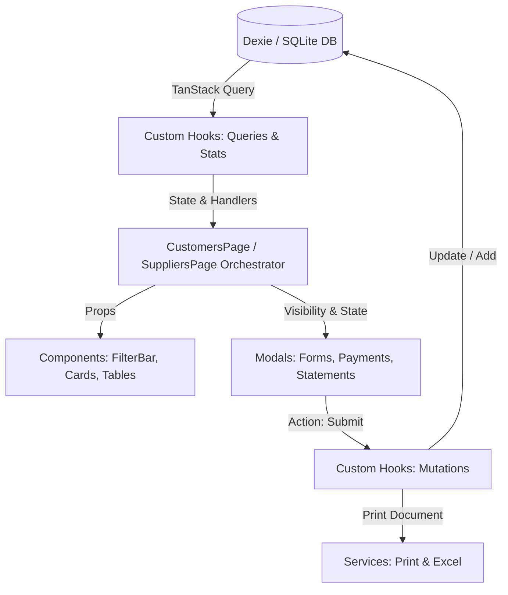

# معمارية نمطية متقدمة لإدارة العملاء والموردين (Customers & Suppliers Modular Architecture)

## 1. المقدمة ونطاق المعمارية
يحتوي نظام **AN POS** على وحدتين أساسيتين لإدارة الذمم المالية والحسابات:
1. **العملاء (Customers):** إدارة الزبائن، المبيعات الآجلة (الكريدي)، حدود الائتمان، تسديد الديون، كشوفات الحساب، وطباعة وصولات القبض والتقارير.
2. **الموردين (Suppliers):** إدارة الموردين، فواتير الشراء والتوريد، تسديد المستحقات (الدائنة)، مطابقة الفواتير، استيراد فواتير PDF الذكية، وكشوفات الحساب.

تُعالج هذه المعمارية مشكلة **الملفات الضخمة (Monolithic Components)** التي تجاوزت 2,000 سطر في ملف واحد (`CustomersPage.tsx` بـ 1,864 سطراً، و `SuppliersPage.tsx` بـ 2,152 سطراً)، من خلال التحول إلى **معمارية الشرائح النمطية الموجهة للميزات (Feature-Sliced Modular Architecture)** مع الالتزام بمبادئ **SOLID** و **Clean Code**.

---

## 2. الهيكل المعماري المقترح للمجلدات

```tree
src/features/
├── customers/
│   ├── CustomersPage.tsx                  # المنسق الرئيسي للصفحة (Orchestrator - ~120 سطر فقط)
│   ├── types.ts                           # الأنواع الخاصة بواجهات العملاء، الفلاتر، والنماذج
│   ├── components/                        # مكونات العرض النقية (Presentational Components)
│   │   ├── CustomerStatsCards.tsx         # بطاقات الإحصائيات المالية (إجمالي الديون، الاستردادات، التجاوز)
│   │   ├── CustomerFilterBar.tsx          # شريط البحث، التبويبات، الفرز، وإجراءات التصدير والطباعة
│   │   ├── CustomerGrid.tsx               # شبكة عرض بطاقات العملاء وحالات الديون
│   │   ├── CustomerCard.tsx               # بطاقة العميل الفردية مع أزرار الإجراءات السريعة
│   │   └── CustomerPagination.tsx         # ترقيم الصفحات
│   ├── modals/                            # النوافذ المنبثقة المنفصلة (Modals)
│   │   ├── CustomerFormModal.tsx          # نافذة إضافة وتعديل عميل (بيانات تجارية وضريبية)
│   │   ├── CustomerPaymentModal.tsx       # نافذة تسديد الديون ومستحقات الكريدي مع الوصل
│   │   ├── CustomerStatementModal.tsx     # نافذة كشف الحساب التفاعلي مع خيارات التصفية والطباعة
│   │   └── CustomerDeleteModal.tsx        # نافذة تأكيد حذف عميل
│   ├── hooks/                             # منطق العمل والاستعلامات (Business Logic & Hooks)
│   │   ├── useCustomerQueries.ts          # استعلامات TanStack Query (عملاء، مبيعات، تسديدات، إعدادات)
│   │   ├── useCustomerMutations.ts        # عمليات الإضافة، التعديل، الحذف، وسندات القبض
│   │   ├── useCustomerFilters.ts          # منطق البحث، التصفية بالتبويب، الفرز، والتقسيم لصفحات
│   │   └── useCustomerStats.ts            # الحسابات المالية المركبة، نسب استغلال الائتمان
│   └── services/                          # الخدمات المنفصلة (Printing & Excel)
│       ├── customerPrintService.ts        # طباعة وصولات القبض، كشوفات الحساب، وتقارير الديون
│       ├── customerExcelService.ts        # تصدير واستيراد بيانات العملاء عبر Excel (XLSX)
│       └── customerStatus.ts              # فحص حالة الائتمان وتوليد روابط تذكير واتساب
│
├── suppliers/
│   ├── SuppliersPage.tsx                  # المنسق الرئيسي للصفحة (Orchestrator - ~150 سطر فقط)
│   ├── types.ts                           # أنواع التبويبات، نماذج الفواتير، وكشوفات الموردين
│   ├── components/                        # مكونات العرض
│   │   ├── SupplierStatsCards.tsx         # بطاقات الإحصائيات (المستحقات، المشتريات، الموردين)
│   │   ├── SupplierFilterBar.tsx          # شريط التبويبات الثلاثة (موردين، فواتير، كشف حساب)، البحث
│   │   ├── SupplierGrid.tsx               # شبكة بطاقات الموردين
│   │   ├── SupplierCard.tsx               # بطاقة المورد الفردية وأزرار الاتصال والتسديد
│   │   ├── SupplierInvoicesTable.tsx      # جدول فواتير المشتريات مع حالة السداد والتفاصيل
│   │   └── SupplierStatementView.tsx      # العرض التفاعلي لكشف حساب المورد المحدد
│   ├── modals/                            # النوافذ المنبثقة
│   │   ├── SupplierFormModal.tsx          # إضافة / تعديل مورد
│   │   ├── SupplierPaymentModal.tsx       # تسديد دفعة لمورد مع طباعة السند
│   │   ├── SupplierInvoiceModal.tsx       # إنشاء فاتورة شراء جديدة (إدخال سلع، باركود، مزامنة المخزون)
│   │   ├── SupplierInvoiceViewModal.tsx   # معاينة تفاصيل الفاتورة وبنودها
│   │   ├── SupplierInvoicePdfModal.tsx    # استيراد ومعالجة الفواتير عبر PDF
│   │   └── SupplierDeleteModal.tsx        # تأكيد حذف مورد
│   ├── hooks/                             # منطق العمل والمشتريات
│   │   ├── useSupplierQueries.ts          # استعلامات الموردين، المشتريات، البنود، المنتجات، التصنيفات
│   │   ├── useSupplierMutations.ts        # إضافة مورد، حفظ فاتورة مشتريات مع تحديث المخزون، وتسديد دفعات
│   │   ├── useSupplierFilters.ts          # إدارة التبويبات والفرز والبحث في الموردين والفواتير
│   │   └── useSupplierStats.ts            # إحصائيات الديون والمشتريات الإجمالية
│   └── services/                          # الخدمات الخارجية والطباعة
│       ├── supplierPrintService.ts        # طباعة سند صرف، كشف حساب مورد، وتقرير المستحقات الإجمالية
│       └── supplierExcelService.ts        # تصدير دليل الموردين إلى Excel
```

---

## 3. مبادئ المعمارية وتوزيع المسؤوليات (Separation of Concerns)

### أ. مبدأ المسؤولية الواحدة (Single Responsibility Principle - SRP):
- **الصفحة الرئيسية (`*Page.tsx`):** مهمتها التنسيق فقط؛ تجمع الـ Hooks وتمرر البيانات إلى المكونات الفرعية وتتحكم في فتح/إغلاق النوافذ المنبثقة، بحيث لا يتجاوز حجمها 150 سطراً.
- **مكونات العرض (`components/`):** مكونات نقية (Pure Components) تستقبل الـ Props وترسم الواجهة، دون إجراء أي استعلامات قاعدة بيانات أو طفرات مباشرة.
- **منطق الأعمال والبيانات (`hooks/`):** كل ما يتعلق بالاستعلامات، التحديثات، الفرز، والعمليات الحسابية يتم عزله في Custom Hooks قابلة للاختبار المستقل (Unit Testing).
- **الخدمات المستقلة (`services/`):** عزل كود توليد قوالب الطباعة (HTML Strings / iframe Print) والتعامل مع مكتبة `xlsx` بعيداً عن كود React، مما يحسن الأداء وسرعة التصيير (Render Performance).

### ب. تدفق البيانات والعمليات (Data Flow):



---

## 4. المزايا التقنية للمعمارية الجديدة

1. **سهولة الصيانة والتطوير (Maintainability):**
   - تعديل تصميم بطاقة العميل أو إضافة حقل جديد لا يتطلب فتح ملف بـ 2,000 سطر، بل يتم مباشرة في `CustomerCard.tsx`.
   - تعديل منطق احتساب الديون أو الفلاتر يتم في `useCustomerFilters.ts` دون التأثير على الواجهة.
2. **تحسين الأداء وتفادي إعادة التصيير غير الضروري (Render Optimization):**
   - عزل الـ State الخاص بكل نافذة منبثقة أو حقل بحث يمنع إعادة تصيير الصفحة بالكامل عند كتابة حرف في البحث أو فتح نافذة التسديد.
3. **إمكانية إعادة الاستخدام (Reusability):**
   - مكونات مثل ترقيم الصفحات (`Pagination`) وشريط التصفية والطباعة تصبح قابلة لإعادة الاستخدام عبر أجزاء النظام.
4. **تغطية الاختبارات التلقائية (Testability):**
   - يمكن كتابة اختبارات وحدة (Unit Tests) لـ `customerStatus.ts` و `useCustomerStats.ts` و `useSupplierMutations.ts` بسهولة وبشكل منعزل تماماً عن الـ DOM.
5. **توافق كامل 100% (Zero Breaking Changes):**
   - المسارات الحالية (`/customers` و `/suppliers`)، والجداول في `db`، وتنسيق الطباعة وشكل الواجهة ستظل متطابقة تماماً دون أي تغيير يمس تجربة المستخدم أو تماسك النظام.

---

## 5. خطة التنفيذ المقترحة خطوة بخطوة

1. **المرحلة الأولى: نمذجة العملاء (Customers Feature Refactoring):**
   - استخراج `types.ts`، `customerStatus.ts`، `customerPrintService.ts`، و `customerExcelService.ts`.
   - استخراج Custom Hooks: `useCustomerQueries`، `useCustomerMutations`، `useCustomerFilters`، و `useCustomerStats`.
   - استخراج المكونات الفرعية: `CustomerStatsCards`، `CustomerFilterBar`، `CustomerGrid`، و `CustomerCard`.
   - استخراج النوافذ المنبثقة: `CustomerFormModal`، `CustomerPaymentModal`، `CustomerStatementModal`، و `CustomerDeleteModal`.
   - تبسيط `CustomersPage.tsx` ليصبح المنسق النظيف.
   - التحقق وتشغيل الاختبارات للتأكد من خلو المشروع من أخطاء الـ Lint والـ TypeCheck.

2. **المرحلة الثانية: نمذجة الموردين (Suppliers Feature Refactoring):**
   - استخراج `types.ts`، `supplierPrintService.ts`، و `supplierExcelService.ts`.
   - استخراج Custom Hooks: `useSupplierQueries`، `useSupplierMutations`، `useSupplierFilters`، و `useSupplierStats`.
   - استخراج المكونات الفرعية: `SupplierStatsCards`، `SupplierFilterBar`، `SupplierGrid`، `SupplierCard`، `SupplierInvoicesTable`، و `SupplierStatementView`.
   - استخراج النوافذ المنبثقة: `SupplierFormModal`، `SupplierPaymentModal`، `SupplierInvoiceModal`، `SupplierInvoiceViewModal`، ونقل `SupplierInvoicePdfModal`.
   - تبسيط `SuppliersPage.tsx` ليصبح منسقاً أنيقاً وموجزاً.
   - التحقق وتشغيل الاختبارات للتأكد من استقرار تدفق المشتريات وتحديث المخزون.
