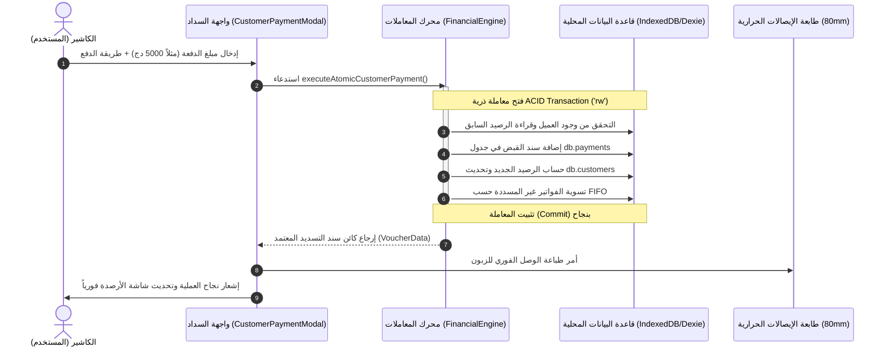
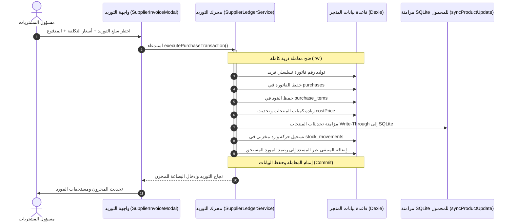
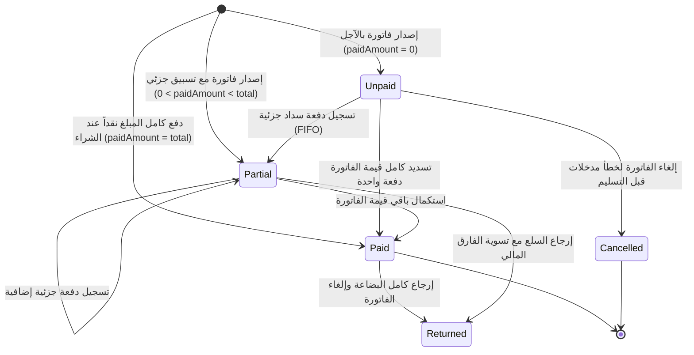

# معمارية المنطق المالي والمحاسبي: العملاء والموردين
# Financial Business Logic & Ledger Architecture: Customers & Suppliers

> **إصدار الوثيقة:** 2.0  
> **التصنيف:** معمارية النظم المالية، الذمم المدينة والدائنة (Accounts Receivable & Accounts Payable)، وسجلات الأستاذ المالي (Financial Ledgers)  
> **النظام المستهدف:** نظام إدارة نقاط البيع والمخزون **AN POS**

---

## الفهرس العام (Table of Contents)

1. [المفاهيم المحاسبية والأسس المالية (Accounting Foundations)](#1-المفاهيم-المحاسبية-والأسس-المالية)
2. [معادلات الأرصدة ودفتر الأستاذ التراكمي (Running Balance Engine)](#2-معادلات-الأرصدة-ودفتر-الأستاذ-التراكمي)
3. [منطق التسديد والتحصيل والتسوية الذكية (Settlement & Allocation Logic)](#3-منطق-التسديد-والتحصيل-والتسوية-الذكية)
4. [معمارية المعاملات الذرية والنزاهة المالية (ACID Transactions & Data Integrity)](#4-معمارية-المعاملات-الذرية-والنزاهة-المالية)
5. [محرك فحص سقف الائتمان وإدارة المخاطر (Credit Limit & Risk Engine)](#5-محرك-فحص-سقف-الائتمان-وإدارة-المخاطر)
6. [التصميم البرمجي للخدمات المحاسبية (Domain Services Architecture)](#6-التصميم-البرمجي-للخدمات-المحاسبية)
7. [معالجة حالات الحافة والعمليات الاستثنائية (Edge Cases & Advanced Scenarios)](#7-معالجة-حالات-الحافة-والعمليات-الاستثنائية)
8. [مخططات التدفق والتفاعل المعماري (Architectural Sequence & State Diagrams)](#8-مخططات-التدفق-والتفاعل-المعماري)

---

## 1. المفاهيم المحاسبية والأسس المالية

### 1.1 طبيعة الحسابات (Account Natures)

في الأنظمة المالية المزدوجة القيود والمحاسبة المعيارية:

| الحساب | التصنيف المحاسبي | الطبيعة الأصلية | عند الزيادة (+) | عند النقصان (-) | معنى الرصيد الموجب | معنى الرصيد السالب |
| :--- | :--- | :---: | :---: | :---: | :--- | :--- |
| **حساب العميل (Customer / Debtor)** | أصول متداولة (Accounts Receivable) | **مدين (Debit)** | مدين (فاتورة بيع بالآجل) | دائن (دفعة تسديد أو مرتجع) | العميل **مدين للمتجر** (له ديون قائمة عليه) | للعميل **رصيد دائن** مسبق (دفعة مقدماً / Overpayment) |
| **حساب المورد (Supplier / Creditor)** | التزامات متداولة (Accounts Payable) | **دائن (Credit)** | دائن (فاتورة شراء بالآجل) | مدين (دفعة مسددة له أو مرتجع شراء) | المتجر **مدين للمورد** (مستحقات واجبة السداد) | للمتجر **رصيد مسبق** لدى المورد (سلفة شراء مقدمة) |

```
                       ┌──────────────────────────────────────────────┐
                       │           دورة الحركة المالية للمتجر        │
                       └──────────────────────────────────────────────┘
                                              │
                    ┌─────────────────────────┴─────────────────────────┐
                    ▼                                                   ▼
       ┌────────────────────────┐                          ┌────────────────────────┐
       │     حسابات العملاء     │                          │     حسابات الموردين    │
       │  Accounts Receivable   │                          │    Accounts Payable    │
       │     (طبيعة مدينة)      │                          │     (طبيعة دائنة)      │
       └────────────────────────┘                          └────────────────────────┘
          ▲                  │                                │                  ▲
   بيع بالدين (+)      تسديد دفعة (-)                  شراء بالدين (+)     تسليم دفعة (-)
 (تزيد رصيد الدين)   (تخفض رصيد الدين)               (تزيد المستحقات)    (تخفض المستحقات)
```

---

## 2. معادلات الأرصدة ودفتر الأستاذ التراكمي

### 2.1 معادلة رصيد العميل التراكمي (Customer Running Balance)

لكل حركة مالية $i$ في كشف حساب العميل مرتبة زمنياً تصاعدياً ($t_0 \le t_1 \le \dots \le t_n$):

$$\text{RunningBalance}_i = \text{RunningBalance}_{i-1} + \text{Debit}_i - \text{Credit}_i$$

حيث:
- $\text{Debit}_i$ (المدين): يمثل **قيمة فاتورة البيع** أو أي رسوم إضافية تزيد التزام العميل:
  $$\text{Debit}_i = \begin{cases} \text{SaleTotal}_i, & \text{إذا كانت الحركة فاتورة بيع} \\ 0, & \text{بخلاف ذلك} \end{cases}$$
- $\text{Credit}_i$ (الدائن): يمثل **المبلغ المسدد نقداً/بنكياً** أو المرتجعات المقبولة:
  $$\text{Credit}_i = \begin{cases} \text{PaidAmount}_i, & \text{إذا كانت الحركة دفعة فورية مع الفاتورة} \\ \text{VoucherAmount}_i, & \text{إذا كانت الحركة سند قبض دفعة لاحقة} \\ \text{ReturnTotal}_i, & \text{إذا كانت الحركة مرتجع مبيعات} \\ 0, & \text{بخلاف ذلك} \end{cases}$$

### 2.2 معادلة رصيد المورد التراكمي (Supplier Running Balance)

لكل حركة مالية $j$ في كشف حساب المورد مرتبة زمنياً تصاعدياً:

$$\text{RunningPayable}_j = \text{RunningPayable}_{j-1} + \text{GoodsValue}_j - \text{PaymentPaid}_j$$

حيث:
- $\text{GoodsValue}_j$ (السلع المستلمة): تمثل قيمة فاتورة التوريد والشراء الصادرة من المورد:
  $$\text{GoodsValue}_j = \text{PurchaseTotal}_j$$
- $\text{PaymentPaid}_j$ (المدفوع للمورد): يمثل المبالغ المسلمة للمورد نقداً أو بشيك أو تحويل بنكي:
  $$\text{PaymentPaid}_j = \text{ImmediatePaid}_j + \text{DisbursementVoucher}_j$$

### 2.3 الفرز الزمني الصارم (Deterministic Chronological Ordering)

عند تساوي تاريخ الحركات المالية باليوم، يتم تطبيق أسبقية الفرز المحاسبي لضمان دقة الرصيد اللحظي:
1. الفواتير الأصلية أولاً (الأصل في نشوء الالتزام).
2. الدفعات النقدية ثانياً (إطفاء الالتزام).
3. إشعارات الخصم والمرتجعات ثالثاً.

---

## 3. منطق التسديد والتحصيل والتسوية الذكية

في معمارية النظم المتقدمة، لا يقتصر التسديد على مجرد تعديل رقم الرصيد العام في جدول العميل، بل ينقسم المنطق إلى نموذجين متكاملين:

```
                               ┌────────────────────────┐
                               │   استلام دفعة مالية    │
                               │    Incoming Payment    │
                               └────────────────────────┘
                                           │
                    ┌──────────────────────┴──────────────────────┐
                    ▼                                             ▼
       ┌────────────────────────┐                    ┌────────────────────────┐
       │  1. تسوية الرصيد العام  │                    │ 2. تسوية الفواتير FIFO │
       │ Account-Level Balance  │                    │ Invoice-Level Matching │
       └────────────────────────┘                    └────────────────────────┘
       - تحديث Customer.balance                      - البحث عن أقدم الفواتير غير المسددة
       - حفظ سند القبض في Payments                   - توزيع المبلغ تدريجياً:
       - توليد إيصال الدفع                           - تحديث paidAmount و remainingBalance
                                                     - تحويل الحالة: unpaid -> partial -> paid
```

### 3.1 التسوية المتسلسلة للفواتير (FIFO Allocation Algorithm)

عندما يدفع العميل دفعة إجمالية (مثلاً: 15,000 دج) ولديه عدة فواتير معلقة، يقوم المحرك المحاسبي بتسوية الفواتير وفق أقدمية الإصدار (**FIFO - First In, First Out**):

```typescript
export interface InvoiceAllocationResult {
  invoiceId: string;
  invoiceNumber: string;
  invoiceDate: string;
  originalTotal: number;
  previouslyPaid: number;
  allocatedAmount: number;
  remainingAfter: number;
  newStatus: 'paid' | 'partial' | 'unpaid';
}

export function allocatePaymentFIFO(
  unpaidInvoices: Array<{
    id: string;
    number: string;
    date: string;
    total: number;
    paidAmount: number;
  }>,
  incomingPaymentAmount: number
): {
  allocations: InvoiceAllocationResult[];
  unallocatedRemaining: number; // الرصيد المتبقي (فائض التسديد إن وجد)
} {
  // 1. فرز الفواتير من الأقدم إلى الأحدث
  const sortedInvoices = [...unpaidInvoices].sort(
    (a, b) => new Date(a.date).getTime() - new Date(b.date).getTime()
  );

  let remainingPayment = incomingPaymentAmount;
  const allocations: InvoiceAllocationResult[] = [];

  for (const inv of sortedInvoices) {
    if (remainingPayment <= 0) break;

    const currentPaid = Number(inv.paidAmount) || 0;
    const currentUnpaid = Math.max(0, inv.total - currentPaid);

    if (currentUnpaid <= 0) continue; // الفاتورة مسددة مسبقاً

    const allocation = Math.min(remainingPayment, currentUnpaid);
    const newPaid = currentPaid + allocation;
    const newRemaining = inv.total - newPaid;

    allocations.push({
      invoiceId: inv.id,
      invoiceNumber: inv.number,
      invoiceDate: inv.date,
      originalTotal: inv.total,
      previouslyPaid: currentPaid,
      allocatedAmount: allocation,
      remainingAfter: newRemaining,
      newStatus: newRemaining === 0 ? 'paid' : newPaid > 0 ? 'partial' : 'unpaid',
    });

    remainingPayment -= allocation;
  }

  return {
    allocations,
    unallocatedRemaining: remainingPayment, // إذا كان أكبر من 0 يعتبر دفعة مقدماً (Credit Balance)
  };
}
```

---

## 4. معمارية المعاملات الذرية والنزاهة المالية

### 4.1 المشكلة الكبرى في العمليات غير الذرية (Non-Atomic Hazards)

إذا تمت عملية إضافة سند القبض في جدول `payments`، ثم انقطع التيار الكهربائي أو حدث استثناء قبل تحديث `customers.balance`:
1. يظهر السند في تقرير الصندوق المالي.
2. لا يزال العميل مديناً بنفس المبلغ في بطاقته الشخصية.
3. يحدث عجز محاسبي وتضارب غير مقبول.

### 4.2 الحل المعماري: Dexie ACID Transactions

يجب أن تنفذ كل عملية سداد أو شراء داخل معاملة ذرية للقراءة والكتابة (`db.transaction('rw', ...)`):

```typescript
import { db } from '@/infrastructure/database/dexie/db';
import { generateId } from '@/utils';

export async function executeAtomicCustomerPayment(params: {
  customerId: string;
  amount: number;
  method: 'cash' | 'check' | 'transfer' | 'baridimob';
  note?: string;
  receivedBy: string;
}) {
  return await db.transaction('rw', [db.customers, db.payments, db.sales], async () => {
    // 1. قفل وقراءة السجل الأصلي للعميل للتحقق
    const customer = await db.customers.get(params.customerId);
    if (!customer) {
      throw new Error(`العميل برقم ${params.customerId} غير موجود بالنظام`);
    }

    if (params.amount <= 0) {
      throw new Error('مبلغ السداد يجب أن يكون أكبر من الصفر');
    }

    const previousBalance = Number(customer.balance) || 0;
    const now = new Date().toISOString();
    const paymentId = generateId();

    // 2. تسجيل سند القبض المالي
    await db.payments.add({
      id: paymentId,
      date: now,
      customerId: customer.id,
      amount: params.amount,
      type: 'credit', // دائن لحساب العميل (يخفض مديونيته)
      method: params.method as any,
      note: params.note || undefined,
      createdBy: params.receivedBy,
      createdAt: now,
    });

    // 3. احتساب الرصيد الجديد بدقة (مع دعم الرصيد الدائن إذا دفع أكثر من المطلوب)
    const newBalance = previousBalance - params.amount;

    // 4. تحديث بطاقة العميل
    await db.customers.update(customer.id, {
      balance: newBalance,
      updatedAt: now,
    });

    // 5. التسوية الذاتية للفواتير المعلقة (FIFO)
    const pendingSales = await db.sales
      .where('customerId')
      .equals(customer.id)
      .filter((s) => s.status !== 'paid' && s.type === 'sale')
      .toArray();

    const { allocations } = allocatePaymentFIFO(pendingSales, params.amount);

    for (const alloc of allocations) {
      await db.sales.update(alloc.invoiceId, {
        paidAmount: alloc.previouslyPaid + alloc.allocatedAmount,
        status: alloc.newStatus,
        updatedAt: now,
      });
    }

    // 6. إرجاع بيانات السند للطباعة والتدقيق
    return {
      paymentId,
      customerId: customer.id,
      customerName: customer.name,
      customerPhone: customer.phone,
      amount: params.amount,
      previousBalance,
      newBalance,
      method: params.method,
      note: params.note,
      date: now,
      allocationsCount: allocations.length,
    };
  });
}
```

---

## 5. محرك فحص سقف الائتمان وإدارة المخاطر

### 5.1 نموذج تقييم أهلية الائتمان (Credit Eligibility Evaluation)

قبل اعتماد أي فاتورة بيع آجل (`sale` مع متبقي غير مدفوع):

$$\text{ProjectedDebt} = \text{CurrentBalance} + (\text{NewInvoiceTotal} - \text{ImmediatePaid})$$

يخضع القرار للقواعد التالية:

```typescript
export type CreditDecision = 
  | { allowed: true; utilizationRate: number; warning?: string }
  | { allowed: false; reason: string; limit: number; projected: number };

export function evaluateCreditRisk(
  customer: {
    name: string;
    balance: number;
    creditLimit: number;
  },
  newInvoiceNetDebt: number
): CreditDecision {
  const limit = Number(customer.creditLimit) || 0;
  const current = Math.max(0, Number(customer.balance) || 0);
  const projected = current + newInvoiceNetDebt;

  // إذا كان سقف الائتمان 0 فهذا يعني (بدون سقف ائتماني محدد - مسموح)
  if (limit <= 0) {
    return { allowed: true, utilizationRate: 0 };
  }

  // تجاوز السقف المسموح به
  if (projected > limit) {
    return {
      allowed: false,
      reason: `العملية مرفوضة: إجمالي الدين المتوقع (${projected.toLocaleString('fr-DZ')} دج) يتجاوز سقف الائتمان المسموح به للزبون "${customer.name}" البالغ (${limit.toLocaleString('fr-DZ')} دج).`,
      limit,
      projected,
    };
  }

  const utilizationRate = Math.round((projected / limit) * 100);

  // إشعار اقتراب من السقف (عند تجاوز 80%)
  if (utilizationRate >= 80) {
    return {
      allowed: true,
      utilizationRate,
      warning: `تنبيه: العميل استهلك ${utilizationRate}% من سقف الائتمان المتاح له.`,
    };
  }

  return {
    allowed: true,
    utilizationRate,
  };
}
```

### 5.2 تحليل تعمير الديون (Aging of Accounts Receivable & Payable)

تقسيم الديون إلى شرائح زمنية وفق تاريخ الفواتير غير المسددة:

```
┌─────────────────┬─────────────────┬─────────────────┬─────────────────┐
│  0 - 30 يوماً   │  31 - 60 يوماً  │  61 - 90 يوماً  │   +90 يوماً     │
│   (ديون عادية)  │   (ديون مستحقة) │ (مخاطر متوسطة)  │  (ديون حرجة)    │
│  Current Active │   Past Due 30+  │   Past Due 60+  │  Severe Default │
└─────────────────┴─────────────────┴─────────────────┴─────────────────┘
```

---

## 6. التصميم البرمجي للخدمات المحاسبية

### 6.1 هيكل الطبقات المستقل (Domain-Driven Service Layout)

```
src/services/financial/
├── contracts/
│   ├── ICustomerLedgerService.ts      # واجهات عقود عمليات العملاء
│   └── ISupplierLedgerService.ts      # واجهات عقود عمليات الموردين
├── CustomerLedgerService.ts           # المحرك المحاسبي لحركات العملاء
├── SupplierLedgerService.ts           # المحرك المحاسبي لحركات الموردين
├── CreditLimitEvaluator.ts            # فاحص سقوف الائتمان والقرارات المالية
└── FinancialAgingService.ts           # حساب تعمير الديون والشرائح الزمنية
```

### 6.2 خدمة دفتر الأستاذ للعملاء (`CustomerLedgerService`)

```typescript
export class CustomerLedgerService {
  /**
   * حساب كشف الحساب التراكمي الموحد للعميل
   */
  public static calculateCustomerStatement(
    sales: Array<{ date: string; number: string; total: number; paidAmount: number; status: string }>,
    payments: Array<{ date: string; amount: number; method: string; note?: string }>,
    options?: {
      dateFrom?: string;
      dateTo?: string;
      filterType?: 'all' | 'sales' | 'payments';
    }
  ) {
    const saleEntries = sales.map((s) => ({
      date: s.date,
      type: 'sale' as const,
      number: s.number,
      description: `فاتورة مبيعات #${s.number}`,
      debit: s.total,
      credit: s.paidAmount,
      status: s.status,
    }));

    const paymentEntries = payments.map((p) => ({
      date: p.date,
      type: 'payment' as const,
      number: '-',
      description: `تسديد دفعة (${p.method})${p.note ? ' - ' + p.note : ''}`,
      debit: 0,
      credit: p.amount,
      status: 'paid' as const,
    }));

    let ledger = [...saleEntries, ...paymentEntries];

    if (options?.filterType === 'sales') ledger = saleEntries;
    if (options?.filterType === 'payments') ledger = paymentEntries;

    if (options?.dateFrom) {
      ledger = ledger.filter((e) => new Date(e.date) >= new Date(options.dateFrom!));
    }
    if (options?.dateTo) {
      ledger = ledger.filter((e) => new Date(e.date) <= new Date(options.dateTo + 'T23:59:59'));
    }

    // فرز تصاعدي دقيق
    ledger.sort((a, b) => new Date(a.date).getTime() - new Date(b.date).getTime());

    let runningBalance = 0;
    const calculatedEntries = ledger.map((entry) => {
      runningBalance += entry.debit - entry.credit;
      return {
        ...entry,
        runningBalance,
      };
    });

    const totalPurchases = calculatedEntries.reduce((acc, e) => acc + e.debit, 0);
    const totalPayments = calculatedEntries.reduce((acc, e) => acc + e.credit, 0);

    return {
      entries: calculatedEntries,
      summary: {
        totalPurchases,
        totalPayments,
        netBalance: totalPurchases - totalPayments,
      },
    };
  }
}
```

### 6.3 خدمة دفتر الأستاذ للموردين (`SupplierLedgerService`)

```typescript
export class SupplierLedgerService {
  /**
   * تنفيذ شراء مع تحديث المخزون ومزامنة SQLite وحساب المورد ذرياً
   */
  public static async executePurchaseTransaction(params: {
    supplierId: string;
    items: Array<{ productId: string; name: string; qty: number; unitPrice: number; lineTotal: number }>;
    total: number;
    paidAmount: number;
    invoicePrefix: string;
    syncProductUpdate: (id: string, changes: any) => Promise<void>;
  }) {
    return await db.transaction(
      'rw',
      [db.purchases, db.purchase_items, db.products, db.stock_movements, db.suppliers],
      async () => {
        const now = new Date().toISOString();
        const purchaseId = generateId();

        // 1. توليد رقم تسلسلي فريد
        const allPurchases = await db.purchases.toArray();
        const maxNum = allPurchases.reduce((max, p) => {
          const num = parseInt(p.number.slice(-6)) || 0;
          return num > max ? num : max;
        }, 0);
        const invoiceNumber = `${params.invoicePrefix}-PSH-${String(maxNum + 1).padStart(6, '0')}`;

        // 2. تسجيل الفاتورة في جدول purchases
        const netRemaining = params.total - params.paidAmount;
        await db.purchases.add({
          id: purchaseId,
          number: invoiceNumber,
          date: now,
          supplierId: params.supplierId,
          subtotal: params.total,
          tvaAmount: 0,
          total: params.total,
          status: 'confirmed',
          createdAt: now,
          updatedAt: now,
          paidAmount: params.paidAmount,
          remainingBalance: netRemaining,
        } as any);

        // 3. تسجيل بنود الشراء وتحديث الكميات وأسعار التكلفة
        for (const item of params.items) {
          await db.purchase_items.add({
            id: generateId(),
            purchaseId,
            productId: item.productId,
            name: item.name,
            qty: item.qty,
            unitPrice: item.unitPrice,
            lineTotal: item.lineTotal,
          });

          const product = await db.products.get(item.productId);
          if (product) {
            const changes = {
              quantity: (product.quantity || 0) + item.qty,
              costPrice: item.unitPrice,
              updatedAt: now,
            };
            await db.products.update(item.productId, changes);
            // مزامنة فورية مع قاعدة بيانات SQLite للمحمول
            await params.syncProductUpdate(item.productId, changes);
          }

          // حركة مخزنية
          await db.stock_movements.add({
            id: generateId(),
            productId: item.productId,
            type: 'purchase',
            qty: item.qty,
            createdBy: 'system',
            createdAt: now,
          });
        }

        // 4. تحديث رصيد المورد المستحق
        const supplier = await db.suppliers.get(params.supplierId);
        if (supplier) {
          await db.suppliers.update(supplier.id, {
            balance: (Number(supplier.balance) || 0) + netRemaining,
            updatedAt: now,
          });
        }

        return {
          purchaseId,
          invoiceNumber,
          netRemaining,
        };
      }
    );
  }
}
```

---

## 7. معالجة حالات الحافة والعمليات الاستثنائية

### 7.1 الوفاء الزائد (Overpayment & Negative Balance)
- **الحالة:** عميل عليه دين قدره 5,000 دج، وقام بدفع 7,000 دج.
- **المعالجة المحاسبية:**
  - يتم تسجيل السند بمبلغ 7,000 دج كاملاً.
  - يصبح الرصيد: $5000 - 7000 = -2000$ دج.
  - يظهر في الواجهة: **رصيد دائن لصالح العميل بقيمة 2,000 دج** بلون أخضر.
  - عند إصدار فاتورة بيع تالية، يخصم النظام تلقائياً من الرصيد الدائن المسبق قبل المطالبة بمبلغ إضافي.

### 7.2 إرجاع المبيعات الآجلة (Sales Returns on Credit)
- **الحالة:** عميل لديه فاتورة بمبلغ 10,000 دج لم يسددها بعد، وقام بإرجاع سلع بقيمة 3,000 دج.
- **المعالجة المحاسبية:**
  - يتم إصدار إشعار دائن (Credit Note) مرتبط برقم الفاتورة الأصلية.
  - تخفيض دين الفاتورة من 10,000 إلى 7,000 دج.
  - تخفيض رصيد العميل العام فورياً بمقدار 3,000 دج.
  - إعادة الكميات المرجعة إلى المخزون مع تسجيل حركة مخزنية من نوع `sale_return`.

### 7.3 الشيكات المؤجلة (Post-Dated Cheques)
- عند اختيار طريقة الدفع `check`:
  - يتم تسجيل رقم الشيك وتاريخ استحقاقه داخل حقل `note`.
  - لا يعتبر الشيك تسوية نهائية لحين التأكيد البنكي في الإدارة المحاسبية المتقدمة.

---

## 8. مخططات التدفق والتفاعل المعماري

### 8.1 مخطط تسلسل عملية تسديد دفعة عميل (Customer Payment Sequence)



### 8.2 مخطط تسلسل عملية توريد بضاعة من مورد (Supplier Delivery Sequence)



### 8.3 مخطط دورة حياة فاتورة البيع والآجل (Invoice Settlement Lifecycle)



---

## 9. مصفوفة التحقق والاختبارات الميدانية (Verification Matrix)

لضمان سلامة العمليات المحاسبية، يجب أن تجتاز المنظومة الاختبارات الآتية:

| كود الاختبار | وصف العملية | النتيجة المتوقعة |
| :--- | :--- | :--- |
| **FIN-TEST-01** | تسديد كامل الدين لزبون لديه 3 فواتير غير مسددة. | تحول رصيد الزبون إلى 0، وتحول حالات الفواتير الثلاث إلى `paid`. |
| **FIN-TEST-02** | تسديد جزئي يغطي الفاتورة الأولى ونصف الفاتورة الثانية. | تحول الفاتورة الأولى إلى `paid`، والثانية إلى `partial`، والثالثة تظل `unpaid`. |
| **FIN-TEST-03** | محاولة إنشاء فاتورة بيع آجل تتجاوز سقف الائتمان. | اعتراض المحرك وإيقاف العملية مع رسالة تحذيرية برفض سقف الائتمان. |
| **FIN-TEST-04** | تسديد مورد بمبلغ يفوق مستحقاته القائمة. | تحول رصيد المورد إلى سالب (سلفة تجارية قائمة لصالح المتجر). |
| **FIN-TEST-05** | محاكاة انقطاع مفاجئ أثناء حفظ السند. | إما تراجع المعاملة بالكامل (Rollback) دون المساس بالرصيد، أو حفظها كاملة دون تناقض. |

---

> **خلاصة معمارية:**  
> باتباع هذه المعمارية، يصبح نظام **AN POS** محكماً مالياً ومحاسبياً، ويضمن تجنب أي فوارق حسابية بين الصندوق وسجلات الزبائن والموردين، مع تقديم سجل تاريخي غير قابل للتلاعب لكافة الحركات المالية.
