# 🗄️ المرجع الشامل لقواعد بيانات تطبيق سطح المكتب (AN POS Desktop Database Architecture)

> **توثيق معماري وهندسي شامل لجميع الجداول، الحقول، المفاتيح الخارجية، العلاقات، والفهارس المرتبطة بكافة ميزات ووحدات تطبيق سطح المكتب.**

---

## 📌 1. نظرة عامة على البنية التحتية لقاعدة البيانات (Database Architecture Overview)

يعتمد تطبيق سطح المكتب **AN POS Desktop** على محرك قاعدة بيانات محلي عالي الأداء والأمان:
- **المحرك الأساسي**: `node:sqlite` المدمج في بيئة Electron Main Process مع تهيئة المعاملات المباشرة (ACID Compliant).
- **طبقة ربط الكائنات (ORM)**: `Drizzle ORM` (`drizzle-orm/sqlite-core`) مع دعم الاستعلامات الآمنة برمجياً.
- **جسر الواجهة (IPC Shim)**: يتم توجيه كافة استدعاءات واجهة المستخدم (Renderer Process) عبر قنوات IPC إلى `node:sqlite`، مما يوفر سرعة استجابة فائقة وعزل تام للبيانات.
- **إجمالي الجداول المعتمدة**: **38 جدولاً مهيكلاً** تغطي كافة العمليات التجارية، المالية، اللوجستية، والتقنية.

---

## 📊 2. مخطط العلاقات والكيانات الشامل (ER Diagram)

```mermaid
erDiagram
    %% المستخدمون والصلاحيات
    USERS ||--o{ USER_ACTIVITIES : "performs"
    USERS ||--o{ AUDIT_LOGS : "triggers"
    ROLES ||--o{ USERS : "assigned_to"

    %% المنتجات والتصنيفات
    CATEGORIES ||--o{ PRODUCTS : "contains"
    PRODUCTS ||--o{ PRODUCT_BARCODES : "has_variants"
    PRODUCTS ||--o{ BARCODE_PRINTS : "generates_labels"
    PRODUCTS ||--o{ PROMOTIONS : "discounted_by"

    %% المبيعات والفواتير
    CUSTOMERS ||--o{ SALES : "places"
    CUSTOMERS ||--o{ PAYMENTS : "pays"
    SALES ||--|{ SALE_ITEMS : "contains"
    PRODUCTS ||--o{ SALE_ITEMS : "sold_in"
    CASH_SESSIONS ||--o{ SALES : "recorded_during"

    %% المشتريات والموردين
    SUPPLIERS ||--o{ PURCHASES : "supplies"
    SUPPLIERS ||--o{ SUPPLIER_ENTRIES : "has_ledger"
    PURCHASES ||--|{ PURCHASE_ITEMS : "contains"
    PRODUCTS ||--o{ PURCHASE_ITEMS : "received_in"

    %% المستودعات وحركات المخزون
    WAREHOUSES ||--o{ PRODUCTS : "stores"
    WAREHOUSES ||--o{ STOCK_MOVEMENTS_V2 : "moves_from_to"
    STOCK_MOVEMENTS_V2 ||--|{ STOCK_MOVEMENT_LINES : "contains"
    WAREHOUSES ||--o{ INVENTORY_COUNTS : "audited_in"
    INVENTORY_COUNTS ||--|{ INVENTORY_COUNT_LINES : "contains"

    %% الطباعة والأجهزة
    PRINT_TEMPLATES ||--o{ PRINT_HISTORY : "formatted_with"
    PRINT_TEMPLATES ||--o{ PRINTER_TEMPLATE_MAPPINGS : "mapped_to"
    PRINTERS ||--o{ PRINTER_TEMPLATE_MAPPINGS : "uses"
    PRINTERS ||--o{ PRINT_JOBS : "executes"
```

---

## 📑 3. الفهرس الشامل للجداول حسب المجالات الوظيفية

| # | المجال الوظيفي (Domain) | الجداول التابعة (Tables) | الغرض والميزات المرتبطة |
|---|---|---|---|
| **1** | **الإعدادات والملف التجاري** | `settings` | إعدادات المحل، الضرائب TVA، العملات، التنسيق، الوضع التشغيلي |
| **2** | **المستخدمون والصلاحيات** | `users`, `roles`, `user_activities`, `refresh_tokens`, `audit_logs` | تسجيل الدخول برمز PIN، مصفوفة الصلاحيات، سجل الرقابة والتدقيق |
| **3** | **الكتالوج والمنتجات والباركود** | `products`, `categories`, `product_barcodes`, `barcode_prints`, `promotions`, `packs` | إدارة الأصناف، التسعير المتعدد، الباركودات، طباعة الملصقات، العروض والباقات |
| **4** | **المستودعات وحركات المخزون** | `warehouses`, `stock_movements`, `stock_movements_v2`, `stock_movement_lines`, `inventory_counts`, `inventory_count_lines` | المستودعات المتعددة، حركات الإدخال/الإخراج/التحويل، الجرد الدوري وتتبع الفروقات |
| **5** | **نقطة البيع والمبيعات (POS)** | `sales`, `sale_items`, `suspended_orders` | فواتير البيع، المرتجعات، عروض الأسعار، السلات المعلقة، بنود الفواتير |
| **6** | **العملاء والديون والمدفوعات** | `customers`, `payments` | حسابات الزبائن، حدود الائتمان، كشف الحساب، سندات القبض والدفع |
| **7** | **الموردون والمشتريات** | `suppliers`, `supplier_entries`, `purchases`, `purchase_items` | فواتير الشراء، ذمم الموردين، قيود الحسابات، استلام البضائع |
| **8** | **الصندوق والمالية ورأس المال** | `cash_sessions`, `capital_entries`, `expenses` | ورديات الكاشير، فتح وإغلاق الصندوق، المصاريف التشغيلية، الإيداعات والسحوبات |
| **9** | **قوالب الطباعة وإدارة الطابعات** | `print_templates`, `print_history`, `template_assignments`, `printers`, `printer_template_mappings`, `print_jobs`, `print_failure_counter` | محرر القوالب المرئي، إدارة طابعات ESC/POS والشبكة، طابور الطباعة، سجل إعادة الطباعة |
| **10** | **الشبكة والمزامنة والأجهزة** | `network_settings`, `connected_devices` | خادم الشبكة المحلية LAN، المزامنة السحابية، أجهزة الباركود والموازين وشاشات العرض |

---

## 🔍 4. تفاصيل الجداول وهيكليتها وعلاقاتها البرمجية

---

### 1️⃣ المجال الأول: الإعدادات والملف التجاري (System & Business Settings)

#### 🔹 جدول `settings`
- **الوصف**: يحتوي على سجل الإعدادات العام للمتجر والبيانات القانونية والمالية.
- **الميزات المرتبطة**: شاشة الإعدادات العامة، ترويسة وتذييل الفواتير، العملات، حسابات الضرائب، حاسبة الزكاة.

| الحقل (Column) | النوع (SQLite Type) | القيود والافتراضي | الوصف والعلاقة |
|---|---|---|---|
| `id` | `TEXT` | `PRIMARY KEY` | المعرف المرجعي (غالباً `'default'`) |
| `shop_name` | `TEXT` | `NOT NULL DEFAULT ''` | الاسم التجاري للمؤسسة |
| `phone` | `TEXT` | `NOT NULL DEFAULT ''` | الهاتف الرئيسي للمتجر |
| `phone2`, `email` | `TEXT` | `DEFAULT ''` | الهاتف الثانوي والبريد الإلكتروني |
| `address`, `city` | `TEXT` | `DEFAULT ''` | العنوان الجغرافي والمدينة |
| `logo`, `shop_logo` | `TEXT` | `DEFAULT ''` | مسار أو ترميز Base64 لشعار المتجر |
| `tva_rate` | `REAL` | `NOT NULL DEFAULT 0` | النسبة الافتراضية لضريبة القيمة المضافة (TVA) |
| `print_width_mm` | `INTEGER` | `NOT NULL DEFAULT 80` | العرض الافتراضي للطباعة الحرارية (`80mm` / `58mm`) |
| `sync_mode` | `TEXT` | `NOT NULL DEFAULT 'single'` | نمط المزامنة (`single`, `lan`, `cloud`, `hybrid`) |
| `currencies` | `TEXT` | `NOT NULL DEFAULT '[]'` | مصفوفة JSON للعملات المدعومة وأسعار الصرف |
| `base_currency` | `TEXT` | `NOT NULL DEFAULT 'دج'` | العملة الأساسية للحسابات |
| `invoice_prefix` | `TEXT` | `NOT NULL DEFAULT 'INV-'` | البادئة التلقائية لأرقام الفواتير |
| `invoice_start_number` | `INTEGER` | `NOT NULL DEFAULT 1` | الرقم المبدئي لترقيم الفواتير |
| `receipt_footer` | `TEXT` | `NOT NULL DEFAULT ''` | نص الشكر والملاحظات أسفل الوصل |
| `zakat_enabled` | `INTEGER` | `NOT NULL DEFAULT 0` | تفعيل وحدة حاسبة الزكاة الشرعية |
| `nisab_threshold` | `REAL` | `NOT NULL DEFAULT 0` | قيمة نصاب الزكاة المالي المعتمد |
| `commercial_register` | `TEXT` | `DEFAULT ''` | رقم السجل التجاري (RC) |
| `company_nif` | `TEXT` | `DEFAULT ''` | رقم التعريف الجبائي (NIF) |
| `company_art` | `TEXT` | `DEFAULT ''` | رقم المادة الضريبية (Article d'imposition) |
| `company_ai` | `TEXT` | `DEFAULT ''` | رقم التعريف الإحصائي (NIS / AI) |
| `allow_negative_stock` | `INTEGER` | `DEFAULT 0` | السماح بالبيع بالرصيد السالب |
| `operating_mode` | `TEXT` | `NOT NULL DEFAULT 'online'` | حالة الاتصال (`online`, `offline`) |

---

### 2️⃣ المجال الثاني: المستخدمون والصلاحيات (Users, Roles & Security)

#### 🔹 جدول `users`
- **الوصف**: حسابات مستخدمي النظام والبائعين والمدراء.
- **الميزات المرتبطة**: تسجيل الدخول، قفل الشاشة، التحقق من رمز PIN، تحديد البائع في الفاتورة، جلسات الصندوق.

| الحقل (Column) | النوع | القيود | الوصف |
|---|---|---|---|
| `id` | `TEXT` | `PRIMARY KEY` | معرف المستخدم الفريد |
| `username` | `TEXT` | `UNIQUE NOT NULL` | اسم المستخدم للدخول |
| `name` | `TEXT` | `NOT NULL` | الاسم الظاهر في الفواتير والتقارير |
| `pin` | `TEXT` | `NOT NULL` | رمز PIN السريع للدخول إلى الكاشير |
| `role` | `TEXT` | `NOT NULL DEFAULT 'seller'` | الدور المبدئي (`admin`, `cashier`, `seller`) |
| `role_id` | `TEXT` | `DEFAULT ''` | ربط بجدول الأدوار `roles(id)` |
| `status` | `TEXT` | `NOT NULL DEFAULT 'active'` | حالة الحساب (`active`, `inactive`, `locked`) |
| `login_attempts` | `INTEGER` | `NOT NULL DEFAULT 0` | عداد محاولات الدخول الخاطئة |
| `locked_until` | `TEXT` | `DEFAULT ''` | تاريخ انتهاء القفل التلقائي للحساب |
| `last_login` | `TEXT` | `DEFAULT ''` | توقيت آخر تسجيل دخول ناجح |

- **الفهارس**: `idx_users_username`, `idx_users_role`, `idx_users_status`.

#### 🔹 جدول `roles`
- **الوصف**: مصفوفات الصلاحيات المخصصة للأدوار الوظيفية.
- **الحقول**: `id (PK)`, `name (UNIQUE)`, `description`, `permissions (JSON)`, `is_system`, `created_at`.

#### 🔹 جدول `user_activities` & `audit_logs`
- **الوصف**: سجل الأحداث والرقابة الأمنية الصارمة لكافة العمليات الحساسة (تعديل أسعار، حذف فواتير، منح خصومات).
- **الحقول**: `id (PK)`, `user_id`, `action`, `entity`, `entity_id`, `details`, `old_value`, `new_value`, `ip_address`, `performed_at`.

---

### 3️⃣ المجال الثالث: الكتالوج والمنتجات والباركود (Inventory Catalog, Barcodes & Promotions)

#### 🔹 جدول `products`
- **الوصف**: الجدول المركزي لبيانات المنتجات، الأسعار، المخزون، والخصائص التجارية.
- **الميزات المرتبطة**: إدارة المخزون، نقطة البيع POS، تقارير الأرباح، تنبيهات النواقص، الجرد.

| الحقل (Column) | النوع | القيود | الوصف |
|---|---|---|---|
| `id` | `TEXT` | `PRIMARY KEY` | معرف المنتج |
| `name` | `TEXT` | `NOT NULL` | اسم الصنف التجاري |
| `barcode` | `TEXT` | `NOT NULL DEFAULT ''` | الباركود الرئيسي الدولي أو المحلي |
| `sku` | `TEXT` | `NOT NULL DEFAULT ''` | رمز التخزين الفريد (SKU) |
| `category` | `TEXT` | `NOT NULL DEFAULT ''` | اسم الفئة / القسم |
| `category_id` | `TEXT` | `FK -> categories(id)` | المعرف المرجعي لقسم المنتج |
| `unit` | `TEXT` | `NOT NULL DEFAULT 'قطعة'` | وحدة القياس (قطعة، كغ، لتر، علبة) |
| `cost_price` | `REAL` | `NOT NULL DEFAULT 0` | سعر الشراء / التكلفة الأولية |
| `average_price` | `REAL` | `NOT NULL DEFAULT 0` | المتوسط المرجح للتكلفة (CMP) |
| `retail_price` | `REAL` | `NOT NULL DEFAULT 0` | سعر البيع بالتجزئة الافتراضي |
| `wholesale_price`| `REAL` | `NOT NULL DEFAULT 0` | سعر البيع بالجملة |
| `wholesale_min_qty`| `INTEGER`| `NOT NULL DEFAULT 0` | الحد الأدنى للكمية لتطبيق سعر الجملة |
| `quantity` | `REAL` | `NOT NULL DEFAULT 0` | الرصيد الحالي المتوفر في المخزون |
| `low_stock_threshold`| `INTEGER`| `NOT NULL DEFAULT 0` | حد الطلب الأدنى للتنبيه بالنواقص |
| `allow_negative_stock`| `INTEGER`| `NOT NULL DEFAULT 0` | السماح ببيع هذا الصنف بالسالب |
| `expiry_date` | `TEXT` | `NOT NULL DEFAULT ''` | تاريخ الصلاحية للأصناف سريعة التلف |
| `batch_number` | `TEXT` | `NOT NULL DEFAULT ''` | رقم التشغيلة / الدفعة (Lot/Batch) |
| `warehouse_id` | `TEXT` | `NOT NULL DEFAULT ''` | المستودع الافتراضي للصنف |
| `status` | `TEXT` | `NOT NULL DEFAULT 'active'` | حالة المنتج (`active`, `inactive`, `archived`) |

- **الفهارس**: `idx_products_name`, `idx_products_barcode`, `idx_products_category`, `idx_products_sku`.

#### 🔹 جدول `categories`
- **الوصف**: تصنيفات وهيكلية أقسام المنتجات التفرعية.
- **الحقول**: `id (PK)`, `name (UNIQUE)`, `parent_id (FK -> categories(id) ON DELETE SET NULL)`, `description`, `icon`, `color`, `created_at`, `updated_at`.

#### 🔹 جدول `product_barcodes`
- **الوصف**: دعم الباركودات الإضافية، الأحجام والألوان، والدفعات للصنف الواحد (BARCODE-MGMT-001).
- **الحقول**: `id (PK)`, `product_id (FK -> products)`, `barcode (UNIQUE)`, `type (primary, variant, batch)`, `variant_label`, `batch_number`, `expiry_date`.

#### 🔹 جدول `barcode_prints`
- **الوصف**: أرشفة وسجل عمليات طباعة ملصقات الباركود والأسعار (10 مقاسات قياسية).
- **الحقول**: `id (PK)`, `product_id (FK)`, `barcode`, `label_size`, `copies`, `barcode_type (ean13, ean8, code128, etc.)`, `show_price`, `show_product`, `show_company`, `print_options (JSON)`, `created_at`.

#### 🔹 جدول `promotions` & `packs`
- **الوصف**: الخصومات المجدولة، وحزم المنتجات (باقات العروض المركبة).
- **الحقول في `packs`**: `id (PK)`, `name`, `barcode`, `items (JSON: [{productId, qty, name}])`, `pack_price`, `status`.
- **الحقول في `promotions`**: `id (PK)`, `product_id`, `name`, `type (percentage, fixed)`, `value`, `start_date`, `end_date`, `active`.

---

### 4️⃣ المجال الرابع: المستودعات وحركات المخزون (Warehouses & Stock Auditing)

#### 🔹 جدول `warehouses`
- **الوصف**: المستودعات والفروع ونقاط التخزين الميدانية.
- **الحقول**: `id (PK)`, `name`, `location`, `type (main, branch, cold, pos)`, `capacity`, `temperature`, `humidity`, `is_active`, `parent_id`.

#### 🔹 جدول `stock_movements_v2` & `stock_movement_lines`
- **الوصف**: السجل المحاسبي لحركات المخزون ثنائية المرحلة مع التحقق والاعتماد.
- **أنواع الحركات (`type`)**: `purchase`, `sale`, `return`, `transfer`, `adjust`, `waste`, `count`, `correction`, `pack`.
- **الحقول الأساسية**: `id (PK)`, `movement_number`, `date`, `type`, `warehouse_id`, `item_id`, `quantity`, `unit_price`, `total_amount`, `reference`, `is_reviewed`, `reviewed_by`, `created_by`.

#### 🔹 جدول `inventory_counts` & `inventory_count_lines`
- **الوصف**: جلسات الجرد الفعلي للمخازن، رصد الفروقات (Variance)، واعتماد التسويات المخزنية.
- **الحقول في `inventory_counts`**: `id (PK)`, `count_number`, `date`, `warehouse_id`, `status (pending, in_progress, completed)`, `is_closed`, `closed_by`.
- **الحقول في `inventory_count_lines`**: `id (PK)`, `count_id (FK)`, `item_id (FK)`, `expected_qty`, `actual_qty`, `variance`, `line_number`.

---

### 5️⃣ المجال الخامس: المبيعات ونقطة البيع (Sales, Invoices & POS Operations)

#### 🔹 جدول `sales`
- **الوصف**: الرأس الأساسي لجميع المعاملات التجارية (مبيعات، مرتجعات، فواتير، وصولات، عروض أسعار).
- **الميزات المرتبطة**: شاشة الكاشير POS، إدارة الفواتير، مرتجع المبيعات، حساب الأرباح، كشف الديون، الطباعة الحرارية وطباعة A4/A5.

| الحقل (Column) | النوع | القيود | الوصف |
|---|---|---|---|
| `id` | `TEXT` | `PRIMARY KEY` | المعرف الفريد للفاتورة |
| `number` | `TEXT` | `NOT NULL` | رقم الفاتورة التسلسلي (مثال: `INV-2026-00125`) |
| `date` | `TEXT` | `NOT NULL` | تاريخ ووقت إصدار الفاتورة |
| `doc_type` | `TEXT` | `DEFAULT 'facture'` | نوع الوثيقة (`facture`, `bl`, `proforma`, `devis`) |
| `type` | `TEXT` | `DEFAULT 'sale'` | نوع العملية (`sale` بيع، `return` مرتجع) |
| `customer_id` | `TEXT` | `DEFAULT ''` | معرف الزبون (أو فارغ للزبون العابر) |
| `customer_name` | `TEXT` | `DEFAULT ''` | اسم العميل المثبت في الفاتورة |
| `subtotal` | `REAL` | `NOT NULL DEFAULT 0` | المجموع الصافي قبل الضريبة والخصم |
| `discount` | `REAL` | `NOT NULL DEFAULT 0` | قيمة الخصم الممنوح |
| `discount_type` | `TEXT` | `DEFAULT 'percent'` | نوع الخصم (`percent` نسبة مئوية، `amount` مبلغ نقدي) |
| `tva_amount` | `REAL` | `NOT NULL DEFAULT 0` | إجمالي ضريبة القيمة المضافة المحسوبة |
| `total` | `REAL` | `NOT NULL DEFAULT 0` | الإجمالي النهائي المستحق للدفع |
| `payment_method`| `TEXT` | `DEFAULT 'cash'` | طريقة الدفع (`cash` نقداً، `credit` كريدي، `card` بطاقة) |
| `amount_paid` | `REAL` | `NOT NULL DEFAULT 0` | المبلغ المدفوع فعلياً من قبل العميل |
| `status` | `TEXT` | `DEFAULT 'paid'` | حالة السداد (`paid` مسدد، `partial` جزئي، `unpaid` غير مدفوع) |
| `sold_by` | `TEXT` | `NOT NULL DEFAULT ''` | اسم أو معرف البائع المسؤول |
| `cash_session_id`| `TEXT`| `NOT NULL DEFAULT ''` | معرف جلسة الصندوق التي سُجلت خلالها الفاتورة |
| `note` | `TEXT` | `DEFAULT ''` | ملاحظات وشروط الفاتورة |
| `last_printed_at`| `TEXT`| `DEFAULT ''` | توقيت آخر عملية طباعة للفاتورة |

- **الفهارس**: `idx_sales_date`, `idx_sales_customer`, `idx_sales_number`, `idx_sales_status`, `idx_sales_type`, `idx_sales_doc_type`.

#### 🔹 جدول `sale_items`
- **الوصف**: البنود التفصيلية للمنتجات داخل كل فاتورة بيع.
- **الحقول**: `id (PK)`, `sale_id (FK -> sales(id) ON DELETE CASCADE)`, `product_id (FK -> products(id))`, `name`, `qty`, `unit_price`, `line_total`, `batch_number`.

#### 🔹 جدول `suspended_orders`
- **الوصف**: السلات المعلقة (Hold Carts) للتبديل السريع بين طلبات الزبائن دون فقدان المدخلات.
- **الحقول**: `id (PK)`, `items (JSON)`, `customer_id`, `discount`, `discount_type`, `note`, `created_by`, `created_at`.

---

### 6️⃣ المجال السادس: العملاء والديون والمدفوعات (Customers, Debts & Payments)

#### 🔹 جدول `customers`
- **الوصف**: سجل الزبائن والعملاء الدائمين وأرصدة الديون ومتابعة السداد.
- **الحقول**: `id (PK)`, `name`, `phone`, `credit_limit (سقف الدين المسموح)`, `balance (الرصيد المدين/الدائن)`, `created_at`, `updated_at`.

#### 🔹 جدول `payments`
- **الوصف**: سندات القبض والدفع وتسديدات ديون الزبائن والموردين.
- **الحقول**: `id (PK)`, `date`, `party_type ('customer' | 'supplier')`, `party_id`, `customer_id`, `amount`, `type ('debit' | 'credit')`, `method ('cash' | 'credit' | 'check')`, `note`, `created_by`, `created_at`.
- **الفهارس**: `idx_payments_customer`, `idx_payments_party`, `idx_payments_date`.

---

### 7️⃣ المجال السابع: الموردون والمشتريات (Suppliers & Purchasing)

#### 🔹 جدول `suppliers` & `supplier_entries`
- **الوصف**: دليل الموردين والشركاء التجاريين، ودفتر الأستاذ المالي لديون ومستحقات كل مورد.
- **الحقول في `suppliers`**: `id (PK)`, `name`, `phone`, `balance`, `created_at`, `updated_at`.
- **الحقول في `supplier_entries`**: `id (PK)`, `supplier_id (FK)`, `date`, `type`, `amount`, `items (JSON)`, `invoice_number`, `paid_amount`, `remaining_balance`.

#### 🔹 جدول `purchases` & `purchase_items`
- **الوصف**: فواتير المشتريات وتوريد البضائع وتحديث تكاليف المخزون آلياً.
- **الحقول في `purchases`**: `id (PK)`, `number`, `date`, `supplier_id (FK)`, `subtotal`, `tva_amount`, `total`, `status ('draft' | 'confirmed' | 'cancelled')`.
- **الحقول في `purchase_items`**: `id (PK)`, `purchase_id (FK)`, `product_id (FK)`, `name`, `qty`, `unit_price`, `line_total`.

---

### 8️⃣ المجال الثامن: الصندوق وإدارة النقدية والمصاريف (Cash Shifts, Capital & Expenses)

#### 🔹 جدول `cash_sessions`
- **الوصف**: دورة حياة مناوبات الكاشير اليومية وحساب العجز والفائض في الدرج.
- **الميزات المرتبطة**: فتح وإغلاق الوردية، الرصيد الافتتاحي، احتساب مبيعات النقد والمرتجع، جرد النقدية الفعلي.

| الحقل (Column) | النوع | القيود | الوصف |
|---|---|---|---|
| `id` | `TEXT` | `PRIMARY KEY` | معرف الجلسة |
| `session_number`| `INTEGER` | `NOT NULL` | الرقم التسلسلي للمناوبة (1, 2, 3...) |
| `opened_by` | `TEXT` | `NOT NULL` | اسم الكاشير المسؤول عن فتح الوردية |
| `opened_at` | `TEXT` | `NOT NULL` | تاريخ وتوقيت فتح الصندوق |
| `closed_at` | `TEXT` | `DEFAULT ''` | تاريخ وتوقيت إغلاق الصندوق |
| `opening_balance`| `REAL` | `NOT NULL DEFAULT 0`| الرصيد النقدي الافتتاحي في الدرج (الفكة) |
| `total_sales` | `REAL` | `NOT NULL DEFAULT 0`| إجمالي مبيعات النقدية المسجلة خلال المناوبة |
| `total_returns`| `REAL` | `NOT NULL DEFAULT 0`| إجمالي المبالغ النقدية المرجعة للزبائن |
| `deposits` | `TEXT` | `NOT NULL DEFAULT '[]'`| مصفوفة JSON للإيداعات والسحوبات النقدية أثناء العمل |
| `expected_balance`| `REAL` | `NULL` | الرصيد المتوقع نظرياً (`opening + sales - returns + deposits`) |
| `actual_balance`| `REAL` | `NULL` | المبلغ الفعلي بعد العد اليدوي للنقود |
| `difference` | `REAL` | `NULL` | الفارق المالي (`actual - expected` عجز أو زيادة) |
| `status` | `TEXT` | `DEFAULT 'open'` | حالة المناوبة (`open` جارية، `closed` مغلقة) |
| `note` | `TEXT` | `DEFAULT ''` | ملاحظات الإغلاق والتسليم |

#### 🔹 جدول `expenses` & `capital_entries`
- **الوصف**: المصاريف التشغيلية (إيجار، كهرباء، رواتب، ضيافة) وحركات رأس المال الاستثماري.
- **الحقول في `expenses`**: `id (PK)`, `date`, `label`, `category`, `amount`, `note`, `created_by`, `created_at`.
- **الحقول في `capital_entries`**: `id (PK)`, `date`, `type ('deposit' | 'withdrawal')`, `amount`, `note`, `created_at`.

---

### 9️⃣ المجال التاسع: قوالب الطباعة والطابعات (Print Engine, Templates & Jobs)

#### 🔹 جدول `print_templates`
- **الوصف**: محرك القوالب المرئي وتخزين هياكل الكتل والألوان والأنماط لجميع مقاسات الورق (`80mm`, `58mm`, `A4`, `A5`).
- **الحقول**: `id (PK)`, `name (UNIQUE)`, `description`, `paper_size`, `orientation`, `width_mm`, `height_mm`, `supported_documents (JSON)`, `visibility (JSON: 17 حقل عرض)`, `layout (JSON: header, body, footer blocks)`, `styles (JSON: primaryColor, theme, fonts)`, `qr (JSON)`, `barcode (JSON)`, `is_default`, `is_system`.

#### 🔹 جدول `printers` & `printer_template_mappings`
- **الوصف**: تعريف الطابعات الفيزيائية وتعيين القالب المخصص لكل وثيقة.
- **الحقول في `printers`**: `id (PK)`, `name`, `type ('thermal' | 'laser' | 'inkjet')`, `connection ('usb' | 'network' | 'bluetooth' | 'browser')`, `address`, `port`, `paper_size`, `driver ('esc_pos' | 'cups' | 'browser')`, `dpi`, `speed`, `status`, `is_default`, `is_active`.
- **الحقول في `printer_template_mappings`**: `id (PK)`, `printer_id (FK)`, `doc_type`, `template_id (FK)`.

#### 🔹 جدول `print_history`, `print_jobs` & `print_failure_counter`
- **الوصف**: سجل تتبع الطباعة وإعادة الطباعة، طابور أوامر الطباعة، وقاطع الدائرة عند تعثر الطابعة.
- **الحقول في `print_history`**: `id (PK)`, `invoice_id (FK)`, `invoice_type`, `doc_type_key`, `template_id`, `printed_by`, `printed_at`, `copies`, `printer_name`, `is_reprint`, `payload`.
- **الحقول في `print_jobs`**: `id (PK)`, `invoice_id`, `template_id`, `printer_id`, `status ('pending' | 'printing' | 'success' | 'failed')`, `copies`, `payload (JSON)`, `error_message`.
- **الحقول في `print_failure_counter`**: `id (PK)`, `printer_id`, `template_id`, `consecutive_failures`, `last_failure_at`, `notified`.

---

### 🔟 المجال العاشر: الشبكة والمزامنة والأجهزة الملحقة (Network, Sync & Peripherals)

#### 🔹 جدول `network_settings`
- **الوصف**: إعدادات خادم الربط المحلي LAN والمزامنة السحابية وأجهزة المسح الضوئي.
- **الحقول**: `id (PK)`, `lan_enabled`, `server_ip`, `server_port`, `protocol ('http' | 'https')`, `auto_reconnect`, `cloud_enabled`, `api_url`, `api_key`, `sync_interval`, `sync_type`, `scanner_beep_enabled`, `scanner_terminator`, `scanner_min_length`.

#### 🔹 جدول `connected_devices`
- **الوصف**: سجل العتاد المتصل بنقطة البيع (قارئ باركود، ميزان إلكتروني، درج نقود، شاشة زبون).
- **الحقول**: `id (PK)`, `device_name`, `device_type ('printer' | 'scanner' | 'cash_drawer' | 'scale' | 'display')`, `connection_type ('usb' | 'network' | 'bluetooth' | 'serial')`, `ip_address`, `status ('online' | 'offline' | 'error')`, `last_seen`.

---

## 🔄 5. تدفقات البيانات ودورات الحياة (Data Lifecycles & Transactions)

### 🛒 1. دورة حياة عملية البيع (Sale Transaction Flow)
1. **بدء البيع**: يقوم الكاشير بمسح الباركود أو اختيار الصنف في واجهة الـ POS.
2. **التحقق من الرصيد والخصومات**:
   - مطابقة الباركود مع جدول `products` أو `product_barcodes` أو `packs`.
   - فحص وجود عروض ترويجية نشطة في `promotions`.
3. **إنشاء الفاتورة وتأكيد الدفع**:
   - إدراج سجل الفاتورة في `sales` مرتبطاً بـ `cash_session_id` و `customer_id`.
   - إدراج بنود الفاتورة في `sale_items`.
4. **تحديث المخزون والمالية**:
   - خصم الكمية المباعة من جدول `products(quantity)`.
   - تسجيل حركة مخزنية في `stock_movements_v2` بنوع `'sale'`.
   - إذا كان الدفع نقداً: يتم تحديث `cash_sessions(total_sales)`.
   - إذا كان الدفع كريدي (آجل): يتم تحديث رصيد دين العميل `customers(balance)`.
5. **الطباعة والأرشفة**:
   - إنشاء مهمة طباعة في `print_jobs` وتسجيل العملية في `print_history`.

---

### 📦 2. دورة حياة التوريد والشراء (Purchase Transaction Flow)
1. **إنشاء أمر الشراء**: إدراج سجل الشراء في `purchases` بحالة `'draft'` مع بنود `purchase_items`.
2. **استلام وتأكيد الشحنة**:
   - تحويل حالة الشراء إلى `'confirmed'`.
   - زيادة رصيد المنتجات في `products(quantity)`.
   - تحديث متوسط سعر التكلفة المرجح `products(average_price)`.
   - تسجيل حركة مخزنية بنوع `'purchase'` في `stock_movements_v2`.
   - إدراج قيد مستحقات المورد في `supplier_entries` وزيادة `suppliers(balance)`.

---

### 💵 3. دورة حياة مناوبة الصندوق (Cash Shift Lifecycle)
1. **فتح الصندوق**: إدراج سجل جديد في `cash_sessions` بالحالة `'open'` وتثبيت `opening_balance`.
2. **أثناء الوردية**: تجميع مبيعات النقد والمرتجع والسحوبات في سجل المناوبة الفعلي.
3. **إغلاق الوردية**:
   - إدخال المبلغ الفعلي `actual_balance` بعد جرد الدرج.
   - حساب `expected_balance` وحساب الفارق `difference`.
   - تحويل الحالة إلى `'closed'` وتثبيت `closed_at`، وطباعة وصل إغلاق الصندوق الشامل (Z-Report).

---

## 🔒 6. قواعد النزاهة والحماية (Integrity & Security Constraints)

1. **القيود المرجعية المتتالية (Cascade Deletes)**:
   - حذف الفاتورة يؤدي إلى حذف بنودها تلقائياً (`sale_items ON DELETE CASCADE`).
   - حذف المنتج يؤدي إلى حذف سجلات ملصقات الباركود التابعة له (`barcode_prints ON DELETE CASCADE`).
   - حذف تصنيف المنتجات يغير تصنيف المنتجات التابعة إلى `SET NULL` منعاً لضياع المنتجات.
2. **الفهارس المركبة للأداء العالي (Performance Indexes)**:
   - فهارس مخصصة لسرعة البحث بالباركود والاسم ورقم الفاتورة وتاريخ العملية والعميل والمورد.
3. **سلامة العمليات (Transactions Atomicity)**:
   - جميع عمليات البيع والشراء والتحويل المالي تُنفذ داخل كتل معاملات `db.transaction()` لضمان عدم حدوث تعليق جزئي للبيانات عند انقطاع التيار أو إغلاق التطبيق المفاجئ.

---

> 📝 **تم إنشاء هذا المرجع التقني بدقة فائقة ليكون المصدر الموحد والشامل لكافة المطورين ولمطابقة بيانات سطح المكتب وتطبيق الهاتف.**
