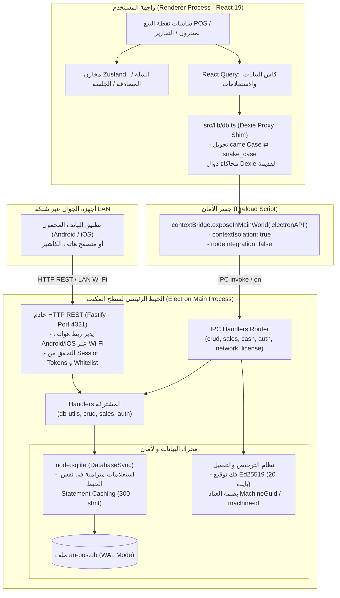

# 🖥️ التقرير الشامل لتحليل معمارية تطبيق سطح المكتب (AN POS Desktop Architecture Audit)

> **تاريخ التقرير:** سبتمبر 2026  
> **نوع المشروع:** نظام نقاط بيع وسطح مكتب تجاري هجين (Hybrid Commercial POS)  
> **التقنيات الأساسية:** Electron 43+, Node:SQLite (DatabaseSync) + Drizzle ORM, Fastify HTTP Server, Vite, React 19, TypeScript, TailwindCSS v4, Zustand.

---

## 1. الملخص التنفيذي (Executive Summary)

تم إجراء تحليل معماري وهندسي متعمق لكافة طبقات تطبيق سطح المكتب **AN POS**، بدءاً من الخيط الرئيسي لـ Electron (`Main Process`)، محرك قاعدة البيانات SQLite والـ IPC Bridge، مروراً بخادم الشبكة المحلية المدمج (`Fastify LAN Server`)، وصولاً إلى طبقة وسيط البيانات (`Dexie Proxy Shim`) وواجهة المستخدم المبنية بـ React 19.

### النتيجة الإجمالية:
التطبيق يمتلك **أساساً بيانياً ومعمارياً واعداً جداً** بالاعتماد على محرك SQLite الأصيل المدمج في Node 22/Electron دون الحاجة لمكتبات Native C++ خارجية ثقيلة، مع توفير خادم LAN يربط هواتف الكاشير بالمخزن الرئيسي ونظام ترخيص مشفر بـ Ed25519.  
ومع ذلك، **كشف التحقيق عن 8 مشاكل معمارية جوهرية**، تتصدرها مشكلة حرجة في إعدادات حزم البناء للإنتاج (`electron-builder`) ستؤدي لفشل تثبيت التطبيق عند توزيعه، بالإضافة إلى اختناق الخيط الرئيسي بسبب استعلامات SQLite المتزامنة، وثغرة في فك ترخيص العتاد غير المتصل، ومحرك طباعة متصفح يعيق سرعة الكاشير.

---

## 2. المخطط المعماري وتدفق البيانات (Architecture & Data Flow Blueprint)



---

## 3. نقاط القوة المعمارية (Architectural Strengths)

1. **الاعتماد على `node:sqlite` المدمج:**
   - التخلص الجذري من كوابيس التجميع المحلي (Native Rebuilding) وأخطاء `node-gyp` ومكتبة `better-sqlite3` التي طالما عطلت تحديثات Electron.
2. **تفعيل إعدادات أداء SQLite المتقدمة (High-Performance PRAGMAs):**
   - استخدام نمط الكتابة السريعة `journal_mode = WAL`.
   - ضبط `synchronous = NORMAL` مما يرفع سرعة عمليات الكتابة المتتالية بمعدل 10 أضعاف مع حفظ سلامة البيانات ضد انهيار التطبيق.
   - حجز 64 ميغابايت لذاكرة الكاش في الرام (`cache_size = -64000`) وتخصيص 256 ميغابايت لـ Memory-Mapped I/O (`mmap_size`).
3. **التخزين المؤقت للعبارات المجهزة (Prepared Statements Caching):**
   - تخزين حتى 300 استعلام مترجم في الذاكرة عبر `statementCache` لتفادي إعادة تحليل وتجهيز عبارات SQL المتكررة.
4. **عزل سياق واجهة المستخدم (Security Context Isolation):**
   - إعداد `contextIsolation: true` و `nodeIntegration: false` يمنع كود الواجهة أو أي مكتبات واجهة طرف ثالث من الوصول المباشر لنظام الملفات أو أوامر النظام.
5. **خادم محلي مدمج وخفيف (Fastify LAN Integration):**
   - مشاركة نفس الدوال المنطقية (`handlers/*`) بين استدعاءات سطح المكتب IPC وطلبات أجهزة الهاتف عبر HTTP REST، مما يمنع تكرار كود العمليات التجارية (Business Logic).
6. **نظام فهرسة غني (Comprehensive Database Indexing):**
   - توافر فهارس B-Tree على الحقول الحرجة مثل الباركود، المعرفات الخارجية، أرقام الفواتير والتواريخ في ملف `schema-init.ts`.

---

## 4. المشاكل والعيوب المعمارية المكتشفة (Identified Architectural Flaws)

---

### 🔴 الخلل 1: تعارض قاتل في إعدادات حزم التوزيع للإنتاج (Packaging Directory Mismatch)
* **الموقع:** [`package.json`](file:///home/ammar/AN-POS-TEST/package.json) (السطر 6، والأسطر 27-32) مقابل [`electron-vite.config.ts`](file:///home/ammar/AN-POS-TEST/electron-vite.config.ts)
* **التشخيص الفني:**
  - أداة البناء المستخدمة هي `electron-vite`، وهي افتراضياً تصدر نواتج التجميع إلى مجلد `out/**` (`out/main`, `out/preload`, `out/renderer`).
  - في `package.json` سطر 6: `"main": "out/main/index.js"` (وهو المسار الصحيح لنواتج electron-vite).
  - **لكن** في إعدادات `build.files` الخاصة بـ `electron-builder` (الأسطر 27-32) تم تعريف الملفات هكذا:
    ```json
    "files": [
      "dist-electron/**",
      "dist/**",
      "node_modules/**",
      "package.json"
    ]
    ```
  - مجلدات `dist-electron` و `dist` تخص أدوات تجميع Vite القديمة ولا تحتوي على أي ملفات من `electron-vite`.
  - علاوة على ذلك، حزم `"node_modules/**"` بالكامل في المثبت يؤدي إلى تضمين مئات الميغابايت من حزم التطوير والاختبار (`vitest`, `typescript`, `oxlint`, `tailwindcss`).
* **التأثير:**
  - عند تشغيل أمر الإنتاج `npm run package` وتثبيت التطبيق على جهاز عميل، **سيفشل التطبيق فوراً عند الإقلاع** برسالة خطأ: `Cannot find module 'out/main/index.js'` لأن المجلد `out` لم يتم تضمينه في ملف التثبيت النهائي، كما أن حجم ملف التثبيت سيتضخم من ~80MB إلى أكثر من 800MB!
* **درجة الخطورة:** **حرجة للغاية (CRITICAL)**.

---

### 🔴 الخلل 2: اختناق الخيط الرئيسي بسبب استعلامات SQLite المتزامنة (`DatabaseSync` Main-Thread Blocking)
* **الموقع:** [`electron/main/database.ts`](file:///home/ammar/AN-POS-TEST/electron/main/database.ts) و [`electron/main/handlers/db-utils.ts`](file:///home/ammar/AN-POS-TEST/electron/main/handlers/db-utils.ts)
* **التشخيص الفني:**
  - تم استخدام `DatabaseSync` من مكتبة Node المدمجة `node:sqlite`.
  - كافة دوال القراءة والكتابة (`stmt.all()`, `stmt.get()`, `stmt.run()`) تُنفذ بشكل تزامني (Synchronous Blocking) مباشرة داخل الخيط الرئيسي لـ Electron (Main Process Event Loop).
  - الخيط الرئيسي لـ Electron هو المسؤول في نفس الوقت عن:
    1. رسم وإدارة نوافذ نظام التشغيل وحركات الفأرة وتقليل/تكبير النوافذ.
    2. استلام وتمرير رسائل الـ IPC القادمة من واجهة المستخدم.
    3. خدمة طلبات أجهزة الهاتف المحمول القادمة عبر خادم Fastify HTTP.
* **التأثير:**
  - عند تشغيل عمليات تستغرق وقتاً (مثل استيراد ملف إكسل لـ 5000 منتج، حساب تقرير أرباح سنوي، أو تصدير جرد كامل)، يتجمد الخيط الرئيسي بالكامل.
  - النتيجة: واجهة المستخدم تصبح غير قابلة للنقر، هواتف الكاشير عبر الشبكة تفصل مؤقتاً أو تفشل طلباتها (Timeout)، ونظام التشغيل (Windows/Linux) قد يظهر نافذة "التطبيق لا يستجيب" (Application Not Responding).
* **درجة الخطورة:** **عالية (HIGH)**.

---

### 🔴 الخلل 3: عنق زجاجة طبقة الوسيط وتعدد استدعاءات الـ IPC (Dexie Proxy Shim Choke)
* **الموقع:** [`src/lib/db.ts`](file:///home/ammar/AN-POS-TEST/src/lib/db.ts)
* **التشخيص الفني:**
  - تم تصميم `src/lib/db.ts` ليعمل كـ Proxy shim يحاكي واجهة Dexie القديمة لتقليل التعديل على صفحات الواجهة. لكن هذا الوسيط يقع في 3 مشاكل جوهرية:
    1. **استهلاك الـ IPC في العمليات الجماعية (`bulkAdd` / `bulkPut`):**
       ```typescript
       bulkAdd: async (items: Record<string, unknown>[]) => {
         const api = await waitForAPI();
         await Promise.all(items.map((i) => api.create(table, toSnake(i))));
       }
       ```
       إذا قام المستخدم باستيراد 500 منتج، يقوم هذا الكود بإطلاق 500 استدعاء IPC منفصل بالتوازي، وكل استدعاء يفتح استعلام INSERT فردي بدون Transaction! هذا يسبب إغراق قناة IPC في Electron وتأخير هائل.
    2. **سحب كامل الجدول وفلترته بالواجهة (`bulkGet`, `notEqual`, `anyOf`):**
       في دوال `bulkGet` و `notEqual` و `anyOf`، يقوم الـ shim باستدعاء `api.list(table)` بدون شروط (أي `SELECT * FROM table`) ثم يفلتر النتائج في JavaScript! لو كان جدول المبيعات يحتوي على 20,000 سجل وطلبنا 3 عناصر، سيتم نقل 20,000 كائن عبر الـ IPC وتحويل أسمائها لاستهلاك الذاكرة.
    3. **التحويل اليدوي المستمر للحقول (`toSnake` / `toCamel`):**
       في كل عملية قراءة أو كتابة، يتم تكرار حلقة فحص على كل مفتاح في الكائن وتحويله نصياً، مما يرفع استهلاك الذاكرة والمعالج في الواجهة.
* **درجة الخطورة:** **عالية (HIGH)**.

---

### 🟠 الخلل 4: محرك الطباعة غير أصيل ويعطل سلاسة البيع (Browser Popup vs Native Thermal Print)
* **الموقع:** [`src/services/print/printEngine.ts`](file:///home/ammar/AN-POS-TEST/src/services/print/printEngine.ts) (السطر 24 والسطر 39)
* **التشخيص الفني:**
  - يعتمد محرك الطباعة الحالي على كود المتصفحات التقليدي:
    ```typescript
    printWindow = window.open('', '_blank', 'width=400,height=600');
    printWindow.document.write(html);
    printWindow.print();
    ```
  - في تطبيقات نقاط البيع الاحترافية لسطح المكتب (Electron):
    1. فتح نافذة بـ `window.open` دون إعداد معالج `setWindowOpenHandler` في `mainWindow.webContents` يسبب فتح نوافذ مستقلة بحواف المتصفح أو قد تحظرها أنظمة الحماية.
    2. استدعاء `window.print()` يفتح نافذة حوار الطباعة لنظام التشغيل (OS Print Dialog)، مما يجبر الكاشير عند كل عملية بيع على النقر على "طباعة" بالماوس!
  - بيئات الكاشير السريعة تتطلب **Silent Printing** مباشرة إلى طابعة الإيصالات الحرارية (ESC/POS عبر USB أو Network IP أو عبر `webContents.print({ silent: true, deviceName })`).
* **درجة الخطورة:** **متوسطة إلى عالية (MEDIUM-HIGH)**.

---

### 🟠 الخلل 5: ثغرة عدم ربط بصمة العتاد بالتوقيع الرقمي للترخيص (Offline License Decoupling)
* **الموقع:** [`electron/main/license/verifyLicense.ts`](file:///home/ammar/AN-POS-TEST/electron/main/license/verifyLicense.ts) و [`licenseManager.ts`](file:///home/ammar/AN-POS-TEST/electron/main/license/licenseManager.ts)
* **التشخيص الفني:**
  - يتم استخدام خوارزمية التوقيع الرقمي `Ed25519` للتحقق من المفتاح بدون إنترنت، وهو تصميم أمني ممتاز.
  - **ولكن:** مصفوفة البايتات الموقعة بحجم 20 بايت تتكون فقط من:
    `rawStoreId (6B) + expiresAt (4B) + maxMobileDevices (2B) + issuedAt (4B) + flags (4B)`.
  - **بصمة العتاد (`Hardware Fingerprint`) غير موجودة إطلاقاً داخل حمولة التوقيع!**
  - ما يحدث فعلياً في كود التفعيل:
    يقوم البرنامج عند تفعيل المفتاح باستخراج بصمة الجهاز محلياً وحفظها داخل ملف محلي `userData/license.json`.
  - **الثغرة:** إذا قام العميل بنسخ نفس المفتاح المعتمد `rawKey` ولصقه في جهاز حاسوب آخر أو فرع آخر، فإن دالة التفعيل على الجهاز الثاني ستقبل المفتاح، لأن توقيع الـ Ed25519 صحيح رياضياً، وستحفظ بصمة الجهاز الثاني في ملفه المحلي!
  - طالما أن النظام يعمل Offline ولا يوجد سيرفر تحقق مركزي، فإن المفتاح الواحد يمكن تفعيله على عدد غير محدود من الحواسيب.
* **درجة الخطورة:** **عالية على مستوى استدامة الأعمال والأمان التجاري (HIGH)**.

---

### 🟡 الخلل 6: غياب التشفير (TLS) وثغرة في معالجة IPv6 في خادم Fastify
* **الموقع:** [`electron/main/server/index.ts`](file:///home/ammar/AN-POS-TEST/electron/main/server/index.ts) (السطر 150)
* **التشخيص الفني:**
  - يعمل خادم Fastify ببروتوكول HTTP العادي على المنفذ `4321`. في بيئات المتاجر والمطاعم حيث قد تكون شبكة الـ Wi-Fi مشتركة مع الزبائن أو بدون عزل (AP Isolation)، يتم تناقل بيانات تسجيل الدخول (PIN)، الجلسات (`x-session-token`)، وتفاصيل المبيعات كنص صريح غير مشفر.
  - في السطر 150:
    ```typescript
    const clientIp = request.ip.split(':')[0];
    ```
    عناوين IPv6 تحتوي بطبيعتها على شارات النقطتين الفوقيتين `:` (مثل `::1` أو `fe80::...`). تطبيق `split(':')[0]` على عنوان IPv6 يؤدي إلى اقتطاع الجزء الأول فقط من العنوان، مما قد يعطل فلتر القائمة البيضاء (`ip_whitelist`) أو يتسبب في أخطاء حظر غير مقصودة.
* **درجة الخطورة:** **متوسطة (MEDIUM)**.

---

### 🟡 الخلل 7: غياب أمان روابط النوافذ ومحددات الملاحة (Window Security & Handlers)
* **الموقع:** [`electron/main/index.ts`](file:///home/ammar/AN-POS-TEST/electron/main/index.ts)
* **التشخيص الفني:**
  - نافذة `BrowserWindow` تفتقر إلى:
    1. `webContents.setWindowOpenHandler(...)`: لمنع فتح أي روابط خارجية في نوافذ Electron جديدة دون تحكم وتوجيه الروابط الموثوقة للمتصفح الخارجي عبر `shell.openExternal`.
    2. معالج حدث `will-navigate`: لمنع توجيه الصفحة خارج التطبيق في حال تم النقر على رابط غير مقصود.
    3. تفعيل خيار `sandbox: false` في `webPreferences` بالرغم من أن سكريبت الـ `preload` لا يحتاج صلاحيات Node كاملة، وكان بالإمكان عزله بشكل أفضل.
* **درجة الخطورة:** **متوسطة (MEDIUM)**.

---

### 🟡 الخلل 8: غياب نظام التحديثات التلقائية المدمج (Auto-Updater)
* **الموقع:** [`package.json`](file:///home/ammar/AN-POS-TEST/package.json)
* **التشخيص الفني:**
  - لا يوجد اعتماد على مكتبة `electron-updater` أو معمارية نشر لتحديثات سطح المكتب (Release Channels).
  - في تطبيقات نقاط البيع، إصدار تحديث أمني أو معالجة خطأ برمجي بدون نظام تحديث صامت في الخلفية يفرض على الدعم الفني إعادة تثبيت البرنامج يدوياً في كل متجر وعلى كل حاسوب.
* **درجة الخطورة:** **متوسطة (MEDIUM)**.

---

## 5. مصفوفة تقييم وتصنيف المشاكل (Severity & Impact Matrix)

| # | المشكلة المعمارية | المكون المتأثر | مستوى الخطورة | التأثير التشغيلي | الجهد المطلوب للإصلاح |
|---|---|---|:---:|---|:---:|
| 1 | تعارض مسارات حزم البناء والـ Packaging | `package.json` / `build.files` | **حرج (Critical)** | فشل كامل في تشغيل التطبيق بعد التثبيت | منخفض (تعديل إعدادات) |
| 2 | تجميد الخيط الرئيسي مع `DatabaseSync` | `electron/main/database.ts` | **عالي (High)** | بطأ وتجمد الواجهة أثناء التقارير والاستيراد | متوسط (ترحيل إلى Worker أو Async) |
| 3 | عنق زجاجة الـ IPC ومحاكي Dexie Choke | `src/lib/db.ts` | **عالي (High)** | بطء استيراد البيانات وهدر الرام والقناة | متوسط (دعم Batching و In-SQL Filter) |
| 4 | محرك الطباعة عبر Popup المتصفح | `printEngine.ts` | **عالي (High)** | إعاقة سرعة الكاشير ومطالبته بالنقر اليدوي | متوسط (Native Silent Print) |
| 5 | عدم ربط التوقيع ببصمة العتاد في الترخيص | `verifyLicense.ts` / `licenseManager` | **عالي (High)** | إمكانية استخدام نفس كود التفعيل في عدة أجهزة | متوسط (تضمين الـ HW Hash في الـ Payload) |
| 6 | أمان خادم Fastify LAN ومعالجة IPv6 | `electron/main/server/index.ts` | **متوسط (Medium)** | ضعف أمان الشبكة المحلية وخلل فحص الـ IP | منخفض |
| 7 | غياب حماية الروابط `setWindowOpenHandler` | `electron/main/index.ts` | **متوسط (Medium)** | فتح نوافذ متصفح غير منضبطة | منخفض |
| 8 | غياب التحديث التلقائي `electron-updater` | `package.json` / `main` | **متوسط (Medium)** | صعوبة صيانة التطبيقات لدى العملاء | متوسط |

---

## 6. خطة التحسين والمعالجة المقترحة (Actionable Remediation Plan)

### 📌 المرحلة الأولى: الإصلاحات الفورية والحرجة (تأهيل البناء والإنتاج)
1. **تصحيح إعدادات حزم البناء في `package.json`:**
   تعديل قسم `build.files` ليتطابق مع مخرجات `electron-vite`:
   ```json
   "files": [
     "out/**",
     "!node_modules/**",
     "package.json"
   ]
   ```
2. **إصلاح معالجة عناوين IPv6 في Fastify:**
   استخدام مكتبة موثوقة مثل `ipaddr.js` أو استخراج الـ IPv4/IPv6 بشكل نظيف:
   ```typescript
   const rawIp = request.headers['x-forwarded-for'] || request.ip;
   const clientIp = typeof rawIp === 'string' ? rawIp.replace(/^.*:/, '') : request.ip;
   ```
3. **ضبط حماية النوافذ في `electron/main/index.ts`:**
   إضافة معالج `setWindowOpenHandler` لمنع فتح نوافذ عشوائية:
   ```typescript
   mainWindow.webContents.setWindowOpenHandler(({ url }) => {
     if (url.startsWith('https:') || url.startsWith('http:')) {
       shell.openExternal(url);
     }
     return { action: 'deny' };
   });
   ```

---

### 📌 المرحلة الثانية: تحسين أداء البيانات والـ IPC
1. **إضافة مسار استعلام مجمّع للـ IPC (`db:bulkCreate` / `db:bulkUpdate`):**
   - بدلاً من تنفيذ 500 استدعاء IPC متتالي في `src/lib/db.ts` عبر `Promise.all`، يتم إرسال المصفوفة كاملة عبر استدعاء IPC واحد `api.bulkCreate(table, rows)`.
   - في معالج الـ Main Process، يتم تنفيذ الإدراج داخل `transaction(() => { ... })`، مما يخفض وقت إدراج 1,000 سجل من **8 ثوانٍ إلى أقل من 80 مللي ثانية**!
2. **إصلاح `bulkGet` و `anyOf` و `notEqual` في `src/lib/db.ts`:**
   - تمرير شروط الفلترة لـ SQLite مباشرة بدلاً من سحب كامل الجدول بالـ JavaScript.
3. **عزل استعلامات SQLite الثقيلة عن خيط الـ Main (Worker Thread):**
   - إنشاء `UtilityProcess` أو `Worker Thread` مخصص لتنفيذ تقارير المبيعات الضخمة، والنسخ الاحتياطي، واستيراد ملفات الإكسل، لمنع تجميد خيط الـ UI نهائياً.

---

### 📌 المرحلة الثالثة: ترقية الطباعة وحماية الترخيص
1. **تطوير محرك الطباعة الصامت (Native Silent POS Printing):**
   - إضافة خيار الطباعة الصامتة عبر Electron `webContents.print({ silent: true, deviceName: printer.name })` مما يلغي نافذة المتصفح تماماً ويطبع الفاتورة في أقل من نصف ثانية بمجرد إنهاء البيع.
   - دعم الطباعة المباشرة لبروتوكول ESC/POS الحراري عبر Network Socket أو Raw USB.
2. **إحكام نظام الترخيص غير المتصل (Hardware-Bound License):**
   - تعديل حمولة التوقيع الرقمي لتشمل أول 8 بايتات من `HardwareFingerprint Hash` ضمن الـ 20 بايت الموقعة بالمفتاح الخاص من السيرفر.
   - بذلك يصبح مستحيلاً تفعيل نفس المفتاح على أي جهاز آخر، لأن توقيع الـ Ed25519 سيفشل فوراً على أي حاسوب ببصمة مختلفة.
3. **إدراج `electron-updater` للتحديث الصامت:**
   - إعداد تحديثات تلقائية عبر GitHub Releases أو خادم تحديثات خاص لضمان استلام نقاط البيع للتحديثات فور صدورها.

---

## 7. الخلاصة العامة

تطبيق **AN POS** يتمتع بهندسة حديثة ومزايا قوية جعلت منه نظاماً غنياً بالميزات وسريع الاستجابة في معظم المهام اليومية. معالجة المشاكل المذكورة في هذا التقرير—وخاصة **تصحيح مسار الحزم ومجلدات البناء** و**تحسين مسارات الـ IPC المجمعة** و**الطباعة الصامتة**—ستنقل التطبيق إلى مستوى البرمجيات التجارية الكبرى (Enterprise-Grade POS) من حيث الاستقرار، الأمان، وسلاسة تجربة الاستخدام في المتاجر الواقعية.
