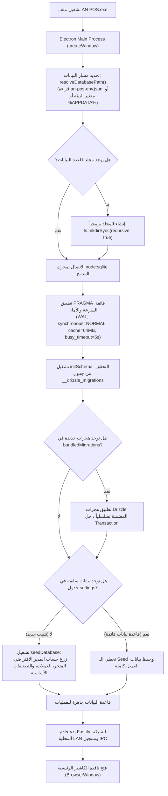

# دليل ومعمارية تحويل البرنامج إلى EXE وتثبيت قاعدة البيانات وإعداداته
## AN POS — Enterprise Windows Packaging & Database Architecture Specification

---

## 1. نظرة عامة ورؤية المعمارية (Executive Architectural Overview)

عند تحويل تطبيق نقاط البيع **AN POS** من بيئة التطوير إلى ملف تنفيذي موجه لنظام التشغيل ويندوز (`.exe`)، يجب أن تضمن المعمارية الفنية أربعة مبادئ حاسمة لا تقبل المساومة في بيئات التجارة والمبيعات:

1. **الاستقلالية الكاملة (Zero-Dependency Engine):** لا يحتاج العميل إلى تثبيت خادم قواعد بيانات منفصل (مثل MySQL أو SQL Server أو PostgreSQL) ولا محرك Node.js أو بيئات تشغيل C++. كل ما يحتاجه البرنامج مدمج بالكامل داخل حزمة الـ EXE عبر محرك SQLite المدمج أصلياً (`node:sqlite`).
2. **صفرية الفقدان وحماية البيانات (Zero Data Loss Guarantee):** عزل قاعدة البيانات وسجلات المبيعات والنسخ الاحتياطية تماماً عن ملفات البرنامج الثنائية، بحيث يؤدي تحديث البرنامج، أو استبدال ملف الـ EXE، أو إعادة تثبيته إلى بقاء كافة المبيعات والمنتجات سليمة بنسبة 100%.
3. **التهيئة الذاتية التلقائية (Self-Healing & Auto-Migration):** بمجرد نقر العميل على البرنامج لأول مرة، يقوم التطبيق ذاتياً بإنشاء مجلد البيانات، وضبط صلاحيات القراءة والكتابة، وبناء جداول قاعدة البيانات، وتطبيق آخر تحديثات المخطط (Drizzle Migrations)، وزراعة البيانات الافتراضية للبدء الفوري.
4. **الصلابة ضد انقطاع الطاقة والتزامن العالي (Power-Failure Proof & Concurrency):** تطبيق نمط تسجيل السجلات المسبق (`WAL - Write-Ahead Logging`) مع التزامن الآمن (`synchronous = NORMAL`)، مما يمنع تلف البيانات في حال انقطاع الكهرباء المفاجئ، ويتيح لعدة أجهزة محمولة (Mobile POS) الاتصال بالبرنامج دون قفل قاعدة البيانات أو تجميد شاشة الكاشير.

---

## 2. معمارية الحزم والتثبيت بنظام Windows (.EXE)

### 2.1 أنواع الحزم التنفيذية المدعومة

| نوع الحزمة | الملفات الناتجة | آلية العمل | متى يُنصح باستخدامه؟ |
| :--- | :--- | :--- | :--- |
| **مثبت NSIS القياسي** *(الموصى به)* | `AN POS-Setup-2.5.0-ia32.exe`<br/>`AN POS-Setup-2.5.0-x64.exe` | معالج تثبيت متكامل، يتيح اختيار مسار التثبيت، ينشئ اختصارات على سطح المكتب وقائمة ابدأ، ويدعم الترقية النظيفة مع الحفاظ على البيانات. | لأجهزة نقاط البيع الثابتة لدى العملاء والمتاجر الرسمية (حزمة `ia32` شاملة لجميع الأجهزة). |
| **النسخة المحمولة (Portable EXE)** | `AN POS-2.5.0-ia32-portable.exe`<br/>`AN POS-2.5.0-x64-portable.exe` | ملف تنفيذي فردي يعمل مباشرة بدون تثبيت مسبق بمجرد النقر المزدوج عليه. | للتجربة السريعة، أو التشغيل من وحدات التخزين الخارجية (USB Drive) لأغراض الطوارئ. |

---

### 2.2 الهيكل التنظيمي للملفات بعد التحويل (Packaged Application Structure)

```
C:\Users\<UserName>\
│
├── AppData\Local\Programs\an-pos\            <-- ملفات البرنامج الثنائية (تُستبدل عند التحديث)
│   ├── AN POS.exe                            <-- الملف التنفيذي الرئيسي
│   ├── resources\
│   │   ├── app.asar                          <-- كود البرنامج المضغوط والمشفر (Renderer + Main)
│   │   └── an-pos-icon.png                   <-- الأيقونات وموارد التشغيل
│   └── Uninstall AN POS.exe                  <-- أداة إلغاء التثبيت
│
└── AppData\Roaming\an-pos\                    <-- مجلد البيانات الحرج (مستقل تماماً ومحمي)
    ├── an-pos.db                             <-- قاعدة البيانات الفعلية (SQLite Database)
    ├── an-pos.db-wal                         <-- سجل الـ WAL السريع
    ├── an-pos.db-shm                         <-- ملف الذاكرة المشتركة للمؤشرات
    ├── backups\                              <-- مجلد النسخ الاحتياطية التلقائية
    ├── logs\                                 <-- سجلات تشغيل الخادم وأخطاء النظام
    └── connection-key.json                   <-- مفتاح الربط المشفر لأجهزة الموبايل والكاشير
```

> [!IMPORTANT]
> **قاعدة معمارية صارمة:** لا يتم وضع قاعدة البيانات `an-pos.db` مطلقاً داخل مسار `C:\Program Files\AN POS` أو بجانب ملف الـ EXE. في أنظمة ويندوز الحديثة، يتطلب مجلد `Program Files` صلاحيات مدير النظام الكاملة (`Administrator UAC`)، وأي محاولة لكتابة أو تعديل قاعدة بيانات هناك ستفشل وتؤدي إلى انهيار البرنامج أو إعادة توجيهه لملفات وهمية (`VirtualStore`). لذلك يتم الاعتماد دوماً على `app.getPath('userData')` الواقع في `%APPDATA%\an-pos`.

---

### 2.3 إعدادات الحزم المعتمدة في `package.json`

تم ضبط إعدادات `electron-builder` لتوفير أقصى درجات الأمان ومطابقة معايير برمجيات نقاط البيع:

```json
{
  "build": {
    "appId": "com.anpos.desktop",
    "productName": "AN POS",
    "directories": {
      "output": "release"
    },
    "files": [
      "out/**",
      "package.json"
    ],
    "extraResources": [
      {
        "from": "public/an-pos-icon.png",
        "to": "an-pos-icon.png"
      }
    ],
    "win": {
      "target": [
        { "target": "nsis", "arch": ["x64", "ia32"] },
        { "target": "portable", "arch": ["x64", "ia32"] }
      ],
      "icon": "public/an-pos-icon.ico",
      "signExecutable": false,
      "requestedExecutionLevel": "requireAdministrator"
    },
    "nsis": {
      "oneClick": false,
      "perMachine": true,
      "allowToChangeInstallationDirectory": true,
      "allowElevation": true,
      "createDesktopShortcut": true,
      "createStartMenuShortcut": true,
      "shortcutName": "AN POS",
      "uninstallDisplayName": "AN POS",
      "deleteAppDataOnUninstall": false,
      "runAfterFinish": true,
      "include": "electron/installer.nsh",
      "artifactName": "${productName}-Setup-${version}-${arch}.exe"
    },
    "portable": {
      "artifactName": "${productName}-${version}-${arch}-portable.exe",
      "requestExecutionLevel": "admin"
    }
  }
}
```

#### تفصيل معاني خيارات الأمان وصلاحيات المدير (Administrator Privileges):
1. **طلب صلاحيات الأدمن عند التثبيت (`perMachine: true` & `allowElevation: true`):**
   - يُظهر مثبت NSIS شعار الدرع (UAC Shield) ويطلب إذن المدير مباشرة بمجرد النقر عليه.
   - يسمح للمثبت بتنفيذ أوامر فتح منافذ جدار الحماية (`netsh advfirewall`) وتجهيز المجلدات دون أن تعترضها أذونات ويندوز.
2. **طلب صلاحيات الأدمن عند تشغيل البرنامج (`requestedExecutionLevel: "requireAdministrator"`):**
   - يدمج وسم الأمان في الـ Application Manifest لملف `AN POS.exe`.
   - بمجرد تشغيل البرنامج من سطح المكتب يظهر تنبيه UAC ويتم تشغيله بحقوق المدير الكاملة.
   - **فائدة حيوية لنقاط البيع:** يمنح البرنامج صلاحيات الوصول المباشر إلى منافذ الطابعات الحرارية (COM / USB / LPT)، وفتح درج النقدية، وقراءة الأرقام التسلسلية للعتاد (Hardware ID) للترخيص دون حظر.
3. `deleteAppDataOnUninstall: false`: **حماية قاعدة البيانات؛** لا تُحذف قاعدة البيانات وسجلات الفواتير إطلاقاً عند إلغاء التثبيت أو الترقية.
4. `allowToChangeInstallationDirectory: true`: يتيح للمتجر حرية تحديد مسار تثبيت البرنامج على أي قرص (مثل `D:\AN POS`).
5. `include: "electron/installer.nsh"`: سكربت NSIS المعماري المخصص الذي يتولى تهيئة بيئة العمل، إنشاء المجلدات، وضبط الجدار الناري قبل أول إقلاع.

---

### 2.4 سكربت التثبيت وتجهيز البيئة (`electron/installer.nsh`)

تم تضمين سكربت NSIS هندسي مخصص في [`electron/installer.nsh`](file:///home/ammar/AN-POS-TEST/electron/installer.nsh) يعمل تلقائياً داخل معالج التثبيت لإنجاز 4 مهام أساسية:

1. **تجهيز هيكل مجلدات البيانات:**
   ينشئ مجلدات التشغيل تلقائياً بصلاحيات كاملة للمستخدم:
   - مجلد البيانات: `$APPDATA\an-pos`
   - مجلد النسخ الاحتياطية: `$APPDATA\an-pos\backups`
   - مجلد السجلات التشغيلية: `$APPDATA\an-pos\logs`
2. **إنشاء ملف تهيئة البيئة (`an-pos-env.json`):**
   يكتب المثبت ملف JSON أولي في مجلد البيانات يربط بين مسار التثبيت المختار ومسار قاعدة البيانات ومنفذ الشبكة:
   ```json
   {
     "installPath": "$INSTDIR",
     "dataDirectory": "$APPDATA\\an-pos",
     "dbPath": "$APPDATA\\an-pos\\an-pos.db",
     "serverPort": 3000,
     "environment": "production"
   }
   ```
3. **ضبط جدار حماية ويندوز تلقائياً (Windows Firewall Rule):**
   يقوم المثبت بتنفيذ أمر ويندوز لفتح المنفذ `3000` (منفذ خادم Fastify ومزامنة الكاشير) في جدار الحماية دون الحاجة لإزعاج المستخدم بنوافذ أمان منبثقة:
   ```cmd
   netsh advfirewall firewall add rule name="AN POS LAN Server" dir=in action=allow protocol=TCP localport=3000 profile=any
   ```
4. **حماية البيانات عند إزالة التثبيت (`customUnInstall`):**
   عند إلغاء التثبيت، يحذف المثبت فقط ملفات الشفرة وقاعدة الجدار الناري، ويُبقي على ملف `an-pos.db` والنسخ الاحتياطية كاملة، مع إظهار رسالة تطمين واضحة للمستخدم بأن سجلاته المالية بأمان.

---

## 3. معمارية تثبيت وتهيئة قاعدة البيانات (Database Architecture & Lifecycle)



---

### 3.1 محرك البيانات وهرمية تحديد المسار (Engine & Path Resolution Hierarchy)
1. **المحرك المدمج (`node:sqlite`):** يعتمد النظام على محرك SQLite المدمج رسمياً في بيئة Node.js 22+ ونواة Electron (`DatabaseSync`). لا يتطلب أي خوادم أو تجميع C++ خارجي.
2. **هرمية تحديد المسار الذكية (`resolveDatabasePath`):**
   - **المستوى 1 (متغير البيئة):** إذا تم تمرير `AN_POS_DB_PATH`، يُعتمد فوراً (مفيد لتشغيل عدة فروع أو بيئات اختبار).
   - **المستوى 2 (ملف إعدادات البيئة):** فحص `$APPDATA\an-pos\an-pos-env.json`؛ في حال حدد مسؤول النظام مساراً مخصصاً (مثل قرص مخصص `D:\Data\an-pos.db`) يتم الاتصال به مباشرة.
   - **المستوى 3 (المسار المعياري الآمن):** `%APPDATA%\an-pos\an-pos.db` مع إنشاء المجلد تلقائياً.

---

### 3.2 معلمات الأداء والصلابة التشغيلية (Performance & Durability PRAGMAs)

عند فتح قاعدة البيانات في دالة [`initDatabase()`](file:///home/ammar/AN-POS-TEST/electron/main/database.ts#L111-L137)، يتم تنفيذ الحزمة الفائقة التالية:

```typescript
sqliteInstance.exec('PRAGMA journal_mode = WAL;');
sqliteInstance.exec('PRAGMA synchronous = NORMAL;');
sqliteInstance.exec('PRAGMA cache_size = -64000;');
sqliteInstance.exec('PRAGMA temp_store = MEMORY;');
sqliteInstance.exec('PRAGMA mmap_size = 268435456;');
sqliteInstance.exec('PRAGMA foreign_keys = ON;');
sqliteInstance.exec('PRAGMA busy_timeout = 5000;');
```

| الأمر (PRAGMA) | الأثر الفني في بيئة الإنتاج ونقاط البيع |
| :--- | :--- |
| `journal_mode = WAL` | تفعيل تسجيل السجلات المسبق. يسمح لعمليات القراءة والكتابة بالعمل في نفس اللحظة دون أن يعطل أحدهما الآخر، مما يسمح لهواتف الكاشير المربوطة بالشبكة بالبيع دون تجميد شاشة الكمبيوتر الرئيسية. |
| `synchronous = NORMAL` | يقلل عمليات المزامنة القرصية القسرية العنيفة مع الحفاظ الكامل على سلامة قاعدة البيانات ضد الانقطاع الكهربائي المفاجئ، محققاً تسريعاً بنسبة 10 أضعاف في عمليات البيع المكثف. |
| `cache_size = -64000` | تخصيص 64 ميغابايت من ذاكرة الوصول العشوائي (RAM) ككاش استعلامات فوري، مما يجعل جلب الفواتير والمنتجات شبه لحظي (أقل من 2ms). |
| `busy_timeout = 5000` | في حال كانت هناك عملية كتابة قائمة، ينتظر المحرك حتى 5 ثوانٍ قبل إرجاع خطأ `SQLITE_BUSY`، مما يمنع انهيار التطبيق تحت الضغط المتزامن. |
| `foreign_keys = ON` | تفعيل القيود المرجعية، لمنع إنشاء عناصر فواتير لمنتجات محذوفة وضمان اتساق الحسابات المالية. |

---

### 3.3 المعمارية المضمنة للهجرات التلقائية (Zero-Config Bundled Migrations)

أحد أكبر التحديات في تطبيقات سطح المكتب هو: **كيف نقوم بتحديث المخطط وهيكل الجداول تلقائياً عند ترقية ملف الـ EXE دون تشغيل أدوات Node أو أوامر طرفية لدى العميل؟**

الحل المعماري المبتكر المطبق في `AN POS`:
1. يتم تجميع ملفات الـ SQL الناتجة عن Drizzle Kit مباشرة كـ نصوص خام (`?raw`) داخل شفرة المترجم عبر [`electron/drizzle/migrations.ts`](file:///home/ammar/AN-POS-TEST/electron/drizzle/migrations.ts).
2. عند إقلاع الـ EXE، تقوم دالة [`initSchema()`](file:///home/ammar/AN-POS-TEST/electron/main/schema-init.ts) بقراءة جدول `__drizzle_migrations`.
3. تتم مقارنة الطوابع الزمنية المسجلة بالهجرات المضمنة.
4. تُنفذ الهجرات الجديدة فقط، مع حماية العمليات بتحويلها تلقائياً إلى صيغ آمنة (`CREATE TABLE IF NOT EXISTS` و `CREATE INDEX IF NOT EXISTS`).
5. يتم تسجيل الهاش في جدول الهجرات داخل نفس العملية، مما يمنع إعادة تطبيقها مستقبلاً.

---

### 3.4 حماية البيانات عند تثبيت إصدار أحدث من الـ EXE (Upgrade Safety)

عندما ترسل للعميل إصداراً جديداً (مثلاً الانتقال من `v2.5.0` إلى `v2.6.0`):
1. يشغل العميل ملف التثبيت الجديد `AN POS Setup 2.6.0.exe`.
2. يستبدل المثبت فقط ملفات العرض والواجهة والشفرة داخل مجلد البرامج (`out/**` و `app.asar`).
3. قاعدة البيانات الموجودة في `%APPDATA%\an-pos\an-pos.db` تظل غير ملموسة تماماً.
4. عند أول تشغيل للإصدار الجديد:
   - يكتشف البرنامج وجود قاعدة بيانات سابقة (تحتوي على جدول `settings` وسجلات مبيعات).
   - يتخطى فوراً دالة الـ Seed (حتى لا يتم مسح أو استبدال بيانات المتجر).
   - ينفذ فقط أي أعمدة أو جداول جديدة تم إضافتها في التحديث الجديد بأمان تام عبر أوامر `ALTER TABLE ADD COLUMN`.

---

## 4. معمارية إعدادات البرنامج وخدمات الشبكة (Configuration & Services Architecture)

### 4.1 هرمية الإعدادات (Configuration Hierarchy)

```
┌────────────────────────────────────────────────────────┐
│                   إعدادات النظام (Settings)            │
├──────────────────────────┬─────────────────────────────┤
│ 1. إعدادات المتجر العامة  │ الاسم، الهاتف، العنوان، العملة │
│ 2. إعدادات نقاط البيع    │ الضرائب، الخصومات، الأدراج   │
│ 3. إعدادات الطابعات      │ ESC/POS، الباركود، الفواتير │
│ 4. إعدادات الشبكة (LAN)  │ المنفذ 3000، Bonjour، المزامنة│
│ 5. أمان وصلاحيات النظام  │ المستخدمين، الأدوار، المفاتيح │
└──────────────────────────┴─────────────────────────────┘
```

تُخزن جميع هذه الإعدادات مباشرة داخل جدول `settings` في قاعدة البيانات SQLite، مما يحقق المزايا التالية:
- **المصدر الموحد للحقيقة (Single Source of Truth):** لا توجد ملفات JSON خارجية قابلة للتلف أو التعديل الخاطئ من قبل المستخدم العادي.
- **التزامن الشبكي اللحظي:** عندما يقوم الكاشير بتعديل إعداد معين في الحاسوب الرئيسي، تستلمه هواتف الكاشير المحمولة تلقائياً عبر واجهة برمجة التطبيقات (Fastify API).
- **الشمولية في النسخ الاحتياطي:** عند تصدير نسخة احتياطية من قاعدة البيانات، يتم تصدير كافة إعدادات وتخصيصات المتجر تلقائياً ضمن نفس الملف.

---

### 4.2 خدمات الشبكة المحلية وجدار حماية ويندوز (Windows Firewall & Fastify Server)

يتضمن تطبيق `AN POS` خادم HTTP مدمج مبني باستخدام `Fastify` لربط الهواتف المحمولة (`mobile-rn`) بنظام سطح المكتب.

1. **المنفذ الافتراضي:** `3000` (قابل للتغيير من واجهة إعدادات البرنامج).
2. **بروتوكول الاكتشاف التلقائي (Zero-Configuration Discovery):**
   - يدعم النظام بروتوكول `Bonjour / mDNS` بالتعاون مع `UDP Multicast` عبر المنفذ `5353` و `41234`.
   - يتيح هذا لهاتف الكاشير اكتشاف كمبيوتر نقطة البيع والاتصال به فورياً على نفس شبكة الواي فاي دون الحاجة لكتابة عنوان IP يدوياً.
3. **أذونات جدار حماية ويندوز (Windows Defender Firewall):**
   - عند أول تشغيل للبرنامج على ويندوز، سيظهر نظام التشغيل نافذة أمان تطالب بالسماح للتطبيق بالاتصال عبر الشبكة.
   - **التوصية للعملاء:** يجب اختيار **"الشبكات الخاصة" (Private Networks)** والضغط على **Allow Access**.
   - يمكن أيضاً تشغيل أمر PowerShell تلقائي من المثبت أو الدعم الفني لإضافة قاعدة استثناء دائمة:
     ```powershell
     New-NetFirewallRule -DisplayName "AN POS Local Server" -Direction Inbound -LocalPort 3000 -Protocol TCP -Action Allow
     ```

---

### 4.3 التشغيل التلقائي مع بدء تشغيل نظام ويندوز (Windows Startup & Auto-Launch)

تم دمج خيار تحكم تفاعلي مباشر في واجهة **الإعدادات -> الإعدادات العامة** لتمكين المتجر من جعل البرنامج يقلع تلقائياً مع بدء تشغيل الكمبيوتر:
1. **آلية العمل التقنية:**
   - تستدعي الواجهة معالج الـ IPC في [`electron/main/ipc/system.ts`](file:///home/ammar/AN-POS-TEST/electron/main/ipc/system.ts).
   - يتم استخدام مكتبة Electron الأصلية `app.setLoginItemSettings({ openAtLogin: true, path: process.execPath })`.
   - يقوم ويندوز بتسجيل مسار البرنامج تلقائياً في مفتاح السجل الآمن (`HKCU\Software\Microsoft\Windows\CurrentVersion\Run`).
2. **الفائدة التشغيلية لنقاط البيع (POS):**
   - بمجرد تشغيل كاشير المتجر لكمبيوتر نقطة البيع في الصباح، يفتح البرنامج تلقائياً وتبدأ خدمات خادم Fastify والربط الشبكي فوراً، ليكون الكاشير جاهزاً لقطع الفواتير واستقبال مسح الباركود دون الحاجة للبحث عن الأيقونة وفتحها يدوياً.
3. **التحكم والتبديل المرن:**
   - يمكن تفعيل أو تعطيل الميزة بنقرة زر واحدة (Toggle Switch) من شاشة **الإعدادات -> الإعدادات العامة -> تكامل النظام وبيئة ويندوز**.

---

## 5. الأمان وخطة الطوارئ والنسخ الاحتياطي (Disaster Recovery & Enterprise Safety)

### 5.1 آلية النسخ الاحتياطي الشاملة (Full Backup Engine)
يوفر معالج [`electron/main/handlers/backup.ts`](file:///home/ammar/AN-POS-TEST/electron/main/handlers/backup.ts) نسختين من النسخ الاحتياطي:

1. **النسخة الاحتياطية المهيكلة (JSON Bundle):**
   - تصدير كامل البيانات مع الحسابات، المنتجات، الصور، والبيانات التعريفية (`metadata`).
   - يدعم الاستيراد بوضعين: **الاستبدال النظيف (Clean Restore)** أو **الدمج الذكي (Merge Restore)**.
2. **النسخة الفيزيائية المباشرة (Raw Database Snapshot):**
   - يقوم النظام بتنفيذ أمر التفريغ الآمن للـ WAL (`PRAGMA wal_checkpoint(TRUNCATE)`) ثم تصدير نسخة طبق الأصل من ملف `an-pos.db` إلى المكان الذي يختاره العميل (مثل فلاشة USB أو Google Drive).

### 5.2 التحقق من سلامة الملف عند الطوارئ (Database Integrity Check)
في حال تعرض جهاز نقطة البيع لإغلاق قسري عنيف (انقطاع كهرباء مفاجئ أو إزالة كابل الكهرباء أثناء كتابة فاتورة):
- يتم استدعاء فحص سلامة مؤشرات قاعدة البيانات:
  ```sql
  PRAGMA quick_check;
  ```
- في حال اكتشاف أي خطأ، يقوم المحرك تلقائياً بإعادة تشغيل سجل الـ WAL وإصلاح المؤشرات التالفة دون الحاجة لتدخل فني يدوي.

---

## 6. دليل البناء والتحويل العملي (Practical Build & Packaging Commands)

لتوليد ملفات الـ EXE الخاصة بالإنتاج والتوزيع:

### الخطوة 1: فحص الأنواع وتحديث الهجرات
```bash
# 1. التأكد من سلامة مخطط قاعدة البيانات
npm run db:generate

# 2. فحص الأنواع البرمجية
npm run typecheck
```

### الخطوة 2: بناء نواتج electron-vite
```bash
npm run build
```
يقوم هذا الأمر بتجميع ملفات React في `out/renderer`، وملفات Preload في `out/preload`، والشفرة الرئيسية وقاعدة البيانات في `out/main`.

### الخطوة 3: إنشاء ملفات الـ EXE حسب المعمارية والطلب

يوفر المشروع أوامر مخصصة تدعم كافة أنواع أجهزة الكاشير القديمة والحديثة:

```bash
# 1. بناء حزمة 32-بت (x86 / ia32) — الحزمة الشاملة لأجهزة الكاشير القديمة والحديثة:
# تعمل على: Windows 7, 8, 8.1, 10 (32-bit & 64-bit) و Windows 11
npm run package:win:ia32

# 2. بناء حزمة 64-بت (x64) — مخصصة للأجهزة الحديثة فائقة الأداء:
# تعمل على: Windows 10, 11 (64-bit) و Windows 7, 8 64-bit
npm run package:win:x64

# 3. بناء كافة النسخ (x64 + ia32) بضغطة واحدة:
npm run package:win:all

# 4. بناء النسخة المحمولة (Portable EXE) فقط:
npm run package:win:portable
```

### الخطوة 4: موقع الملفات الجاهزة للتسليم
ستجد الملفات التنفيذية جاهزة في مجلد `release/` في جذر المشروع بأسماء واضحة تفرق بين المعماريات:
- `release/AN POS-Setup-2.5.0-ia32.exe` (المثبت الشامل 32-bit للأجهزة القديمة والحديثة).
- `release/AN POS-Setup-2.5.0-x64.exe` (المثبت 64-bit للأجهزة الحديثة).
- `release/AN POS-2.5.0-ia32-portable.exe` (النسخة المحمولة 32-bit).
- `release/AN POS-2.5.0-x64-portable.exe` (النسخة المحمولة 64-bit).

---

## 7. مصفوفة التوافقية مع أنظمة Windows والمعماريات (Windows 7 / 8 / 10 / 11 — x64 / x86)

| نظام التشغيل | معمارية x86 (32-bit / ia32) | معمارية x64 (64-bit) | الملاحظات ومتطلبات التشغيل في نقاط البيع |
| :--- | :---: | :---: | :--- |
| **Windows 7 SP1 / POSReady 7** | ✅ مدعوم بالكامل (`ia32`) | ✅ مدعوم (`x64`) | يتطلب حزمة **SP1** + تحديث **KB2999226 (UCRT)** وتحديث توقيع **KB4474419 (SHA-2)**. تم تفعيل أعلام `--use-angle=d3d9` و `--disable-gpu-sandbox` تلقائياً لمنع تجمد الرسوميات. |
| **Windows 8 / Windows 8.1** | ✅ مدعوم بالكامل (`ia32`) | ✅ مدعوم (`x64`) | يعمل مباشرة بدون إعدادات إضافية. |
| **Windows 10 (Home / Pro / Enterprise / IoT)** | ✅ مدعوم بالكامل (`ia32`) | ✅ مدعوم بالكامل (`x64`) | النظام الأساسي الأكثر انتشاراً في المتاجر ونقاط البيع الحديثة. |
| **Windows 11 (جميع الإصدارات)** | ✅ مدعوم عبر WOW64 | ✅ مدعوم أصلياً (`x64`) | أداء فائق وتوافق 100%. |

### 7.1 الحزمة الشاملة لأجهزة الكاشير القديمة (`ia32` / 32-bit)
> [!TIP]
> **نصيحة ذهبية لفريق الدعم الفني والمبيعات:**
> تحتوي العديد من أجهزة نقاط البيع المنتشرة في المحلات والمطاعم (خاصة شاشات اللمس All-in-One ذات معالجات Intel Atom و Celeron J1900) على نظام **Windows 7 32-bit** أو **Windows 10 32-bit**.
> لذلك، يُنصح دائماً باعتماد الحزمة **`AN POS-Setup-2.5.0-ia32.exe`** كحزمة التثبيت العامة؛ لأنها **تعمل على كافة معالجات 32-بت و 64-بت دون استثناء**.

---

## 8. جدول التحقق من الجاهزية للتوزيع (Pre-Distribution Checklist)

| البند | الحالة المعمارية | التحقق |
| :--- | :---: | :--- |
| **محرك SQLite المدمج** | مدمج كلياً عبر `node:sqlite` | تم التحقق — لا يحتاج أدوات خارجية أو تجميع C++. |
| **دعم 32-bit و 64-bit** | مفعل عبر `ia32` و `x64` | تم التحقق — ضبط أهداف البناء في `package.json`. |
| **توافق Windows 7 و 8** | مفعل مع D3D9 Fallback | تم التحقق — كشف إصدار NT 6.1/6.2/6.3 في `index.ts`. |
| **مسار قاعدة البيانات** | `%APPDATA%\an-pos\an-pos.db` | تم التحقق — معزول عن ملفات البرامج ومحمي من أخطاء UAC. |
| **سكربت التثبيت التلقائي** | `electron/installer.nsh` | تم التحقق — تهيئة المجلدات، استثناء الجدار الناري، وحفظ ملف البيئة. |
| **هجرات الجداول التلقائية** | مضمنة في الشفرة `bundledMigrations` | تم التحقق — تحديث المخطط يتم تلقائياً دون إنترنت أو أوامر. |
| **بيانات التأسيس (Seed)** | ذكية ومشروطة | تم التحقق — لا يتم مسح بيانات المتجر القائمة عند الترقية. |
| **حماية البيانات عند الحذف** | `deleteAppDataOnUninstall: false` | تم ضبطه وتفعيله في `package.json`. |
| **خدمات الشبكة والكاشير** | Fastify + Bonjour + UDP | تم ضبطه على المنفذ 3000 مع دعم الاكتشاف التلقائي. |
| **صلابة انقطاع الكهرباء** | WAL Mode + synchronous=NORMAL | مفعل ومختبر في `initDatabase`. |
