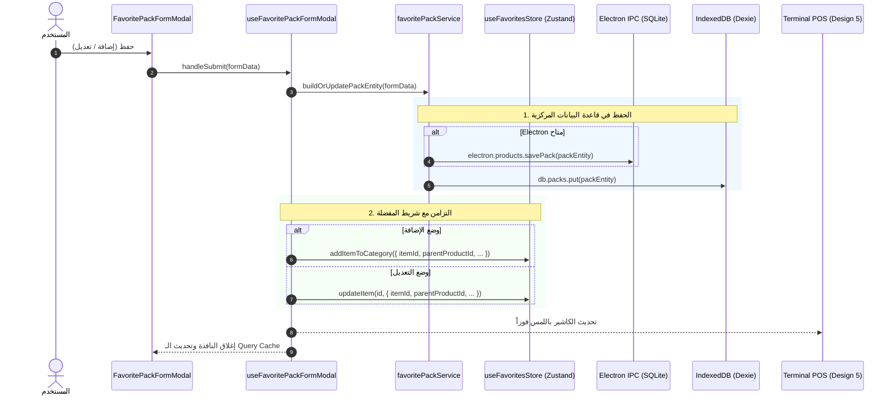

# وثيقة المعمارية الموحدة لإدارة المفضلة والعبوات السريعة
## (Unified Architecture for Favorites & Quick Packs Management)

---

## 1. ملخص المشكلة والتشخيص الهندسي (Problem & Architectural Gap)

في الإصدارات السابقة، وُجد تباين واختلاف جوهري بين عمليتي **إضافة العبوة السريعة (Quick Pack Addition)** و**تعديل العبوة (Edit Pack)** في وحدة المفضلة:

1. **اختلاف عقود البيانات (Data Types Mismatch)**:
   - واجهة `QuickPackParams` تحتوي على ربط صريح بالمنتج الأساسي (`productId`, `productName`).
   - واجهة `EditPackParams` كانت تفتقر إلى حقول المنتج الأساسي (`productId`, `productName`) وتعتمد فقط على البيانات الظاهرية.
2. **غياب ميزة البحث وتغيير المنتج الأساسي في التعديل**:
   - في نافذة الإضافة: يتوفر بحث حي متقدم واختيار وتغيير لمنتج التجزئة الأساسي.
   - في نافذة التعديل: كان المنتج الأساسي يظهر كحقل قراءة فقط إذا وُجد، دون إمكانية البحث أو اختيار منتج تجزئة جديد إذا رغب المستخدم في إعادة ربط العبوة أو تصحيحها.
3. **عدم تطابق حقول التسعير والخصم والتوليد الآلي**:
   - التوليد التلقائي لاسم العبوة (`generateQuickPackName`) كان متاحاً في الإضافة ومفقوداً في التعديل.
   - شارة السعر التشجيعي وحساب التخفيض كانت موجودة في الإضافة وغير متناسقة في التعديل.
4. **عدم تطابق خيارات التعبئة والتصنيف**:
   - اختلفت أزرار الوحدات السريعة (`['كرتونة', 'طرد', 'باقة', 'شدة', 'صندوق', 'علبة']` مقابل `['كرتونة', 'طرد', 'علبة', 'باقة', 'صندوق', 'كيس', 'ربطة']`).
   - اختلفت أزرار عدد القطع السريعة (`[3, 4, 6, 12, 24, 30, 48]` مقابل `[4, 6, 8, 12, 24, 30]`).
   - غياب حقل نوع العبوة (`packType`: `bundle` / `wholesale` / `half_wholesale`) والحد الأدنى للجملة (`minWholesaleQty`) رغم وجودهما في قاعدة البيانات `PackEntity`.
5. **خلل التزامن (Sync Inconsistency)**:
   - عند التعديل، لم يكن يتم تحديث `parentProductId` في مخزن المفضلة `useFavoritesStore`، كما لم يكن يتم تحديث `items[0].productId` في جدول `PackEntity` في SQLite/Dexie.

---

## 2. عقد البيانات الموحد (Unified Data Contract)

توحيد نموذج البيانات ليعبر عن دورة حياة العبوة كاملة (إضافة وتعديل):

```typescript
export type FavoritePackType = 'bundle' | 'wholesale' | 'half_wholesale';

/**
 * النموذج الموحد لبيانات العبوة السريعة في الإضافة والتعديل
 */
export interface FavoritePackFormData {
  // المعرفات
  id?: string;               // معرف عنصر المفضلة (فارغ في الإضافة، موجود في التعديل)
  packId?: string;           // معرف كيان العبوة في المخزن (PackEntity ID)
  
  // 1. المنتج الأساسي المرتبط
  productId: string;         // معرف منتج التجزئة الأصلي
  productName: string;       // اسم منتج التجزئة
  productBarcode?: string;   // باركود منتج التجزئة
  productRetailPrice: number;// سعر الحبة تجزئة
  productStock: number;      // الرصيد المتوفر في المخزن

  // 2. مواصفات التعبئة
  piecesCount: number;       // عدد القطع في العبوة (مثال: 6، 12، 24)
  unitName: string;          // مسمى وحدة التعبئة (كرتونة، طرد، باقة، صندوق...)

  // 3. التسمية والباركود
  packName: string;          // اسم العبوة الظاهر في شريط الكاشير
  barcode: string;           // باركود العبوة (اختياري للبيع باللمس)

  // 4. التسعير والخصومات
  packPrice: string;         // سعر البيع الإجمالي للعبوة
  isCustomPrice: boolean;    // هل السعر مخصص أم محسوب تلقائياً

  // 5. التصنيف والتوجيه
  targetCatId: string;       // معرف تصنيف المفضلة التابع له
  packType: FavoritePackType;// نوع الباقة (مجمعة، جملة، نصف جملة)
  minWholesaleQty: number;   // الحد الأدنى للبيع بالجملة

  // حالة واجهة المستخدم
  searchQuery?: string;      // نص البحث عند اختيار المنتج
}
```

---

## 3. المعمارية الموحدة للمكونات والخطافات (Component & Hook Architecture)

```
src/features/favorites/
├── types.ts                                # عقود البيانات الموحدة FavoritePackFormData و FavoritePackType
├── constants/
│   ├── favoriteVisuals.ts                  # خريطة الأيقونات والألوان
│   └── favoritePackOptions.ts              # الثوابت الموحدة للوحدات والقطع وأنواع الباقات
├── services/
│   └── favoritePackService.ts              # محرك الحسابات، توليد الأسماء، وبناء وتحديث الكيانات المزدوجة
├── hooks/
│   ├── useFavoritesData.ts                 # جلب العبوات والمنتجات
│   ├── useFavoritesCategoryFilter.ts       # تصفية المفضلة
│   ├── useCategoryFormModal.ts             # إدارة تصنيفات المفضلة
│   └── useFavoritePackFormModal.ts         # الخطاف الموحد لإدارة نموذج العبوة (إضافة وتعديل)
├── modals/
│   ├── CategoryFormModal.tsx               # نافذة التصنيفات
│   ├── AddFavoriteItemsModal.tsx           # نافذة اختيار العبوات الجاهزة
│   └── FavoritePackFormModal.tsx           # النافذة الموحدة الشاملة للإضافة والتعديل
└── FavoritesPage.tsx                       # المنسق الرئيسي
```

---

## 4. المكون الموحد: `FavoritePackFormModal.tsx`

بدلاً من ازدواجية الكود بين `QuickPackModal` و `EditFavoritePackModal` مع تباين الحقول، يتم توحيد النموذج في نافذة واحدة ذكية تعمل بوضعين:
- **وضع الإضافة (Mode: Create)**: عنوان "إنشاء عبوة سريعة من منتج تجزئة"، اختيار المنتج أولاً، واقتراح الاسم والسعر تلقائياً.
- **وضع التعديل (Mode: Edit)**: عنوان "تعديل بيانات وسعر العبوة"، تعبئة الحقول مسبقاً، مع الحفاظ على **نفس الإمكانيات بالكامل**:
  1. إمكانية تغيير المنتج الأساسي بالبحث الحي.
  2. إمكانية إعادة حساب السعر التلقائي أو إدخال سعر مخصص.
  3. إمكانية إعادة توليد الاسم بنقرة واحدة عند تغيير الوحدة أو عدد القطع.
  4. تحديد نوع الباقة (`bundle`, `wholesale`, `half_wholesale`).
  5. تحديد باركود العبوة أو تركه فارغاً للبيع باللمس.
  6. اختيار تصنيف المفضلة المستهدف.
  7. نفس أزرار القطع السريعة الموحدة: `[2, 3, 4, 6, 8, 10, 12, 24, 30, 48]`.
  8. نفس أزرار الوحدات السريعة الموحدة: `['كرتونة', 'طرد', 'باقة', 'شدة', 'صندوق', 'علبة', 'كيس', 'ربطة']`.

---

## 5. خطة الحفظ المزدوج والتزامن (Dual-Persistence & Sync Engine)



---

## 6. مصفوفة تطابق الحقول بنسبة 100% (Field Parity Matrix)

| الحقل البرمجي | في وضع الإضافة | في وضع التعديل | نوع البيانات | الدالة المساعدة |
| :--- | :---: | :---: | :---: | :--- |
| **`productId` / `productName`** | ✅ مدعوم ببحث حي | ✅ مدعوم ببحث وتغيير | `string` | `onSelectBaseProduct` |
| **`productRetailPrice` / Stock** | ✅ يظهر تلقائياً | ✅ يظهر تلقائياً | `number` | `formatMoney` |
| **`piecesCount`** | ✅ أزرار سريعة + إدخال | ✅ أزرار سريعة + إدخال | `number (>=1)` | `onChangePiecesCount` |
| **`unitName`** | ✅ خيارات سريعة + تخصيص | ✅ خيارات سريعة + تخصيص | `string` | `onChangeUnitName` |
| **`packName`** | ✅ توليد آلي + كتابة | ✅ توليد آلي + كتابة | `string` | `generateQuickPackName` |
| **`packPrice`** | ✅ حساب آلي + خصم | ✅ حساب آلي + خصم | `string -> number` | `calculateQuickPackPrice` |
| **`packType`** | ✅ خيارات الثلاثة | ✅ خيارات الثلاثة | `'bundle'\|'wholesale'\|...` | اختيار نوع التسعير |
| **`barcode`** | ✅ اختياري للمس | ✅ اختياري للمس | `string` | فحص الازدواجية |
| **`targetCatId`** | ✅ قائمة التصنيفات | ✅ قائمة التصنيفات | `string` | نقل وتصنيف فوري |
| **ملاحظة تشغيلية** | ✅ كارت توضيحي | ✅ كارت توضيحي | JSX | شروحات كاشير 5 |
