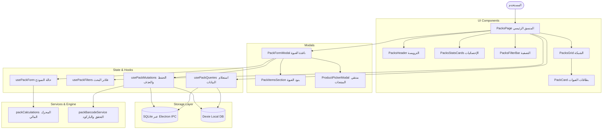

# معمارية وهندسة وحدة عبوات الجملة والباقات (Packs Architecture)
> **AN POS System — Enterprise Wholesale Packaging & Bundles Architecture**

---

## 1. الملخص التنفيذي والأهداف (Executive Summary)

كان ملف `src/features/promotions/PacksPage.tsx` يحتوي على **1,064 سطر برمجي** في ملف أحادي واحد (Monolith)، يجمع بين:
- إدارة الاستعلامات وحالات التخزين المؤقت (React Query & Dexie).
- اتصالات الـ IPC مع خادم سطح المكتب (Electron API).
- العمليات الحسابية للهوامش المالية والتوفير وتكاليف الأصناف.
- التحقق من تفرد الباركود عبر جداول المنتجات والعبوات.
- منطق التصفية والبحث المتعدد.
- واجهات المستخدم الرسومية: الترويسة، البطاقات الإحصائية، شريط الفرز، شبكة البطاقات، نافذة التعديل/الإضافة الكبيرة (320 سطر JSX)، والنافذة الفرعية لاختيار المنتجات.

كما كان مدمجاً بشكل مضلل تحت مجلد `promotions/` رغم كونه قسماً مستقلاً بالكامل في الشريط الجانبي للتطبيق (`/packs`).

### الهدف من المعمارية الجديدة:
1. **تفكيك الملف الأحادي**: تحويله إلى وحدة نمطية مستقلة `src/features/packs/` تتكون من طبقات معيارية واضحة.
2. **فصل المسؤوليات (Clean Architecture & SRP)**: عزل الحسابات المالية والتحقق في طبقة الخدمات (`services/`)، وإدارة البيانات في طبقة الخطافات (`hooks/`)، والواجهات في مكونات مستقلة وقابلة لإعادة الاستخدام (`components/` & `modals/`).
3. **تقليص الحجم**: تخفيض حجم الصفحة الرئيسية من **1,064 سطر** إلى **أقل من 130 سطر**.
4. **التوافق العكسي (Zero-Breaking Changes)**: إعادة تصدير الصفحة من `src/features/promotions/PacksPage.tsx` لضمان عدم تأثر أي مسار أو استيراد قائم.

---

## 2. الهيكلية المعمارية المقترحة (`src/features/packs/`)

```
src/features/packs/
├── types.ts                               # تعريفات الأنواع (PackType, PackItemSelection, PackFormData, PackCalculations, PackFilterStatus)
├── services/
│   ├── packCalculations.ts               # محرك الحسابات المالية (التكلفة الإجمالية، التجزئة، هامش الربح، توفير العميل)
│   └── packBarcodeService.ts             # خدمات فحص تفرد الباركود (Electron + Dexie) وتوليد باركود EAN-13
├── hooks/
│   ├── usePackQueries.ts                 # استعلامات العبوات، المنتجات، وإعدادات المتجر عبر Electron IPC و Dexie
│   ├── usePackMutations.ts               # طفرات حفظ وتعديل وحذف العبوات (Dual-write) وإبطال الكاش
│   ├── usePackFilters.ts                 # منطق البحث بالاسم والباركود والتصفية حسب الحالة (الكل/نشطة/معطلة)
│   └── usePackForm.ts                    # إدارة حالة النموذج، إضافة المنتجات، وتعديل الكميات والحسابات اللحظية
├── components/
│   ├── PacksHeader.tsx                   # الترويسة، عدد العبوات، العودة للمخزون، التحديث، وزر الإضافة
│   ├── PacksStatsCards.tsx               # بطاقات المؤشرات الإحصائية الثلاث (الإجمالي، النشطة، المنتجات المشمولة)
│   ├── PacksFilterBar.tsx                # شريط البحث وزر المسح وأزرار تبديل الحالة
│   ├── PackCard.tsx                      # بطاقة العبوة المستقلة مع شارات النوع، الأصناف، السعر، وأزرار الإجراءات
│   ├── PacksGrid.tsx                     # شبكة العرض المتجاوبة مع مؤشر التحميل وحالة عدم وجود نتائج
│   └── PacksEmptyState.tsx               # العرض التوضيحي عند فراغ قائمة العبوات أو نتائج البحث
├── modals/
│   ├── PackFormModal.tsx                 # النافذة المنبثقة الشاملة لإنشاء وتعديل العبوة
│   ├── PackItemsSection.tsx              # قسم إدارة بنود وأصناف العبوة داخل المودال (الكميات، الحذف)
│   └── ProductPickerModal.tsx            # النافذة الفرعية للبحث عن منتج وإضافته للعبوة
└── PacksPage.tsx                         # المنسق الرئيسي الخفيف (Orchestrator)
```

---

## 3. تفصيل طبقات المعمارية ومسؤولياتها

### 3.1 طبقة الأنواع والبيانات (`types.ts`)
تتضمن العقود المشتركة بين كافة المكونات:
- `PackType`: تصنيف العبوة التجاري (`'wholesale'` | `'bundle'` | `'half_wholesale'`).
- `PackItemSelection`: تمثيل الصنف داخل العبوة مع أسعار التكلفة والتجزئة المحلولة.
- `PackCalculations`: النتائج المالية (التكلفة، سعر التجزئة الموازي، نسبة الهامش، مبلغ ونسبة التوفير).
- `PackFormData`: الحالة الداخلية لنموذج إضافة/تعديل العبوة.
- `PackFilterStatus`: خيارات تصفية الحالة (`'all'` | `'active'` | `'inactive'`).

### 3.2 طبقة الخدمات والمنطق المجرد (`services/`)
- **`packCalculations.ts`**: دوال رياضية نقية (Pure Functions) قابلة للاختبار المعزول:
  - $\text{Total Cost} = \sum (\text{costPrice} \times \text{qty})$
  - $\text{Total Retail} = \sum (\text{retailPrice} \times \text{qty})$
  - $\text{Margin \%} = \frac{\text{packPrice} - \text{Total Cost}}{\text{packPrice}} \times 100$
  - $\text{Savings} = \max(0, \text{Total Retail} - \text{packPrice})$
  - $\text{Savings \%} = \frac{\text{Savings}}{\text{Total Retail}} \times 100$
- **`packBarcodeService.ts`**:
  - فحص عدم تكرار الباركود عبر استدعاء Electron IPC API والرجوع إلى كاش Dexie كبديل آمن، مع استثناء معرف العبوة الحالية في وضع التعديل (`excludeId`).
  - توليد باركودات EAN-13 معيارية بصيغة صالحة.

### 3.3 طبقة الخطافات والحالة (`hooks/`)
- **`usePackQueries.ts`**:
  - جلب قائمة العبوات `packs` من SQLite عبر IPC مع Fallback لـ Dexie.
  - جلب المنتجات `products` لحساب التكاليف وعرض خيارات الإضافة.
  - جلب الإعدادات والعملة الأساسية للمتجر (`currencySymbol`).
- **`usePackMutations.ts`**:
  - `saveMutation`: تدعم الإضافة والتعديل مع التحقق من الحقول الإلزامية وتفرد الباركود، وحفظ متزامن في SQLite و Dexie.
  - `deleteMutation`: حذف العبوة من الخادم والذاكرة المحلية مع إبطال الـ Query Cache.
- **`usePackFilters.ts`**:
  - إدارة حالة البحث والتصفية حسب الكلمة المفتاحية والحالة.
- **`usePackForm.ts`**:
  - إدارة حالة النموذج، تبديل نوع العبوة ووحدات التعبئة السريعة، إضافة الصنف بزيادة كميته إن كان موجوداً، أو إدراجه، وحساب الهامش الفوري.

### 3.4 طبقة واجهات العرض والمودالات (`components/` & `modals/`)
- تفكيك واجهة الـ 1,064 سطر إلى مكونات بصرية صغيرة، كل مكون لا يتجاوز 80 - 150 سطراً ويهتم بوظيفة واحدة فقط.
- فصل نافذة اختيار المنتجات `ProductPickerModal` لتكون مكوّناً مستقلاً ومرناً.
- تجميع قسم المنتجات المشمولة في `PackItemsSection` لتسهيل قراءته وصيانته.

---

## 4. مخطط تدفق البيانات والتفاعل (Data Flow Diagram)



---

## 5. مصفوفة المقارنة (قبل وبعد المعمارية الجديدة)

| المعيار | الوضع السابق (Monolith) | الوضع بعد المعمارية الجديدة |
| :--- | :---: | :---: |
| **المسار** | `src/features/promotions/PacksPage.tsx` | `src/features/packs/` (مستقل) |
| **عدد أسطر الصفحة الرئيسية** | **1,064 سطر** | **~120 سطر** (تقليص بنسبة 88%) |
| **عدد الملفات المقسمة** | ملف واحد ضخم | 14 ملفاً صغيراً ومحدداً |
| **فصل المنطق الحسابي** | مدمج داخل كود الواجهة | معزول في `packCalculations.ts` |
| **التحقق من الباركود** | استدعاء مكرر داخل الصفحة | خدمة مخصصة `packBarcodeService.ts` |
| **إمكانية إعادة الاستخدام** | مستحيلة خارج الملف | عالية (الحسابات، منتقي المنتجات) |
| **سهولة الاختبار الآلي (Unit Testing)** | معقدة جداً | سهلة ومباشرة للخدمات والخطافات |
