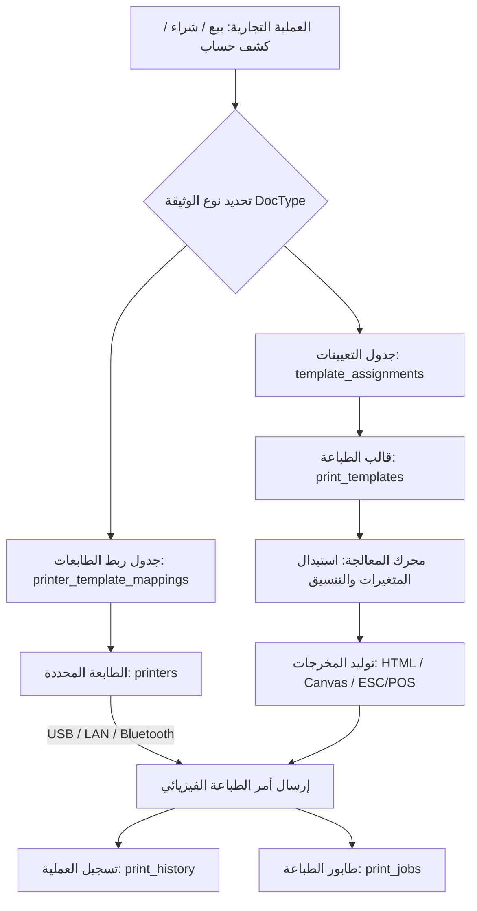

# 🖨️ الدليل الشامل لنظام قوالب الطباعة وإدارة الطابعات (AN POS Print & Hardware System Guide)

> **توثيق معماري، تقني، وتشغيلي متكامل لنظام قوالب الفواتير، المحرر المرئي، ربط الطابعات (Bluetooth, LAN, USB, ESC/POS)، وتعيينات المستندات لتطبيقي سطح المكتب والهاتف.**

---

## 📌 1. نظرة عامة على معمارية نظام الطباعة (Architecture Overview)

تم تصميم نظام الطباعة في **AN POS** ليوفر مرونة مطلقة في تصميم المستندات التجارية مع توافق عتادي شامل لكافة أنواع الطابعات:
- **المحرر المرئي للكتل (Visual Block Editor)**: تخصيص وتوزيع مكونات الفاتورة (رأس، متن، تذييل) بنظام السحب والترتيب.
- **تعدد مقاسات الورق**: دعم كامل للمقاسات الحرارية (`80mm` و `58mm`) والمقاسات القياسية المكتبية (`A4` و `A5`).
- **تعدد لغات الطباعة**: طباعة بالعربية 🇩🇿، ثنائية اللغة عربي/فرنسي 🌐، الفرنسية 🇫🇷، والإنجليزية 🇬🇧.
- **إدارة الطابعات المتعددة**: دعم بروتوكولات الاتصال المباشر (USB Direct, Network/LAN TCP/IP, Bluetooth SPP/BLE, System Spooler).
- **محرك القواطع والأوامر المباشرة**: توليد أوامر **ESC/POS** المباشرة مع قص الورق الآلي وفتح درج النقود.
- **أرشفة وإعادة الطباعة**: سجل تدقيق كامل لكل عملية طباعة مع مؤشر تكرار الطباعة لمنع التلاعب.



---

## 📄 2. بنية وهيكلية قوالب الطباعة (Template Data Schema)

يُخزن كل قالب في جدول `print_templates` بتركيبة JSON غنية تشمل:

### أ. الخصائص الأساسية للقالب
- **`id`**: المعرف الفريد للقالب (مثل `default-thermal-80`, `custom-a4-luxury`).
- **`name`**: الاسم التعريفي للقالب.
- **`paperSize`**: مقاس الورق (`80mm`, `58mm`, `A4`, `A5`).
- **`orientation`**: اتجاه الصفحة (`portrait` عمودي، `landscape` أفقي).
- **`widthMm` & `heightMm`**: الأبعاد الملموسة بالمليمتر.
- **`isDefault` & `isSystem`**: تحديد ما إذا كان القالب افتراضياً أو قالباً مدمجاً من النظام.

### ب. مصفوفة حقول العرض (Visibility Map — 17 خياراً)
تسمح للمستخدم بالتحكم الفوري في إظهار أو إخفاء أي عنصر:
```typescript
interface VisibilityMap {
  showLogo: boolean;               // شعار المتجر
  showShopName: boolean;           // اسم المؤسسة
  showShopDescription: boolean;    // نشاط المحل
  showShopAddress: boolean;        // العنوان الجغرافي
  showShopPhone: boolean;          // أرقام الهواتف
  showLegalInfo: boolean;          // السجل التجاري والضرائب (RC, NIF, ART, AI)
  showInvoiceNumber: boolean;      // رقم الفاتورة التسلسلي
  showDateTime: boolean;           // تاريخ وتوقيت الإصدار
  showCustomer: boolean;           // بيانات العميل / الزبون
  showCashier: boolean;            // اسم الكاشير المسؤول
  showPaymentMethod: boolean;      // طريقة الدفع (نقداً، كريدي، بطاقة)
  showDiscount: boolean;           // بند التخفيضات
  showTax: boolean;                // تفاصيل ضريبة TVA
  showFooterNotes: boolean;        // نص التذييل والشكر
  showQrCode: boolean;             // رمز الاستجابة السريعة QR
  showBarcode: boolean;            // باركود رقم الفاتورة
  showSignature: boolean;          // خانة توقيع المستلم
  showStamp: boolean;              // خانة ختم المؤسسة
}
```

### ج. أقسام وتخطيط الكتل (Template Layout & Blocks)
يتكون المستند من 3 أقسام رئيسية:
1. **`header`**: رأس الفاتورة (شعار، نصوص، معلومات المتجر، تفاصيل العميل).
2. **`body`**: متن الفاتورة (جدول المنتجات، الأعمدة، الكميات، الأسعار، الإجماليات).
3. **`footer`**: تذييل الفاتورة (الملخص المالي، الضريبة، التوقيع، الختم، QR).

**أنواع الكتل المدعومة (`TemplateBlock`)**:
- `text`: نص ثابت أو متغيرات ديناميكية.
- `table`: جدول الأصناف والأسعار مع التحكم بالأعمدة.
- `separator`: فاصل خطي (مستمر، منقط، مزدوج).
- `qr`: رمز QR مشفر برقم الفاتورة أو الرابط أو البيانات الضريبية.
- `barcode`: باركود خطي Code128 / EAN برقم الفاتورة.
- `image`: صورة شعار أو ختم تجاري.

### د. المظهر والألوان (Styles & Theme Palettes)
- **`primaryColor`**: اللون الأساسي للترويسة وحدود الجداول.
- **`secondaryColor`**: لون التظليل والعناوين الفرعية.
- **`fontFamily`**: الخط المعتمد (`Cairo`, `Amiri`, `Tajawal`, `Roboto`).
- **`fontSize`**: حجم الخط الافتراضي (`small`, `medium`, `large`).
- **`tableHeaderBg`**: لون خلفية رأس جدول الأصناف.

---

## 🧩 3. المتغيرات الديناميكية المتاحة في القوالب (Dynamic Variables)

تتم معالجة النصوص عبر دالة `interpolateVariables(text, context)` لدمج البيانات الحية تلقائياً:

| المتغير البرمجي (Variable) | القيمة المعوضة (Replaced Value) | مثال ناتج |
|---|---|---|
| `{{shopLegal.name}}` | اسم المتجر المسجل في الإعدادات | `سوبر ماركت النجاح` |
| `{{shopLegal.phone}}` | هاتف المتجر الرئيسي | `0550 12 34 56` |
| `{{shopLegal.address}}` | عنوان المحل الجغرافي | `شارع الأمير عبد القادر، الجزائر` |
| `{{shopLegal.commercialRegister}}` | رقم السجل التجاري (RC) | `16/00-0123456B20` |
| `{{shopLegal.companyNif}}` | رقم التعريف الجبائي (NIF) | `002016012345678` |
| `{{shopLegal.companyArt}}` | رقم المادة الضريبية (ART) | `16012345678` |
| `{{invoice.number}}` | رقم الفاتورة التسلسلي | `INV-2026-00412` |
| `{{invoice.date}}` | تاريخ إصدار الفاتورة | `2026-08-27` |
| `{{invoice.time}}` | توقيت الإصدار الدقيق | `14:35:10` |
| `{{invoice.subtotal}}` | المجموع الصافي قبل الضريبة | `12,500.00 دج` |
| `{{invoice.tvaAmount}}` | قيمة ضريبة القيمة المضافة | `2,375.00 دج` |
| `{{invoice.total}}` | الإجمالي النهائي المستحق | `14,875.00 دج` |
| `{{invoice.paidAmount}}` | المبلغ المدفوع فعلياً | `15,000.00 دج` |
| `{{invoice.remaining}}` | المتبقي (كريدي أو فكة مرجعة) | `125.00 دج` |
| `{{invoice.paymentMethod}}` | طريقة السداد | `نقداً` / `كريدي` / `بطاقة` |
| `{{customer.name}}` | اسم الزبون | `مؤسسة الأمل للتجارة` |
| `{{customer.phone}}` | هاتف الزبون | `0661 98 76 54` |
| `{{customer.debt}}` | رصيد دين الزبون الإجمالي | `45,000.00 دج` |
| `{{user.name}}` | اسم الكاشير أو البائع | `أحمد بن علي` |
| `{{cashSession.number}}` | رقم وردية الصندوق الحالية | `#04` |

---

## 🎨 4. النماذج الجاهزة والقوالب المدمجة (Presets & Default Templates)

### القوالب الافتراضية المدمجة في النظام:
1. **`default-thermal-80`**: القالب الحراري القياسي بعرض 80 ملم (مخصص للوصولات السريعة ونقاط البيع).
2. **`default-thermal-58`**: القالب الحراري الاقتصادي بعرض 58 ملم (للطابعات المحمولة وطابعات البلوتوث الصغير).
3. **`default-invoice-a4`**: القالب الرسمي الكامل بمقاس A4 للمؤسسات والشركات والفواتير الرسمية.
4. **`default-invoice-a5`**: القالب المدمج بمقاس A5 لسندات التسليم (BL) وعروض الأسعار (Devis).

### الباليتات والثيمات المسبقة (Theme Presets):
- 🔵 **الأزرق الملكي (Royal Sapphire)**: `#2563eb` — للمؤسسات والمبيعات الرسمية.
- 🟢 **الزمردي التجاري (Emerald Modern)**: `#059669` — لسوبر ماركت ومحلات المواد الغذائية.
- 🟣 **البنفسجي العصري (Purple Elegance)**: `#7c3aed` — للملابس والعطور ومستحضرات التجميل.
- 🔴 **العنابي الدافئ (Crimson Bold)**: `#dc2626` — للمطاعم والمقاهي والوجبات السريعة.
- 🟠 **العنبري الكلاسيكي (Warm Amber)**: `#d97706` — لمواد البناء والأجهزة الكهرومنزلية.
- ⚫ **الرمادي الحجري (Slate Minimal)**: `#334155` — للخدمات والمكاتب الهندسية.

---

## 📑 5. تعيين القوالب للوثائق التجارية (Document Assignments)

يدعم النظام تعيين قالب مخصص لكل وثيقة تجارية عبر جدول `template_assignments`:

| مفتاح الوثيقة (`docType`) | اسم المستند التجاري | الاستخدام الموصى به | القالب الافتراضي |
|---|---|---|---|
| `thermal-receipt` | وصل البيع الحراري (Ticket de caisse) | مبيعات الكاشير اليومية السريعة | `default-thermal-80` |
| `sale-invoice` | فاتورة المبيعات الرسمية (Facture de vente) | فواتير الزبائن والمؤسسات | `default-invoice-a4` |
| `proforma` | الفاتورة المبدئية (Facture Proforma) | المعاملات البنكية والمناقصات | `default-invoice-a4` |
| `devis` | عرض أسعار تقديري (Devis) | تقديم عروض الأسعار للزبائن | `default-invoice-a5` |
| `bl` | سند تسليم بضاعة (Bon de Livraison) | شحن البضائع وسائقي التوصيل | `default-invoice-a5` |
| `return-invoice` | فاتورة المرتجعات (Bon de Retour) | استرجاع المنتجات واسترداد الأموال | `default-thermal-80` |
| `purchase-invoice` | فاتورة المشتريات (Facture d'achat) | أرشفة واستلام فواتير الموردين | `default-invoice-a4` |
| `customer-statement` | كشف حساب الزبون (Relevé client) | متابعة الديون والمستحقات | `default-invoice-a4` |
| `supplier-statement` | كشف حساب المورد (Relevé fournisseur) | مراجعة السداد لموردي الجملة | `default-invoice-a4` |

---

## 🔌 6. إدارة الطابعات الفيزيائية والاتصال (Hardware Printer Integration)

### أنواع الطابعات المدعومة:
1. **طابعات البلوتوث (Bluetooth Thermal Printers)**:
   - مسح تلقائي لأجهزة البلوتوث المحيطة (SPP / BLE).
   - التوصيل المباشر بدون كابلات (مثالي لتطبيق الهاتف والمندوبين).
2. **طابعات الشبكة (Network / LAN / Wi-Fi Printers)**:
   - الاتصال عبر بروتوكول `Raw TCP Socket` عبر المنفذ الافتراضي `9100`.
   - إدخال الـ IP والمنفذ مثل `192.168.1.200:9100`.
3. **طابعات الـ USB المباشرة**:
   - التوافق مع برامج تشغيل النظام (`CUPS` في لينكس/ماك، `WinSpool` في ويندوز).
   - التخاطب المباشر عبر Vendor ID و Product ID.

### جدول الطابعات (`printers`):
| الحقل | النوع | الوصف |
|---|---|---|
| `id` | `TEXT (PK)` | المعرف الفريد للطابعة |
| `name` | `TEXT` | الاسم التعريفي (مثال: `طابعة الكاشير الرئيسية - Xprinter`) |
| `type` | `TEXT` | نوع الطابعة (`thermal`, `laser`, `inkjet`, `system`) |
| `connection` | `TEXT` | وسيلة الاتصال (`usb`, `network`, `bluetooth`, `browser`) |
| `address` | `TEXT` | عنوان IP للشبكة أو MAC address للبلوتوث |
| `port` | `INTEGER` | منفذ الشبكة (افتراضي `9100`) |
| `paper_size` | `TEXT` | مقاس ورق الطابعة (`80mm`, `58mm`, `A4`, `A5`) |
| `driver` | `TEXT` | محرك التخاطب (`esc_pos`, `cups`, `browser`, `zpl`) |
| `is_default` | `INTEGER` | تعيين كطابعة افتراضية للنظام |
| `is_active` | `INTEGER` | تفعيل/تعطيل استقبال أوامر الطباعة |

---

## 🔗 7. ربط الطابعات بالقوالب (Printer-Template Mappings)

يوفر جدول `printer_template_mappings` إمكانية توجيه كل وثيقة إلى طابعة محددة بقالب مخصص:
- **مثال عملي**:
  - وثيقة `thermal-receipt` تذهب تلقائياً إلى طابعة الإيصالات الحرارية **Xprinter 80mm** بالقالب الحراري.
  - وثيقة `sale-invoice` تذهب تلقائياً إلى طابعة الليزر المكتبية **HP LaserJet A4** بقالب الفاتورة الرسمي.
  - وثيقة `bl` (سند التسليم) تذهب إلى طابعة المستودع **Epson A5**.

---

## ⚙️ 8. أوامر ESC/POS للطباعة الحرارية المباشرة

يستخدم النظام أوامر البايت المباشرة للتحكم في الطابعات الحرارية:

```typescript
// تهيئة الطابعة وإعادة التعيين
const ESC_INIT = [0x1B, 0x40];

// محاذاة النص
const ALIGN_LEFT   = [0x1B, 0x61, 0x00];
const ALIGN_CENTER = [0x1B, 0x61, 0x01];
const ALIGN_RIGHT  = [0x1B, 0x61, 0x02];

// نمط الخط
const BOLD_ON  = [0x1B, 0x45, 0x01];
const BOLD_OFF = [0x1B, 0x45, 0x00];

// حجم الخط
const SIZE_NORMAL = [0x1D, 0x21, 0x00];
const SIZE_DOUBLE = [0x1D, 0x21, 0x11];

// قص الورق الآلي (Cut Paper)
const PAPER_CUT = [0x1D, 0x56, 0x41, 0x10];

// فتح درج النقود (Open Cash Drawer)
const OPEN_DRAWER = [0x1B, 0x70, 0x00, 0x19, 0xFA];
```

---

## 📋 9. سجل الطباعة وإعادة الطباعة وطابور المهام

### أ. سجل عمليات الطباعة (`print_history`):
- يوثق كل عملية طباعة بدقة:
  - رقم الفاتورة ونوعها.
  - المستخدم الذي أصدر أمر الطباعة.
  - التاريخ والتوقيت بالثانية.
  - اسم الطابعة والقالب المستخدم.
  - عدد النسخ المطبوعة.
  - علامة `is_reprint`: تمييز الفاتورة المعاد طباعتها ووضع عبارة "نسخة ثانية - إعادة طباعة" لمنع استخدام الوصل مرتين.

### ب. طابور الطباعة وقاطع الأعطال (`print_jobs` & `print_failure_counter`):
- عند انقطاع الاتصال بالطابعة، يتم الاحتفاظ بالوظيفة في طابور `pending`.
- عند تجاوز 3 محاولات فاشلة، يقوم `print_failure_counter` بتنبيه المستخدم فوراً لعلاج انحشار الورق أو انقطاع الكابل دون تعطيل شاشة البيع.

---

## 🚀 10. دليل الاستخدام السريع للمستخدم والمشرف

1. **لإنشاء أو تعديل قالب**:
   - توجه إلى `المزيد` ➡️ `قوالب الطباعة وتخصيص الفواتير`.
   - اضغط على `تخصيص` بجانب أي قالب أو اختر نموذجاً من شريط النماذج السريعة.
   - تحكم في حقول العرض والألوان والأقسام، ثم اضغط `حفظ التغييرات`.
2. **لإضافة طابعة جديدة**:
   - توجه إلى `المزيد` ➡️ `إعدادات الطابعات الحرارية`.
   - اضغط على `إضافة طابعة`، حدد نوع الاتصال (بلوتوث/شبكة/USB)، ثم اضغط `اختبار الطباعة`.
3. **لإعادة طباعة فاتورة سابقة**:
   - افتح تفاصيل الفاتورة في شاشة المبيعات، اضغط على `إعادة طباعة`، حدد عدد النسخ والقالب المطلوب ثم أكد العملية.

---

> 📝 **تم إعداد وتوثيق هذا الدليل ليكون المرجع التقني والتشغيلي الموحد لجميع منصات تطبيق AN POS.**
