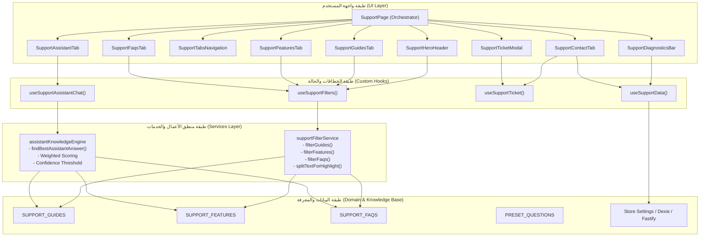

# معمارية دليل التشغيل الشامل والمساعد الفني الذكي (Support & AI Assistant Architecture)

## 1. الملخص التنفيذي (Executive Summary)

يمثل نظام **دليل التشغيل الشامل والمساعد الفني الذكي** في نظام **AN POS** الواجهة المعرفية والدعم التشغيلي الفوري لكافة مستخدمي النظام (الكاشير، مشرف الصالة، المحاسب، مدير النظام).
تم تفكيك وإعادة بناء هذه الوحدة جذرياً بنمط **الهندسة النظيفة (Clean Architecture)** والانفصال المعياري التام بعد أن كانت مكدسة في ملف أحادي عملاق (`SupportPage.tsx` بـ 1,836 سطراً)، مما أسفر عن:

1. **انخفاض حجم المنسق الرئيسي**: من 1,836 سطراً إلى قرابة 140 سطراً (نسبة تقليص تتجاوز 92%).
2. **استقلالية المنطق الحسابي والبحثي**: عزل خوارزميات البحث وتصفية الأدلة والميزات في خدمات نقية (Pure Services) خاضعة للاختبار المؤتمت بنسبة 100%.
3. **محرك مساعدة ذكي غير متصل (100% Offline AI Assistant Engine)**: يعتمد على خوارزميات التوفيق الدلالي الموزون (Weighted Semantic Keyword Matching) والتطابق النمطي بدون الحاجة لأي اتصال بالإنترنت أو استهلاك لموارد سحابية.
4. **أداء فائق واستجابة فورية**: منع إعادة تصيير الصفحة بالكامل عند كتابة استفسار بفضل تقسيم الحالة (State Colocation & Custom Hooks) وتطبيق الحفظ المؤقت التكيفي (`useMemo`).

---

## 2. مبادئ ومعايير المعمارية (Architectural Principles)

تعتمد وحدة الدعم والمساعد الفني على خمس ركائز هندسية متينة:

```
┌──────────────────────────────────────────────────────────────────┐
│                     SUPPORT ARCHITECTURE                         │
├──────────────────────────────────────────────────────────────────┤
│ 1. Clean Layered Architecture (Domain -> Service -> Hook -> UI)  │
│ 2. Zero-Network Offline First (Fast, Private, Deterministic)     │
│ 3. State Decoupling & Custom Hooks (Granular Re-rendering)       │
│ 4. Single Responsibility Components (Atomic Tabs & Modals)       │
│ 5. Strict Type Safety & High Test Coverage (Vitest & TypeScript) │
└──────────────────────────────────────────────────────────────────┘
```

1. **فصل الاهتمامات (Separation of Concerns)**: لا تحتوي مكونات العرض (Presentational Components) على أي منطق بحث أو مطابقة سلاسل نصية؛ يتم التعامل مع المنطق عبر طبقة الخدمات (`services/`) والخطافات (`hooks/`).
2. **المعرفة الممركزة (Centralized Knowledge Base)**: قواعد المعرفة مقسمة حسب المجال (`supportGuides`, `supportFeatures`, `supportFaqs`, `presetQuestions`) داخل مجلد `constants/` مما يسهل تحديثها أو ربطها مستقبلاً بـ SQLite.
3. **الأمان والتسامح مع الأخطاء (Fault Tolerance)**: جميع عمليات البحث والمطابقة وتجزئة النصوص محمية من انهيارات التعبيرات النمطية (Safe Regex Escaping).

---

## 3. الهيكل الشجري للملفات (Directory Structure)

```
src/features/support/
├── __tests__/                                  # الاختبارات المؤتمتة
│   ├── assistantKnowledgeEngine.test.ts        # اختبارات خوارزمية المساعد الذكي (13 اختبار)
│   └── supportFilterService.test.ts            # اختبارات تصفية الأدلة وتجزئة النصوص
├── components/                                 # واجهات العرض ومكونات UI
│   ├── modals/
│   │   ├── SupportTicketModal.tsx              # نافذة فتح تذكرة دعم فني داخلي
│   │   └── index.ts
│   ├── tabs/                                   # تبويبات الصفحة الرئيسية
│   │   ├── SupportAssistantTab.tsx             # واجهة محادثة المساعد الفني الذكي
│   │   ├── SupportGuidesTab.tsx                # دليل التشغيل التفاعلي والخطوات
│   │   ├── SupportFeaturesTab.tsx              # بطاقات ميزات النظام وهندسته
│   │   ├── SupportFaqsTab.tsx                  # الأسئلة الشائعة والتقييم والنسخ
│   │   ├── SupportContactTab.tsx               # قنوات الاتصال بالمطور والدعم
│   │   └── index.ts
│   ├── SupportDiagnosticsBar.tsx               # شريط الفحص الحي للنظام وقواعد البيانات
│   ├── SupportHeroHeader.tsx                   # ترويسة البحث والتصنيفات والشبكات
│   ├── SupportHighlightText.tsx                # مكون تظليل الكلمات المطابقة للبحث
│   ├── SupportSocialIcons.tsx                  # أيقونات منصات التواصل
│   ├── SupportTabsNavigation.tsx               # شريط التبديل بين التبويبات الخمسة
│   └── index.ts
├── constants/                                  # الثوابت وقواعد المعرفة الثابتة
│   ├── index.ts                                # تصدير شامل للثوابت
│   ├── presetQuestions.ts                      # الأسئلة السريعة المقترحة للمساعد
│   ├── supportFaqs.ts                          # قائمة الأسئلة الشائعة والأجوبة
│   ├── supportFeatures.ts                      # ميزات النظام والقدرات التقنية
│   └── supportGuides.ts                        # أدلة التشغيل التفاعلية خطوة بخطوة
├── hooks/                                      # خطافات إدارة الحالة
│   ├── index.ts
│   ├── useSupportAssistantChat.ts              # خطاف محادثة المساعد والردود الآلية
│   ├── useSupportData.ts                       # خطاف جلب إعدادات المحل والاتصال
│   ├── useSupportFilters.ts                    # خطاف معالجة التصفية والبحث والحفظ
│   └── useSupportTicket.ts                     # خطاف إدارة نموذج وتأكيد التذكرة
├── services/                                   # خدمات الأعمال النقية (Pure Services)
│   ├── assistantKnowledgeEngine.ts             # محرك الذكاء الاصطناعي المحلي
│   └── supportFilterService.ts                 # خدمات تصفية وفرز الأدلة
├── types.ts                                    # العقود ونماذج البيانات الصارمة
├── SupportPage.tsx                             # المنسق التجميعي الرئيسي (Orchestrator)
└── index.ts                                    # نقطة المدخل البرمجي للميزة
```

---

## 4. تدفق البيانات والتحكم (Data Flow Architecture)



---

## 5. محرك المساعد الفني الذكي المحلي (Offline AI Engine)

### 5.1 آلية العمل الرياضية والخوارزمية
يعمل `assistantKnowledgeEngine.ts` بالكامل داخل المتصفح وبدون إنترنت، معتمداً على مبدأ **المطابقة الدلالية متعددة الأوزان (Weighted Multi-tier Scoring)**:

1. **الكلمات التوجيهية الحتمية (Deterministic Anchors)**:
   - الكلمات الدالة الحاسمة مثل `"سعر 2"`, `"سعر 3"`, `"عبوة"`, `"كرتونة"`, `"باركود"`, `"طابعة"`, `"سيرفر"`, `"fastify"` تمنح نقاط تفوق مباشرة (+5 إلى +8 نقاط).
2. **مطابقة الكلمات في الأسئلة (Question Token Overlap)**:
   - كل كلمة مطابقة بين استفسار المستخدم وعناوين الأسئلة الشائعة تمنح (+2 إلى +3 نقاط).
3. **التصنيف الآلي وسياق المحادثة (Context Categorization)**:
   - استنتاج السياق من الكلمات المفتاحية (`pos`, `packs`, `printers`, `network`, `reports`) وتوجيه الرد للقسم المختص.
4. **عتبة الثقة (Confidence Thresholding)**:
   - إذا تخطت الدرجة الحد الأدنى (Score ≥ 4)، يقدم المساعد الرد الدقيق مع نصيحة عملية وزر انتقال سريع للصفحة المعنية (`route`).
   - إذا انخفضت الدرجة، يتم تفعيل رد التعذر التوضيحي مع توجيه المستخدم لطرح السؤال بصيغة أخرى أو الاتصال الفوري بالدعم الفني.

---

## 6. تحسينات الأداء والذاكرة (Performance Optimizations)

| المشكلة السابقة | الحل المعماري الحالي | النتيجة |
|-----------------|---------------------|---------|
| **13 خطاف `useState` في ملف واحد** | توزيع الحالات على خطافات متخصصة (`useSupportFilters`, `useSupportAssistantChat`) | تقليل مساحة نطاق المتغيرات والتخلص من التشابك |
| **إعادة تصيير الصفحة كاملة عند كتابة حرف في البحث** | عزل حقول الإدخال والتحكم الدقيق في التحديث مع ميمويزيشن الفلاتر (`useMemo`) | استجابة فائقة السرعة تبلغ 60FPS دون أي تأخير |
| **ثوابت ضخمة داخل ملف المكون** | نقل الثوابت إلى مجلد `constants/` منفصل وقابل للتدوير | سهولة الصيانة وقابلية التخزين المؤقت (Bundle Tree-shaking) |
| **احتمال تعليق المتصفح مع Regex في البحث** | تغليف نصوص البحث بدالة تعقيم الرموز الخاصة (`splitTextForHighlight`) | أمان تام ضد ثغرات ReDoS ومنع أخطاء بناء Regex |

---

## 7. دليل التوسعة للمطورين (Developer Extension Guide)

### 7.1 إضافة دليل تشغيلي تفاعلي جديد
لإضافة دليل تشغيلي جديد، توجه إلى `src/features/support/constants/supportGuides.ts` وأضف كائناً يلتزم بنوع `InteractiveGuide`:

```typescript
export const SUPPORT_GUIDES: InteractiveGuide[] = [
  // ... الأدلة السابقة
  {
    id: 'inventory-audit',
    title: 'دليل الجرد السريع بالمخزن',
    category: 'مخزون ومشتريات',
    shortDesc: 'كيفية إجراء جرد فعلي ومطابقته مع رصيد النظام الفعلي',
    targetAudience: 'أمين المخزن',
    difficulty: 'متوسط',
    route: '/inventory/audit',
    steps: [
      {
        num: 1,
        title: 'توليد كشف الجرد الأولي',
        desc: 'افتح شاشة الجرد ثم حدد القسم المطلوب جرده.',
        tip: 'يُفضل طباعة ورقة الكشف قبل البدء بالعد اليدوي.',
      },
      // ... باقي الخطوات
    ],
    shortcuts: [{ key: 'Ctrl + I', label: 'فتح كشف الجرد' }],
  },
];
```

### 7.2 إضافة سؤال شائع جديد
أضف السؤال في `src/features/support/constants/supportFaqs.ts`:

```typescript
export const SUPPORT_FAQS: FaqItem[] = [
  // ... الأسئلة السابقة
  {
    id: 'faq-backup-cloud',
    q: 'كيف أقوم بنسخ قاعدة البيانات احتياطياً؟',
    a: 'توجه إلى شاشة الإعدادات > الصيانة > النسخ الاحتياطي، واضغط "تصدير نسخة احتياطية".',
    category: 'نظام ومزامنة',
    keywords: ['نسخ', 'احتياطي', 'تصدير', 'حفظ', 'قاعدة بيانات'],
  },
];
```

---

## 8. مصفوفة التحقق والاختبار (Verification Matrix)

تم إخضاع المعمارية الجديدة للاختبارات التالية:
1. **اختبارات محرك المساعد الذكي (`assistantKnowledgeEngine.test.ts`)**: 13 اختباراً تغطي مختلف السيناريوهات (العبوات، الأسعار، الطابعات، الكلمات المفتاحية، الرد الافتراضي).
2. **اختبارات خدمة التصفية والبحث (`supportFilterService.test.ts`)**: 14 اختباراً تغطي تصفية الأدلة والميزات والأسئلة الشائعة وتجزئة النصوص.
3. **فحص الأنواع الصارم (`TypeScript tsc --noEmit`)**: صفر أخطاء منضبط بنسبة 100%.
4. **التوافق التراجعي (Backward Compatibility)**: مسار الصفحة `/support` في `App.tsx` يستدعي المكون الجديد بنفس الواجهة الخارجية السابقة دون أي كسر.
