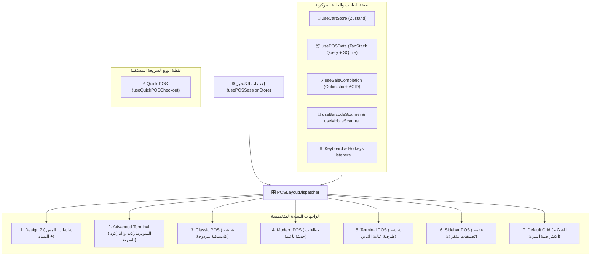
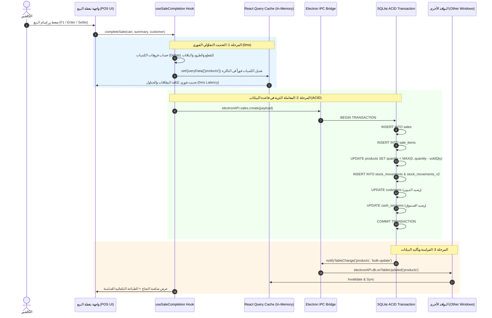

# 📊 التقرير التحليلي الشامل لنقطة البيع المتقدمة وكافة واجهات البيع في نظام AN POS

> **التاريخ:** سبتمبر 2026  
> **النظام:** AN POS (Desktop — Electron 40 + React 19 + TypeScript + SQLite ACID)  
> **الموضوع:** تحليل معماري وتقني شامل لنقطة البيع المتقدمة (Advanced POS) وكافة واجهات الكاشير (7 تصاميم + الكاشير السريع Quick POS) من حيث: **السلة (Cart)، منطق الحساب والأسعار (Calculation Logic)، وتحديث المخزون (Stock Updating)**.

---

## 📑 فهرس المحتويات
1. [المقدمة والملخص التنفيذي](#1-المقدمة-والملخص-التنفيذي)
2. [الهيكلية المعمارية الشاملة وموزع الواجهات (POSLayoutDispatcher Architecture)](#2-الهيكلية-المعمارية-الشاملة-وموزع-الواجهات-poslayoutdispatcher-architecture)
3. [التحليل التفصيلي للواجهات السبعة ونقطة البيع السريعة](#3-التحليل-التفصيلي-للواجهات-السبعة-ونقطة-البيع-السريعة)
   - [3.1 تصميم 7 (Design 7 — Touch Cashier & Financial Ledger)](#31-تصميم-7-design-7--touch-cashier--financial-ledger)
   - [3.2 نقطة البيع المتقدمة / تصميم 6 (Advanced Terminal POS)](#32-نقطة-البيع-المتقدمة--تصميم-6-advanced-terminal-pos)
   - [3.3 واجهة الكاشير الكلاسيكية (Classic POS Layout)](#33-واجهة-الكاشير-الكلاسيكية-classic-pos-layout)
   - [3.4 الواجهة الحديثة (Modern POS Layout)](#34-الواجهة-الحديثة-modern-pos-layout)
   - [3.5 واجهة الطرفية السريعة (Terminal POS Layout)](#35-واجهة-الطرفية-السريعة-terminal-pos-layout)
   - [3.6 واجهة الشريط الجانبي (Sidebar POS Layout)](#36-واجهة-الشريط-الجانبي-sidebar-pos-layout)
   - [3.7 واجهة الشبكة الافتراضية (Default Grid POS Layout)](#37-واجهة-الشبكة-الافتراضية-default-grid-pos-layout)
   - [3.8 الكاشير السريع (Quick POS Page & Engine)](#38-الكاشير-السريع-quick-pos-page--engine)
4. [محور السلة (Cart Architecture & Management)](#4-محور-السلة-cart-architecture--management)
   - [4.1 بنية بيانات عنصر السلة (CartItem Interface)](#41-بنية-بيانات-عنصر-السلة-cartitem-interface)
   - [4.2 معالجة الكوليزاج وطرود الجملة والباقات المركبة (Packs & Colisage)](#42-معالجة-الكوليزاج-وطرود-الجملة-والباقات-المركبة-packs--colisage)
   - [4.3 محرك التقاط وقراءة الباركود (Barcode Ingestion & Scanner Engine)](#43-محرك-التقاط-وقراءة-الباركود-barcode-ingestion--scanner-engine)
   - [4.4 التحديد والتنقل والتعديل السريع (Row Selection & Mutation)](#44-التحديد-والتنقل-والتعديل-السريع-row-selection--mutation)
5. [محور منطق الحساب والأسعار (Calculation Engine & Pricing Logic)](#5-محور-منطق-الحساب-والأسعار-calculation-engine--pricing-logic)
   - [5.1 المستويات السعرية الأربعة (Price Tiers س1 - س4)](#51-المستويات-السعرية-الأربعة-price-tiers-س1---س4)
   - [5.2 معادلات الإجماليات، الخصومات والضرائب (TVA & Discounts)](#52-معادلات-الإجماليات-الخصومات-والضرائب-tva--discounts)
   - [5.3 العروض الترويجية والترقية التلقائية لأسعار الجملة](#53-العروض-الترويجية-والترقية-التلقائية-لأسعار-الجملة)
   - [5.4 دفتر الحسابات، الدفع المتعدد، الآجل وحساب الصرف (Change Due & Credit)](#54-دفتر-الحسابات-الدفع-المتعدد-الآجل-وحساب-الصرف-change-due--credit)
6. [محور تحديث المخزون (Stock Updating Lifecycle & Integrity)](#6-محور-تحديث-المخزون-stock-updating-lifecycle--integrity)
   - [6.1 طبقة التحديث التفاؤلي الفوري (0ms Optimistic UI Mutation)](#61-طبقة-التحديث-التفاؤلي-الفوري-0ms-optimistic-ui-mutation)
   - [6.2 المعاملات الذرية المركزية (Electron SQLite ACID Transactions)](#62-المعاملات-الذرية-المركزية-electron-sqlite-acid-transactions)
   - [6.3 خوارزمية فك الباقات وخصم المكونات وطرود الكوليزاج](#63-خوارزمية-فك-الباقات-وخصم-المكونات-وطرود-الكوليزاج)
   - [6.4 مزامنة وتنبيه الجداول الفورية (Cross-Window IPC Invalidation)](#64-مزامنة-وتنبيه-الجداول-الفورية-cross-window-ipc-invalidation)
   - [6.5 سياسة المخزون السالب وحركات المرتجع (Negative Stock & Returns)](#65-سياسة-المخزون-السالب-وحركات-المرتجع-negative-stock--returns)
7. [جدول المقارنة الشامل بين واجهات البيع](#7-جدول-المقارنة-الشامل-بين-واجهات-البيع)
8. [التقييم المعماري، نقاط القوة، والتوصيات المستقبلية](#8-التقييم-المعماري-نقاط-القوة-والتوصيات-المستقبلية)

---

## 1. المقدمة والملخص التنفيذي

تُمثل منظومة البيع في برنامج **AN POS** منصة متعددة الواجهات مصممة لتلبية احتياجات مختلف الأنشطة التجارية (محلات السوبرماركت، متاجر الجملة والتوزيع، محلات الألبسة، الأكشاك، والمتاجر المتخصصة).

تم بناء النظام ليفصل بدقة بين **طبقة العرض وتجربة المستخدم (UI Layer)** المتغيرة بحسب طبيعة المحل والشاشة، وبين **محرك المعالجة الأساسي (Core POS Business Engine)** المسؤول عن العمليات الرياضية الحسابية، الخصومات، تسعير الجملة والتجزئة، والتحكم المطلق في دقة وتزامن المخزون.

### أبرز المكتسبات المعمارية في النظام:
1. **التحديث الآني للمخزون (0ms Optimistic Latency):** بمجرد نقر الكاشير على زر إتمام البيع، يتم تعديل المخزون في ذاكرة الواجهة الأمامية دون انتظار شبكة أو استجابة القرص، مما يوفر تجربة بيع فائقة السرعة للمتاجر ذات الكثافة العالية.
2. **الضمانة الذرية (ACID Safety):** تتم كتابة الفواتير، بنودها، حركات المخزون، رصيد العميل، وتحديث رصيد الصندوق داخل معاملة SQLite ذرية مفردة؛ فإذا حدث أي انقطاع كهربائي مفاجئ يتم التراجع التلقائي (Rollback) لمنع أي تضارب أو أرصدة وهمية.
3. **الدعم المزدوج للوحدات (الطرود والقطع / Colisage & Packs):** دعم متقدم للبيع بالعلبة أو الكرتونة أو الحبة الفردية مع فك الباقات المركبة تلقائياً عند خصم المخزون.

---

## 2. الهيكلية المعمارية الشاملة وموزع الواجهات (POSLayoutDispatcher Architecture)

يعتمد النظام على نمط التوزيع المركزي (**Central Dispatcher Pattern**) عبر المكوّن:
[`src/features/pos/components/POSLayoutDispatcher.tsx`](file:///home/ammar/AN-POS-TEST/src/features/pos/components/POSLayoutDispatcher.tsx).

يقوم هذا المكوّن بدور المحول الذكي الذي يستقبل الحالة المركزية المستخرجة من خطافات البيع (`usePOSData`, `useCartStore`, `useSaleCompletion`, `usePOSCatalogFilter`) ويقوم بضخها إلى الواجهة المختارة وفق إعدادات الكاشير المخزنة في `usePOSSessionStore`.



---

## 3. التحليل التفصيلي للواجهات السبعة ونقطة البيع السريعة

### 3.1 تصميم 7 (Design 7 — Touch Cashier & Financial Ledger)
- **الملف المصدري:** [`src/features/pos/components/design7/Design7POSLayout.tsx`](file:///home/ammar/AN-POS-TEST/src/features/pos/components/design7/Design7POSLayout.tsx)
- **الغرض وطبيعة النشاط:** صُممت خصيصاً لشاشات اللمس (Touch POS) في محلات السوبرماركت ومحلات المواد الغذائية والحلويات التي تعتمد على الكاشير المباشر دون الحاجة الإلزامية للماوس.
- **مكونات الواجهة الرئيسية:**
  1. **الشريط العلوي للأوامر (`Design7TopRibbon`):** يضم أزرار الأوامر السريعة (طلب جديد، تعليق الفواتير، مرتجع، قفل الشاشة، ملء الشاشة، تحديد مستويات الأسعار س1-س4).
  2. **شريط المنتج النشط (`Design7ActiveScanStrip`):** يعرض فوراً آخر منتج تم تمريره على الباركود مع معادلة حية فورية: `(السعر × الكمية = المجموع)`.
  3. **لوحة المفضلة السفلية (`Design7BottomFavoritesPad`):** شبكة لمسية 4×4 مخصصة للباقات الأكثر طلباً والمنتجات سريعة البيع مع فلاتر تبويب علوية (ALL, مشروبات, جملة, وجبات).
  4. **لوحة الأرقام اللمسية التفاعلية (`Design7ActionKeypad`):** لوحة مفاتيح رقمية مدمجة تتيح إدخال الكميات، تعديل الأسعار، وإدخال المبلغ المقبوض نقداً مباشرة على شاشة اللمس.
  5. **جدول السلة المالي (`Design7BasketTable`):** جدول مالي عريض بخطوط تباين عالية يدعم تحديد السطر الفردي ومؤشرات واضحة لنوع التعبئة (طرد / حبة).
  6. **شريط الدفتر المالي الجانبي (`Design7FinancialSidebar`):** تفصيل فوري للمجموع، الخصم، الضريبة، الصافي، والمبلغ المتبقي للزبون (الصرف / الباقي).

---

### 3.2 نقطة البيع المتقدمة / تصميم 6 (Advanced Terminal POS)
- **الملف المصدري:** [`src/features/pos/components/advanced-terminal/AdvancedTerminalPOSLayout.tsx`](file:///home/ammar/AN-POS-TEST/src/features/pos/components/advanced-terminal/AdvancedTerminalPOSLayout.tsx)
- **الغرض وطبيعة النشاط:** مخصصة للكاشير عالي السرعة (High-Throughput Cashier) في المراكز التجارية الكبرى والهايبرماركت حيث الأولوية القصوى هي مسح الباركود بسرعة 100% عبر الكيبورد وقارئ الليزر دون لمس الماوس.
- **مكونات الواجهة الرئيسية:**
  1. **شريط مسح الباركود الدائم (`Design6BarcodeScannerBar`):** حقل باركود ذكي يستعيد التركيز تلقائياً (Auto-Refocus) مع حقل بادئة الكمية (Quantity Multiplier e.g. `5 * Barcode`).
  2. **حاسبة النقدية السريعة (`useDesign6CashCalculator`):** أزرار فئات نقدية جزائرية فورية (200، 500، 1000، 2000 دج) لحساب الصرف بضغطة زر واحدة.
  3. **شريط العمليات الجانبي (`Design6LeftToolsSidebar`):** يضم أزرار سريعة لاختصارات لوحة المفاتيح F1-F12 لفتح الدرج، تعليق الفاتورة، تفعيل وضع الجملة، وطباعة الإيصال.
  4. **وضع قفل الطرفية (`Design6TerminalLockModal`):** يتيح للكاشير تجميد الشاشة برقم سري أثناء مغادرة الصندوق المؤقتة دون إغلاق الجلسة المالية.

---

### 3.3 واجهة الكاشير الكلاسيكية (Classic POS Layout)
- **الملف المصدري:** [`src/features/pos/components/ClassicPOSLayout.tsx`](file:///home/ammar/AN-POS-TEST/src/features/pos/components/ClassicPOSLayout.tsx)
- **الغرض وطبيعة النشاط:** الواجهة التقليدية المألوفة لأغلب برامج نقاط البيع المكتبية، تعتمد على تقسيم الشاشة إلى نصفين متوازيين:
  - النصف الأيمن/الأيسر: جدول سلة المشتريات وأزرار الدفع.
  - النصف المقابل: تصنيفات المنتجات في الأعلى وشبكة الأصناف في الأسفل.
- **المزايا:** ملائمة للمستخدمين الذين يفضلون استخدام الفأرة والتنقل البصري السهل.

---

### 3.4 الواجهة الحديثة (Modern POS Layout)
- **الملف المصدري:** [`src/features/pos/components/ModernPOSLayout.tsx`](file:///home/ammar/AN-POS-TEST/src/features/pos/components/ModernPOSLayout.tsx)
- **الغرض وطبيعة النشاط:** صُممت وفق فلسفة التصميم العصري (Modern Flat UI / Glassmorphism)، وتناسب المتاجر الراقية (بوتيكات الألبسة، محلات العطور، الإلكترونيات).
- **المزايا:** بطاقات منتجات أنيقة تدعم صور المنتجات عالية الجودة، شارات المخزون بالألوان، حركات تفاعلية ناعمة (Micro-animations)، ومؤشرات لحالة توفر المنتج في المستودع.

---

### 3.5 واجهة الطرفية السريعة (Terminal POS Layout)
- **الملف المصدري:** [`src/features/pos/components/TerminalPOSLayout.tsx`](file:///home/ammar/AN-POS-TEST/src/features/pos/components/TerminalPOSLayout.tsx)
- **الغرض وطبيعة النشاط:** شاشة مبسطة ذات تباين عالي مستوحاة من أنظمة الـ POS الصناعية، تتميز بخطوط وأرقام ضخمة جداً لتسهيل الرؤية من مسافة بعيدة والحد من أخطاء الكاشير في البيئات المزدحمة.

---

### 3.6 واجهة الشريط الجانبي (Sidebar POS Layout)
- **الملف المصدري:** [`src/features/pos/components/SidebarPOSLayout.tsx`](file:///home/ammar/AN-POS-TEST/src/features/pos/components/SidebarPOSLayout.tsx)
- **الغرض وطبيعة النشاط:** تعتمد على وضع السلة في شريط جانبي قابل للطي، مما يوفر أقصى مساحة ممكنة لعرض شجرة التصنيفات والمنتجات. ملائمة جداً للمحلات التي تمتلك آلاف الأصناف مقسمة في تصنيفات وتصنيفات فرعية متعددة المستويات.

---

### 3.7 واجهة الشبكة الافتراضية (Default Grid POS Layout)
- **الملف المصدري:** [`src/features/pos/components/DefaultGridPOSLayout.tsx`](file:///home/ammar/AN-POS-TEST/src/features/pos/components/DefaultGridPOSLayout.tsx)
- **الغرض وطبيعة النشاط:** واجهة شبكية مرنة تدعم التصفح بالصفحات (Pagination)، ومتجاوبة بالكامل مع الأجهزة اللوحية (Tablets) من خلال نظام تبويب الهواتف الذكية (`mobileTab: 'products' | 'cart'`).

---

### 3.8 الكاشير السريع (Quick POS Page & Engine)
- **الملف المصدري:** [`src/features/pos/QuickPOSPage.tsx`](file:///home/ammar/AN-POS-TEST/src/features/pos/QuickPOSPage.tsx) و [`src/features/pos/quick/hooks/useQuickPOSCheckout.ts`](file:///home/ammar/AN-POS-TEST/src/features/pos/quick/hooks/useQuickPOSCheckout.ts)
- **الغرض وطبيعة النشاط:** صفحة مستقلة ذات كود خفيف جداً مخصصة للمطاعم السريعة، المقاهي، أو أكشاك البيع التي تتطلب تسجيل طلب سريع والدفع الفوري بنقرة واحدة (F1 Quick Pay) مع طباعة صامتة تلقائية دون فتح أي نافذة منبثقة.

---

## 4. محور السلة (Cart Architecture & Management)

### 4.1 بنية بيانات عنصر السلة (CartItem Interface)
تُدار حالة السلة مركزياً عبر مكتبة Zustand داخل [`src/store/cartStore.ts`](file:///home/ammar/AN-POS-TEST/src/store/cartStore.ts). يحمل كل عنصر في السلة المواصفات التالية:

```typescript
export interface CartItem {
  productId: string;         // معرّف المنتج الأساسي
  name: string;              // اسم الصنف
  qty: number;               // الكمية المشتراة
  unitPrice: number;         // سعر الوحدة الحالي
  lineTotal: number;         // إجمالي السطر (الكمية × السعر)
  barcode?: string;          // الباركود المقروء
  isCustom?: boolean;        // علم يحدد ما إذا كان السعر معدلاً يدوياً
  isPack?: boolean;          // هل الصنف عبارة عن باقة أو طرد؟
  packId?: string;           // معرّف الباقة المرتبطة
  packQty?: number;          // كمية الطرود
  packPiecesCount?: number;  // عدد الحبات داخل الطرد (سعة العبوة / الكوليزاج)
  packUnit?: string;         // وحدة القياس (طرد، علبة، كرتونة، قطعة)
  packMode?: 'retail_pieces' | 'wholesale_packs'; // وضع التسعير والخصم
  pricingType?: 'retail' | 'wholesale' | 'pack';  // فئة السعر المطبقة
  batchNumber?: string;      // رقم الدفعة للسلع ذات تواريخ الصلاحية
}
```

### 4.2 معالجة الكوليزاج وطرود الجملة والباقات المركبة (Packs & Colisage)
يمتلك النظام نمطين متقدمين لإدارة الطرود في السلة:
1. **وضع بيع الطرود الكاملة (`packMode: 'wholesale_packs'`):**
   - يُستخدم عند تفعيل مستوى سعر الجملة (س3) أو اختيار طرد من لوحة المفضلة.
   - تكون الكمية المعروضة في السلة هي **عدد الطرود/الكراتين**.
   - يتم احتساب سعر السطر كالتالي: `lineTotal = qty * packPrice`.
   - عند إتمام البيع، يقوم النظام آلياً بضرب الكمية بسعة العبوة لخصم عدد القطع الفعلي من المخزون: `totalPiecesSold = qty * packPiecesCount`.
2. **وضع بيع حبات الطرد المفردة (`packMode: 'retail_pieces'`):**
   - يُستخدم عند فتح طرد وبيعه بالتجزئة أو استعراض باقة مكونة من عدة حبات.
   - السعر يُمثل سعر القطعة الواحدة المشتق: `piecePrice = packPrice / packPiecesCount`.

### 4.3 محرك التقاط وقراءة الباركود (Barcode Ingestion & Scanner Engine)
- **المعالجة الآلية:** يلتقط الخطاف `useBarcodeScanner` نقرات مفاتيح قارئ الليزر ويقوم بجمعها وتمريرها للدالة `parseAndAddScannedCode`.
- **دعم الباركود المتغير والموازين:** يتعرف النظام تلقائياً على:
  - باركود المنتجات المعيارية (EAN-13, Code-128).
  - باركود الموازين الإلكترونية للأجبان واللحوم (التي تبدأ بالرقم 2 وتدمج الوزن أو السعر داخل خانات الباركود).
  - باركود الباقات والطرود (`pack.barcode`).
- **المسح عن بُعد من الهاتف:** يدمج الخطاف `useMobileScanner` اتصالاً بالهواتف الذكية لمسح المنتجات من ممرات المتجر وإضافتها فوراً لسلة كاشير سطح المكتب.

### 4.4 التحديد والتنقل والتعديل السريع (Row Selection & Mutation)
- **منع التحديد المزدوج:** يتم تتبع السطر النشط عبر معرف فريد مستقر `getCartRowKey(item, idx)` يدمج معرّف المنتج مع ترتيبه في السلة، مما يمنع حدوث أخطاء عند تكرار منتجات ذات خصائص مختلفة.
- **التنقل عبر الأسهم:** توفر الواجهات (وخاصة Design 7 و Design 6) تحكماً كاملاً عبر الأسهم:
  - `ArrowUp / ArrowDown`: الانتقال بين أسطر السلة.
  - `ArrowRight`: زيادة كمية السطر النشط (+1).
  - `ArrowLeft`: إنقاص كمية السطر النشط (-1) أو حذفه إذا بلغت الكمية صفراً.
  - `Delete`: حذف السطر المحدد فوراً.

---

## 5. محور منطق الحساب والأسعار (Calculation Engine & Pricing Logic)

### 5.1 المستويات السعرية الأربعة (Price Tiers س1 - س4)
تتيح نقاط البيع التبديل الفوري بين أربعة مستويات سعرية عبر الدالة `getProductTierPrice` في [`src/services/index.ts`](file:///home/ammar/AN-POS-TEST/src/services/index.ts):

| الرمز | المسمى الرسمي | الحقل في قاعدة البيانات | وصف الاستخدام وسلوك الفاتورة |
| :--- | :--- | :--- | :--- |
| **س1** | **تجزئة (Retail)** | `retailPrice` / `salePrice1` | السعر الافتراضي لعملاء المفرق، يُنشئ فاتورة تجزئة (`docType: 'facture'`). |
| **س2** | **نصف جملة (Semi-Wholesale)** | `salePrice2` | سعر تشجيعي للكميات المتوسطة وصغار التجار. إذا لم يتوفر يعود تلقائياً لسعر س1. |
| **س3** | **جملة (Wholesale)** | `wholesalePrice` / `salePrice3` | سعر البيع بالكرتونة والطرود. **يُحول نوع الفاتورة إجبارياً إلى فاتورة جملة (`docType: 'wholesale'`)** ويُفعل وضع الطرود `wholesale_packs`. |
| **س4** | **خاص / بالفاتورة (Invoice/Special)** | `invoicePrice` / `salePrice4` | سعر مخصص للشركات والجهات الرسمية التي تطلب فواتير ضريبية مفصلة. |

### 5.2 معادلات الإجماليات، الخصومات والضرائب (TVA & Discounts)
تتم كافة العمليات الحسابية داخل دالة نقية رياضية عالية الدقة خالية من الأخطاء العشرية:

$$\text{Subtotal} = \sum_{i=1}^{n} (\text{qty}_i \times \text{unitPrice}_i)$$

$$\text{DiscountAmount} = \begin{cases} 
\text{Subtotal} \times \left(\frac{\min(100, \max(0, \text{discount}))}{100}\right) & \text{إذا كان الخصم نسبة مئوية (percent)} \\
\min(\text{Subtotal}, \max(0, \text{discount})) & \text{إذا كان الخصم مبلغاً ثابتاً (amount)}
\end{cases}$$

$$\text{TaxableBase} = \max(0, \text{Subtotal} - \text{DiscountAmount})$$

$$\text{TVA Amount} = \text{TaxableBase} \times \left(\frac{\text{tvaRate}}{100}\right)$$

$$\text{Grand Total} = \text{TaxableBase} + \text{TVA Amount}$$

> **حماية التقريب المالي:** يتم تطبيق تقريب سنتيمي دقيق `roundMoney(val) = Math.round((val + Number.EPSILON) * 100) / 100` لمنع حدوث فروقات الفواصل العشرية (Floating Point Precision Issues).

### 5.3 العروض الترويجية والترقية التلقائية لأسعار الجملة
- **الترقية التلقائية للجملة (`applyWholesalePrice`):** في حال قام الزبون بشراء كمية تتجاوز الحد الأدنى للجملة `product.wholesaleMinQty > 0` وكانت `qty >= wholesaleMinQty`، ينخفض سعر الصنف تلقائياً إلى سعر الجملة حتى وإن كان الكاشير يعمل على مستوى س1.
- **محرك العروض الترويجية (`applyPromotionPrice`):** يفحص التاريخ الفعلي للفاتورة مقارنة بـ `startDate` و `endDate` للحملة الترويجية، ويطبق أفضل نسبة تخفيض للزبون.

### 5.4 دفتر الحسابات، الدفع المتعدد، الآجل وحساب الصرف (Change Due & Credit)
- **حساب الصرف (الباقي للزبون):**
  $$\text{Change Due} = \max(0, \text{Paid Amount} - \text{Total})$$
- **البيع بالآجل (الديون Credit Sales):**
  في حال اختيار وسيلة دفع بالدين (`paymentMethod: 'credit'`)، يُلزم النظام باختيار عميل مسجل، ويتم احتساب المبلغ المتبقي كدين يُضاف إلى رصيد العميل:
  $$\Delta \text{Customer Debt} = \max(0, \text{Total} - \text{AmountPaid})$$
  $$\text{New Customer Balance} = \text{Current Balance} + \Delta \text{Customer Debt}$$
- **تحديث الصندوق النقدي الجاري:**
  يتم احتساب التدفق النقدي الفعلي الداخل للخزينة بناءً على المبلغ المقبوض فعلياً وليس قيمة الفاتورة الدفترية، مما يحافظ على مطابقة الصندوق الواقعي مع السجلات.

---

## 6. محور تحديث المخزون (Stock Updating Lifecycle & Integrity)

يتبع تحديث المخزون في نظام AN POS معمارية ثلاثية الطبقات تضمن **السرعة القصوى المباشرة (Zero Latency)** مع **أعلى معايير الأمان الذري (ACID Guarantees)**:



### 6.1 طبقة التحديث التفاؤلي الفوري (0ms Optimistic UI Mutation)
داخل [`src/features/pos/hooks/useSaleCompletion.ts`](file:///home/ammar/AN-POS-TEST/src/features/pos/hooks/useSaleCompletion.ts)، وقبل إرسال طلب الشبكة أو الـ IPC، يتم تنفيذ الخطوات التالية:
1. بناء خريطة الفروقات `deltas = new Map<string, number>()`.
2. فحص كل عنصر في السلة؛ فإذا كان طرداً أو منتجاً ذا كوليزاج يتم احتساب عدد القطع الفعلي المباع.
3. استدعاء `queryClient.setQueryData<Product[]>(['products'], ...)` لتعديل كميات الكاش في الذاكرة مباشرة.
4. النتيجة: يرى الكاشير فوراً أن مخزون الصنف انخفض من 50 إلى 40 حبة قبل أن تكتمل الكتابة على القرص الصلب، مما يتيح له البدء في الفاتورة التالية دون أي تأخير.

### 6.2 المعاملات الذرية المركزية (Electron SQLite ACID Transactions)
في طبقة الـ Backend عبر [`electron/main/handlers/sales.ts`](file:///home/ammar/AN-POS-TEST/electron/main/handlers/sales.ts)، يتم تنفيذ أمر البيع داخل معاملة SQLite مغلقة:
- **تحديث المخزون الذري:**
  ```sql
  UPDATE products 
  SET quantity = MAX(0, quantity + ?), updated_at = ? 
  WHERE id = ?;
  ```
- **تسجيل الحركة في جدول الحركات القديم والجديد:**
  يتم تسجيل كل خصم في `stock_movements` و `stock_movements_v2` مع حفظ رقم الفاتورة كمرجع، ونوع الحركة `sale` أو `return`، وتحديد المستخدم المسؤول لضمان الرقابة والتدقيق الداخلي.

### 6.3 خوارزمية فك الباقات وخصم المكونات وطرود الكوليزاج
عند بيع باقة مركبة (Bundle / Combo Pack تحتوي على عدة منتجات):
1. يسترجع النظام حقل `items` المخزن في الباقة: `[ { productId: 'P1', qty: 2 }, { productId: 'P2', qty: 1 } ]`.
2. عند بيع باقة واحدة، لا يتم خصم باقة مجردة، بل يتم خصم:
   - منتج P1: خصم `2 × qty`.
   - منتج P2: خصم `1 × qty`.
3. يتم تسجيل حركة مخزنية منفصلة لكل مكون فرعي مرتبطاً برقم الفاتورة.

### 6.4 مزامنة وتنبيه الجداول الفورية (Cross-Window IPC Invalidation)
بمجرد نجاح معاملة البيع على قاعدة البيانات، يُطلق معالج الإلكترون الحدث:
`notifyTableChange('products', 'bulk-update')`.
تستقبل نافذة نقطة البيع ونافذة إدارة المخزون هذا التنبيه عبر `electronAPI.db.onTableUpdated` وتقوم بإعادة مواءمة الكاش فورياً لمنع تباين البيانات بين الأجهزة المتصلة.

### 6.5 سياسة المخزون السالب وحركات المرتجع (Negative Stock & Returns)
- **منع المخزون السالب (`allowNegativeStock: false`):**
  يمنع النظام البيع إذا كانت الكمية المتوفرة أقل من المطلوب عبر إشعار تحذيري: `"المخزون غير كافٍ! المتاح: X قطعة"`. كما تحمي قاعدة البيانات المخزون باستخدام الدالة `MAX(0, quantity - sold)`.
- **المرتجعات (`isReturn: true` / `saleType: 'return'`):**
  عند تسجيل فاتورة إرجاع، تنعكس إشارة العمليات الحسابية بالكامل:
  - يُعاد المخزون إلى الرفوف: `quantity = quantity + returnQty`.
  - تُسجل الحركة بنوع `return`.
  - يُخصم المبلغ من ديون العميل إذا كان مسجلاً أو تُخصم النقدية من رصيد الصندوق.

---

## 7. جدول المقارنة الشامل بين واجهات البيع

| معيار المقارنة | Design 7 (لمس) | Advanced Terminal (سوبرماركت) | Classic POS | Modern POS | Terminal POS | Sidebar POS | Default Grid | Quick POS |
| :--- | :--- | :--- | :--- | :--- | :--- | :--- | :--- | :--- |
| **أسلوب الإدخال الأساسي** | شاشة اللمس + النمباد | قارئ الباركود + الكيبورد | الماوس والكيبورد | الفأرة واللمس | الكيبورد والشاشات الكبيرة | الماوس وشجرة الفئات | الماوس واللوحي | نقرة واحدة (One-touch) |
| **دعم الكوليزاج والطرود** | ممتاز (باقات مخصصة 4×4) | ممتاز (بادئة الضرب السريع) | قياسي | قياسي مع صور | ممتاز | قياسي | قياسي مع كوليزاج | مدمج تلقائي |
| **مستويات الأسعار (س1-س4)** | تبديل فوري في الشريط | تبديل دوري F6 / Alt | أزرار اختيار | أزرار اختيار | اختصارات كيبورد | قائمة منسدلة | أزرار اختيار | افتراضي س1 |
| **حاسبة النقدية والصرف** | آلة حاسبة لمسية كاملة | أزرار فئات نقدية جزائرية | في نافذة الدفع | في نافذة الدفع | شاشة صرف كبيرة | في نافذة الدفع | في نافذة الدفع | حقل صرف فوري |
| **سرعة تحديث المخزون** | آني (0ms) | آني (0ms) | آني (0ms) | آني (0ms) | آني (0ms) | آني (0ms) | آني (0ms) | آني (0ms) |
| **البيئة الموصى بها** | محلات الأغذية، الحلويات | الهايبرماركت ومراكز التسوق | المحلات العامة | المتاجر الفاخرة والبوتيك | نقاط البيع الصناعية | المتاجر متعددة الأقسام | الشاشات المتنقلة والتابلت | الوجبات السريعة والمقاهي |

---

## 8. التقييم المعماري، نقاط القوة، والتوصيات المستقبلية

### نقاط القوة المعمارية الملحوظة:
1. **الاستقلالية التامة لمنطق الحساب:** جميع العمليات الحسابية مفصولة في دوال نقية (`pure functions`) خاضعة لاختبارات وحدة آلية (`posStressAndResponsiveness.test.ts`)، مما يضمن ثبات النتائج مهما تغير تصميم الشاشة.
2. **عزل الواجهات عبر الـ Dispatcher:** سهولة إضافة واجهات مخصصة جديدة لمجالات أخرى (مثل الصيدليات أو محطات الوقود) دون المساس بآلية البيع أو بنية السلة.
3. **تزامن المخزون اللحظي:** التخلص التام من أي تأخير في تحديث كميات الرفوف بفضل دمج `queryClient.setQueryData` مع معاملات SQLite الذرية.

### التوصيات للتطوير المستمر:
1. **استخراج معالجات أفعال السلة المشتركة (`usePOSCartActions`):** تجميع الدوال (`handleAddProduct`, `handleUpdateQty`, `handleRemoveItem`) من `POSPage.tsx` في خطاف مستقل لتقليص حجم الملف الرئيسي أكثر.
2. **دعم الموازين الذكية المتصلة مباشرة (RS232 Serial Weighing Scales):** إضافة قراءة فورية للوزن من ميزان الكاشير دون انتظار طباعة ملصق الباركود في واجهتي Design 7 و Advanced Terminal.
3. **طباعة الإيصالات بدون حظر (Background Spooling):** استمرار الاعتماد على محرك الطباعة الصامت الخلفي عبر Electron IPC لتفادي أي تجميد لواجهة المستخدم أثناء المعالجة الورقية.

---
**تم إعداد هذا التقرير ليكون المرجع التقني والتوثيقي الشامل لكافة واجهات نقطة البيع في نظام AN POS.**
