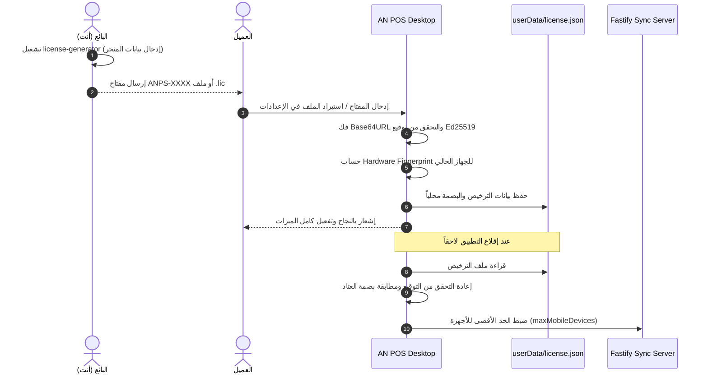

# نظام مفاتيح التفعيل ذاتية التحقق — AN POS Activation System

## 1. فلسفة النظام والمبادئ التوجيهية
نظام **AN POS** مبني على فلسفة **Offline-First** الصارمة. يجب أن تعمل عملية تفعيل النظام بدون أي اتصال بالإنترنت أو الاعتماد على خوادم خارجية قد تتعطل أو تتوقف.

### المقارنة المعمارية
| المعيار | مفتاح ذاتي التحقق (المعتمد) | خادم ترخيص مركزي |
|---|---|---|
| **الحاجة للإنترنت وقت التفعيل** | ❌ لا يتطلب إنترنت نهائياً | ✅ يتطلب إنترنت مرة واحدة على الأقل |
| **بنية تحتية وتكاليف تشغيل** | ❌ صفر تكاليف تشغيلية | ✅ خادم + قاعدة بيانات + نطاق + مراقبة |
| **التوافق مع بيئة نقاط البيع (POS)** | ✅ توافق بنسبة 100% | ⚠️ معرض للتوقف عند انقطاع الشبكة |
| **الأمان ومنع التزوير** | ✅ أمان رياضي غير قابل للكسر (Ed25519) | ✅ أمان مركزي |

---

## 2. البنية التشفيرية لمفتاح التفعيل (Cryptographic Architecture)

### 2.1 زوج المفاتيح (Ed25519 Key Pair)
يستخدم النظام خوارزمية التوقيع الرقمي الحديثة **Ed25519**:
* **المفتاح الخاص (Private Key):** يظل بحوزة البائع (المطور) فقط خارج أي مستودع برمجي، ويُستخدم لتوقيع التراخيص.
* **المفتاح العام (Public Key):** يُدمج في الكود المصدري لتطبيق AN POS Desktop للتحقق من صحة التوقيع.

### 2.2 بنية البيانات المضغوطة (License Binary Payload - 20 بايت)
```text
 0                   1                   2                   3
 0 1 2 3 4 5 6 7 8 9 0 1 2 3 4 5 6 7 8 9 0 1 2 3 4 5 6 7 8 9 0 1
+-+-+-+-+-+-+-+-+-+-+-+-+-+-+-+-+-+-+-+-+-+-+-+-+-+-+-+-+-+-+-+-+
|                    storeId (6 Bytes ASCII)                    |
|                               +-+-+-+-+-+-+-+-+-+-+-+-+-+-+-+-+
|                               |     expiresAt (4 Bytes LE)    |
+-+-+-+-+-+-+-+-+-+-+-+-+-+-+-+-+-+-+-+-+-+-+-+-+-+-+-+-+-+-+-+-+
|  maxMobileDevices (2 Bytes LE)|      issuedAt (4 Bytes LE)    |
+-+-+-+-+-+-+-+-+-+-+-+-+-+-+-+-+-+-+-+-+-+-+-+-+-+-+-+-+-+-+-+-+
|                     flags (4 Bytes LE)                        |
+-+-+-+-+-+-+-+-+-+-+-+-+-+-+-+-+-+-+-+-+-+-+-+-+-+-+-+-+-+-+-+-+
```

* `storeId` (6 Bytes): معرّف قصير للمتجر (مثل `ST0042`).
* `expiresAt` (4 Bytes UInt32 LE): طابع زمني بانتهاء الصلاحية بالثواني (Unix timestamp)، أو `0` لترخيص مدى الحياة.
* `maxMobileDevices` (2 Bytes UInt16 LE): الحد الأقصى لأجهزة الجوال المسموح باقترانها مع سطح المكتب.
* `issuedAt` (4 Bytes UInt32 LE): تاريخ إصدار الترخيص.
* `flags` (4 Bytes UInt32 LE): حقل محجوز للترقيات والميزات الإضافية.

### 2.3 التوقيع والترميز
1. يتم توقيع الـ 20 بايت بالمفتاح الخاص لإنتاج توقيع بطول **64 بايت**.
2. دمج الـ Payload مع التوقيع: `Buffer.concat([payloadBuffer, signatureBuffer])` = **84 بايت**.
3. تشفير الناتج بصيغة `Base64URL` (بطول 112 حرفاً).
4. تقسيم النص لمجموعات من 5 أحرف مسبوقة بـ `ANPS-`:
   ```text
   ANPS-AAAAA-BBBBB-CCCCC-DDDDD-EEEEE-...
   ```

---

## 3. ربط العتاد (Hardware Fingerprint)

لضمان عدم نسخ ملف الترخيص وتشغيله على أجهزة أخرى بدون إذن:
* يتم استخراج بصمة عتاد ثابتة من النظام:
  * **Windows:** `MachineGuid` من سجل النظام (Registry) + المعالج.
  * **Linux:** `/etc/machine-id` أو `/var/lib/dbus/machine-id`.
  * **macOS:** `IOPlatformSerialNumber`.
* تُدمج القيم وتُشفر باستخدام `SHA-256`.
* عند التفعيل لأول مرة على جهاز العميل، تُسجل بصمة الجهاز محلياً في `userData/license.json` مصحوبة بالتوقيع.
* عند كل تشغيل للتطبيق، يعاد التحقق من بصمة الجهاز والتوقيع الرقمي.

---

## 4. تدفق العمليات (Sequence Diagram)



---

## 5. تكامل خادم المزامنة المحلي (Mobile Sync Restriction)

يقوم خادم Fastify المحلي على سطح المكتب بفحص عدد الأجهزة المتصلة:
* إذا كان عدد الأجهزة المقترنة النشطة >= `maxMobileDevices` المرخصة، يرفض السيرفر طلب الاقتران الجديد من الهاتف برسالة:
  `تم الوصول للحد الأقصى لعدد الأجهزة المرخصة لهذا المتجر (${maxMobileDevices})`.
