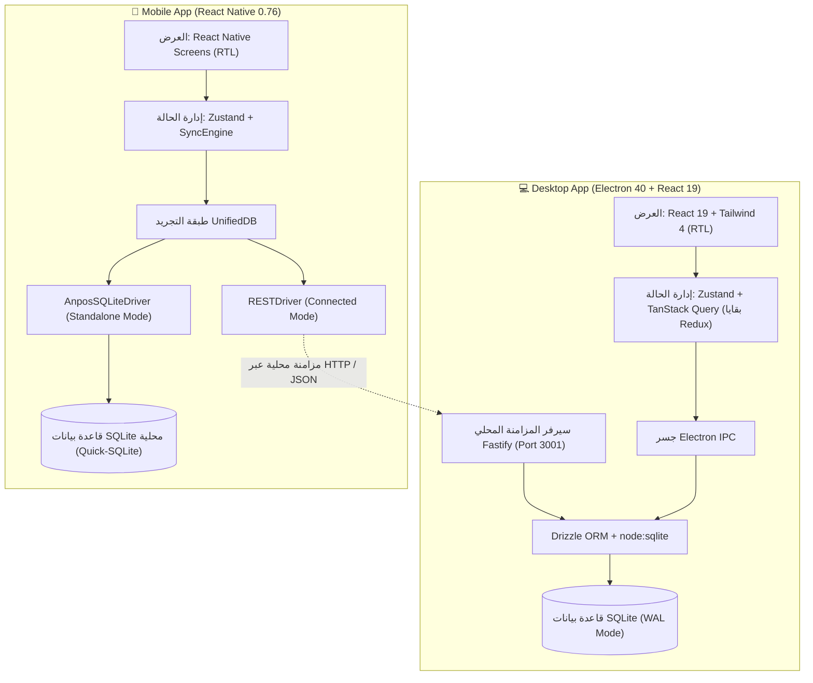

# 📊 التحليل المعماري، تشخيص المشاكل، وخارطة طريق الميزات — AN POS

تم إعداد هذا التقرير الفني استناداً إلى معايير **Technology Selection Framework** وفحص المعمارية الحالية لنظام **AN POS** (نسخة سطح المكتب + نسخة الهاتف المحمول).

---

## 🏛️ 1. التحليل المعماري للنظام الحالي (System Architecture)



### تقييم المكدس التقني (Technology Evaluation Matrix)

| المعيار | التقييم | التحليل |
|---|:---:|---|
| **قاعدة البيانات (SQLite WAL)** | ⭐⭐⭐⭐⭐ | مثالية لنقاط البيع: بدون خادم مركزي، استجابة لحظية، ومقاومة لانقطاع الكهرباء. |
| **واجهة المستخدم (React 19 + RN)** | ⭐⭐⭐⭐☆ | سرعة فائقة في معالجة العمليات، دعم أصيل لاتجاه اليمين لليسار (RTL). |
| **بنية النمط المزدوج (Dual Mode)** | ⭐⭐⭐⭐⭐ | مرونة عالية في تشغيل التطبيق مستقلاً (Standalone) أو كشاشة كاشير فرعية (Connected). |
| **المزامنة والاتصال (Fastify + REST)** | ⭐⭐⭐☆☆ | كافية للمزامنة الدورية، لكن تفتقر للبث اللحظي (Real-time Streaming) وتستهلك بطارية الهاتف. |

---

## ⚠️ 2. تشخيص مشاكل التطوير والديون التقنية (Technical Bottlenecks)

وفق مبدأ *Iron Law: No Technology Choice Without Explicit Trade-Off Analysis*:

### 1. تشتت طبقة البيانات وازدواجية السكيما (Schema Divergence)
- **المشكلة:** تعريف الجداول مكرر في 4 ملفات مختلفة بشكل يدوي:
  1. `electron/drizzle/schema.ts` (Drizzle ORM)
  2. `electron/main/schema-init.ts` (Raw SQL)
  3. `mobile-rn/src/infrastructure/database/schema.ts` (Raw SQL)
  4. `src/infrastructure/database/dexie/` (بقايا Dexie/IndexedDB)
- **الخطر:** أي تعديل على حقل أو جدول يتطلب صيانة 4 ملفات، مما يزيد من احتمالية حدوث أخطاء عدم تطابق البيانات (Schema Drift).

### 2. غياب المعاملات الذرية المركبة (Distributed Transaction Safety)
- **المشكلة:** عملية البيع تتطلب (إصدار فاتورة + خصم مخزون + تسجيل حركة صندوق + تسجيل دفعة).
- **الخطر:** في حال حدوث خطأ أو انقطاع مفاجئ أثناء الحفظ، قد تُسجل الفاتورة بدون خصم المخزون لعدم تغليفها في `BEGIN TRANSACTION ... COMMIT` واحدة على مستوى السيرفر والموبايل.

### 3. خطر البيع السالب وتضارب المزامنة (Concurrency & Conflict Resolution)
- **المشكلة:** المزامنة الحالية تعتمد على *Last-Write-Wins* والاستطلاع الدوري (Polling).
- **الخطر:** إذا باع بائعان آخر قطعتين من نفس المنتج في نفس اللحظة من جهازين مختلفين، سيحدث بيع بالماينس وتضارب في الجرد.

### 4. تشتت إدارة الحالة (State Fragmentation)
- **المشكلة:** وجود 3 مكتبات لإدارة الحالة في نفس المشروع:
  - **Zustand** (للمصادقة وسلة البيع).
  - **TanStack Query** (لجلب البيانات).
  - **Redux Toolkit** (بقايا شاشات Stitch القديمة).
- **الأثر:** زيادة وزن الحزمة وصعوبة تتبع تدفق البيانات للمطورين الجدد.

---

## 🚀 3. خارطة طريق الميزات ومواصفات التطوير (Feature Roadmap)

```
خارطة الميزات
│
├── 🛒 المرحلة 1: ميزات نقاط البيع المتقدمة (POS Core)
│   ├── 💳 الدفع المجزأ (Split Payments: كاش + بطاقة + آجل)
│   ├── 🔄 نظام المرتجعات والاستبدال المرتبط بالفاتورة (Returns Engine)
│   ├── ⏸️ تعليق واستئناف السلات (Hold / Resume Carts)
│   └── 📱 الفوترة الإلكترونية ورمز QR (ZATCA / Tax E-Invoicing)
│
├── 📦 المرحلة 2: إدارة المخزون وسلاسل الإمداد (Inventory & SCM)
│   ├── ⏳ تتبع الدفعات وتواريخ الصلاحية (Batch & Expiry - FIFO/FEFO)
│   ├── ⚖️ قراءة باركود الميزان الإلكتروني (Scale Barcode Parser)
│   ├── 🏢 المستودعات المتعددة والتحويل الداخلي (Multi-Warehouse Transfer)
│   └── 📑 أوامر الشراء وإدارة الموردين (Purchase Orders)
│
├── ⚡ المرحلة 3: الشبكات والمزامنة الفورية (Real-Time Networking)
│   ├── 🔌 المزامنة اللحظية عبر WebSockets (Instant Sync)
│   ├── 🔍 الاكتشاف التلقائي عبر الشبكة المحلية (ZeroConf / mDNS)
│   └── 🛡️ حجز المخزون اللحظي لمنع البيع السالب (Stock Lock)
│
└── 📊 المرحلة 4: التقارير والرقابة المالية (Auditing & Analytics)
    ├── 📑 تقارير الصندوق المعتمدة (Z-Report / X-Report)
    ├── 📈 تحليل تكلفة البضاعة المباعة والأرباح (COGS & P&L)
    └── 🔒 الصلاحيات الدقيقة وسجل التدقيق الشامل (Granular RBAC & Audit Log)
```

---

### جدول تفصيلي للميزات ذات الأولوية

| المرحلة | الميزة | الوصف الهندسي | القيمة المضافة للمتجر |
|:---:|---|---|---|
| **1** | **الدفع المجزأ (Split Payment)** | دعم توزيع قيمة الفاتورة على أكثر من وسيلة دفع (مثال: جزء نقدي + جزء بنكي + المتبقي آجل). | مرونة فائقة وتسهيل الصفقات الكبيرة. |
| **1** | **المرتجعات المرتبطة (Linked Returns)** | إرجاع السلع بالاعتماد على الفاتورة الأصلية وإعادة الكمية للمخزون تلقائياً وضبط الخزينة. | منع التلاعب ومنع استرجاع بضائع بأسعار غير صحيحة. |
| **1** | **تعليق السلة (Hold/Resume)** | حفظ عربة التسوق الحالية مؤقتاً والانتقال لخدمة زبون آخر ثم العودة لها. | سرعة خدمة الزبائن في أوقات الذروة. |
| **2** | **تتبع الصلاحية والدفعات** | تتبع أرقام التشغيل وتواريخ الانتهاء بنظام FIFO (الوارد أولاً يخرج أولاً) مع تنبيهات ذكية. | ضروري للأنشطة الغذائية والصيدلانية لتقليل التوالف. |
| **2** | **باركود الميزان الذكي** | تفكيك باركود الميزان لاستخراج كود الصنف، الوزن الصافي، والسعر الإجمالي مباشرة. | تسريع عمليات الوزن في محلات البقالة والخضار واللحوم. |
| **3** | **المزامنة اللحظية (WebSockets)** | استبدال Polling بقناة دائمة ترسل إشعارات فورية عند حدوث أي بيع أو تعديل في أي نقطة بيع. | سرعة فائقة (< 50ms) وتوفير كبير لبطارية أجهزة الهاتف. |
| **3** | **الاكتشاف التلقائي (mDNS)** | العثور على خادم الكاشير في شبكة الـ Wi-Fi تلقائياً دون إدخال عنوان IP يدوياً. | تشغيل فوري بدون أي تعقيدات تقنية للمستخدم. |
| **4** | **تقارير الصندوق (Z & X Reports)** | تقرير إغلاق اليومية (Z-Report) وتقرير المراجعة النصفية (X-Report) وحساب الفوارق النقدية. | ضبط العمليات المالية ومنع العجز والسرقات. |

---

## 🛠️ 4. القرارات المعمارية المقترحة (Architecture Decision Records)

### ADR-001: توحيد سكيما البيانات (Single Source of Truth)
- **القرار:** نقل نماذج البيانات إلى مجلد مشترك `shared/schema/` ليتم توليد سكيما Drizzle في سطح المكتب وسكيما SQLite في الموبايل من نفس المصدر تلقائياً.
- **الأثر:** القضاء التام على أخطاء عدم تطابق الجداول وتسهيل إضافة حقول جديدة.

### ADR-002: إزالة Redux واستكمال الترحيل إلى Zustand
- **القرار:** ترحيل الـ 13 شاشة القديمة المتبقية من Redux إلى Zustand و TanStack Query، ثم إزالة حزمة `@reduxjs/toolkit` و `react-redux`.
- **الأثر:** تخفيف حجم التطبيق بنسبة 15% وتبسيط مسار تدفق البيانات.

### ADR-003: حماية العمليات المالية عبر Database Transactions
- **القرار:** تغليف عمليات إنشاء الفواتير وتعديل المخزون داخل Transaction موحدة على مستوى السيرفر والتطبيق المحلي.
- **الأثر:** ضمان موثوقية ACID ومنع حدوث أي فواتير غير مكتملة أو أرصدة مخزون معلقة.
