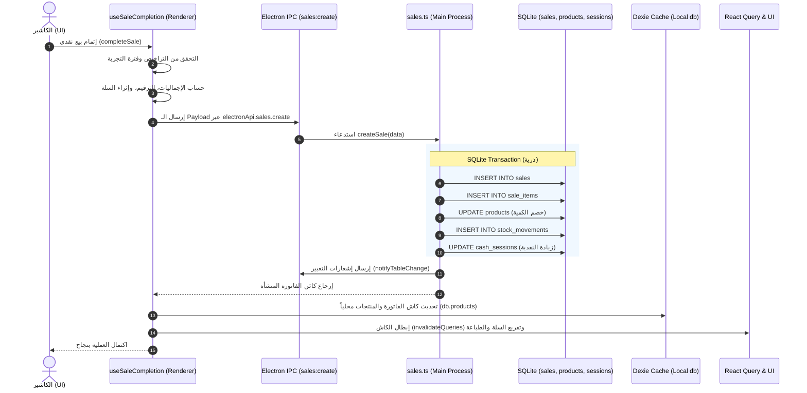
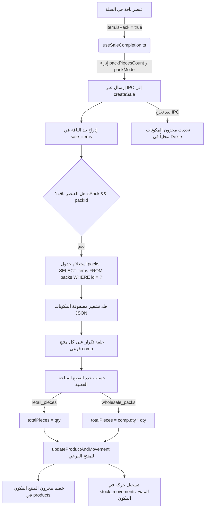

# توثيق المسار المرجعي لإتمام المبيعات (Baseline Sale Flow)

> **الغرض من هذا المستند:**
> توثيق هندسي دقيق وشامل لجميع الخطوات المتتالية التي ينفذها نظام الكاشير عند إتمام عملية بيع، بناءً على الكود الفعلي في:
> 1. [`src/features/pos/hooks/useSaleCompletion.ts`](file:///home/ammar/AN-POS-TEST/src/features/pos/hooks/useSaleCompletion.ts)
> 2. [`electron/main/handlers/sales.ts`](file:///home/ammar/AN-POS-TEST/electron/main/handlers/sales.ts)
> 
> *ملاحظة: هذا المستند هو مرجع توثيقي بحت؛ لم يتم تعديل أو حذف أي كود في المشروع.*

---

## الفهرس
1. [المسار الزمني لإتمام بيع عادي (نقدي - Cash) عبر Electron IPC](#1-المسار-الزمني-لإتمام-بيع-عادي-نقدي---cash-عبر-electron-ipc)
2. [مسار إتمام بيع بمنتج ضمن باقة (Pack)](#2-مسار-إتمام-بيع-بمنتج-ضمن-باقة-pack)
3. [مواضع تحديث كمية المنتج (quantity) في هذا المسار](#3-مواضع-تحديث-كمية-المنتج-quantity-في-هذا-المسار)

---

## 1. المسار الزمني لإتمام بيع عادي (نقدي - Cash) عبر Electron IPC

عند قيام الكاشير بالضغط على زر إتمام البيع النقدي، تمر العملية بالخطوات المتسلسلة التالية من الواجهة (Renderer) وحتى قاعدة البيانات المركزية (Main Process):



### تفاصيل الخطوات بالترتيب الدقيق:

#### الخطوة 1: استدعاء الطفرة وفحص الترخيص (Renderer)
- **الملف:** `src/features/pos/hooks/useSaleCompletion.ts` (السطور 51 - 71)
- يتم استدعاء الدالة `completeSale(params)`.
- فحص حالة الترخيص وفترة التجربة (السطر 69): إذا لم يكن المستخدم مطوراً والرخصة غير مفعلة وانتهت فترة التجربة (7 أيام)، يتم رمي استثناء فوري `انتهت فترة التجربة المجانية` وإيقاف العملية.

#### الخطوة 2: الحسابات المالية وتوليد رقم الفاتورة (Renderer)
- **الملف:** `src/features/pos/hooks/useSaleCompletion.ts` (السطور 73 - 93)
- استدعاء `calculateSaleTotal(...)` لحساب الإجمالي والمجموع الفرعي والخصومات والضريبة.
- توليد الرقم التسلسلي التالي للفاتورة عبر `SaleRepository.getNextNumber(...)`.
- في البيع النقدي: يتم ضبط المبلغ المدفوع `effectivePaidAmount = saleSummary.total`.
- مطابقة بيانات العميل المختار وتحديد نوع المستند (`facture` للبيع العادي أو `wholesale` للجملة).

#### الخطوة 3: إثراء عناصر السلة بالبيانات التكميلية (Renderer)
- **الملف:** `src/features/pos/hooks/useSaleCompletion.ts` (السطور 95 - 115)
- إنشاء مصفوفة `enrichedCart` من خلال مطابقة عناصر السلة مع المنتجات والباقات لضمان وجود `piecesCount` و `unitName` و `pricingType`.

#### الخطوة 4: تشكيل كائنات الفاتورة والبنود المنفردة (Renderer)
- **الملف:** `src/features/pos/hooks/useSaleCompletion.ts` (السطور 117 - 152)
- استدعاء `createSale(...)` لتوليد الكائن الأساسي `baseSale` ثم دمج الحقول الإضافية لتكوين كائن `sale`.
- تجهيز مصفوفة `saleItemEntities` الخاصة بجدول البنود `sale_items`.

#### الخطوة 5: إرسال الطلب عبر قناة Electron IPC (Renderer -> Main)
- **الملف:** `src/features/pos/hooks/useSaleCompletion.ts` (السطور 156 - 184)
- فحص توفر `window.electronAPI.sales.create`.
- تجهيز كائن البيانات `payload` متضمناً: المعرّف، الرقم، التاريخ، العناصر، المجموع، الضريبة، طريقة الدفع (`cash`)، المبلغ المدفوع بالكامل، معرف جلسة الصندوق `cashSessionId`، واسم البائع، وخيار المخزون السالب `allowNegativeStock`.
- استدعاء: `const res = await electronApi.sales.create(payload);`.

#### الخطوة 6: استقبال الطلب في المعالج الرئيسي (IPC Router)
- **الملف:** `electron/main/ipc/sales.ts` (السطور 26 - 34)
- يستقبل `ipcMain.handle('sales:create', ...)` الطلب.
- يفحص التراخيص والتلاعب بساعة النظام على مستوى النظام ويزيد عداد مبيعات التجربة إن وُجدت.
- يمرر البيانات إلى دالة المعالجة `createSale(data)` في `sales.ts`.

#### الخطوة 7: بدء المعاملة الذرية (SQLite Transaction) في الباك إند
- **الملف:** `electron/main/handlers/sales.ts` (السطور 73 - 301)
- استخراج المعاملات وإعداد القيم الافتراضية والتحقق التلقائي من جلسة الصندوق المفتوحة `openSess` وإعداد `allowNegativeStock`.
- فتح معاملة ذرية `transaction(() => { ... })`:
  1. **إدراج الفاتورة في جدول المبيعات (السطور 130 - 159):**
     تنفيذ استعلام `INSERT INTO sales (...) VALUES (...)` مع تخزين العناصر كـ JSON مشفر في حقل `items`.
  2. **إدراج البنود في جدول `sale_items` (السطور 211 - 223):**
     تكرار على كل عنصر في الفاتورة وإدراجه بسجل منفصل يحتوي على `sale_id` و `product_id` و `qty` و `unit_price` و `line_total`.
  3. **تحديث كمية المخزون وسجل الحركات (السطور 162 - 195، 252 - 255):**
     - يتم حساب التغيير `qtyChange = -qty` (إشارة سالبة لأن البيع ينقص المخزون).
     - استدعاء الدالة المساعدة `updateProductAndMovement(productId, qtyChange)`.
     - تحديث كمية المنتج في جدول `products` فوراً مع احترام سياسة المخزون السالب:
       `UPDATE products SET quantity = MAX(0, quantity + ?), updated_at = ? WHERE id = ?`.
     - إدراج سجل حركة في جدول `stock_movements` بنوع `'sale'` مرتبط برقم الفاتورة كمرجع.
  4. **فحص رصيد العميل (السطور 260 - 279):**
     - لأن طريقة الدفع نقدية (`cash`)، لا يترتب على العميل أي دين متبقٍ (`unpaidPart = 0`) وبالتالي لا يُعدل رصيد العميل.
  5. **تحديث جلسة الصندوق النقدية المفتوحة (السطور 281 - 300):**
     - لأن البيع نقدي ومسدد بالكامل، يتم زيادة إجمالي المبيعات والرصيد الفعلي للصندوق:
       `UPDATE cash_sessions SET total_sales = total_sales + ?, actual_balance = actual_balance + ?, updated_at = ? WHERE id = ?`.

#### الخطوة 8: إرسال إشعارات التغيير ورد الاستجابة (Main Process)
- **الملف:** `electron/main/handlers/sales.ts` (السطور 303 - 313)
- إطلاق إشعارات التغيير للواجهات:
  - `notifyTableChange('sales', 'create', id)`
  - `notifyTableChange('products', 'bulk-update')`
  - `notifyTableChange('cash_sessions', 'update', cashSessionId)`
- استعلام الفاتورة المسجلة حديثاً وإرجاعها للواجهة `{ data: created }`.

#### الخطوة 9: التحديث المتزامن المحلي في Dexie (Renderer)
- **الملف:** `src/features/pos/hooks/useSaleCompletion.ts` (السطور 187 - 219)
- فور استلام الاستجابة الناجحة:
  - حفظ الفاتورة محلياً في IndexedDB: `await db.sales.put(sale)`.
  - تحديث كمية المنتج في جدول `products` المحلي داخل Dexie فوراً (السطر 216) لمنع وميض الواجهة أثناء انتظار المزامنة.

#### الخطوة 10: إجراءات ما بعد إتمام البيع (Mutation onSuccess)
- **الملف:** `src/features/pos/hooks/useSaleCompletion.ts` (السطور 355 - 390)
- إبطال كاش React Query لكافة الجداول المتأثرة (`products`, `sales`, `customers`, `cashSessions`, `stockMovements`).
- إطلاق أمر الطباعة التلقائية عبر `printDocument(...)` إذا كان خيار `autoPrint` مفعلاً.
- تفريغ السلة `clearCart()`.
- استدعاء رد النداء `onSaleSuccess(sale)` لتحديث الواجهة أو إغلاق النوافذ.

---

## 2. مسار إتمام بيع بمنتج ضمن باقة (Pack)

تختلف الباقة (Pack) أو الطرد بالجملة عن المنتج العادي، حيث يتم تسجيل بند البيع باسم الباقة، لكن **المخزون يتم خصمه وتتبعه من المنتجات الفرعية المكونة للباقة (Components)**.



### التفصيل التقني لخطوات بيع الباقة:

1. **التعرف على الباقة وإثرائها في الواجهة (Renderer):**
   - **الملف:** `src/features/pos/hooks/useSaleCompletion.ts` (السطور 95 - 115)
   - يتم التعرف على الباقة عبر `item.isPack` أو وجود معرّف باقة `item.packId` أو مطابقة مع مصفوفة `packs`.
   - يتم استخراج وحساب:
     - `packPiecesCount`: عدد القطع الكلي داخل الباقة (من تعريف الباقة أو من `packageSize` للمنتج).
     - `packUnit`: اسم وحدة الباقة (مثل "طرد"، "كرتونة").
     - `packQty`: كمية الطرود/الباقات.
     - `packMode`: نمط البيع، إما بيع مفرّق بالقطع من الباقة (`'retail_pieces'`) أو بيع طرود كاملة (`'wholesale_packs'`).

2. **نقل بيانات الباقة في حمولة الـ IPC:**
   - **الملف:** `src/features/pos/hooks/useSaleCompletion.ts` (السطور 158 - 181)
   - يتم إرسال العنصر متضمناً `isPack: true`، `packId`، و `packMode` إلى الباك إند.

3. **تسجيل بند البيع في جدول البنود `sale_items`:**
   - **الملف:** `electron/main/handlers/sales.ts` (السطور 211 - 223)
   - يُدرج سطر البيع في جدول `sale_items` بمعلومات الباقة (السعر الإجمالي، الكمية، واسم الباقة) ليكون التقرير المالي مطابقاً لما رآه واشتراه العميل.

4. **فك مكونات الباقة وخصم مخزون كل منتج فرعي (Unbundling):**
   - **الملف:** `electron/main/handlers/sales.ts` (السطور 227 - 251)
   - يفحص المعالج الشرط:
     ```typescript
     if (isPack && packId) { ... }
     ```
   - يجلب تعريف الباقة من قاعدة بيانات SQLite:
     ```sql
     SELECT items FROM packs WHERE id = ?
     ```
   - يفك تشفير حقل `items` المخزن كـ JSON، والذي يحتوي مصفوفة بالمكونات الفرعية: `[{ productId, qty }]`.
   - يقوم المعالج بالدوران على كل مكوّن فرعي (`comp`) ويحسب كمية القطع المستهلكة بدقة:
     - إذا كان النمط بالقطع المفرقة (`packMode === 'retail_pieces'`):
       $$\text{totalPiecesSold} = \text{qty}$$
     - إذا كان النمط بالطرود الكاملة (`packMode !== 'retail_pieces'`):
       $$\text{totalPiecesSold} = \text{comp.qty} \times \text{qty}$$
   - تُحسب قيمة التغيير المخزني: `compQtyChange = sign * totalPiecesSold` (تكون سالبة في البيع).
   - يتم استدعاء `updateProductAndMovement(comp.productId, compQtyChange)` لكل منتج فرعي:
     - يخصم المخزون من جدول `products` للمنتج المكوّن.
     - يدرج حركة في `stock_movements` للمنتج المكوّن برقم الفاتورة.

5. **تحديث رصيد المكونات محلياً في مخزن Dexie بالواجهة:**
   - **الملف:** `src/features/pos/hooks/useSaleCompletion.ts` (السطور 189 - 208)
   - بعد عودة استجابة IPC بالنجاح، يمر الكود على السلة محلياً، وإذا كان العنصر باقة، يقرأ مكوناتها من `packs`، ويحسب `totalPiecesSold` بنفس المعادلة، ثم ينفذ:
     ```typescript
     db.products.update(product.id, { quantity: newQuantity });
     ```
     لكل منتج مكوّن فرعي لتحديث الواجهة فوراً.

6. **المسار الاحتياطي للباقات في بيئة الويب الخالصة (Browser Fallback):**
   - **الملف:** `src/features/pos/hooks/useSaleCompletion.ts` (السطور 241 - 278)
   - في حال عدم تشغيل النظام على بيئة Electron، يتم تنفيذ نفس منطق فك الباقة وخصم كميات المنتجات الفرعية داخل معاملة Dexie (`db.transaction`).

---

## 3. مواضع تحديث كمية المنتج (quantity) في هذا المسار

يوضح الجدول التالي كافة المواضع التي يتم فيها تغيير حقل `quantity` لمنتج في قاعدة البيانات أثناء مسار إتمام البيع، مع ذكر الملف، السطر التقريبي، والسياق البرمجي:

| # | الملف | السطور التقريبية | البيئة والطبقة | نوع المنتج المستهدف | الكود / الاستعلام المنفذ |
|---|-------|------------------|----------------|---------------------|--------------------------|
| **1** | `electron/main/handlers/sales.ts` | **السطور 166 - 177**<br>(الاستدعاء عند السطر **254**) | Electron Backend<br>(SQLite Transaction) | منتج عادي منفرد | ```sql UPDATE products SET quantity = MAX(0, quantity + ?), updated_at = ? WHERE id = ? ``` *(أو `quantity + ?` إذا فُعّل المخزون السالب)* |
| **2** | `electron/main/handlers/sales.ts` | **السطور 166 - 177**<br>(الاستدعاء عند السطر **250**) | Electron Backend<br>(SQLite Transaction) | كل منتج فرعي داخل باقة (Pack Component) | استدعاء `updateProductAndMovement(comp.productId, compQtyChange)` لكل مكوّن في الباقة، من خلال نفس استعلام الـ SQL الموضح أعلاه. |
| **3** | `src/features/pos/hooks/useSaleCompletion.ts` | **السطور 202 - 206**<br>(التحديث عند السطر **205**) | Renderer Process<br>(Dexie Local Cache) | كل منتج فرعي داخل باقة (Pack Component) | ```typescript db.products.update(product.id, { quantity: newQuantity }).catch(() => {}); ``` |
| **4** | `src/features/pos/hooks/useSaleCompletion.ts` | **السطور 213 - 217**<br>(التحديث عند السطر **216**) | Renderer Process<br>(Dexie Local Cache) | منتج عادي منفرد | ```typescript db.products.update(product.id, { quantity: newQuantity }).catch(() => {}); ``` |
| **5** | `src/features/pos/hooks/useSaleCompletion.ts` | **السطور 259 - 264**<br>(التحديث عند السطر **262**) | Renderer Process<br>(Fallback Dexie Tx) | كل منتج فرعي داخل باقة (Pack Component) | ```typescript await db.products.update(product.id, { quantity: newQuantity }); ``` *(المسار الاحتياطي عند عدم وجود Electron)* |
| **6** | `src/features/pos/hooks/useSaleCompletion.ts` | **السطور 283 - 288**<br>(التحديث عند السطر **286**) | Renderer Process<br>(Fallback Dexie Tx) | منتج عادي منفرد | ```typescript await db.products.update(product.id, { quantity: newQuantity }); ``` *(المسار الاحتياطي عند عدم وجود Electron)* |

---

## خلاصة وضمانات التكامل
- **الذرية (Atomicity):** كافة التحديثات في بيئة سطح المكتب تقع داخل كتلة `transaction` في SQLite داخل `electron/main/handlers/sales.ts`. فإذا فشل تحديث أي عنصر أو مخزونه يتم التراجع عن كامل الفاتورة تلقائياً.
- **تتبع المخزون للباقات:** الباقة ذاتها لا تمتلك مخزوناً مباشراً في جدول `products`، بل يُخصم استهلاكها تلقائياً من مخزون العناصر الأصلية المكونة لها، سواء بيعت كطرد جملة أو كقطع مفرقة.
- **تزامن الواجهة:** يتم تحديث Dexie في الواجهة فور استلام الرد لمنع أي بطء أو تأخر في ظهور الرصيد المتبقي للمنتج على الشاشة.
