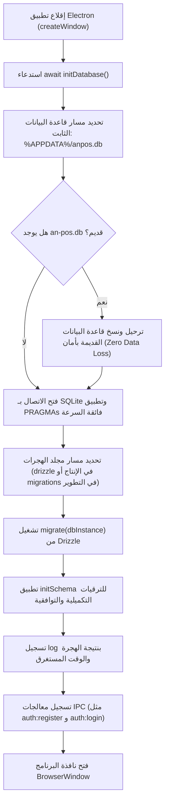

# دليل تهيئة قاعدة البيانات والهجرات التلقائية (Auto-Migration)
## AN POS — Desktop Architecture Guide

---

## 1. المشكلة التي تم حلها (Root Cause Analysis)

### العَرَض:
ظهور خطأ أثناء أول تشغيل للتطبيق أو عند إنشاء أول مستخدم في شاشة التسجيل:
```
Error invoking remote method 'auth:register': Error: no such table: users
```

### الأسباب الجذرية المكتشفة:
1. **أخطاء صياغة SQLite في ملفات الهجرة (`near "(": syntax error`):**
   كانت ملفات الهجرة الناتجة عن Drizzle تحتوي على عبارات:
   `DEFAULT datetime('now')`
   في قواعد بيانات SQLite، أي تعبير دالة ضمن القيمة الافتراضية للعمود (Column Default Expression) يجب حتماً أن يُحاط بأقواس دائرية، مثل:
   `DEFAULT (datetime('now'))`
   بسبب غياب هذه الأقواس، فشل إنشاء الجداول الصريحة مثل `users` و `settings` و `sales` بصمت داخل SQLite.

2. **تسجيل الهجرة كمنفذة رغم فشل إنشاء الجداول:**
   في آلية التهيئة القديمة، كان اعتراض الخطأ يتجاوز الفشل ويسجل الهاش في جدول `__drizzle_migrations`، مما أوهم النظام بأن الجداول قائمة بينما هي غير موجودة في الحقيقة.

3. **وجود ملف قاعدة بيانات يتيم في جذر المستودع:**
   كان ملف `anpos.db` يتم تتبعه في Git، مما أخفى الخلل أثناء التطوير على بيئات المطورين، لكن عند التثبيت على جهاز عميل نظيف كان يفشل فوراً.

---

## 2. المعمارية المحدثة للتهيئة التلقائية (Auto-Migration Architecture)

تم بناء آلية تهيئة موحدة وقوية تعتمد على أداة `migrate()` الرسمية المدمجة في Drizzle (`drizzle-orm/better-sqlite3/migrator`) دون أي مكتبات خارجية إضافية:



---

## 3. مسار قاعدة البيانات وهرمية التشغيل

- **المسار الافتراضي الثابت:** `%APPDATA%\anpos.db` (المستخرج عبر `app.getPath('userData')/anpos.db`).
- **حماية الترقية من الإصدارات السابقة:**
  إذا كان العميل يمتلك ملف بيانات من إصدار سابق باسم `an-pos.db`، يقوم النظام تلقائياً بترحيله ونسخه إلى `anpos.db` فورياً قبل الإقلاع، مما يضمن **عدم فقدان أي فاتورة أو صنف أو إعدادات سابقة نهائياً**.
- **بيئات الاختبار:** يمكن تمرير متغير البيئة `AN_POS_DB_PATH` لاختيار مسار مخصص أثناء الاختبارات الآلية أو التشغيل المعزول.

---

## 4. إعدادات التحزيم وبناء ملف التثبيت (`electron-builder`)

لضمان وصول ملفات الهجرة (`.sql` وملف `_journal.json`) إلى بيئة الإنتاج بعد التثبيت على حواسيب العملاء، تم تضمين المجلد في إعدادات `package.json`:

```json
"extraResources": [
  {
    "from": "public/an-pos-icon.png",
    "to": "an-pos-icon.png"
  },
  {
    "from": "electron/drizzle/migrations",
    "to": "drizzle"
  }
]
```

عند تشغيل التطبيق المثبت، يتعرف النظام تلقائياً على المسار عبر:
```typescript
path.join(process.resourcesPath, 'drizzle')
```

---

## 5. دليل المطور: كيفية إضافة جدول أو عمود جديد مستقبلاً

عند الرغبة في إضافة جداول أو حقول جديدة في التحديثات القادمة:

### الخطوة 1: تعديل المخطط في `electron/drizzle/schema.ts`
تأكد دوماً من إحاطة أي دوال SQLite بأقواس دائرية عند استخدام قيم افتراضية:
```typescript
// ✅ صحيح ومطابق لقواعد SQLite:
createdAt: text('created_at').notNull().default(sql`(datetime('now'))`),

// ❌ خاطئ ويسبب near "(": syntax error:
createdAt: text('created_at').notNull().default(sql`datetime('now')`),
```

### الخطوة 2: توليد ملف الهجرة
قم بتشغيل الأمر:
```bash
npm run db:generate
```
سيقوم Drizzle Kit بإنشاء ملف SQL جديد في `electron/drizzle/migrations/` وتحديث `_journal.json`.

### الخطوة 3: التحزيم والإطلاق
لا يلزم أي كود إضافي؛ محرك الـ Auto-Migration سيقرأ ملف الـ SQL الجديد تلقائياً ويطبقه على أجهزة العملاء بمجرد تشغيل النسخة المحدثة.

---

## 6. الاسترداد الذاتي ضد انعدام الجداول (Self-Healing Fallback)

في حال حدوث أي خطأ تشغيلي غير متوقع وظهور `no such table:` أثناء تنفيذ أي استعلام، تم تزويد دوال `db-utils.ts` بآلية استرداد ذكية:
1. اعتراض الخطأ فوراً.
2. تشغيل هجرات المخطط وإعادة إنشاء الجداول الناقصة برمجياً.
3. إعادة تنفيذ استعلام العميل تلقائياً دون إظهار أي رسالة خطأ أو تعطيل الخدمة.

---

## 7. ملاحظات الإصدار (Release Note — v2.5.3-patch)

> **إصلاح جذري لتهيئة قاعدة البيانات الأولية:**
> - تم تفعيل نظام التهجرة التلقائية المدمج بالكامل (Zero-Config Auto-Migration).
> - حل مشكلة خطأ تسجيل أول مستخدم بعد التثبيت على الحواسيب الجديدة (`no such table: users`).
> - تثبيت مسار موحد لقاعدة البيانات مع حماية كاملة بنسبة 100% لسجلات وبيانات المتاجر المثبتة سابقاً.
