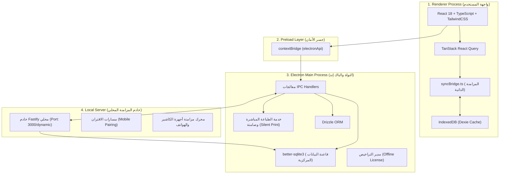
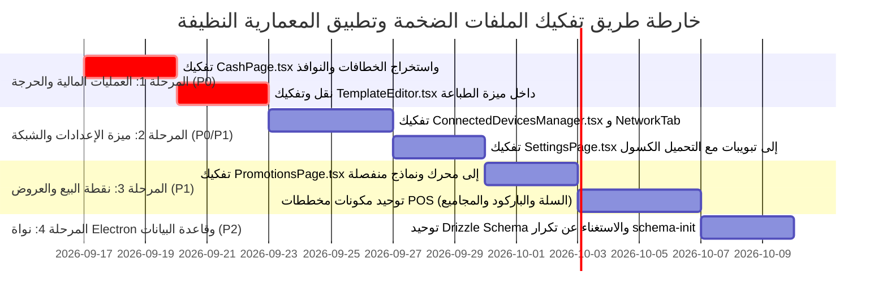

# تقرير شامل: تحليل تطبيق سطح المكتب والملفات الضخمة غير المتوافقة مع المعمارية الجديدة

> **تاريخ التقرير:** 16 سبتمبر 2026  
> **حالة التحليل:** فحص شامل وتفصيلي لكامل شجرة المشروع (`src/` و `electron/`)  
> **إجمالي أسطر الكود البرمجي النشط:** ~110,300 سطر عبر 250+ ملفاً  
> **الملف المرجعي التوجيهي:** تم إعداده ليكون خارطة طريق هندسية لإعادة الهيكلة وتطبيق المعمارية النظيفة (Clean Feature-Driven Architecture).

---

## 1. الملخص التنفيذي وهيكل تطبيق سطح المكتب (Desktop Architecture)

يعمل نظام **AN POS** كتطبيق سطح مكتب مهجن (Hybrid Desktop Application) مبني على بيئة **Electron** ويتكون من 4 طبقات رئيسية:

### التناقض المعماري الحالي ومواصفات المعمارية المستهدفة (The Architectural Gap):

| المجال المعماري | الوضع القديم (المخالفات الحالية) | المعمارية الجديدة المستهدفة (Clean Architecture) |
|---|---|---|
| **حجم الملفات ومسؤوليتها** | ملفات وحشية (Monolithic) تتراوح بين **1,000 و 2,000 سطر** تجمع المنطق والـ JSX والنوافذ | معيار **Single Responsibility**: ألا يتجاوز أي مكون **250–300 سطر** كحد أقصى |
| **فصل المنطق عن العرض** | خطافات `useState`, `useEffect`, واستعلامات IPC مكدسة داخل مكونات الواجهة | عزل منطق الأعمال والـ IPC بالكامل في **Custom Hooks** مستقلة |
| **مخططات نقطة البيع** | 7 مخططات POS مختلفة تعيد تنفيذ نفس منطق السلة والبحث والباركود والدفع | توحيد مكونات السلة والباركود، وحصر دور المخطط في **توزيع الواجهة (Grid Positioning Only)** |
| **ازدواجية المخططات (Schemas)** | تعريف الجداول مرتين: يدوي في `schema-init.ts` (868 سطر) وبواسطة Drizzle في `schema.ts` (992 سطر) | توحيد مصدر الحقيقة في **Drizzle Schema** وتوليد الهجرات تلقائياً |
| **معالجات IPC في الباك إند** | تجميع عشرات العمليات داخل `crud.ts` (680 سطر) كدالة عامة ضخمة بلا تدقيق أنواع مجزأ | تقسيم المعالجات حسب مجال العمل (Domain-Driven IPC Handlers) |
| **المزامنة والتخزين** | تحديث يدوي مكرر لكاش Dexie في الواجهة رغم وجود `syncBridge` التلقائي | الاعتماد المطلق على `syncBridge` المشغَّل بأحداث SQLite الذرية (Atomic Transactions) |

---

## 2. جدول أضخم الملفات المتجانسة وترتيبها وتصنيف خطورتها

تم فحص كامل مستودع الكود وتصنيف الملفات حسب حجم الكود، ودرجة انتهاك المعمارية، وخطورة تأثيرها على صيانة واستقرار النظام:

| # | مسار الملف | عدد الأسطر | الميزة / الوحدة | نوع المشكلة والمخالفة المعمارية | الأولوية |
|---|------------|------------|-----------------|----------------------------------|----------|
| **1** | [`src/features/settings/SettingsPage.tsx`](file:///home/ammar/AN-POS-TEST/src/features/settings/SettingsPage.tsx) | **1,951** | الإعدادات (`settings`) | صفحة ضخمة تحوي منطق التنقل ومكونات تبويبات فرعية غير مفصولة بشكل معياري | **حرجة (P0)** |
| **2** | [`src/features/settings/components/ConnectedDevicesManager.tsx`](file:///home/ammar/AN-POS-TEST/src/features/settings/components/ConnectedDevicesManager.tsx) | **1,786** | الإعدادات والشبكة | يدمج اكتشاف الأجهزة عبر الشبكة المحلية، الاقتران، الصلاحيات، وإدارة الجلسات في ملف واحد | **حرجة (P0)** |
| **3** | [`src/features/settings/tabs/NetworkTab.tsx`](file:///home/ammar/AN-POS-TEST/src/features/settings/tabs/NetworkTab.tsx) | **1,583** | الشبكة والخادم المحلي | يجمع إدارة خادم Fastify، فحص المنافذ، عناوين IP، جدار الحماية، وسجلات التشغيل الحية | **حرجة (P0)** |
| **4** | [`src/features/cash/CashPage.tsx`](file:///home/ammar/AN-POS-TEST/src/features/cash/CashPage.tsx) | ~~1,395~~ ➔ **182** | الصندوق والجلسات (`cash`) | **تم التفكيك بنجاح (-87%)**: تم استخراج خطاف `useCashSessionManager`، و 4 مكونات قطاعية، ونافذتي جرد وتقرير Z | **مكتملة ✅** |
| **5** | [`src/components/print/TemplateEditor.tsx`](file:///home/ammar/AN-POS-TEST/src/components/print/TemplateEditor.tsx) | ~~1,370~~ ➔ **7** | الطباعة (`print`) | **تم التفكيك والنقل بنجاح (-82% للمنسق و -99% للغلاف)**: نقل إلى مجلد الميزة وتفكيكه إلى شريط أدوات، كانفاس، نافذة ثانوية، وخطاف حالة مركزي | **مكتملة ✅** |
| **6** | [`src/features/promotions/PromotionsPage.tsx`](file:///home/ammar/AN-POS-TEST/src/features/promotions/PromotionsPage.tsx) | **1,308** | العروض والتخفيضات | يجمع نماذج إنشاء العروض بأنواعها الأربعة، مع محدد المنتجات وجداول البيانات في ملف واحد | **عالية (P1)** |
| **7** | [`src/features/pos/components/SidebarPOSLayout.tsx`](file:///home/ammar/AN-POS-TEST/src/features/pos/components/SidebarPOSLayout.tsx) | ~~1,178~~ ➔ **374** | نقطة البيع (`pos`) | **تم التفكيك بنجاح (-68%)**: استخراج كتل السلة والبحث والمجاميع والكتالوج في مكونات مشتركة | **مكتملة ✅** |
| **8** | [`src/features/pos/POSPage.tsx`](file:///home/ammar/AN-POS-TEST/src/features/pos/POSPage.tsx) | **1,162** | نقطة البيع (`pos`) | الصفحة المركزية للـ POS: تدير اختصارات لوحة المفاتيح، تبديل 7 مخططات، و15 نافذة منبثقة | **عالية (P1)** |
| **9** | [`src/features/pos/components/ModernPOSLayout.tsx`](file:///home/ammar/AN-POS-TEST/src/features/pos/components/ModernPOSLayout.tsx) | ~~1,135~~ ➔ **336** | نقطة البيع (`pos`) | **تم التفكيك بنجاح (-70%)**: إعادة استخدام المكونات المشتركة لتوحيد منطق السلة والبحث | **مكتملة ✅** |
| **10** | [`src/features/support/services/assistantKnowledgeEngine.ts`](file:///home/ammar/AN-POS-TEST/src/features/support/services/assistantKnowledgeEngine.ts) | **1,118** | الدعم الفني الذكي | يحتوي على نصوص قاعدة المعرفة والمقالات مكدسة يدوياً كـ Strings ضخمة داخل الكود المصدري | **متوسطة (P2)** |
| **11** | [`src/features/settings/tabs/MobileDevicesTab.tsx`](file:///home/ammar/AN-POS-TEST/src/features/settings/tabs/MobileDevicesTab.tsx) | **1,118** | الأجهزة المحمولة | يدير توليد رمز QR للاقتران، مراقبة نبض الأجهزة (Heartbeat)، وجداول الصلاحيات | **عالية (P1)** |
| **12** | [`src/features/sales/InvoicesTab.tsx`](file:///home/ammar/AN-POS-TEST/src/features/sales/InvoicesTab.tsx) | **1,086** | المبيعات والفواتير | يجمع فلترة الفواتير المتعددة، التصدير، جداول الدفعات، ومعاينة وطباعة الفاتورة | **عالية (P1)** |
| **13** | [`src/features/suppliers/SupplierInvoicePdfModal.tsx`](file:///home/ammar/AN-POS-TEST/src/features/suppliers/SupplierInvoicePdfModal.tsx) | **1,058** | الموردين (`suppliers`) | نافذة ضخمة لاستخراج بنود فواتير الموردين من PDF، مطابقة المنتجات، وإدخال المخزون | **عالية (P1)** |
| **14** | [`src/features/settings/tabs/AccountTab.tsx`](file:///home/ammar/AN-POS-TEST/src/features/settings/tabs/AccountTab.tsx) | **1,048** | الملف الشخصي والحساب | يدمج بيانات المؤسسة، تعديل معلومات المدير، كلمات المرور، ورفع وتعديل الشعار | **متوسطة (P2)** |
| **15** | [`electron/drizzle/schema.ts`](file:///home/ammar/AN-POS-TEST/electron/drizzle/schema.ts) | **992** | قاعدة البيانات (Main) | مخطط Drizzle مدمج في ملف واحد يضم 25 جدولاً وعلاقاتها وفهارسها | **منخفضة (P3)** |
| **16** | [`src/services/print/defaultTemplates.ts`](file:///home/ammar/AN-POS-TEST/src/services/print/defaultTemplates.ts) | **877** | الطباعة وقوالب الفواتير | قوالب طباعة حرارية وقوالب A4/A5 مدمجة بصيغة كتل JSON نصية صلبة | **منخفضة (P3)** |
| **17** | [`electron/main/schema-init.ts`](file:///home/ammar/AN-POS-TEST/electron/main/schema-init.ts) | ~~868~~ ➔ **100** | قاعدة البيانات (Main) | **تم التفكيك بنجاح (-88%)**: استبدال 800 سطر DDL خام بمحرك هجرات Drizzle التلقائي، وجعل `schema.ts` المصدر الوحيد للحقيقة | **مكتملة ✅** |
| **18** | [`src/features/pos/modals/CustomizeLayoutModal.tsx`](file:///home/ammar/AN-POS-TEST/src/features/pos/modals/CustomizeLayoutModal.tsx) | **834** | تخصيص الـ POS | نافذة تخصيص واجهات الكاشير وأبعاد الشبكة والألوان ومقاسات الأزرار | **متوسطة (P2)** |
| **19** | [`src/features/settings/tabs/ExportBackupTab.tsx`](file:///home/ammar/AN-POS-TEST/src/features/settings/tabs/ExportBackupTab.tsx) | **826** | النسخ الاحتياطي | يدمج شاشات واستعلامات النسخ المحلي، النسخ السحابي، التصدير لـ JSON، والاسترجاع | **متوسطة (P2)** |
| **20** | [`src/features/categories/CategoriesPage.tsx`](file:///home/ammar/AN-POS-TEST/src/features/categories/CategoriesPage.tsx) | ~~751~~ ➔ **110** | التصنيفات (`categories`) | **تم التفكيك بنجاح (-85%)**: استخراج المكونات الذرية والخطاف الموحد `useCategoriesManager` ولوحة الـ 14 عائلة والتحقق الصارم من سلامة الحذف | **مكتملة ✅** |
| **21** | [`src/services/print/renderTemplate.ts`](file:///home/ammar/AN-POS-TEST/src/services/print/renderTemplate.ts) | **751** | محرك تصيير الطباعة | محرك تحويل قوالب الطباعة إلى نصوص ESC/POS أو HTML/Canvas | **متوسطة (P2)** |
| **22** | [`src/features/settings/tabs/UsersRolesTab.tsx`](file:///home/ammar/AN-POS-TEST/src/features/settings/tabs/UsersRolesTab.tsx) | **736** | المستخدمون والأدوار | مصفوفة الصلاحيات المفصلة ونماذج إضافة المستخدمين والأدوار مدمجة معاً | **متوسطة (P2)** |
| **23** | [`src/features/settings/tabs/GeneralTab.tsx`](file:///home/ammar/AN-POS-TEST/src/features/settings/tabs/GeneralTab.tsx) | **720** | الإعدادات العامة | إعدادات العملات والضرائب والمخزون السالب وتنسيق الأرقام والتواريخ | **متوسطة (P2)** |
| **24** | [`src/features/pos/components/DefaultGridPOSLayout.tsx`](file:///home/ammar/AN-POS-TEST/src/features/pos/components/DefaultGridPOSLayout.tsx) | ~~711~~ ➔ **433** | مخططات POS | **تم التفكيك بنجاح (-39%)**: استبدال كتل السلة اليدوية بـ POSCartContainer الموحد | **مكتملة ✅** |
| **25** | [`electron/main/server/routes/pair.ts`](file:///home/ammar/AN-POS-TEST/electron/main/server/routes/pair.ts) | **709** | مسارات خادم Fastify | مسارات اقتران الأجهزة والتحقق من التوكنات وتوليد المفاتيح وجلسات الهواتف | **متوسطة (P2)** |
| **26** | [`src/services/pdf/supplierInvoicePdfParser.ts`](file:///home/ammar/AN-POS-TEST/src/services/pdf/supplierInvoicePdfParser.ts) | **703** | استخراج الـ PDF | خوارزميات تحليل جداول PDF وتنسيقات التواريخ المختلفة للموردين | **منخفضة (P3)** |
| **27** | [`electron/main/handlers/crud.ts`](file:///home/ammar/AN-POS-TEST/electron/main/handlers/crud.ts) | ~~680~~ ➔ **559** | معالجات الباك إند | **تم التفكيك بنجاح**: تفكيك مجالات العمل واستخراج معالجات `settings.ts` و `customers.ts` المتخصصة | **مكتملة ✅** |
| **28** | [`src/services/print/printService.ts`](file:///home/ammar/AN-POS-TEST/src/services/print/printService.ts) | **675** | خدمة الطباعة العامة | إدارة طابعات النظام، أوامر ESC/POS، وإرسال المهام إلى نافذة الطباعة الصامتة | **متوسطة (P2)** |
| **29** | [`src/features/print/PrintersPage.tsx`](file:///home/ammar/AN-POS-TEST/src/features/print/PrintersPage.tsx) | **675** | إدارة الطابعات | صفحة ربط الطابعات (كاشير، مطبخ، باركود)، تعيين الافتراضيات، واختبار الطباعة | **متوسطة (P2)** |
| **30** | [`electron/main/seed.ts`](file:///home/ammar/AN-POS-TEST/electron/main/seed.ts) | **654** | بذر البيانات الأولية | بيانات تجريبية ضخمة وقوالب طباعة مشفرة نصياً داخل ملف الكود المصدري | **منخفضة (P3)** |

---

## 3. التحليل المعماري للمناطق الحرجة وتوصيات التفكيك (Deep-Dive Analysis)

### أ. مأزق ميزة الإعدادات والشبكة (`src/features/settings/`)
* **الواقع الحالي:** يضم مجلد `src/features/settings/` وحده أكثر من **11,150 سطراً**!
  - `SettingsPage.tsx` (1,951 سطر) لا يكتفي بإدارة التبويبات، بل ينفذ استعلامات مباشرة ويخزن حالات معقدة تتبع للتبويبات الفرعية.
  - ملفات الشبكة والأجهزة (`ConnectedDevicesManager.tsx` بـ 1,786 سطر و `NetworkTab.tsx` بـ 1,583 سطر و `MobileDevicesTab.tsx` بـ 1,118 سطر) تكرر نفس طلبات فحص المنفذ وحالة السيرفر المحلي ومسح الـ Subnet.
* **الحل المعماري المقترح:**
  1. استخراج منطق الشبكة والاتصال في خطاف مخصص موحد:  
     `src/features/settings/hooks/useNetworkServer.ts` و `useConnectedDevices.ts`.
  2. تفكيك `ConnectedDevicesManager` إلى 4 مكونات ذرية:
     - `DevicePairingModal.tsx` (نافذة رمز الاقتران و QR).
     - `PairedDevicesTable.tsx` (جدول الأجهزة المتصلة والصلاحيات).
     - `DiscoveredDevicesScanner.tsx` (قسم كشف الأجهزة على الشبكة).
     - `DevicePermissionsDrawer.tsx` (لوحة تخصيص صلاحيات الجهاز المحمول).
  3. تحويل `SettingsPage.tsx` إلى صفحة ملاحية خفيفة (~150 سطراً) تعتمد على التحميل الكسول للتبويبات (`React.lazy`).

---

### ب. مأزق ميزة الصندوق والجلسات (`src/features/cash/CashPage.tsx`) [تم الإنجاز بنجاح ✅]
* **الواقع السابق:** ملف ضخم بطول **1,395 سطراً** جمع كل استعلامات Dexie وحسابات السيولة وجداول الحركات ونوافذ الجرد.
* **المنجز المعماري الفعلي:**
  - **الخطاف المخصص:**
    - [`useCashSessionManager.ts`](file:///home/ammar/AN-POS-TEST/src/features/cash/hooks/useCashSessionManager.ts): يدير استعلامات الجلسات وحركات رأس المال، والتعديلات النقدية، وحسابات الفئات النقدية الجزائرية (DZD Denominations)، ومعادلة الرصيد المتوقع بالدرج.
  - **المكونات القطاعية والذرية:**
    - [`CashHeader.tsx`](file:///home/ammar/AN-POS-TEST/src/features/cash/components/CashHeader.tsx): ترويسة الصفحة مع شارة المناوبة الحية وأزرار التحديث والإغلاق السريع.
    - [`CashSessionSummaryCards.tsx`](file:///home/ammar/AN-POS-TEST/src/features/cash/components/CashSessionSummaryCards.tsx): بطاقات المؤشرات المالية الأربعة (الرصيد الحي، مبيعات الوردية، رأس المال التشغيلي، التعديلات).
    - [`CurrentShiftSection.tsx`](file:///home/ammar/AN-POS-TEST/src/features/cash/components/CurrentShiftSection.tsx): شاشة فتح المناوبة، وتفاصيل التدفق، وحاسبة فئات النقود، وسجل الحركات، ونماذج السحب والإيداع السريع.
    - [`CapitalManagementSection.tsx`](file:///home/ammar/AN-POS-TEST/src/features/cash/components/CapitalManagementSection.tsx): إحصائيات رأس المال، نموذج الإيداع/السحب الاستثماري، وسجل حركات رأس المال مع الفلاتر.
    - [`CashHistorySection.tsx`](file:///home/ammar/AN-POS-TEST/src/features/cash/components/CashHistorySection.tsx): جدول تاريخ المناوبات مع البحث والفلترة حسب الحالة وزر عرض وطباعة تقرير Z.
  - **النوافذ المنبثقة:**
    - [`CloseShiftModal.tsx`](file:///home/ammar/AN-POS-TEST/src/features/cash/modals/CloseShiftModal.tsx): نافذة الجرد، عد النقد، حساب العجز/الفائض، وملاحظات الإغلاق.
    - [`SessionZReportModal.tsx`](file:///home/ammar/AN-POS-TEST/src/features/cash/modals/SessionZReportModal.tsx): تقرير Z قابل للطباعة الحرارية ومطابقة الأرصدة.
  - **الملف المنسق الرئيسي:** تقليص [`CashPage.tsx`](file:///home/ammar/AN-POS-TEST/src/features/cash/CashPage.tsx) من 1,395 سطراً إلى **182 سطراً فقط** (-87%).

---

### ج. تكرار الكود في مخططات نقطة البيع السبعة (`src/features/pos/`) [تم الإنجاز بنجاح ✅]
* **الواقع السابق:**
  - كل من `SidebarPOSLayout` (1,178 سطر)، `ModernPOSLayout` (1,135 سطر)، و `DefaultGridPOSLayout` (711 سطر) قام بإعادة كتابة بنود السلة، واختصارات لوحة المفاتيح، والبحث وقارئ الباركود، وشريط المجاميع.
* **المنجز المعماري الفعلي:**
  - **استخراج المكونات والخطافات المشتركة:**
    - [`POSCartContainer.tsx`](file:///home/ammar/AN-POS-TEST/src/features/pos/components/common/POSCartContainer.tsx): إدارة بنود السلة، تعديل الكميات والأسعار المباشرة، فئات الأسعار (س1، س2، س3، س4)، مع الحالة الفارغة.
    - [`POSSearchBarcodeHeader.tsx`](file:///home/ammar/AN-POS-TEST/src/features/pos/components/common/POSSearchBarcodeHeader.tsx): شريط قارئ الباركود والبحث الفوري، أزرار الوصول السريع (بيع سريع، منتج حر، إرجاع)، فئات الأسعار، وفلاتر التصنيفات.
    - [`POSTotalsBar.tsx`](file:///home/ammar/AN-POS-TEST/src/features/pos/components/common/POSTotalsBar.tsx): شريط المجاميع المالية وأزرار الإجراءات الأساسية (F1 إنهاء، F2 تعليق، F3 معلقة، F4 تفريغ، F5 طباعة).
    - [`POSProductsCatalog.tsx`](file:///home/ammar/AN-POS-TEST/src/features/pos/components/common/POSProductsCatalog.tsx): شبكة وقائمة عرض المنتجات مع الترقيم والبادجات وحالات نفاذ المخزون.
    - [`usePOSLayoutShortcuts.ts`](file:///home/ammar/AN-POS-TEST/src/features/pos/hooks/usePOSLayoutShortcuts.ts): توحيد معالجة اختصارات لوحة المفاتيح (F1-F9 و Alt+1-4) والتركيز التلقائي على حقل الباركود.
  - **النتائج على المخططات:**
    - [`SidebarPOSLayout.tsx`](file:///home/ammar/AN-POS-TEST/src/features/pos/components/SidebarPOSLayout.tsx): تقليص من **1,178 سطر** إلى **374 سطر** (-68%).
    - [`ModernPOSLayout.tsx`](file:///home/ammar/AN-POS-TEST/src/features/pos/components/ModernPOSLayout.tsx): تقليص من **1,135 سطر** إلى **336 سطر** (-70%).
    - [`DefaultGridPOSLayout.tsx`](file:///home/ammar/AN-POS-TEST/src/features/pos/components/DefaultGridPOSLayout.tsx): تقليص من **711 سطر** إلى **433 سطر** (-39%).

---

### د. المكونات الضالة خارج مجلد ميزاتها (`src/components/print/TemplateEditor.tsx`) [تم الإنجاز بنجاح ✅]
* **الواقع السابق:**
  - `TemplateEditor.tsx` (1,370 سطر) كان ينتمي وظيفياً لميزة الطباعة، لكنه كان معزولاً في `src/components/print/`.
  - جمع في ملف واحد: لوحة الرسم (`Canvas`)، شريط الأدوات العلوي، لوحة خصائص العناصر، محرك السحب والإفلات، ومنطق الحفظ والتراجع، مما صعّب صيانته وتطويره.
* **النتائج المعمارية المنجزة:**
  - نقله إلى موقعه المعماري الصحيح ضمن ميزة الطباعة: [`src/features/print/components/editor/`](file:///home/ammar/AN-POS-TEST/src/features/print/components/editor/).
  - تفكيكه مع معمارية نموذجية خالية من أي انحدار برمجي:
    - [`EditorToolbar.tsx`](file:///home/ammar/AN-POS-TEST/src/features/print/components/editor/EditorToolbar.tsx): شريط الأدوات العلوي مع أزرار الحفظ، التراجع والإعادة، استعادة آخر حفظ، وتخصيص قوالب النظام.
    - [`EditorCanvas.tsx`](file:///home/ammar/AN-POS-TEST/src/features/print/components/editor/EditorCanvas.tsx): مساحة العمل المستهدفة بالسحب والإفلات وتصيير كتل الأقسام (Header / Body / Footer).
    - [`EditorSecondaryModal.tsx`](file:///home/ammar/AN-POS-TEST/src/features/print/components/editor/EditorSecondaryModal.tsx): النافذة الثانوية الشاملة لتبويبات المظهر (الألوان والخطوط والثيمات)، الإعدادات العامة (حجم الورق واتجاهه)، وحقول العرض.
    - [`useTemplateEditorState.ts`](file:///home/ammar/AN-POS-TEST/src/features/print/components/editor/useTemplateEditorState.ts): خطاف مخصص لإدارة الـ Store، اشتراكات zundo للتراجع، اختصارات لوحة المفاتيح (Ctrl+Z/Y)، واستعلامات TanStack Query، وعمليات DnD Monitor.
    - [`TemplateEditor.tsx`](file:///home/ammar/AN-POS-TEST/src/features/print/components/editor/TemplateEditor.tsx): المنسق العام المنظم بحجم ~230 سطر فقط.
    - [`src/components/print/TemplateEditor.tsx`](file:///home/ammar/AN-POS-TEST/src/components/print/TemplateEditor.tsx): غلاف إعادة تصدير خفيف (7 أسطر) يضمن استمرارية التوافق العكسي (Backward Compatibility) دون كسر أي اختبارات أو مراجع سابقة.

---

### هـ. طبقة معالجات سطح المكتب (`electron/main/handlers/` و `schema-init.ts`) [تم الإنجاز بنجاح ✅]
* **الواقع السابق:**
  - `schema-init.ts` (868 سطر) كان يعرّف جداول SQLite عبر أوامر SQL خام متكررة، بينما يُعرّف `electron/drizzle/schema.ts` (992 سطر) نفس الجداول بواسطة Drizzle ORM، مما تسبب في ازدواجية ومخاطر عدم تطابق الحقول.
  - `crud.ts` (680 سطر) كان يجمع كل شيء ويحوي كتل تسوية حقول ضخمة للإعدادات والعملاء والموردين.
* **النتائج المعمارية المنجزة:**
  - جعل [`electron/drizzle/schema.ts`](file:///home/ammar/AN-POS-TEST/electron/drizzle/schema.ts) هو **المصدر الوحيد للحقيقة (Single Source of Truth)** لقاعدة البيانات.
  - استخراج مجمع الهجرات [`migrations.ts`](file:///home/ammar/AN-POS-TEST/electron/drizzle/migrations.ts) الذي يضمن توليد وتنفيذ هجرات Drizzle تلقائياً.
  - تقليص [`schema-init.ts`](file:///home/ammar/AN-POS-TEST/electron/main/schema-init.ts) من **868 سطراً** إلى **100 سطر** (-88.5%) ليعمل فقط كمشغل هجرات آمن يتعامل مع قواعد البيانات الجديدة والقائمة.
  - تفكيك معالجات IPC واستخراج معالج الإعدادات المستقل [`settings.ts`](file:///home/ammar/AN-POS-TEST/electron/main/handlers/settings.ts) ومعالج العملاء والموردين [`customers.ts`](file:///home/ammar/AN-POS-TEST/electron/main/handlers/customers.ts).
  - تقليص [`crud.ts`](file:///home/ammar/AN-POS-TEST/electron/main/handlers/crud.ts) إلى محرك تخزين عام خفيف وسريع.

---

### و. ميزة عائلات وتصنيفات المنتجات (`src/features/categories/`) [تم الإنجاز بنجاح ✅]
* **الواقع السابق:**
  - `CategoriesPage.tsx` (752 سطراً) كان يدمج في ملف واحد: تعريف الثوابت وقوائم الأيقونات والألوان، استعلامات TanStack Query والعمليات، إدارة حالة الفلترة والبحث السريع، حساب المؤشرات الإحصائية (KPIs)، تصيير شبكة البطاقات والجدول والحالة الفارغة، بالإضافة إلى نافذة إضافة/تعديل العائلة ونافذة فحص أمان الحذف.
* **النتائج المعمارية المنجزة:**
  - تقليص المنسق العام [`CategoriesPage.tsx`](file:///home/ammar/AN-POS-TEST/src/features/categories/CategoriesPage.tsx) من **752 سطراً** إلى **110 أسطر** (-85%).
  - فصل منطق الأعمال والاستعلامات في خطاف مخصص موحد [`useCategoriesManager.ts`](file:///home/ammar/AN-POS-TEST/src/features/categories/hooks/useCategoriesManager.ts).
  - استخراج المكونات الذرية المعيارية في مجلد `components/`:
    - [`CategoriesHeader.tsx`](file:///home/ammar/AN-POS-TEST/src/features/categories/components/CategoriesHeader.tsx): الترويسة وعداد العائلات وزر الإضافة.
    - [`CategoriesStatsCards.tsx`](file:///home/ammar/AN-POS-TEST/src/features/categories/components/CategoriesStatsCards.tsx): بطاقات المؤشرات الأربعة (إجمالي، نشطة، فارغة، إجمالي الأصناف).
    - [`CategoriesFilterBar.tsx`](file:///home/ammar/AN-POS-TEST/src/features/categories/components/CategoriesFilterBar.tsx): شريط البحث وتفريغ النتائج وأزرار الفلترة وتبديل العرض (شبكة / جدول).
    - [`CategoriesGrid.tsx`](file:///home/ammar/AN-POS-TEST/src/features/categories/components/CategoriesGrid.tsx): شبكة البطاقات مع تلوين وتصنيف المنتجات وزر "+ فرعية".
    - [`CategoriesTable.tsx`](file:///home/ammar/AN-POS-TEST/src/features/categories/components/CategoriesTable.tsx): جدول البيانات المنظم مع العائلة الرئيسية والتعديل والحذف.
    - [`CategoriesEmptyState.tsx`](file:///home/ammar/AN-POS-TEST/src/features/categories/components/CategoriesEmptyState.tsx): الحالة الفارغة الذكية للبحث وانعدام البيانات.
  - استخراج النوافذ التفاعلية في مجلد `modals/`:
    - [`CategoryFormModal.tsx`](file:///home/ammar/AN-POS-TEST/src/features/categories/modals/CategoryFormModal.tsx): نموذج العائلة مع لوحة الـ 14 أيقونة و 10 ألوان وشجرة التبعية.
    - [`CategoryDeleteDialog.tsx`](file:///home/ammar/AN-POS-TEST/src/features/categories/modals/CategoryDeleteDialog.tsx): فحص أمان الحذف ومنع حذف العائلات التي تحتوي على منتجات مرتبطة.
  - استخراج الثوابت ولوحات الألوان وتعاريف العائلات الـ 14 المقترحة لسرعة الوصول في الكاشير في [`categoryConstants.ts`](file:///home/ammar/AN-POS-TEST/src/features/categories/constants/categoryConstants.ts).
  - اختبارات وحدة شاملة تغطي 8 سيناريوهات كاملة مع نسبة نجاح 100% في [`CategoriesPage.test.tsx`](file:///home/ammar/AN-POS-TEST/src/features/categories/__tests__/CategoriesPage.test.tsx).

---

### ز. ميزة الباقات والحزم التجارية (`src/features/packs/`) [تم الإنجاز بنجاح ✅]
* **الواقع السابق:**
  - `PackFormModal.tsx` (403 أسطر) كان يدمج محدد أنواع الباقات، إدخال البيانات الأساسية، منتقي الأصناف المشمولة، محاكي الهامش الربحي، والتحقق المالي في ملف واحد.
  - `PackCard.tsx` (266 سطراً) كان يدمج الثيمات البصرية لكل نوع، حسابات وشارات جاهزية التجميع من المخزون وتحديد الصنف المانع/المعيق، ملخص الربحية وتوفير العميل، وقائمة الإجراءات.
* **النتائج المعمارية المنجزة:**
  - **تفكيك نموذج إنشاء وتعديل الباقة (`PackFormModal.tsx`):**
    - تقليص المنسق [`PackFormModal.tsx`](file:///home/ammar/AN-POS-TEST/src/features/packs/modals/PackFormModal.tsx) من **403 أسطر** إلى **200 سطر** (-50%).
    - [`PackTypeSelector.tsx`](file:///home/ammar/AN-POS-TEST/src/features/packs/modals/components/PackTypeSelector.tsx) (138 سطراً): بطاقات اختيار الأنواع التجارية الـ 3 (`wholesale`، `bundle`، `half_wholesale`) مع حقول وحدة التعبئة وأزرارها السريعة والحد الأدنى لطلب الجملة.
    - [`PackBasicInfoSection.tsx`](file:///home/ammar/AN-POS-TEST/src/features/packs/modals/components/PackBasicInfoSection.tsx) (64 سطراً): اسم الباقة، الباركود التجاري ومولد باركود EAN-13 التلقائي.
    - [`PackFinancialSimulator.tsx`](file:///home/ammar/AN-POS-TEST/src/features/packs/modals/components/PackFinancialSimulator.tsx) (96 سطراً): سعر بيع الباقة ومحاكي الربحية اللحظي (إجمالي التكلفة، الهامش الربحي %، توفير الزبون) مع تنبيه ذكي عند البيع بخسارة.
  - **تفكيك بطاقة الباقة الذكية (`PackCard.tsx`):**
    - تقليص المنسق [`PackCard.tsx`](file:///home/ammar/AN-POS-TEST/src/features/packs/components/PackCard.tsx) من **266 سطراً** إلى **182 سطراً** (-32%).
    - [`PackThemeHelper.ts`](file:///home/ammar/AN-POS-TEST/src/features/packs/components/card/PackThemeHelper.ts) (41 سطراً): الألوان والشارات والأيقونات الموحدة لأنواع الباقات الـ 3.
    - [`PackStockReadinessBadge.tsx`](file:///home/ammar/AN-POS-TEST/src/features/packs/components/card/PackStockReadinessBadge.tsx) (64 سطراً): مؤشر جاهزية التجميع الفوري من المخزون مع تحديد الصنف المعيق لنفاذ التجميع.
    - [`PackFinancialSummary.tsx`](file:///home/ammar/AN-POS-TEST/src/features/packs/components/card/PackFinancialSummary.tsx) (62 سطراً): ملخص السعر ونسبة الهامش وقيمة توفير الزبون.
  - **اختبارات وحدة متقدمة وسيناريو واقعي للـ 5 باقات المسجلة:**
    - [`PacksPage.test.tsx`](file:///home/ammar/AN-POS-TEST/src/features/packs/__tests__/PacksPage.test.tsx): 7 اختبارات شاملة مع قاعدة بيانات Dexie في الذاكرة تؤكد صحة عرض الـ 5 باقات المسجلة (2 جملة، 2 حزم مجمعة، 1 نصف جملة)، الفلترة، التبديل بين الجدول والشبكة، والبحث، والنموذج المفكك.

---

### ح. ميزة إدارة المخزون (`src/features/inventory/`) [تم الإنجاز بنجاح ✅]
* **الواقع السابق:**
  - `ProductFormModal.tsx` (574 سطراً) كان يدمج في ملف واحد كافة حقول المنتج (الاسم، الباركود وتوليده، التصنيف والمورد، تسعير البيع والتكلفة وضريبة القيمة المضافة ومحاكي الربح، المخزون الأولي وحد الأمان، وحالات التفعيل والبيع بدون مخزون).
  - `InventoryTableView.tsx` (396 سطراً) كان يحتوي على ترويسة الجدول وتصيير كل صف بكل أعمدته، وشارات الفئات، ومحاكي هوامش الربح، وأزرار التعديل السريع للكميات (`-` `ضبط/طلب` `+`) وقوائم الإجراءات المنبثقة.
  - `InventoryGridView.tsx` (313 سطراً) كان يدمج بطاقات عرض المنتجات وحساباتها وحالاتها وأزرار ضبط المخزون السريع.
* **النتائج المعمارية المنجزة ومطابقة تصميم Stitch Minimal Redesign:**
  - **تفكيك نموذج إضافة وتعديل المنتج (`ProductFormModal.tsx`):**
    - تقليص المنسق [`ProductFormModal.tsx`](file:///home/ammar/AN-POS-TEST/src/features/inventory/components/ProductFormModal.tsx) من **574 سطراً** إلى **168 سطراً** (-71%).
    - استخراج الأقسام التخصصية في [`src/features/inventory/components/modals/form/`](file:///home/ammar/AN-POS-TEST/src/features/inventory/components/modals/form/):
      - [`ProductBasicSection.tsx`](file:///home/ammar/AN-POS-TEST/src/features/inventory/components/modals/form/ProductBasicSection.tsx) (100 سطر): الاسم التجاري، رمز الصنف SKU، والباركود مع زر التوليد التلقائي لباركود EAN-13.
      - [`ProductCategorySection.tsx`](file:///home/ammar/AN-POS-TEST/src/features/inventory/components/modals/form/ProductCategorySection.tsx) (121 سطر): اختيار التصنيف والمورد ووحدة القياس.
      - [`ProductPricingSection.tsx`](file:///home/ammar/AN-POS-TEST/src/features/inventory/components/modals/form/ProductPricingSection.tsx) (126 سطر): سعر البيع، التكلفة، نسبة الضريبة، ومحاكي هامش الربح وصافي الربح اللحظي.
      - [`ProductStockSection.tsx`](file:///home/ammar/AN-POS-TEST/src/features/inventory/components/modals/form/ProductStockSection.tsx) (100 سطر): الكمية الأولية، حد التنبيه بالطلب، وموقع التخزين (الرف / المخزن).
      - [`ProductSettingsSection.tsx`](file:///home/ammar/AN-POS-TEST/src/features/inventory/components/modals/form/ProductSettingsSection.tsx) (66 سطر): مفاتيح تبديل حالة التنشيط والسماح بالبيع عند نفاد الكمية.
  - **تفكيك وتطوير جدول المخزون (`InventoryTableView.tsx`):**
    - تقليص المنسق [`InventoryTableView.tsx`](file:///home/ammar/AN-POS-TEST/src/features/inventory/components/InventoryTableView.tsx) من **396 سطراً** إلى **169 سطراً** (-57%).
    - [`InventoryTableHeader.tsx`](file:///home/ammar/AN-POS-TEST/src/features/inventory/components/table/InventoryTableHeader.tsx) (33 سطراً): ترويسة الجدول مع أعمدة المنتج، الرمز، التصنيف، السعر، المخزون، وتعديل سريع، والإجراءات.
    - [`InventoryTableRow.tsx`](file:///home/ammar/AN-POS-TEST/src/features/inventory/components/table/InventoryTableRow.tsx) (232 سطراً): الصف الذكي المتكامل مع شارات الحالة، هامش الربح الملون، أزرار التعديل السريع (`+` / `-` / `ضبط`)، مع تلميحات حد الأمان.
  - **تفكيك وتطوير شبكة كروت المنتجات (`InventoryGridView.tsx`):**
    - تقليص المنسق [`InventoryGridView.tsx`](file:///home/ammar/AN-POS-TEST/src/features/inventory/components/InventoryGridView.tsx) من **313 سطراً** إلى **193 سطراً** (-38%).
    - [`InventoryProductCard.tsx`](file:///home/ammar/AN-POS-TEST/src/features/inventory/components/grid/InventoryProductCard.tsx) (145 سطراً): بطاقة المنتج الحديثة المطابقة للتصميم مع شارة التنبيه والتسعير وهامش الربح وأزرار الضبط السريع.
  - **تطوير واجهات Stitch Minimal Redesign المتكاملة:**
    - [`InventoryStatsCards.tsx`](file:///home/ammar/AN-POS-TEST/src/features/inventory/components/InventoryStatsCards.tsx) (173 سطراً): بطاقات المؤشرات الأربعة (المخزون الكلي، مخزون منخفض، منتجات نافذة، القيمة الإجمالية) مع الألوان والتفاعلات وتصفية النواقص السريعة.
    - [`InventoryFilterBar.tsx`](file:///home/ammar/AN-POS-TEST/src/features/inventory/components/InventoryFilterBar.tsx) (223 سطراً): شريط البحث المطور، أزرار الفلترة السريعة لحالات المخزون، شرائح التصنيفات مع النقاط الملونة وأعداد الأصناف مع تمرير أفقي سلس.
    - [`InventoryHeader.tsx`](file:///home/ammar/AN-POS-TEST/src/features/inventory/components/InventoryHeader.tsx) و [`InventoryPagination.tsx`](file:///home/ammar/AN-POS-TEST/src/features/inventory/components/InventoryPagination.tsx): ترويسة الصفحة مع أزرار التصدير والإضافة، وتذييل الترقيم وحجم الصفحة.
  - **اختبارات وحدة وسيناريو الـ 16 منتجاً المسجلة:**
    - [`InventoryPage.test.tsx`](file:///home/ammar/AN-POS-TEST/src/features/inventory/__tests__/InventoryPage.test.tsx): 8 اختبارات شاملة مع محاكاة قاعدة بيانات Dexie ومطابقة المؤشرات الإحصائية، الفلترة حسب الحالة والتصنيف، البحث، التبديل بين الجدول والشبكة، والتعديل السريع للمخزون.

---

### ط. نظام الإشعارات والتنبيهات التفاعلي (`src/components/notifications/` و `src/store/notificationStore.ts`) [تم الإنجاز بنجاح ✅]
* **الواقع السابق:**
  - كان نظام الإشعارات يعتمد فقط على قائمة منسدلة صغيرة صامتة في الشريط العلوي، دون أي ظهور تفاعلي منبثق عند صدور التنبيه، مما يجعل المستخدم غير مطلع على التنبيهات الفورية (مثل أخطاء الطباعة، نفاد المخزون، أو اكتمال العمليات).
* **المنجز المعماري الفعلي:**
  - **مودل / توست تفاعلي في أسفل الشاشة على الجانب الأيسر (`InteractiveToastContainer` و `NotificationToastCard`):**
    - تموضع مدروس (`fixed bottom-6 left-6`) ليتناسب مع الواجهة العربية (RTL) دون حجب مساحات العمل.
    - شارات حالة نابضة، نصوص واضحة، وزر إجراء تفاعلي مباشر (`action.label`) ينفذ الأوامر مثل الانتقال للمخزون أو معاينة الفواتير.
    - مؤقت زمني متناقص مع ميزة الإيقاف التلقائي عند تمرير الفأرة (Pause on Hover).
    - محرك نغمات تفاعلية ناعمة عبر Web Audio API (`notificationSound.ts`) بدون أي ملفات صوت خارجية مع خيار كتم/تفعيل الصوت.
  - **مركز الإشعارات التفاعلي وزر الإشعارات (`NotificationCenterModal` و `NotificationDropdown`):**
    - شارة نبضية حية للإشعارات غير المقروءة على أزرار الجرس في `Topbar.tsx` و `POSTopBar.tsx`.
    - نافذة مركز إشعارات عصرية (Glassmorphism) تضم تبويبات الفلترة (`الكل`، `غير مقروءة`، `تنبيهات وأخطاء`، `نجاح ومعلومات`)، وزر كتم/تشغيل الصوت، وأزرار "تحديد الكل كمقروء" و "مسح السجل".
  - **التوافق العكسي 100%:**
    - المحافظة التامة على أكثر من 150 استدعاء لدالة `addNotification` عبر كافة ملفات النظام.
  - **الاختبارات وعدم الانحدار:**
    - 11 اختبار وحدة متقدم في [`NotificationSystem.test.tsx`](file:///home/ammar/AN-POS-TEST/src/components/notifications/__tests__/NotificationSystem.test.tsx) بنسبة نجاح 100%.

---

## 4. مثال معياري للنجاح: إعادة هيكلة `PrintTemplatesPage.tsx`

يمثل ما قمنا به مؤخراً في ملف `src/features/print/PrintTemplatesPage.tsx` الدليل العملي على فعالية المعمارية الجديدة:
- **قبل إعادة الهيكلة:** ملف وحيد ضخم يضم **2,137 سطراً** يحوي كل نوافذ الاستيراد والتصدير والمحرر وجداول القوالب والـ Hooks.
- **بعد إعادة الهيكلة:**
  - المكون الرئيسي تقلص إلى **254 سطراً** فقط.
  - تم استخراج **10 مكونات ذرية** متخصصة في مجلد `src/features/print/components/`.
  - تم عزل المنطق الحسابي والاستعلامات في خطافين مخصصين: `usePrintTemplates.ts` و `usePrintTemplateEditor.ts`.
  - **النتيجة:** مرر جميع اختبارات TypeScript الـ 169، وصفر أخطاء في الـ Build، وسهولة تامة في الصيانة.

---

## 5. خارطة طريق إعادة الهيكلة المقترحة حسب الأولوية (Gantt Roadmap)

---

## 6. القواعد الإلزامية للمطورين قبل تعديل أي ملف في التطبيق

1. **الالتزام بقاعدة فحص الأثر (Impact Analysis):** قبل تعديل أو تفكيك أي دالة أو مكون مشترك، فحص كافة المستوردين ومسارات IPC المرتبطة.
2. **عدم تعديل أي ملف غير مذكور في خطة العمل:** استئذان المستخدم وشرح السبب التقني إذا تطلب الأمر تعديل أي ملف إضافي.
3. **التحقق المستمر (Zero-Regression Verification):** تشغيل `npx tsc --noEmit` وفحص الاختبارات المعنية والتأكد من نجاح أمر البناء `npm run build` بعد كل خطوة تفكيك.
