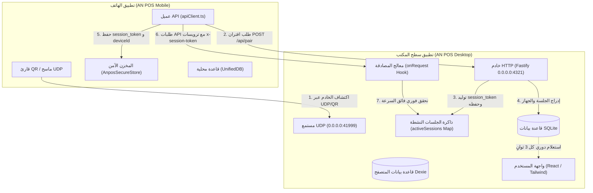

# الدليل الشامل والتحليلي: منظومة الشبكة، الاتصال، وإدارة جلسات وأجهزة الهاتف المقترن في AN POS

> **تاريخ التحليل:** سبتمبر 2026  
> **حالة النظام:** خادم الشبكة نشط (`Port: 4321` | `UDP: 41999`)  
> **النطاق:** تطبيق سطح المكتب (Electron + React + Fastify + SQLite/Dexie) وتطبيق الهاتف المقترن (React Native + Expo)

---

## فهرس المحتويات
1. [نظرة عامة على البنية الشبكية والحالة الراهنة](#1-نظرة-عامة-على-البنية-الشبكية-والحالة-الراهنة)
2. [أوضاع التشغيل الأربعة ومنطق التفعيل](#2-أوضاع-التشغيل-الأربعة-ومنطق-التفعيل)
3. [إدارة الجلسات في تطبيق الهاتف المقترن (Session Management)](#3-إدارة-الجلسات-في-تطبيق-الهاتف-المقترن-session-management)
4. [حفظ الأجهزة وبيانات الجلسات (Persistence & Schema Architecture)](#4-حفظ-الأجهزة-وبيانات-الجلسات-persistence--schema-architecture)
5. [عرض الأجهزة وتحديث حالتها في واجهة سطح المكتب (UI & State Representation)](#5-عرض-الأجهزة-وتحديث-حالتها-في-واجهة-سطح-المكتب-ui--state-representation)
6. [منظومة الأمان والتحقق الرقمي (Security Architecture)](#6-منظومة-الأمان-والتحقق-الرقمي-security-architecture)
7. [منظومة ملحقات العتاد: الطابعات وقوارئ الباركود](#7-منظومة-ملحقات-العتاد-الطابعات-وقوارئ-الباركود)
8. [تشخيص الفجوات البرمجية والتوصيات الهندسية المعتمدة](#8-تشخيص-الفجوات-البرمجية-والتوصيات-الهندسية-المعتمدة)

---

## 1. نظرة عامة على البنية الشبكية والحالة الراهنة

يعتمد نظام **AN POS** على معمارية **هجينة محلية (Local-First Hybrid Architecture)** تتيح العمل المتصل وغير المتصل بالإنترنت:
- **الخادم المدمج (Embedded Fastify Server):** يعمل داخل العملية الرئيسية لسطح المكتب (`electron/main/server/index.ts`) ويستمع على المنفذ `4321` بكافة الواجهات الشبكية (`0.0.0.0:4321`).
- **مستمع الاكتشاف التلقائي (UDP Broadcast Listener):** يعمل عبر موديول داتاجرام (`electron/main/discoveryUdp.ts`) على المنفذ `41999` للرد الفوري على نداءات هواتف الكاشير دون الحاجة لإدخال الـ IP يدوياً.
- **حالة الاتصال الظاهرة:**
  - **الخادم المحلي:** نشط (`Port 4321`).
  - **الأجهزة المتصلة:** تظهر حالياً `0 جهاز متصل` في شريط الترويسة لتبويب الشبكة، ويتم تحديثها فور إقران هواتف جديدة عبر رمز الاستجابة السريعة (QR).



---

## 2. أوضاع التشغيل الأربعة ومنطق التفعيل

يوفّر النظام في تبويب **وضع التشغيل (Operation Mode)** أربعة مسارات تشغيلية:

| وضع التشغيل | الرمز | الوصف السلوكي | حالة خادم الربط وإقران الهواتف |
| :--- | :---: | :--- | :--- |
| **جهاز واحد (Single Mode)** | `single` | جهاز حاسوب مستقل تماماً، لا يشارك البيانات مع أي جهاز خارجي. | **معطّل افتراضياً**: يتم إيقاف خادم Fastify ومنع مسح الـ QR لحماية البيانات إلا في **حساب المطور**. تظهر رسالة تحذيرية للمستخدم تطلب التبديل إلى وضع LAN. |
| **شبكة محلية (LAN Multi-Device)** | `lan` | حاسوب رئيسي (Master/Server) تتصل به هواتف ونقاط بيع فرعية عبر نفس شبكة Wi-Fi. | **نشط**: يتم تفعيل الخادم على منفذ `4321`، تفعيل مستمع UDP، وتوليد رمز QR لربط الهواتف فوراً. |
| **سحابي (Cloud Sync)** | `cloud` | مزامنة البيانات مع خادم خارجي عبر بروتوكولات REST/WebSocket. | متاح للربط السحابي ومزامنة الفروع. |
| **هجين (Hybrid)** | `hybrid` | أولوية العمل على الشبكة المحلية السريعة، مع مزامنة تفاضلية دورية مع السحابة عند توفر الإنترنت. | يجمع بين سرعة LAN وموثوقية النسخ الاحتياطي السحابي. |

---

## 3. إدارة الجلسات في تطبيق الهاتف المقترن (Session Management)

تخضع جلسات الهواتف لدورة حياة صارمة تبدأ من المصافحة وحتى انتهاء الصلاحية أو قطع الاتصال:

### أ. مرحلة المصافحة الأولية والاقتران (Pairing Handshake)
1. **عرض الـ QR على سطح المكتب:** يُولّد سطح المكتب كائناً يحتوي على:
   ```json
   {
     "ip": "192.168.1.105",
     "port": 4321,
     "key": "A1B2-C3D4-E5F6-7890",
     "shopName": "محل الأمل التجاري",
     "ips": ["192.168.1.105", "10.0.0.2"]
   }
   ```
2. **إرسال طلب الاقتران:** يمسح الهاتف الرمز أو يكتشف الخادم عبر UDP، ثم يرسل:
   - المسار: `POST /api/pair`
   - الحمولة: `{ "deviceName": "Samsung Galaxy S23", "connectionKey": "A1B2-C3D4-E5F6-7890", "deviceType": "mobile" }`
3. **التحقق من المفتاح في الخادم (`pair.ts`):**
   - استرجاع `connection_key` المخزّن في جدول `network_settings`.
   - المقارنة الزمنية الآمنة (`timingSafeEqual`) لمنع هجمات توقيت التخمين (Timing Attacks).
   - فحص حد التراخيص: يسمح بعدد الهواتف المصرح به في الترخيص (أو حتى 999 هاتف لحساب المطور النشط).
4. **توليد رمز الجلسة (Session Token Generation):**
   - يُولّد الخادم رمز جلسة عشوائي مشفر بحجم 32 بايت (`64 hex chars`) باستخدام `crypto.randomBytes(32).toString('hex')`.
   - يُولّد معرّف فريد للجهاز `deviceId` بنظام `UUID v4`.

### ب. تخزين الجلسة والتحقق فائق السرعة (In-Memory + Database Session Cache)
لضمان معالجة مئات طلبات البيع في الثانية دون إرهاق القرص الصلب باستعلامات SQL مستمرة:
- **في الذاكرة العشوائية (RAM):**
  ```typescript
  const activeSessions = new Map<string, { deviceId: string; userId: string | null; pairedAt: string }>();
  ```
- **في قاعدة البيانات الدائمة (SQLite):**
  يتم حفظ الجلسة في جدول `device_sessions`.
- **عند إعادة تشغيل سطح المكتب:**
  تقوم دالة `loadSessionsFromDB()` بإنهاء الجلسات التي تجاوزت 7 أيام من عدم النشاط، وتحميل كافة الجلسات الصالحة إلى الذاكرة العشوائية مسبقاً.

### ج. فحص الترويسات والصلاحيات (Fastify Auth Hook)
كل طلب API لاحق يرسله الهاتف (مزامنة منتجات، إنشاء فاتورة، جلب عملاء) يمر عبر خطاف التحقق العام `server.addHook('onRequest')`:
```typescript
const token = request.headers['x-session-token'];
const deviceId = request.headers['x-device-id'];
const valid = await verifySession(token, deviceId);
if (!valid) {
  return reply.code(401).send({
    error: { status: 401, detail: 'جلسة غير صالحة أو منتهية — يجب إعادة الاقتران' }
  });
}
```
- يتم تحديث ختم النشاط الزمني `last_seen` في جدول `connected_devices` وجدول `device_sessions`.

### د. دورة حياة الجلسة في تطبيق الهاتف (`mobile-rn`)
- **حفظ الجلسة الآمن:** يحفظ الهاتف التوكن في `AnposSecureStore` تحت المفاتيح:
  - `anpos_session_token`: الرمز المشفر للجلسة.
  - `anpos_device_id`: معرّف الجهاز المسجل.
  - `anpos_server_url`: عنوان الخادم الكامل (مثال: `http://192.168.1.105:4321`).
  - `anpos_paired_device`: كائن البيانات الكامل للجهاز المقترن.
- **إبطال الجلسة التلقائي (Session Invalidation):**
  إذا استقبل الهاتف خطأ `401 Unauthorized` أثناء أي عملية بيع أو مزامنة، يتم استدعاء `session.invalidate('unauthorized')`:
  1. مسح رموز الجلسة من التخزين الآمن.
  2. تحويل وضع التطبيق فوراً إلى `standalone`.
  3. تحديث حالة الجهاز المقترن إلى `unauthorized`.
  4. إخطار المستمعين وتوجيه المستخدم لشاشة تسجيل الدخول أو إعادة الاقتران.

---

## 4. حفظ الأجهزة وبيانات الجلسات (Persistence & Schema Architecture)

تتوزع بيانات الأجهزة والجلسات على مستويين رئيسيين:

### أ. مخطط قاعدة البيانات في سطح المكتب (`electron/drizzle/schema.ts`)

#### 1. جدول الأجهزة المتصلة (`connected_devices`)
يحفظ هوية وسجل كل جهاز ارتبط بالنظام:
```sql
CREATE TABLE connected_devices (
    id TEXT PRIMARY KEY,                       -- UUID الجهاز
    device_name TEXT NOT NULL,                 -- اسم الهاتف (مثل: Redmi Note 11)
    device_type TEXT NOT NULL,                 -- نوع الجهاز: mobile / pos_terminal / printer / scanner
    connection_type TEXT NOT NULL,             -- نوع الاتصال: network / usb / bluetooth
    ip_address TEXT DEFAULT '',                -- عنوان IP للجهاز
    mac_address TEXT DEFAULT '',               -- عنوان الماك إن وجد
    port INTEGER,                              -- المنفذ المخصص
    status TEXT NOT NULL DEFAULT 'offline',    -- الحالة: online / offline / error
    last_seen TEXT DEFAULT '',                 -- آخر ظهور بصيغة ISO 8601
    vendor TEXT DEFAULT '',                    -- الشركة المصنعة
    model TEXT DEFAULT '',                     -- الموديل
    created_at TEXT NOT NULL DEFAULT (datetime('now')),
    updated_at TEXT NOT NULL DEFAULT (datetime('now'))
);
CREATE INDEX idx_connected_devices_type ON connected_devices(device_type);
CREATE INDEX idx_connected_devices_status ON connected_devices(status);
```

#### 2. جدول جلسات الأجهزة (`device_sessions`)
يحفظ الرموز المصرح لها بالوصول وصلاحيتها الزمنية:
```sql
CREATE TABLE device_sessions (
    id TEXT PRIMARY KEY,                       -- UUID الجلسة
    session_token TEXT UNIQUE NOT NULL,        -- رمز التوثيق (64-character hex)
    device_id TEXT NOT NULL,                   -- معرّف الجهاز المرتبط
    device_name TEXT DEFAULT '',               -- اسم الجهاز
    user_id TEXT,                              -- الكاشير المستخدم للجلسة
    paired_at TEXT NOT NULL DEFAULT (datetime('now')),
    last_seen TEXT NOT NULL DEFAULT (datetime('now')),
    expires_at TEXT,                           -- وقت انتهاء الصلاحية
    created_at TEXT NOT NULL DEFAULT (datetime('now'))
);
CREATE INDEX idx_device_sessions_token ON device_sessions(session_token);
CREATE INDEX idx_device_sessions_device ON device_sessions(device_id);
```

### ب. تخزين الأجهزة في تطبيق الهاتف (`pairedDeviceStore.ts`)
يحتفظ تطبيق الهاتف بسجل للأجهزة المقترنة لتمكين إعادة الاتصال التلقائي:
```typescript
export interface PairedDevice {
  deviceId: string;
  serverUrl: string;
  ip: string;
  port: number;
  shopName: string;
  deviceName: string;
  version: string;
  mode: 'lan' | 'cloud';
  pairedAt: string;
  lastSeenAt: string | null;
  lastStatus: 'online' | 'offline' | 'unauthorized' | 'unknown';
}
```
- **الجهاز النشط (`anpos_paired_device`):** الجهاز الحالي المتصل بالخادم.
- **قائمة الأجهزة السابقة (`anpos_known_devices`):** ذاكرة تتسع لآخر 10 أجهزة/خوادم تم الاقتران بها لتسهيل التنقل بين نقاط البيع دون مسح QR كل مرة.

---

## 5. عرض الأجهزة وتحديث حالتها في واجهة سطح المكتب (UI & State Representation)

تتكامل واجهة سطح المكتب مع دورة حياة الأجهزة من خلال واجهتين رئيسيتين:

### أ. تبويب تطبيق الهاتف المقترن (`MobileDevicesTab.tsx`)
- **الاستعلام التفاعلي:** يستعلم عن الهواتف المقترنة عبر `useQuery` بالمفتاح `server:connected-devices` كل 3 ثوانٍ.
- **بطاقات الأجهزة الحية:**
  - عرض اسم الهاتف، وأيقونة الهاتف الذكي.
  - مؤشر النبض الأخضر الحركي (`animate-pulse`) للدلالة على الاتصال الحي.
  - التوقيت النسبي لآخر نشاط (`last_seen`).
  - زر الفصل الفوري (`LogOut`) الذي يستدعي `electronAPI.server.disconnectDevice(id)`.
- **لوحة التحكم بالخادم:**
  - زر تفعيل/إيقاف الخادم المحلي مع مؤشر التحميل.
  - زر **تجديد المفتاح السري (Regenerate Key)** لقطع اتصال جميع الهواتف السابقة وفرض إعادة الاقتران.
  - رمز الـ QR التفاعلي مع إمكانية نسخ الرمز السري يدوياً ومشاركته.

### ب. تبويب الشبكة والاتصال العام (`NetworkTab.tsx`)
- **شريط الترويسة:**
  - شارة عدد الأجهزة المتصلة: `{onlineDevicesCount} جهاز متصل`.
  - حالة الخادم: `خادم الشبكة: نشط (4321)` أو `الخادم المحلي: متوقف`.
  - تحذير قفل الإعدادات الحساسة (`BR-NET-005`): عند وجود اتصالات نشطة، يتم تعطيل تعديل المنافذ والبروتوكولات لحماية الجلسات الجارية من الانقطاع المفاجئ.
- **التبويبات الفرعية السبعة:**
  1. `mode`: وضع التشغيل (جهاز واحد، شبكة محلية، سحابي، هجين).
  2. `lan`: عنوان IP المحلي، منفذ الخادم، وفحص الاتصال المحلي.
  3. `cloud`: خادم المزامنة الخارجي وحالة المزامنة السحابية.
  4. `printer`: إعدادات طابعات الإيصالات والباركود.
  5. `barcode`: إعدادات قارئ الباركود اليدوي والمكتبي.
  6. `security`: القائمة البيضاء لعناوين IP وسياسات الجدار الناري.
  7. `devices`: السجل العام لكافة ملحقات العتاد المتصلة.

---

## 6. منظومة الأمان والتحقق الرقمي (Security Architecture)

1. **مفتاح الاتصال الديناميكي (Connection Key):**
   - كود مقسّم رباعي من 16 محرف سداسي عشري بصيغة: `XXXX-XXXX-XXXX-XXXX`.
   - يُخزن مشفراً في قاعدة البيانات ويُجدد عند الطلب.
2. **المقارنة بالوقت الثابت (Constant-Time Verification):**
   - حماية مسار الاقتران من هجمات التوقيت عبر `node:crypto` `timingSafeEqual`.
3. **القائمة البيضاء لعناوين IP (IP Whitelisting):**
   - دعم حصر الاتصالات على قائمة محددة من عناوين الـ IP الخاصة بأجهزة المتجر واستبعاد أي جهاز متطفل على الشبكة.
4. **عزل وضع الجهاز الواحد (Single Mode Enforcement):**
   - منع تشغيل الخادم في وضع الجهاز الواحد لمنع تسريب بيانات المبيعات أو فتح منافذ غير مراقبة على الشبكة.

---

## 7. منظومة ملحقات العتاد: الطابعات وقوارئ الباركود

### أ. طابعات الإيصالات والفواتير (ESC/POS Printers)
- **بروتوكول التشغيل:** أوامر `ESC/POS` القياسية لدعم طابعات 80mm و 58mm.
- **طرق التوصيل:**
  - **USB:** اتصال مباشر عبر النواة مع معالجة قائمة الانتظار المطبوعة (`printQueue`).
  - **Network / LAN Printer:** اتصال عبر مقبس TCP مباشر على المنفذ الافتراضي `9100`.
  - **Bluetooth:** اقتران تسلسلي عبر منافذ SPP.
- **الميزات التلقائية:** قطع الورق التلقائي، فتح درج الكاشير، وطباعة الشعار ورسائل التذييل.

### ب. قوارئ الباركود (Barcode Scanners)
- **آلية العمل (Keyboard Wedge Emulation):**
  - يعمل قارئ الباركود كلوحة مفاتيح فائقة السرعة.
  - يلتقط خطاف `useBarcodeScanner.ts` المدخلات التي تصل بفارق زمني يقل عن `30ms` بين كل حرف والآخر مع محرف نهاية `Enter`.
  - هذا الفارق الدقيق يفرّق تماماً بين كتابة المستخدم البشري ومسح القارئ الإلكتروني، مما يمنع تشويه حقول الإدخال وإرسال الباركود مباشرة لسلة البيع.

---

## 8. تشخيص الفجوات البرمجية والتوصيات الهندسية المعتمدة

من خلال التحليل المعماري الدقيق لملفات المشروع، تم رصد النقاط التالية التي تعزز استقرار المنظومة:

### 1. توحيد عداد الأجهزة في ترويسة الشبكة (`onlineDevicesCount`)
- **الملاحظة الحالية:** في `SettingsPage.tsx`، يتم احتساب `onlineDevicesCount` بناءً على جدول Dexie `db.connected_devices` المخصص لملحقات المتصفح، بينما هواتف الكاشير المقترنة تُسجل وتُحدّث في جدول SQLite `connected_devices` وتُقرأ في مصفوفة `mobilePhones`.
- **الأثر:** يظهر في الترويسة أحياناً `0 جهاز متصل` رغم وجود هواتف مقترنة نشطة في تبويب الهواتف.
- **الحل المعتمد:** دمج عداد الهواتف النشطة من `mobilePhones` مع عداد الأجهزة الملحقة لتعكس الترويسة بدقة إجمالي الأجهزة المتصلة بالنظام لحظياً.

### 2. الإبطال الكامل للجلسة عند فصل الجهاز من سطح المكتب
- **الملاحظة الحالية:** في `electron/main/ipc/network.ts`، يقوم معالج `server:disconnect-device` بتحديث حالة الجهاز في `connected_devices` إلى `offline`.
- **التوصية:** استدعاء `unpairDevice` أو تنفيذ:
  ```sql
  UPDATE device_sessions SET expires_at = datetime('now') WHERE device_id = ?;
  ```
  وحذف التوكن من الذاكرة `activeSessions.delete(token)` لضمان حرمان الهاتف المفصول من إجراء أي طلبات بيع فوراً قبل انتهاء مدة جلسته.

### 3. بث إشعار فوري عند تجديد مفتاح الأمان (Regenerate Key)
- عند توليد مفتاح جديد، يجب مسح ذاكرة الجلسات `activeSessions.clear()` وإبطال كل السجلات في `device_sessions` لإجبار كافة الهواتف المتصلة على العودة لشاشة الاقتران.

---

## خلاصة التحليل
تمتلك منظومة **AN POS** بنية متقدمة وقوية لإدارة الاتصال المحلي وجلسات الأجهزة، تجمع بين السرعة الفائقة عبر التخزين المؤقت في الذاكرة العشوائية (In-Memory Fastify Auth)، والموثوقية العالية بتخزين الجلسات في SQLite والتخزين المشفر في الهواتف، مع توفير استقلالية تامة للعمل بدون إنترنت (Offline-First).
