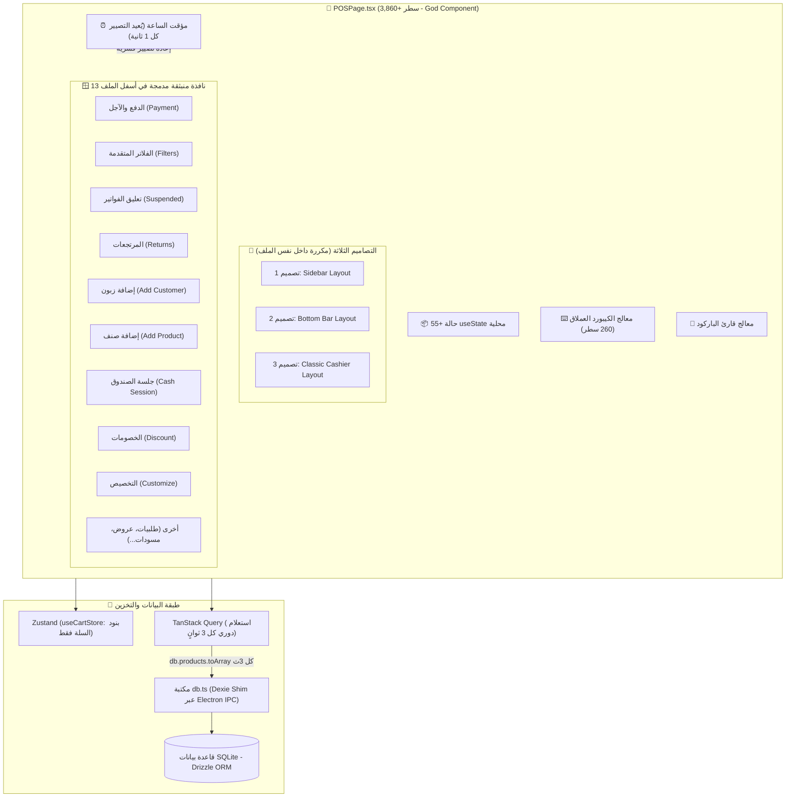

# 🏛️ التحليل المعماري الشامل لنقطة البيع المتقدمة (Advanced POS) وتوصيف المشاكل والحلول

> **تاريخ التقرير:** سبتمبر 2026  
> **النظام:** AN POS (Desktop — Electron 40 + React 19 + TypeScript + Tailwind CSS 4)  
> **الملف المحوري المحلل:** `src/features/pos/POSPage.tsx` والملفات المرتبطة به.

---

## 📑 فهرس المحتويات
1. [الملخص التنفيذي (Executive Summary)](#1-الملخص-التنفيذي-executive-summary)
2. [المخطط المعماري الحالي (Current Architecture Trace)](#2-المخطط-المعماري-الحالي-current-architecture-trace)
3. [التشخيص التفصيلي للمشاكل البرمجية والمعمارية (Problem Diagnosis)](#3-التشخيص-التفصيلي-للمشاكل-البرمجية-والمعمارية-problem-diagnosis)
   - [3.1 المكوّن الأحادي العملاق (The God Component Anti-Pattern)](#31-المكوّن-الأحادي-العملاق-the-god-component-anti-pattern)
   - [3.2 كارثة الأداء وإعادة التصيير المستمر (Rendering & Performance Traps)](#32-كارثة-الأداء-وإعادة-التصيير-المستمر-rendering--performance-traps)
   - [3.3 تشتت إدارة الحالة وضعف الاتساق (State Management Fragmentation)](#33-تشتت-إدارة-الحالة-وضعف-الاتساق-state-management-fragmentation)
   - [3.4 تكديس النوافذ المنبثقة داخل ملف واحد (Modals Inlining Sprawl)](#34-تكديس-النوافذ-المنبثقة-داخل-ملف-واحد-modals-inlining-sprawl)
   - [3.5 هشاشة نظام اختصارات الكيبورد والباركود (Keyboard & Scanner Collisions)](#35-هشاشة-نظام-اختصارات-الكيبورد-والباركود-keyboard--scanner-collisions)
   - [3.6 تكرار الكود عبر التصاميم الثلاثة (Layout Duplication)](#36-تكرار-الكود-عبر-التصاميم-الثلاثة-layout-duplication)
   - [3.7 غياب المعاملات الذرية لعمليات البيع (Transaction Safety & Data Integrity)](#37-غياب-المعاملات-الذرية-لعمليات-البيع-transaction-safety--data-integrity)
4. [مقارنة معمارية: الوضع الحالي مقابل الوضع المستهدف (Current vs Target Architecture)](#4-مقارنة-معمارية-الوضع-الحالي-مقابل-الوضع-المستهدف)
5. [الهيكلية المقترحة لتقسيم الكود (Proposed Component Hierarchy & File Structure)](#5-الهيكلية-المقترحة-لتقسيم-الكود)
6. [خطة عمل وإعادة هيكلة تدريجية (Step-by-Step Refactoring Roadmap)](#6-خطة-عمل-وإعادة-هيكلة-تدريجية)

---

## 1. الملخص التنفيذي (Executive Summary)

تعتبر صفحة **نقطة البيع المتقدمة** (`src/features/pos/POSPage.tsx`) القلب النابض لنظام **AN POS**، حيث توفر واجهة كاشير مرنة تدعم ثلاثة تصاميم مختلفة (Sidebar، Bottom Bar، وClassic Cashier)، مع ميزات احترافية مثل قراءة الباركود، الفلاتر المتقدمة، تعليق الفواتير، مرتجع المبيعات، والدفع المتعدد.

ورغم قوة الميزات وسرعة تفاعل المستخدم معها ظاهرياً، إلا أن الفحص المعماري الدقيق يكشف عن **تراكم تقني حرج (Critical Technical Debt)** ناتج عن جمع كل الوظائف في مكوّن واحد تجاوز حجمه **3,860 سطراً برمجياً**. هذا التكديس يؤدي إلى:
1. **استهلاك موارد غير مبرر وإعادة تصيير مستمرة (Re-rendering Loop)** بمعدل مرة كل ثانية بسبب مؤقت الساعة، وجلب دوري لآلاف المنتجات كل 3 ثوانٍ.
2. **صعوبة بالغة في الصيانة وإضافة ميزات جديدة**، حيث يؤدي أي تعديل بسيط (مثل تصحيح زر أو فلتر) إلى احتمالية كسر أجزاء غير متوقعة في الشاشات الأخرى.
3. **تشتت الحالة بين مخزن Zustand والحالات المحلية `useState` (أكثر من 55 حالة محليه داخل نفس المكوّن)**.

---

## 2. المخطط المعماري الحالي (Current Architecture Trace)

يوضح المخطط التالي كيفية ارتباط البيانات وتدفق التحكم داخل `POSPage.tsx` حالياً:



---

## 3. التشخيص التفصيلي للمشاكل البرمجية والمعمارية (Problem Diagnosis)

### 3.1 المكوّن الأحادي العملاق (The God Component Anti-Pattern)
- **المشكلة:** يبلغ حجم الملف `POSPage.tsx` أكثر من **3,860 سطراً**. يحتوي المكوّن على:
  - إدارة حالة التطبيق.
  - دوال الاستعلام والـ IPC.
  - خوارزميات الحساب الرياضي والخصومات والتسعير.
  - كود الرسم والتنسيق (JSX) لثلاثة تصاميم كاشير كاملة.
  - كود 13 نافذة حوار منبثقة.
- **الأثر السلبي:** انتهاك صارخ لمبدأ المسؤولية الفردية (**Single Responsibility Principle**)، استحالة كتابة اختبارات آلية موثوقة (Unit/Integration Tests)، وصعوبة قراءة الكود أو تطويره بأمان.

---

### 3.2 كارثة الأداء وإعادة التصيير المستمر (Rendering & Performance Traps)
يحتوي الملف على ممارستين تسببان هدراً هائلاً في موارد المعالج والذاكرة:

1. **مؤقت الثواني في جذر المكون (`currentTime` State):**
   ```tsx
   // في السطر 70:
   const [currentTime, setCurrentTime] = useState(new Date());
   useEffect(() => {
     const timer = setInterval(() => setCurrentTime(new Date()), 1000);
     return () => clearInterval(timer);
   }, []);
   ```
   **الخلل:** تحديث `currentTime` كل ثانية واحدة يُجبر React على إعادة فحص وتصيير المكوّن كاملاً (بجميع تفرعاته وحساباته) **60 مرة كل دقيقة**، حتى لو كان الكاشير بعيداً عن الجهاز!
   
2. **استطلاع البيانات المتكرر كل 3 ثوانٍ (`refetchInterval: 3000`):**
   ```tsx
   // في السطر 77:
   const { data: products = [] } = useQuery({
     queryKey: ['products'],
     queryFn: () => db.products.toArray(),
     refetchInterval: 3000,
   });
   ```
   **الخلل:** في السوبرماركت والمحلات التي تحتوي على 5,000 إلى 20,000 صنف، يتم جلب كل هذا الجدول عبر IPC وتحويله إلى كائنات JavaScript في الذاكرة كل 3 ثوانٍ، ثم إعادة تشغيل الفلاتر `filteredProducts` و `availableCategories` عبر `useMemo`، مما يؤدي إلى تقطيع واستهلاك مفاجئ للموارد (Frame drops & UI Freezes).

---

### 3.3 تشتت إدارة الحالة وضعف الاتساق (State Management Fragmentation)
- **تشتت بيانات الفاتورة:**
  - أصناف الفاتورة (`cart`) مخزنة في مخزن Zustand المركزي (`useCartStore`).
  - بينما **الخصم** (`discount`)، **نوع الخصم** (`discountType`)، **الزبون المختار** (`selectedCustomer`)، **طريقة الدفع** (`paymentMethod`)، و**المبلغ المدفوع** محصورة داخل `useState` داخلية في `POSPage.tsx`.
- **الأثر:**
  - عند تعليق الفاتورة (`handleSuspend`)، يضطر المطور لكتابة كود تجميع يدوي لدمج بنود السلة مع الخصم والزبون المخزنين في الـ Local State.
  - عند استرجاع فاتورة معلقة، يتم تحديث 4 حالات منفصلة يدوياً مما يفتح الباب لثغرات عدم اتساق البيانات (Race conditions).

---

### 3.4 تكديس النوافذ المنبثقة داخل ملف واحد (Modals Inlining Sprawl)
- يحتوي الملف على **13 نافذة منبثقة (Modals)** مكتوبة سطراً بسطر في نهاية المكوّن (تمثل وحدها أكثر من 1,500 سطر من الملف).
- **المشكلة المعمارية:** كل حرف يكتبه الكاشير في أي حقل إدخال داخل أي نافذة منبثقة (مثل إدخال اسم زبون جديد أو البحث عن فاتورة مرتجع) يتسبب في إعادة تصيير صفحة البيع بأكملها في الخلفية، لأن حالة تلك النوافذ تقع في نطاق المكوّن الأب.

---

### 3.5 هشاشة نظام اختصارات الكيبورد والباركود (Keyboard & Scanner Collisions)
1. **معالج أحداث الكيبورد (260 سطر في `useEffect` واحد):**
   - مستمع الحدث `keydown` على كائن `window` يعتمد على مصفوفة تبعيات ضخمة تضم أكثر من 16 متغيراً ودالة، مما يجعله يُلغى ويُعاد بناؤه باستمرار.
2. **قارئ الباركود مع `respectInputFocus: false`:**
   - قراءة الباركود مفعلة بدون احترام حقول الإدخال، مما قد يتسبب في اعتراض ضربات المفاتيح السريعة إذا كان الكاشير يكتب رقماً أو ملاحظة داخل حقل نصي.

---

### 3.6 تكرار الكود عبر التصاميم الثلاثة (Layout Duplication)
- يحتوي النظام على 3 تصاميم:
  - **التصميم 1 (Sidebar):** السلة على اليسار وشبكة المنتجات على اليمين.
  - **التصميم 2 (Bottom Bar):** السلة بجانب المنتجات مع شريط أزرار `F1..F12` سفلي.
  - **التصميم 3 (Classic):** شاشة LED علوية خضراء مع جدول أسعار بالوسط وشبكة لمس بالأسفل.
- **المشكلة:** كود الأزرار، وحساب الإجماليات، واستدعاءات الطباعة، وعرض الأصناف مكرر 3 مرات داخل نفس الملف بدلاً من استخدام مكوّنات قابلة لإعادة الاستخدام (`POSCartTable`، `POSActionBar`، `ProductGrid`).

---

### 3.7 غياب المعاملات الذرية لعمليات البيع (Transaction Safety & Data Integrity)
- عند الضغط على "تأكيد ودفع الفاتورة":
  1. يتم حفظ الفاتورة في جدول `sales`.
  2. يتم إدخال تفاصيل البنود في `sale_items`.
  3. يتم خصم المخزون لكل منتج وحزمة.
  4. يتم تحديث رصيد الصندوق في `cash_sessions`.
  5. يتم تحديث دين العميل إذا كانت الفاتورة آجلة.
- **الخطر المعماري:** هذه العمليات تتم في سلسلة من الاستدعاءات المنفصلة عبر الـ IPC دون تغليفها داخل **معاملة ذرية واحدة (Database Transaction / ACID)**. إذا أُغلق التطبيق أو حدث انقطاع مفاجئ للكهرباء في منتصف العملية، قد تُسجل الفاتورة بدون خصم المخزون أو بدون تسجيل حركة الصندوق.

---

## 4. مقارنة معمارية: الوضع الحالي مقابل الوضع المستهدف

| الجانب المعماري | الوضع الحالي (Current State) | الوضع المستهدف (Target State) |
|---|---|---|
| **حجم الملف** | ملف أحادي عملاق (`POSPage.tsx` > 3,860 سطر) | مكوّن موجّه لا يتجاوز 250 سطراً ينسق مكونات فرعية |
| **إعادة التصيير (Rerenders)** | 60+ مرة في الدقيقة قسرياً بسبب مؤقت الثواني | تصيير عند تغير البيانات الحقيقية فقط (Isolated Sub-trees) |
| **استعلام المنتجات** | `refetchInterval: 3000` يجلب كامل الجدول دورياً | استعلام مفهرس + إبطال ذكي (`invalidateQueries`) عند التعديل فقط |
| **إدارة الحالة** | 55 حالة `useState` متفرقة + Zustand جزئي | مخزن موحد `usePOSSessionStore` يجمع الفاتورة وحالات الشاشة |
| **النوافذ المنبثقة** | 13 نافذة مدمجة داخل الملف | مكوّنات مستقلة في مجلد `features/pos/modals/` مع Lazy Loading |
| **التصاميم الثلاثة** | كود JSX مكرر 3 مرات داخل شروط `posLayout` | مكوّنات تخطيط منفصلة تتشارك نفس الـ Hooks ومكونات العرض |
| **اختصارات لوحة المفاتيح** | `useEffect` عملاق بطول 260 سطراً | Hook مخصص ومجرد: `usePOSKeyboardShortcuts()` |
| **أمان البيانات (ACID)** | استدعاءات متسلسلة قد تفشل جزئياً | معاملة ذرية كاملة تنفذ في Electron/SQLite |

---

## 5. الهيكلية المقترحة لتقسيم الكود

يوصى بنقل `POSPage.tsx` إلى هيكلية معمارية معيارية ترتكز على فصل الاهتمامات (Separation of Concerns):

```
src/features/pos/
├── POSPage.tsx                         # الصفحة الرئيسية المنسقة (Container Component - ~200 سطر)
│
├── hooks/                              # منطق الأعمال والتحكم
│   ├── usePOSProducts.ts               # جلب المنتجات، الفلترة، والتصنيفات
│   ├── usePOSCart.ts                   # إدارة السلة، الخصم، الزبون، والحسابات
│   ├── usePOSKeyboardShortcuts.ts      # إدارة اختصارات F1..F12 و Escape
│   ├── usePOSScanner.ts                # معالجة الباركود وفك رموزه
│   └── useSaleCompletion.ts            # إتمام البيع، الفوترة، وحركات الصندوق
│
├── layouts/                            # تصاميم الكاشير الثلاثة
│   ├── POSSidebarLayout.tsx            # تصميم 1: شريط السلة الجانبي
│   ├── POSBottomBarLayout.tsx          # تصميم 2: شريط الإجراءات السفلي
│   └── POSClassicLayout.tsx            # تصميم 3: شاشة الكاشير الكلاسيكية
│
├── components/                         # عناصر الواجهة القابلة لإعادة الاستخدام
│   ├── header/                         # الرأس، شريط البحث، وساعة الوقت المعزولة
│   │   ├── POSHeader.tsx
│   │   └── POSTimerBadge.tsx           # مكوّن الساعة المعزول (يُعيد تصيير نفسه فقط)
│   ├── catalog/                        # شبكة المنتجات والتبويبات
│   │   ├── ProductGrid.tsx
│   │   ├── ProductCard.tsx
│   │   └── CategoryTabs.tsx
│   ├── cart/                           # جدول السلة والإجماليات
│   │   ├── POSCartTable.tsx
│   │   ├── CartItemRow.tsx
│   │   └── POSCartSummary.tsx
│   └── actions/                        # شريط أزرار F1..F12 المشترك
│       └── POSActionBar.tsx
│
└── modals/                             # النوافذ المنبثقة المستقلة
    ├── PaymentModal.tsx                # نافذة الدفع المتعدد والآجل
    ├── AdvancedFiltersModal.tsx        # نافذة الفلاتر المتقدمة
    ├── SuspendedOrdersModal.tsx        # فواتير المسودات والمعلقة
    ├── ReturnSaleModal.tsx             # استرجاع المبيعات
    ├── QuickCustomerModal.tsx          # إضافة زبون سريع
    ├── QuickProductModal.tsx           # إضافة صنف سريع
    ├── FreeProductModal.tsx            # إضافة منتج حر
    ├── DiscountModal.tsx               # الخصم والإضافات
    └── CustomizeLayoutModal.tsx        # تخصيص واجهة العرض
```

---

## 6. خطة عمل وإعادة هيكلة تدريجية (Step-by-Step Refactoring Roadmap)

لضمان إجراء التحديث المعماري بأمان وبدون أي توقف في تشغيل نقطة البيع أو كسر أي ميزة حالية، يجب اتباع خطة المراحل التالية:

### المرحلة 1: عزل التسريبات الأدائية (Quick Performance Wins)
- [ ] **عزل مكوّن الساعة (`POSTimerBadge`):** نقل `currentTime` إلى مكوّن فرعي معزول ليتم تحديث الثواني داخله فقط دون إعادة تصيير الشاشة بالكامل.
- [ ] **إيقاف الاستطلاع الأعمى كل 3 ثوانٍ:** إزالة `refetchInterval: 3000`، والاعتماد على إبطال الكاش (`queryClient.invalidateQueries`) فقط عند إضافة أو تعديل منتج، أو الاستماع لأحداث الـ IPC المباشرة.

### المرحلة 2: استخراج النوافذ المنبثقة (Modals Decoupling)
- [ ] استخراج أكبر النوافذ المنبثقة (`PaymentModal` و `AdvancedFiltersModal` و `SuspendedOrdersModal`) إلى ملفات مخصصة داخل مجلد `modals/`.
- [ ] تغليف مدخلات النوافذ بحالات محلية لا تؤثر على شجرة مكوّن الكاشير حتى لحظة الحفظ.

### المرحلة 3: توحيد شريط الإجراءات والكيبورد (Unified Action Bar & Shortcuts)
- [ ] استخراج معالج الأحداث `usePOSKeyboardShortcuts` في كود موحد.
- [ ] إنشاء مكوّن `POSActionBar` موحد يُستخدم في التصاميم الثلاثة، لضمان تطابق الأزرار والاختصارات (`F1` تسوية، `F2` تعليق، `F3` مسودات، `F4` إلغاء، `F5` طباعة، `F9` سجل).

### المرحلة 4: فصل التصاميم الثلاثة (Layouts Extraction)
- [ ] نقل كود التصميم 1 إلى `POSSidebarLayout.tsx`.
- [ ] نقل كود التصميم 2 إلى `POSBottomBarLayout.tsx`.
- [ ] نقل كود التصميم 3 إلى `POSClassicLayout.tsx`.
- [ ] جعل `POSPage.tsx` مجرد مكوّن حاوي خفيف الوزن يمرر الحالة إلى التصميم المختار.

### المرحلة 5: تحصين أمان العمليات (Atomic Transactions)
- [ ] تغليف دالة البيع بالكامل في الخلفية (`electron/main`) داخل `db.transaction` ذرية لضمان تماسك الفاتورة، المخزون، وحركات الصندوق.

---

> 💡 **خلاصة:**  
> نقطة البيع المتقدمة في **AN POS** تمتلك وظائف متكاملة ومتقدمة جداً، لكنها تعاني من اختناق معماري بسبب حشر كل شيء في ملف واحد. تطبيق الهيكلية المقترحة سيوفر سرعة استجابة فورية للأجهزة الضعيفة، ويقضي على المشاكل الخفية في الذاكرة وإعادة التصيير، ويسهل صيانة النظام والتوسع فيه بثقة واحترافية.
