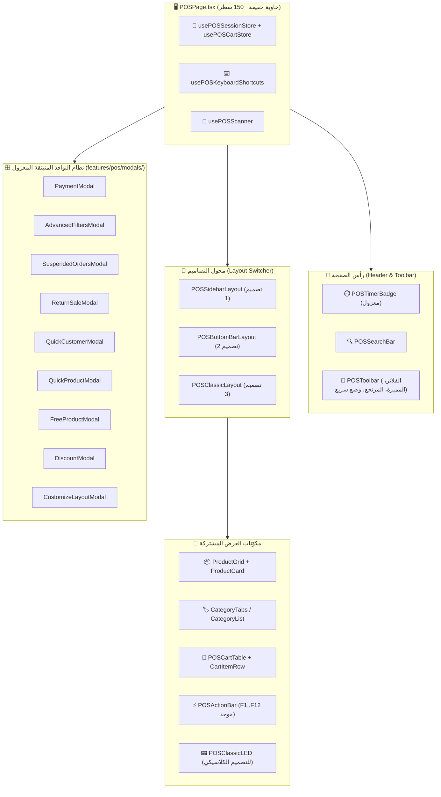

# خطة إعادة هيكلة وتطوير معمارية نقطة البيع المتقدمة (Advanced POS)

استناداً إلى وثيقة التحليل المعماري [docs/POS_ADVANCED_ARCHITECTURE_ANALYSIS.md](file:///home/ammar/AN-POS-TEST/docs/POS_ADVANCED_ARCHITECTURE_ANALYSIS.md)، تهدف هذه الخطة إلى تفكيك المكوّن الأحادي العملاق [`src/features/pos/POSPage.tsx`](file:///home/ammar/AN-POS-TEST/src/features/pos/POSPage.tsx) (3,860+ سطر) وتحويله إلى معمارية معيارية نموذجية تضمن:
1. **أداءً فائقاً** عبر القضاء على دورات إعادة التصيير غير المبررة (60 مرة في الدقيقة).
2. **استقراراً كاملاً** عبر توحيد إدارة الحالة وفصل الاهتمامات (Separation of Concerns).
3. **أمان المعاملات المالية (ACID Transactions)** لمنع أي خلل في المخزون أو رصيد الصندوق والعملاء.
4. **سهولة الصيانة والتوسع** دون المساس بأي ميزة موجودة حالياً.

---

## 🎯 الأهداف الأساسية والشروط العامة

> [!IMPORTANT]
> **التوافق التام وعدم تعطيل العمل (Zero Downtime / Non-breaking):**
> عملية إعادة الهيكلة يجب أن تحافظ على كل الميزات والوظائف والاختصارات الحالية بنسبة 100%. لن يتم حذف أو تعديل أي سلوك يعتمد عليه الكاشير.

> [!WARNING]
> **التنفيذ المرحلي المنضبط:**
> نظراً لحساسية شاشة البيع، سيتم تقسيم التنفيذ إلى **6 مراحل تدريجية**، مع التحقق واختبار البناء وTypeScript بعد كل مرحلة للتأكد من خلو المشروع من أي أخطاء.

---

## المخطط الهيكلي المستهدف (Target Modular Architecture)



---

## المراحل التفصيلية للتنفيذ (Implementation Phases)

---

### المرحلة 1: القضاء على التسريبات الأدائية الفورية (Quick Performance Wins)
**الهدف:** التخلص فوراً من مشكلة إعادة التصيير المتكررة (60 مرة/دقيقة) واستطلاع الـ 3 ثوانٍ الثقيل، دون المساس بتصميم الملف حالياً.

#### [MODIFY] [`src/features/pos/POSPage.tsx`](file:///home/ammar/AN-POS-TEST/src/features/pos/POSPage.tsx)
1. **عزل مؤقت الساعة:**
   - حذف `const [currentTime, setCurrentTime] = useState(new Date());` والـ `setInterval` المرتبط بها من جذر المكون.
   - إنشاء مكوّن فرعي معزول داخلياً `POSTimerBadge` يدير وقته بنفسه، بحيث تنحصر إعادة التصيير الناتجة عن الثواني داخل الـ Badge الصغير فقط.
2. **ضبط استعلام المنتجات (`products` Query):**
   - إلغاء `refetchInterval: 3000`.
   - ضبط `staleTime: 1000 * 60 * 5` (5 دقائق) مع الاعتماد على `queryClient.invalidateQueries({ queryKey: ['products'] })` عند عمليات الإضافة والتعديل والبيع فقط.
   - هذا يمنع جلب آلاف السجلات عبر الـ IPC وإعادة حساب المصفوفات في الذاكرة كل 3 ثوانٍ.

---

### المرحلة 2: استخراج النوافذ المنبثقة إلى مكونات مستقلة (Modals Decoupling)
**الهدف:** تقليص حجم `POSPage.tsx` بأكثر من 1,500 سطر، وعزل حالة كل نافذة منبثقة حتى لا يعيد إدخال البيانات فيها رسم شاشة البيع في الخلفية.

#### [NEW] مجلد النوافذ: `src/features/pos/modals/`
إنشاء النوافذ التالية كمكونات مستقلة ذات واجهات Props واضحة:
1. `PaymentModal.tsx`:
   - خيارات الدفع (كاش، بطاقة، تحويل، آجل/دين).
   - لوحة الأرقام السريعة (Keypad) وفئات العملات (500، 1000، 2000 دج).
   - اختيار العميل وزر إضافة زبون جديد في حالة البيع الآجل.
2. `AdvancedFiltersModal.tsx`:
   - فلترة حسب العائلة/التصنيف، المورد، حالة المخزون، والمنتجات المميزة.
   - زر التطبيق وزر مسح الكل.
3. `SuspendedOrdersModal.tsx`:
   - عرض الفواتير المعلقة والمسودات، استعادتها، أو حذفها مع شارة العدد.
4. `ReturnSaleModal.tsx`:
   - البحث في المبيعات السابقة، اختيار الفاتورة، وتحديد الأصناف المرتجعة.
5. `QuickCustomerModal.tsx`:
   - إضافة زبون سريع بالاسم والهاتف وسقف الدين.
6. `QuickProductModal.tsx`:
   - إضافة صنف سريع مع الباركود والسعر والتكلفة والمخزون.
7. `FreeProductModal.tsx`:
   - إضافة منتج حر مفتوح السعر والاسم والكمية.
8. `DiscountModal.tsx`:
   - تطبيق نسبة مئوية أو مبلغ خصم/إضافة.
9. `CustomizeLayoutModal.tsx`:
   - التبديل بين التصاميم الثلاثة، تفعيل صور الأصناف، ومستوى التكبير (Zoom).
10. `ShortcutsGuideModal.tsx`:
    - دليل اختصارات لوحة المفاتيح.
11. `SessionWarningModal.tsx` و `OpenSessionModal.tsx`:
    - تنبيه فتح الصندوق وبدء الوردية النقدية.

#### [MODIFY] [`src/features/pos/POSPage.tsx`](file:///home/ammar/AN-POS-TEST/src/features/pos/POSPage.tsx)
- استبدال الـ 1,500 سطر من كود النوافذ باستدعاءات نظيفة للمكونات المستخرجة مع تمرير الـ Props و Handlers المطلوبة.

---

### المرحلة 3: توحيد إدارة الحالة واستخراج مخزن جلسة البيع (State Unification)
**الهدف:** التخلص من 55 حالة `useState` متفرقة، وتوحيد السلة مع بيانات الفاتورة (الخصم، الزبون، نوع الدفع، والمعلقات).

#### [NEW] [`src/features/pos/store/usePOSSessionStore.ts`](file:///home/ammar/AN-POS-TEST/src/features/pos/store/usePOSSessionStore.ts)
إنشاء مخزن Zustand موحد لإدارة جلسة نقطة البيع يضم:
```typescript
interface POSSessionState {
  // بيانات الفاتورة النشطة
  selectedCustomer: string;
  discount: number;
  discountType: 'percent' | 'amount';
  paymentMethod: 'cash' | 'card' | 'transfer' | 'credit';
  paidAmount: number;
  returnMode: boolean;
  
  // الفلاتر والبحث
  searchQuery: string;
  filterCategory: string;
  filterSupplier: string;
  filterStockStatus: 'all' | 'in_stock' | 'out_of_stock' | 'low_stock';
  isFeaturedOnly: boolean;
  currentPage: number;
  
  // التخصيص
  posLayout: 'sidebar' | 'bottom' | 'classic';
  showProductImages: boolean;
  uiZoom: number;
  
  // التحكم بالنوافذ المنبثقة
  activeModal: 'payment' | 'filters' | 'suspended' | 'returns' | 'addCustomer' | 'addProduct' | 'freeProduct' | 'discount' | 'customize' | 'shortcuts' | null;
  
  // Actions
  setSelectedCustomer: (id: string) => void;
  setDiscount: (val: number, type?: 'percent' | 'amount') => void;
  setPaymentMethod: (method: 'cash' | 'card' | 'transfer' | 'credit') => void;
  openModal: (modalName: POSSessionState['activeModal']) => void;
  closeModals: () => void;
  resetSaleSession: () => void;
}
```

---

### المرحلة 4: تنظيم نظام الكيبورد وقارئ الباركود وشريط الإجراءات الموحد (Keyboards & Actions)
**الهدف:** استخراج معالج الـ 260 سطر الخاص باختصارات الكيبورد في Hook مخصص، وحل مشكلة اعتراض حقول الإدخال، وتوحيد أزرار `F1..F12` في مكوّن مشترك.

#### [NEW] [`src/features/pos/hooks/usePOSKeyboardShortcuts.ts`](file:///home/ammar/AN-POS-TEST/src/features/pos/hooks/usePOSKeyboardShortcuts.ts)
- استخراج الـ `useEffect` من الصفحة الرئيسية في Hook مجرد.
- عزل فحص `isInput` بشكل ذكي لمنع اعتراض الكتابة في الحقول.
- ضمان سلوك موحد لجميع المفاتيح:
  - `F1`: تسوية الفاتورة / الدفع
  - `F2`: تعليق الفاتورة
  - `F3`: فواتير المسودات / المعلقة
  - `F4`: إلغاء الفاتورة / مسح السلة
  - `F5`: تبديل الطباعة التلقائية
  - `F6`: المنتجات المميزة
  - `F7`: التركيز على حقل البحث
  - `F8`: منتج حر
  - `F9`: سجل المبيعات / المرتجع
  - `F10`: فتح الصندوق
  - `F11`: شاشة كاملة
  - `F12`: دليل الاختصارات
  - `Escape`: إغلاق النوافذ النشطة
  - `Ctrl + D`: حذف الصنف المحدد

#### [NEW] [`src/features/pos/components/actions/POSActionBar.tsx`](file:///home/ammar/AN-POS-TEST/src/features/pos/components/actions/POSActionBar.tsx)
- مكوّن موحد لأزرار الإجراءات السريعة وشارات الـ F-keys، يتم استخدامه في التصاميم الثلاثة بدلاً من تكرار كود الأزرار في 3 أماكن مختلفة.

---

### المرحلة 5: تفكيك وعزل التصاميم الثلاثة (Layouts Modularization)
**الهدف:** تقسيم الـ JSX المتبقي في `POSPage.tsx` إلى 3 مكوّنات تصميم مستقلة ونظيفة.

#### [NEW] [`src/features/pos/layouts/POSSidebarLayout.tsx`](file:///home/ammar/AN-POS-TEST/src/features/pos/layouts/POSSidebarLayout.tsx)
- كود التصميم 1 (Sidebar): السلة على اليسار مع ملخص الدفع في الأسفل، والكتالوج وشبكة المنتجات على اليمين.

#### [NEW] [`src/features/pos/layouts/POSBottomBarLayout.tsx`](file:///home/ammar/AN-POS-TEST/src/features/pos/layouts/POSBottomBarLayout.tsx)
- كود التصميم 2 (Bottom Bar): السلة بجانب شبكة المنتجات، مع شريط الأزرار والإجماليات في الشريط السفلي.

#### [NEW] [`src/features/pos/layouts/POSClassicLayout.tsx`](file:///home/ammar/AN-POS-TEST/src/features/pos/layouts/POSClassicLayout.tsx)
- كود التصميم 3 (Classic Cashier): شاشة LED الخضراء العلوية، جدول بنود الفاتورة بالوسط، وشبكة اللمس وقائمة التصنيفات بالأسفل.

#### [MODIFY] [`src/features/pos/POSPage.tsx`](file:///home/ammar/AN-POS-TEST/src/features/pos/POSPage.tsx)
- تصبح الصفحة الرئيسية مكوّناً حاوياً رشيقاً (`< 150 سطر`) مهمته التنسيق بين الـ Hooks والـ Layout المختار والنوافذ.

---

### المرحلة 6: تحصين أمان العمليات والمعاملات الذرية (Atomic Transactions Safety)
**الهدف:** ضمان عدم حدوث أي تضارب أو تجزئة في حفظ الفاتورة والمخزون وحسابات الصندوق في حال انقطاع التيار أو إغلاق التطبيق.

#### [MODIFY] [`src/features/pos/hooks/useSaleCompletion.ts`](file:///home/ammar/AN-POS-TEST/src/features/pos/hooks/useSaleCompletion.ts)
- استبدال استدعاءات `db.sales.add` و `db.products.update` المتسلسلة باستدعاء قناة الـ IPC المباشرة `window.electronAPI.sales.create` التي تُنفذ داخل SQLite Transaction حقيقية `BEGIN TRANSACTION ... COMMIT` على مستوى الخادم المحلي (`electron/main/handlers/sales.ts`).
- إضافة آلية تراجع تلقائي (Automatic Rollback) ومعالجة أخطاء مع إشعار المستخدم فورياً في حال فشل أي خطوة.

---

## خطة التحقق والاختبار (Verification Plan)

### الاختبارات الآلية (Automated Verification):
1. **فحص الأنواع وسلامة TypeScript:**
   ```bash
   npm run typecheck
   ```
2. **فحص بناء الحزمة البرمجية (Build):**
   ```bash
   npm run build
   ```
3. **تشغيل الاختبارات الأحادية:**
   ```bash
   npm test
   ```

### التحقق اليدوي التفاعلي (Manual Verification Checklist):
- [ ] إضافة أصناف بالضغط والبحث وعبر الباركود.
- [ ] التحقق من تطبيق وتحديث الخصومات والزيادات.
- [ ] اختبار التبديل السلس بين التصاميم الثلاثة (Sidebar, Bottom, Classic) والتأكد من بقاء السلة سليمة.
- [ ] اختبار جميع اختصارات الكيبورد (`F1..F12` و `Escape` و `Ctrl+D`).
- [ ] اختبار عمليات الدفع (كاش، بطاقة، تحويل، آجل).
- [ ] اختبار تعليق الفواتير واسترجاعها وتفريغها.
- [ ] مراقبة الذاكرة وأداء المعالج للتأكد من اختفاء دورات إعادة التصيير غير المبررة.
