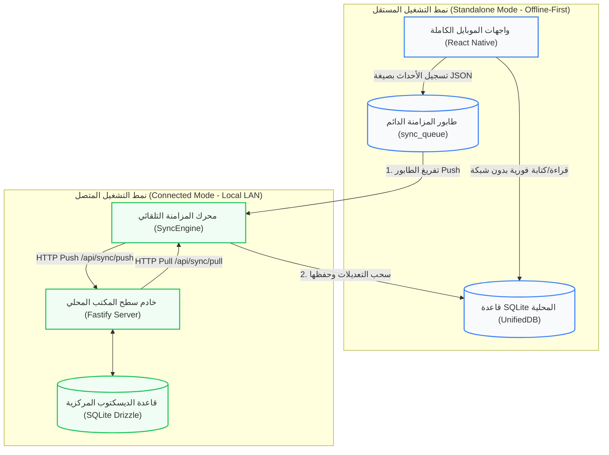
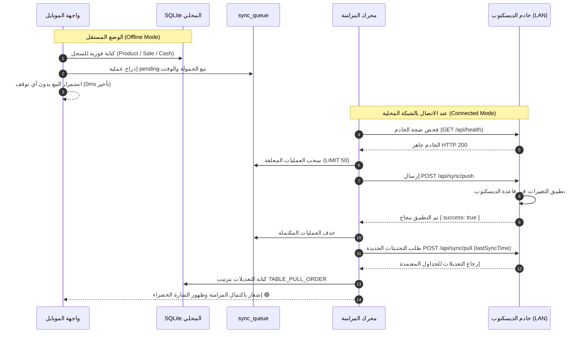
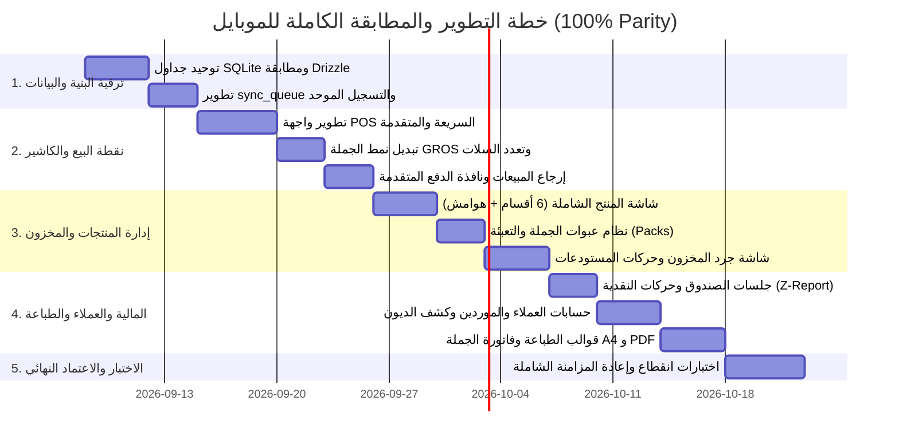

# 📱 وثيقة متطلبات المنتج الشاملة لتطبيق الهاتف المحمول (AN POS Mobile)
## Complete Mobile Product Requirements Document (PRD) — 100% Desktop Parity

---

### 📋 بطاقة تعريف الوثيقة (Document Metadata)
- **اسم النظام:** نظام إدارة نقاط البيع والمخزون والتوزيع الميداني (AN POS Ecosystem)
- **المشروع المستهدف:** تطبيق الهاتف المحمول والأجهزة اللوحية والكاشير المحمول (`mobile-rn` - React Native / Expo)
- **النظام المرجعي:** تطبيق سطح المكتب المركزي (`desktop-app` - Electron / Node-SQLite / Fastify LAN Server / Drizzle ORM)
- **معرّف الوثيقة:** `PRD-MOB-DESKTOP-PARITY-2026`
- **الحالة:** الوثيقة الهندسية المعتمدة للمطابقة الكاملة (Full Parity Technical Specification)
- **تاريخ الإصدار:** سبتمبر 2026
- **المعايير المعتمدة:** تكافؤ كامل للميزات بنسبة 100% (Zero Feature Loss)، مبدأ العمل بدون اتصال أولاً (Offline-First Architecture)، والنظام التجاري والجبائي الجزائري (RC, NIF, NIS, ART).

---

## 📑 الفهرس العام (Table of Contents)
1. [الملخص التنفيذي وأهداف التكافؤ الكامل (Executive Summary & Parity Goals)](#1-الملخص-التنفيذي-وأهداف-التكافؤ-الكامل)
2. [معمارية التشغيل المزدوجة: المستقل مقابل المتصل (Dual Operating Architecture)](#2-معمارية-التشغيل-المزدوجة-المستقل-مقابل-المتصل)
3. [مصفوفة التكافؤ الوظيفي بين الديسكتوب والموبايل (Functional Parity Matrix)](#3-مصفوفة-التكافؤ-الوظيفي-بين-الديسكتوب-والموبايل)
4. [توحيد قاعدة البيانات والمخطط (Unified Database & Schema Parity)](#4-توحيد-قاعدة-البيانات-والمخطط)
5. [نظام نقطة البيع المتقدمة على الهاتف (Mobile Advanced POS System)](#5-نظام-نقطة-البيع-المتقدمة-على-الهاتف)
6. [نظام إدارة المنتجات والمخزون الشامل (Comprehensive Product & Stock Management)](#6-نظام-إدارة-المنتجات-والمخزون-الشامل)
7. [نظام عبوات الجملة والتعبئة والباقات (Wholesale Packs & Bundles)](#7-نظام-عبوات-الجملة-والتعبئة-والباقات)
8. [نظام إدارة الخزينة والصندوق والورديات (Cash Drawer & Shift Management)](#8-نظام-إدارة-الخزينة-والصندوق-والورديات)
9. [نظام العملاء والموردين والديون والتحصيل (Customers, Suppliers & Credit Ledger)](#9-نظام-العملاء-والموردين-والديون-والتحصيل)
10. [نظام الفواتير وقوالب الطباعة المتقدمة (Invoicing & Printing Engine)](#10-نظام-الفواتير-وقوالب-الطباعة-المتقدمة)
11. [نظام المستخدمين والصلاحيات والأمان (Users, Roles & Security)](#11-نظام-المستخدمين-والصلاحيات-والأمان)
12. [محرك المزامنة الثنائية وحسم التعارضات (Two-Way Sync & Conflict Resolution)](#12-محرك-المزامنة-الثنائية-وحسم-التعارضات)
13. [خطة التنفيذ البرمجي ومراحل التحقق (Roadmap & Verification Plan)](#13-خطة-التنفيذ-البرمجي-ومراحل-التحقق)

---

## 1. الملخص التنفيذي وأهداف التكافؤ الكامل

### 1.1 الرؤية العامة (Vision)
تهدف هذه الوثيقة إلى وضع المعايير الهندسية والوظيفية الدقيقة لتحويل تطبيق الهاتف المحمول **AN POS Mobile** من مجرد "تطبيق مساعد محدود" إلى **نظام نقطة بيع وإدارة تجارية متكامل بنسبة 100%**، يطابق كل شاشة، وكل ميزة، وكل زر، وكل حقل متواجد في تطبيق سطح المكتب **AN POS Desktop**.

يُمكّن هذا النظام التاجر أو مندوب المبيعات الميداني من تشغيل كامل نشاطه التجاري من جيبه الخاص، سواء كان في مستودع تجاري، شاحنة توزيع متنقلة، متجر تجزئة، أو معرض كبير، مع الحفاظ على نفس البنية الرياضية والمحاسبية لسطح المكتب.

### 1.2 ركائز التكافؤ الاستراتيجي (Strategic Parity Pillars)
1. **تطابق البيانات والمنطق التجاري (100% Business Logic Parity):** نفس معادلات حساب الأرباح، نفس مستويات الأسعار المتعددة (شراء، PAMP، بيع 1، بيع 2، بيع 3، سعر فاتورة)، نفس منطق الضرائب والخصومات، ونفس معالجة ديون العملاء والموردين.
2. **استقلالية تامة بدون شروط (Zero-Dependency Standalone):** لا يتطلب الموبايل تشغيل الديسكتوب لكي يعمل؛ يمتلك قاعدة بياناته الذاتية (SQLite محلي) وتوليد المعرفات وترقيم الفواتير الخاص به.
3. **تزامن هجين فائق السرعة (Hybrid LAN/Cloud Sync):** بمجرد اتصال الهاتف بشبكة المحل المحلية (Local Wi-Fi) مع جهاز سطح المكتب، تتبادل الأجهزة التحديثات في أجزاء من الثانية دون تدخل يدوي ودون أي تصادم بيانات.
4. **تجربة مستخدم ملائمة للشاشات اللمسية (Mobile-Optimized UX):** نقل كثافة بيانات الديسكتوب إلى شاشة الهاتف عبر واجهات تفاعلية ذكية (أكورديون، تبويبات انزلاقية، كروت KPI ملونة، دعم كامل للغة العربية RTL).

---

## 2. معمارية التشغيل المزدوجة: المستقل مقابل المتصل

### 2.1 قواعد الوضع المستقل (Standalone Engine Rules)
1. **معرفات السجلات:** توليد معرفات فريدة عالمياً من النوع UUID v4 (`generateId()`) لجميع الكيانات المضافة على الهاتف لمنع أي تكرار مع الديسكتوب.
2. **ترقيم المستندات الذكي:** استخدام بادئة فريدة تعتمد على معرف الجهاز مع رقم تسلسلي وطابع زمني:
   $$	ext{Invoice No.} = 	ext{"MOB-" + DeviceID[:4] + "-" + Date(YYYYMMDD) + "-" + Sequence}$$
   مثال: `MOB-C8D1-20260906-0035`.
3. **الكتابة المحلية الصفرية في الطابور:** أي معاملة (حفظ منتج، بيع فاتورة، صرف نقدية، جرد مخزون) تكتب فوراً في قاعدة البيانات المحلية وتدرج سجلاً موازياً في `sync_queue` بحالة `pending`.
4. **المخزون اللحظي:** خصم الكميات واحتساب الأرصدة محلياً لضمان عدم توقف عمليات البيع المتتالية.

### 2.2 قواعد الوضع المتصل (Connected Engine Rules)
1. **الاكتشاف والاقتران السريع:** التعرف على خادم سطح المكتب تلقائياً عبر بروتوكول UDP / mDNS أو مسح رمز QR المعروض على شاشة الديسكتوب.
2. **الدفع أولاً ثم السحب (Push-then-Pull Flow):**
   - دفع السجلات المعلقة من `sync_queue` إلى سطح المكتب.
   - عند تأكيد الحفظ بنجاح من الخادم، يتم حذف السجلات من `sync_queue`.
   - طلب تحديثات الجداول بترتيب الأسبقية والتبعيات (`TABLE_PULL_ORDER`).
3. **حسم التعارضات (Conflict Resolution):**
   - **البيانات المرجعية (المنتجات، الفئات، العملاء):** اعتماد قاعدة **الأحدث زمناً (Last-Write-Wins)** بناءً على حقل `updated_at`.
   - **المبيعات والفواتير:** سجلات تراكمية غير تصادمية (Additive Records).
   - **المخزون وحركات الصندوق:** تطبيق نسبي للفروقات والتسويات (Delta-based Adjustments) لضمان عدم حدوث تضارب محاسبي.

---

## 3. مصفوفة التكافؤ الوظيفي بين الديسكتوب والموبايل

| الوحدة / الميزة | توفرها في الديسكتوب | التصميم والتنفيذ المطلوب في الموبايل | حالة التطابق |
|---|---|---|---|
| **نقطة البيع السريعة (Quick POS)** | متاح (`/pos/quick`) مع شبكة أصناف مميزة | شبكة منتجات لمسية سريعة بحجمين مع البحث الفوري ومسح الباركود | 100% تطابق |
| **نقطة البيع المتقدمة (Pro POS)** | متاح (`/pos`) مع تعليق السلات والضرائب | سلة تفاعلية تدعم الخصم، الضريبة، إدخال سعر مخصص، وتعدد السلات | 100% تطابق |
| **تبديل وضع الجملة (Gros/Détail)** | متاح بضغطة زر واختصار Alt+W | زر تبديل علوي بارز يغير ألوان السلة ويعيد التسعير تلقائياً | 100% تطابق |
| **تعليق واسترجاع الطلبات** | متاح (حفظ عدة سلات باسم العميل) | درج سفلي منزلق لاستعراض واستئناف السلات المعلقة بلمسة واحدة | 100% تطابق |
| **مسح الباركود بالكاميرا** | متاح عبر أجهزة السكانر والكاميرا | ماسح ضوئي فائق السرعة عبر الكاميرا + دعم أجهزة الباركود البلوتوث | 100% تطابق |
| **شاشة إضافة/تعديل المنتج** | متاح بـ 6 أقسام وهامش الربح و 3 أسعار بيع | نموذج مبوب (Accordion) يطابق كل الحقول الـ 30 في الديسكتوب | 100% تطابق |
| **عبوات الجملة والتعبئة (Packs)** | متاح (`/packs`) مع Colisage وسعر الطرد | شاشة متخصصة لإدارة العبوات، والبيع بالكرتون مع خصم القطع | 100% تطابق |
| **العائلات والتصنيفات** | متاح (`/categories`) مع أيقونات وألوان | شاشة لإدارة العائلات مع إمكانية إنشاء فئة جديدة داخل شاشة المنتج | 100% تطابق |
| **حركات المخزون والمستودعات** | متاح (دخول، خروج، تحويل بين المخازن) | شاشة حركات المخزون وسندات التحويل بين مستودع المحل وشاحنة المندوب | 100% تطابق |
| **جرد المخزون الفعلي** | متاح (تسجيل الفروقات وتعديل الرصيد) | شاشة جرد متطورة مع مسح متتالي للباركود واحتساب الفروقات آلياً | 100% تطابق |
| **إدارة جلسات الصندوق (Cash)** | متاح (فتح، إغلاق، حركات نقدية، Z-Report) | إدارة دورة الصندوق الكاملة مع إدخال رصيد الافتتاح والإغلاق | 100% تطابق |
| **حسابات العملاء والديون** | متاح (سقف الائتمان، كشف الحساب، RC/NIF) | إدارة العملاء، تصنيفهم، متابعة الديون، وتسجيل سندات القبض | 100% تطابق |
| **حسابات الموردين وفواتير الشراء** | متاح (`/suppliers` و المشتريات) | شاشة الموردين، تسجيل مشتريات جديدة وتحديث أسعار التكلفة والمخزون | 100% تطابق |
| **سجل الفواتير والإرجاع (Avoir)** | متاح (فلترة، تفاصيل الفاتورة، إرجاع) | سجل المبيعات مع إمكانية الإرجاع الجزئي والكلي وطباعة الوصل | 100% تطابق |
| **إدارة المصاريف اليومية** | متاح (تصنيفات المصاريف، التقارير) | تسجيل المصاريف النثرية والتشغيلية وخصمها من رصيد الصندوق | 100% تطابق |
| **قوالب الطباعة المخصصة** | متاح (محرر القوالب الحرارية و A4) | محرك قوالب كامل يدعم ESC/POS 80mm/58mm وتصدير PDF A4 | 100% تطابق |
| **المستخدمون والصلاحيات و PIN** | متاح (أدوار وصلاحيات دقيقة) | تسجيل الدخول برمز PIN مع تطبيق قيود الصلاحيات على كل زر | 100% تطابق |

---

## 4. توحيد قاعدة البيانات والمخطط (Unified Database & Schema Parity)

يجب أن تعتمد قاعدة بيانات الهاتف المحلية (`UnifiedDB` / SQLite) على مخطط متطابق حرفياً مع نماذج Drizzle في الديسكتوب، مع الالتزام بالحقول والأنواع التالية:

### 4.1 جدول المنتجات المتكامل (`products`)
- `id` (TEXT PRIMARY KEY): معرف فريد UUID v4.
- `name` (TEXT NOT NULL): الاسم التجاري للصنف.
- `sku` (TEXT NOT NULL): رمز المادة الفريد.
- `barcode` (TEXT NOT NULL): الباركود الأساسي.
- `category` (TEXT NOT NULL): اسم الفئة/العائلة.
- `category_id` (TEXT): المعرف الفريد للفئة.
- `unit` (TEXT NOT NULL DEFAULT 'قطعة'): وحدة البيع الأساسية.
- `cost_price` (REAL NOT NULL DEFAULT 0): آخر سعر شراء حقيقي.
- `average_price` (REAL NOT NULL DEFAULT 0): متوسط سعر الشراء المرجح (PAMP).
- `retail_price` (REAL NOT NULL DEFAULT 0): سعر البيع 1 (تجزئة).
- `sale_price2` (REAL NOT NULL DEFAULT 0): سعر البيع 2 (نصف جملة).
- `sale_price3` (REAL NOT NULL DEFAULT 0): سعر البيع 3 (جملة).
- `wholesale_price` (REAL NOT NULL DEFAULT 0): سعر الجملة العام.
- `invoice_price` (REAL NOT NULL DEFAULT 0): سعر البيع بالفاتورة.
- `profit_margin` (REAL NOT NULL DEFAULT 0): نسبة هامش الربح المحسوبة %.
- `tax_rate` (REAL NOT NULL DEFAULT 0): نسبة الرسم على القيمة المضافة TVA %.
- `discount` (REAL NOT NULL DEFAULT 0): نسبة الخصم المسموح بها للمندوب %.
- `quantity` (REAL NOT NULL DEFAULT 0): رصيد المخزون الفعلي.
- `low_stock_threshold` (REAL NOT NULL DEFAULT 5): حد التنبيه لانخفاض المخزون.
- `wholesale_min_qty` (REAL NOT NULL DEFAULT 0): الحد الأدنى للكمية لتطبيق سعر الجملة.
- `wholesale_unit_name` (TEXT DEFAULT 'كرتون'): اسم وحدة الجملة للطباعة.
- `weight` (REAL DEFAULT 0): الوزن الصافي (كغ).
- `package_size` (TEXT DEFAULT ''): نمط التعبئة (Colisage).
- `location` (TEXT DEFAULT ''): مكان الصنف بالرف/المخزن.
- `allow_negative_stock` (INTEGER NOT NULL DEFAULT 0): السماح بالبيع برصيد سالب (1/0).
- `quick_sale` (INTEGER NOT NULL DEFAULT 1): الظهور في شاشة البيع السريع (1/0).
- `status` (TEXT NOT NULL DEFAULT 'active'): حالة الصنف ('active' | 'archived').
- `image` (TEXT DEFAULT ''): رابط الصورة أو مسارها المحلي.
- `custom_prices` (TEXT DEFAULT '[]'): مصفوفة أسعار مخصصة إضافية بصيغة JSON.
- `created_at`, `updated_at` (TEXT NOT NULL): طوابع زمنية دقيقة UTC.

### 4.2 جدول عبوات الجملة والطرود (`packs`)
- `id` (TEXT PRIMARY KEY), `name` (TEXT NOT NULL), `barcode` (TEXT NOT NULL).
- `items` (TEXT NOT NULL): مصفوفة الأصناف والكميات بصيغة JSON: `[{ "productId": "...", "qty": 24 }]`.
- `pack_price` (REAL NOT NULL DEFAULT 0): سعر بيع العبوة بالجملة.
- `pack_type` (TEXT NOT NULL DEFAULT 'pack'): نوع العبوة ('colisage' | 'bundle' | 'demi_gros').
- `unit_name` (TEXT DEFAULT 'كرتون'): اسم وحدة العبوة (كرتون، طرد، صندوق).
- `pieces_count` (INTEGER DEFAULT 1): إجمالي عدد القطع لخصمها من رصيد الصنف.
- `min_wholesale_qty` (INTEGER DEFAULT 1): الحد الأدنى للعبوات.
- `status` (TEXT NOT NULL DEFAULT 'active'), `created_at`, `updated_at`.

### 4.3 جدول العملاء التجاري والجبائي (`customers`)
- `id`, `name`, `phone`, `email`, `address`.
- `customer_type` (TEXT NOT NULL DEFAULT 'retail'): نوع العميل ('retail' | 'semi_wholesale' | 'wholesale').
- `credit_limit` (REAL NOT NULL DEFAULT 0): سقف الائتمان المالي المسموح به.
- `balance` (REAL NOT NULL DEFAULT 0): رصيد الحساب الحالي (مدين أو دائن).
- `rc` (TEXT): رقم السجل التجاري الرسمي.
- `nif` (TEXT): رقم التعريف الجبائي.
- `nis` (TEXT): رقم التعريف الإحصائي.
- `art` (TEXT): رقم المادة الضريبية.
- `notes` (TEXT), `status`, `created_at`, `updated_at`.

### 4.4 جدول المبيعات وبنودها (`sales` & `sale_items`)
- `sales`: `id`, `number` (رقم الفاتورة ببادئة الجهاز), `date`, `doc_type` ('facture' | 'wholesale' | 'bon_livraison' | 'ticket'), `customer_id`, `customer_name`, `subtotal`, `discount`, `discount_type`, `tva_amount`, `total`, `payment_method` ('cash' | 'credit' | 'card' | 'check'), `amount_paid`, `status` ('paid' | 'partial' | 'unpaid'), `sold_by`, `cash_session_id`, `created_at`, `updated_at`.
- `sale_items`: `id`, `sale_id`, `product_id`, `name`, `qty`, `unit_price`, `line_total`, `is_pack`, `pack_id`, `pack_qty`, `pack_unit`, `pricing_type` ('retail' | 'semi_wholesale' | 'wholesale' | 'custom'), `created_at`.

### 4.5 جدول جلسات الصندوق والخزينة (`cash_sessions`)
- `id` (TEXT PRIMARY KEY), `session_number` (TEXT NOT NULL), `user_id`, `user_name`.
- `opened_at` (TEXT NOT NULL), `closed_at` (TEXT).
- `opening_balance` (REAL NOT NULL DEFAULT 0): رصيد فتح الدرج.
- `closing_balance` (REAL DEFAULT 0): الرصيد الفعلي المحسوب عند الإغلاق.
- `expected_balance` (REAL DEFAULT 0): الرصيد النظري المتوقع من النظام.
- `cash_sales` (REAL DEFAULT 0), `credit_sales` (REAL DEFAULT 0), `expenses` (REAL DEFAULT 0).
- `cash_in` (REAL DEFAULT 0), `cash_out` (REAL DEFAULT 0).
- `status` (TEXT NOT NULL DEFAULT 'open'): حالة الجلسة ('open' | 'closed').
- `notes` (TEXT), `created_at`, `updated_at`.

---

## 5. نظام نقطة البيع المتقدمة على الهاتف (Mobile Advanced POS)

### 5.1 تجربة واجهة الكاشير المتطورة (UI Layout & Interaction)
1. **الشريط العلوي الذكي:**
   - مؤشر حالة الاتصال وسرعة المزامنة (🟢 متصل / 🟡 جاري التزامن / ⚪ وضع مستقل مع عداد العمليات المعلقة).
   - زر التبديل السريع لنمط البيع: **«🛒 تجزئة (DÉTAIL)»** ⟷ **«📦 جملة (GROS)»** مع تغيير لون الواجهة.
   - زر سلة الانتظار المعلقة مع شارة عدد السلات النشطة.
   - زر القائمة السريعة للعمليات (فتح الدرج، إرجاع بضاعة، مصاريف، إغلاق الوردية).
2. **شريط البحث والإدخال السريع:**
   - حقل بحث فوري يدعم البحث المتزامن بالاسم، الرمز (SKU)، والباركود.
   - زر تفعيل الكاميرا السريعة لمسح الباركود بنمط المسح المستمر (Continuous Scanning Mode).
   - زر تصفية سريع بحسب الفئات والعائلات.
3. **شبكة وعناصر السلة التفاعلية (Interactive Cart):**
   - تعديل الكميات مباشرة بأزرار (+ / -) أو لوحة مفاتيح أرقام عائمة بلمسة واحدة.
   - إظهار شارات نوع التسعير بوضوح بجانب كل بند: `[تجزئة]`، `[نصف جملة]`، `[جملة]`، `[طرد كرتونة]`.
   - إمكانية تطبيق خصم على مستوى الصنف (نسبة مئوية أو مبلغ ثابت).
   - حذف الصنف بالسحب الجانبي (Swipe-to-Delete).
4. **شريط ملخص الدفع السفلي (Bottom Checkout Bar):**
   - إجمالي القطع، المجموع الفرعي، الضرائب، والخصم العام.
   - الإجمالي النهائي للدفع بلون بارز وخط واضح.
   - أزرار الدفع السريع: **[ 💵 نقد كاش ]**، **[ 💳 بطاقة ]**، **[ ⏳ بيع بالآجل/دين ]**، **[ 📄 خيارات متقدمة ]**.

### 5.2 نافذة إتمام الدفع الشاملة (Payment & Checkout Modal)
- إدخال المبلغ المدفوع من العميل مع حاسبة فورية لمبلغ الفكة/المتبقي الواجب إرجاعه.
- خيار تقسيم الدفع (Split Payment: جزء نقداً وجزء في الحساب الآجل للعميل).
- تحديد نوع المستند المراد إصداره:
  - وصل إيصال حراري (Ticket de caisse).
  - وصل تسليم بضاعة (Bon de livraison - BL).
  - فاتورة بيع رسمية (Facture A4).
  - فاتورة بيع بالجملة (Wholesale Invoice A4).
- خيار الطباعة الفورية عبر طابعة البلوتوث أو توليد ومشاركة ملف PDF عبر WhatsApp.

### 5.3 نظام السلات المعلقة المتعددة (Multi-Cart / Hold Orders)
- إمكانية تعليق السلة الحالية بضغطة زر وتحديد اسم أو ملاحظة (مثال: "زبون ينتظر سيارته").
- إمكانية فتح سلة جديدة فوراً دون فقدان أي بيانات.
- قائمة منزلقة تعرض جميع السلات المعلقة مع تاريخ التعليق، القيمة الإجمالية، وزر استئناف سريع.

---

## 6. نظام إدارة المنتجات والمخزون الشامل

### 6.1 شاشة إضافة وتعديل الصنف المطابقة للديسكتوب (Product Form)
تنقسم شاشة إدارة الصنف في الهاتف إلى 6 أقسام تفاعلية منظمة:

1. **القسم 1: معلومات وهوية الصنف (Identity):**
   - اسم المنتج التجاري (إلزامي).
   - رمز الصنف (SKU) مع زر التوليد التلقائي وزر التحديث.
   - الفئة/العائلة (Category) مع إمكانية إضافة فئة جديدة فوراً داخل الشاشة (Inline Category Creation).
   - وحدة القياس الأساسية (قطعة، علبة، كغ، لتر، طرد...).
   - التقاط صورة المنتج بالكاميرا أو اختيارها من معرض الصور، مع ضغط تلقائي للصورة لتقليل حجم المزامنة.
2. **القسم 2: الأسعار والربحية وهوامش الأرباح (Pricing & Profitability):**
   - كروت KPI علوية ملونة: تكلفة الشراء، سعر التجزئة، صافي الربح، ونسبة هامش الربح %.
   - مؤشر بصري لوني ذكي لهامش الربح:
     - 🔴 أحمر: بيع بخسارة (الهامش < 0%).
     - 🟠 برتقالي: هامش ضئيل (< 10%).
     - 🔵 أزرق: هامش جيد (10% - 30%).
     - 🟢 أخضر: هامش ممتاز (> 30%).
   - أزرار تطبيق هامش ربح سريع جاهز (+15%، +25%، +35%، +50%).
   - مستويات التسعير الستة:
     1. آخر سعر شراء (Dernier Prix d'Achat).
     2. متوسط سعر الشراء المرجح (PAMP - يُحسب تلقائياً من المشتريات).
     3. سعر البيع 1: سعر التجزئة الأساسي (Détail).
     4. سعر البيع 2: سعر نصف الجملة (Demi-Gros).
     5. سعر البيع 3: سعر الجملة الرسمي (Gros).
     6. سعر البيع بالفاتورة الرسمية (Prix Facture).
   - نسبة الضريبة TVA % ونسبة الخصم التجاري المسموح به للمندوب %.
3. **القسم 3: الباركود والترميز المتعدد (Barcodes & Coding):**
   - الباركود الرئيسي: مسح بالكاميرا، إدخال يدوي، أو توليد آلي (EAN-13 / Code-128).
   - قائمة الباركودات الثانوية البديلة (Secondary Barcodes): ربط باركودات إضافية لنفس الصنف مع تسميات سعرية (مثال: باركود العلبة وباركود الحبة).
4. **القسم 4: عبوات الجملة والتعبئة (Packaging & Colisage):**
   - مفتاح تفعيل البيع بالعبوة لهذا الصنف.
   - اسم العبوة (مثال: كرتونة 24 علبة).
   - عدد القطع الإجمالية داخل العبوة (Colisage Count).
   - سعر بيع العبوة بالجملة.
   - احتساب فوري لسعر القطعة داخل العبوة وهامش ربح العبوة الإجمالي.
   - باركود العبوة الخارجي المستقل (مع زر المسح بالكاميرا).
5. **القسم 5: إدارة المخزون وموقع التخزين (Stock & Storage):**
   - الكمية الحالية المتوفرة بالمخزن.
   - حد التنبيه لانخفاض المخزون (Low stock threshold).
   - الوزن الصافي للوحدة (كغ).
   - مكان تواجد الصنف بالرف والممر (Shelf location).
   - تاريخ الصلاحية ورقم الدفعة (Batch & Expiry date).
6. **القسم 6: خيارات البيع المتقدمة (Advanced Controls):**
   - مفتاح "منتج مميز للبيع السريع" (Quick Sale).
   - مفتاح "السماح بالبيع بدون مخزون / رصيد سالب" (Allow Negative Stock).
   - مفتاح "حالة الصنف نشط / معطل" (Active Status).

### 6.2 وحدة حركات المخزون والمستودعات المتعددة (Stock Movements)
- تسجيل حركات دخول بضاعة (Stock Entry).
- تسجيل حركات خروج بضاعة (Stock Exit / Waste).
- تسجيل سند تحويل بين المستودعات (Warehouse Transfer): نقل بضائع من "المستودع الرئيسي" إلى "شاحنة المندوب"، مع توثيق السند برقم مرجعي وخصم وإضافة الكميات في المستودعين فورياً.

### 6.3 وحدة الجرد المادي للمخزون (Physical Inventory Count)
- إنشاء دورة جرد جديدة لمستودع محدد.
- استخدام كاميرا الهاتف لمسح الباركودات بشكل مستمر وتجميع الكميات الممسوحة تلقائياً.
- مقارنة الكمية الممسوحة فعلياً مع الكمية المسجلة دفترياً بالنظام.
- إظهار تقرير الفروقات (العجز أو الزيادة) مع القيمة المالية للفارق.
- زر اعتماد الجرد النهائي: تسوية أرصدة المخزون تلقائياً لتطابق الواقع الممسوح.

---

## 7. نظام عبوات الجملة والتعبئة والباقات (Wholesale Packs & Bundles)

- **فلسفة العمل:** تمكين تجار الجملة والموزعين من بيع الطرود دون الإخلال بجرد القطع الفردية.
- **أنواع العبوات المدعومة:**
  1. **طرد جملة (Colisage):** كرتون يحتوي على عدد محدد من نفس الصنف (مثال: كرتون زيت = 12 قارورة).
  2. **باقة عروض مجمعة (Bundle):** باقة تحتوي على أصناف مختلفة معاً بسعر مخفض (مثال: باقة عودة للمدرسة = محفظة + 3 كراريس + مقلمة).
  3. **نصف جملة (Demi-gros):** عبوة متوسطة لتجار التجزئة الصغار.
- **الخصم الذكي من المخزون:**
  عند مسح أو بيع باركود العبوة، يتم خصم عدد القطع الفعلي من جدول الأصناف الأساسية، مما يضمن دقة الجرد سواء بيعت القطع مفردة أو كعبوات.

---

## 8. نظام إدارة الخزينة والصندوق والورديات (Cash Management)

### 8.1 دورة حياة وردية الصندوق (Cash Shift Lifecycle)
1. **فتح الوردية (Opening Shift):**
   - إدخال رصيد فتح الصندوق (Fonds de caisse) والتحقق من المستخدم.
   - بدء جلسة نقدية جديدة برقم تسلسلي فريد.
2. **العمليات أثناء الوردية (In-Shift Transactions):**
   - تسجيل المبيعات النقدية تلقائياً.
   - تسجيل عمليات الدفع الآجل والبطاقات النقدية.
   - عمليات إيداع نقدية إضافية في الدرج (Cash In).
   - عمليات سحب نقدية وسداد مصاريف تشغيلية من الصندوق (Cash Out / Expense).
3. **إغلاق الوردية والتقرير النهائي (Closing Shift & Z-Report):**
   - عد النقدية الموجودة فعلياً في الدرج وإدخالها.
   - احتساب النظام للرصيد النظري ومقارنته بالمبلغ الفعلي:
     $$	ext{Difference} = 	ext{Actual Cash} - (	ext{Opening} + 	ext{Sales} + 	ext{CashIn} - 	ext{CashOut})$$
   - توثيق الفارق (فائض أو عجز) مع خانة للملاحظات.
   - طباعة تقرير إغلاق الوردية المالي (Z-Report) على الطابعة الحرارية يتضمن ملخص المبيعات، الضرائب، المرتجعات، وصافي النقدية.

---

## 9. نظام العملاء والموردين والديون والتحصيل (Ledger System)

### 9.1 إدارة عملاء الجملة والتجزئة (Customer CRM)
- تصنيف العميل: **تجزئة (Retail)** | **نصف جملة (Semi-Wholesale)** | **تاجر جملة (Wholesale)**.
- توثيق البيانات الجبائية والقانونية: السجل التجاري (RC)، الرقم الجبائي (NIF)، رقم الإحصاء (NIS)، ورقم المادة (ART).
- تحديد سقف الائتمان (Credit Limit): يمنع الكاشير أو ينبهه عند محاولة إصدار فاتورة بالدين تتجاوز السقف المسموح به.
- **كشف الحساب المالي للعميل (Statement of Account):**
  استعراض تاريخ الفواتير السابقة، المدفوعات، الأرصدة المتبقية، وتصدير كشف حساب PDF رسمي لمشاركته مع العميل.
- **سندات القبض والتحصيل الميداني (Cash Collection / Recouvrement):**
  إمكانية قيام الموزع بقبض مبالغ مالية من العميل في الميدان لتسديد ديون قديمة، وإصدار وصل قبض رسمي وتحديث رصيد العميل فوراً.

### 9.2 إدارة الموردين والمشتريات (Suppliers & Purchasing)
- سجل الموردين مع بيانات الاتصال والرصيد الدائن.
- إنشاء فواتير مشتريات وسندات استلام بضائع من الموبايل:
  - إدخال الكميات المستلمة وأسعار الشراء.
  - التحديث التلقائي الفوري لرصيد المخزون في المستودع المحدد.
  - التحديث التلقائي لـ "آخر سعر شراء" وحساب متوسط سعر التكلفة الجديد (PAMP).
  - تسجيل المدفوع للمورد وترحيل الباقي لحساب ديون المورد.

---

## 10. نظام الفواتير وقوالب الطباعة المتقدمة (Invoicing & Printing)

### 10.1 أنواع المستندات المدعومة بالكامل
1. **وصل إيصال كاشير حراري (Thermal Receipt 80mm & 58mm).**
2. **فاتورة بيع رسمية (Facture A4).**
3. **فاتورة بيع بالجملة مخصصة (Wholesale Invoice A4) مع بيانات الطرود والأرصدة.**
4. **وصل تسليم بضاعة (Bon de livraison - BL).**
5. **إشعار إرجاع بضاعة وإبراء (Bon de retour / Avoir).**
6. **وصل قبض نقدي (Reçu de paiement).**
7. **تقرير إغلاق الوردية واليومية (Z-Report).**

### 10.2 محتوى فاتورة الجملة الرسمية (Wholesale Invoice Parity)
- ترويسة البائع الرسمية: الشعار، الاسم التجاري، العنوان، الهاتف، RC, NIF, NIS, ART.
- بيانات المشتري التجارية: الاسم التجاري، العنوان، الهاتف، السجل التجاري RC، الرقم الجبائي NIF.
- جدول البنود: الرمز SKU، اسم الصنف، نوع العبوة والتعبئة (Colisage)، عدد الطرود، إجمالي القطع، سعر الوحدة، الإجمالي.
- ملخص الحسابات والوضعية المالية الكاملة:
  - المجموع الإجمالي والتخفيض التجاري.
  - الصافي للدفع في هذه الفاتورة.
  - **الرصيد السابق للزبون (Ancien Solde).**
  - **المبلغ المدفوع حالياً (Montant Versé).**
  - **الرصيد الإجمالي الجديد المتبقي (Nouveau Solde).**
- التفقيط التلقائي للمبلغ بالحروف، ومربعات التوقيع والختم الرسمي والتأشيرة.

### 10.3 قنوات وأجهزة الطباعة المدعومة بالموبايل
- **طابعات البلوتوث والواي فاي والشبكة (ESC/POS):** دعم أوامر الطباعة المباشرة لطابعات الإيصالات المحمولة عبر البلوتوث (POS Printers) بأحجام 80mm و 58mm.
- **محرك توليد PDF A4:** توليد فوري لملف PDF عالي الجودة متوافق مع معايير A4 بدون الحاجة لإنترنت، مع زر مشاركة فوري عبر WhatsApp أو البريد أو الطباعة عبر AirPrint / Mopria.

---

## 11. نظام المستخدمين والصلاحيات والأمان (Users & Security)

### 11.1 تسجيل الدخول وحماية الجلسة
- تسجيل الدخول السريع برمز PIN سري مكون من 4 إلى 6 أرقام مع قفل تلقائي عند عدم النشاط.
- دعم الدخول باسم المستخدم وكلمة المرور.

### 11.2 مصفوفة الصلاحيات الصارمة (Role-Based Access Control)
تطبيق نفس منظومة صلاحيات الديسكتوب لمنع المستخدمين غير المصرح لهم من تجاوز القواعد:
- منع الكاشير من تغيير أسعار البيع أثناء البيع (إلا بموافقة المدير أو إدخال PIN الإدارة).
- منع تطبيق خصم يتجاوز النسبة المحددة للصنف أو المندوب.
- منع إلغاء أو حذف الفواتير الصادرة دون تصريح إداري.
- حجب أسعار الشراء وهوامش الربح عن المستخدمين برتبة "كاشير" أو "بائع".
- تسجيل كل عملية حساسة في سجل التدقيق والأنشطة الداخلي (`audit_logs`).

---

## 12. محرك المزامنة الثنائية وحسم التعارضات (Sync Engine)

### 12.1 ترتيب الجداول عند السحب (Dependency Pull Order)
لضمان تكامل المفاتيح الخارجية والعلاقات، تسحب الجداول بالترتيب الصارم التالي:
1. `settings`, `roles`, `users`
2. `categories`, `warehouses`
3. `products`, `product_barcodes`, `promotions`, `packs`
4. `customers`, `suppliers`, `supplier_entries`
5. `cash_sessions`, `sales`, `sale_items`, `suspended_orders`, `payments`
6. `purchases`, `purchase_items`, `expenses`, `capital_entries`
7. `stock_movements_v2`, `stock_movement_lines`, `inventory_counts`
8. `print_templates`, `template_assignments`, `printers`

---

## 13. خطة التنفيذ البرمجي ومراحل التحقق (Roadmap)

### 13.1 معايير القبول وضمان الجودة (QA Parity Checklist)
- [ ] **مطابقة واجهة المنتج:** جميع الحقول الـ 30 في ديسكتوب متوفرة وتعمل في شاشة إضافة المنتج بالموبايل.
- [ ] **مطابقة البيع بالجملة:** التبديل إلى نمط الجملة يطبق أسعار الجملة تلقائياً في كلا الجهازين.
- [ ] **مطابقة العبوات:** بيع عبوة كرتونة تخصم عدد القطع الحقيقي من المخزون في الموبايل والديسكتوب.
- [ ] **الاستقلالية في وضع الطيران:** إجراء 50 عملية بيع وإضافة منتجين في وضع عدم الاتصال وحفظها بنجاح محلياً.
- [ ] **المزامنة الصفرية للأخطاء:** عند إعادة الاتصال بشبكة Wi-Fi، تنتقل الـ 50 عملية إلى الديسكتوب بدقة 100% دون تكرار أو نقص.
- [ ] **مطابقة الفاتورة:** فاتورة الجملة A4 الصادرة من الهاتف تحتوي على نفس الهيكل، البيانات الجبائية، وجدول الأرصدة المتواجد في الديسكتوب.

---

> **خاتمة الاعتماد:** تمثل هذه الوثيقة المرجع الأساسي والملزم لفرق التطوير لضمان تحقيق التطابق الكامل بنسبة 100% بين تطبيق الهاتف وتطبيق سطح المكتب في منظومة **AN POS**.
