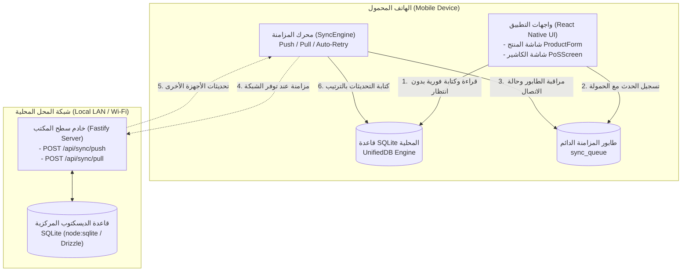
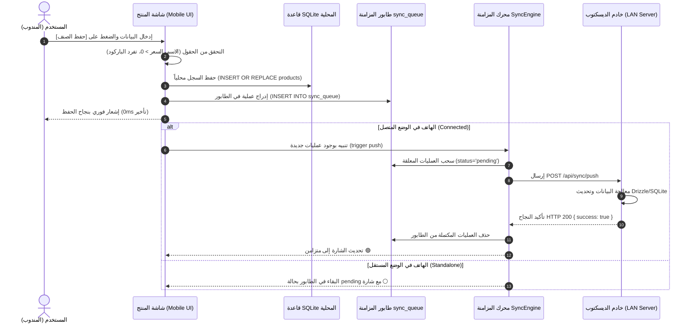
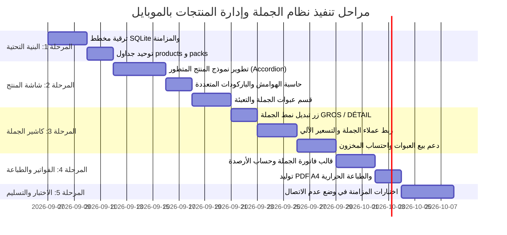

# 📱 وثيقة متطلبات المنتج (PRD): نظام بيع الجملة وإدارة المنتجات لتطبيق الهاتف (الوضع المستقل والمتصل)
## Product Requirements Document: Mobile Wholesale Sales & Comprehensive Product Management (Standalone & Connected Modes)

---

### 📋 بطاقة تعريف الوثيقة (Document Metadata)
- **المشروع:** نظام نقاط البيع وإدارة المخزون (AN POS Ecosystem)
- **المنصة المستهدفة:** تطبيق الهاتف المحمول (`mobile-rn` - React Native / Expo) لأنظمة Android و iOS
- **النظام المرافق:** تطبيق سطح المكتب (`desktop-app` - Electron / Fastify Local Server / SQLite Drizzle)
- **معرّف الوثيقة:** `PRD-MOB-WS-PROD-2026`
- **الحالة:** معتمد للتنفيذ البرمجي (Approved Architecture & Implementation Specification)
- **تاريخ الإصدار:** سبتمبر 2026
- **المعايير المرجعية:** معايير التطابق مع الديسكتوب (SABLE STOCK Parity)، النظام الجبائي والتجاري الجزائري (RC, NIF, NIS, ART)، ومعمارية التطبيقات التي تعمل بدون اتصال أولاً (Offline-First Architecture).

---

## 📑 الفهرس العام (Table of Contents)
1. [الملخص التنفيذي والأهداف الاستراتيجية (Executive Summary & Goals)](#1-الملخص-التنفيذي-والأهداف-الاستراتيجية)
2. [معمارية التشغيل الثنائية: المستقل (Standalone) مقابل المتصل (Connected)](#2-معمارية-التشغيل-الثنائية-المستقل-مقابل-المتصل)
3. [مخطط وتوحيد قاعدة البيانات المشتركة (Database Schema Parity)](#3-مخطط-وتوحيد-قاعدة-البيانات-المشتركة)
4. [مواصفات شاشة إضافة وتعديل المنتج على الهاتف (Mobile Product Management)](#4-مواصفات-شاشة-إضافة-وتعديل-المنتج-على-الهاتف)
5. [نظام بيع الجملة في نقطة البيع بالهاتف (Mobile Wholesale POS System)](#5-نظام-بيع-الجملة-في-نقطة-البيع-بالهاتف)
6. [نظام عبوات الجملة والباقات على الهاتف (Wholesale Packs & Colisage)](#6-نظام-عبوات-الجملة-والباقات-على-الهاتف)
7. [فواتير وقوالب طباعة الجملة (Wholesale Invoicing & Document Engine)](#7-فواتير-وقوالب-طباعة-الجملة)
8. [معمارية المزامنة وحل التعارضات ثنائية الاتجاه (Two-Way Sync & Conflict Resolution)](#8-معمارية-المزامنة-وحل-التعارضات)
9. [خطة التنفيذ البرمجي ومراحل الإطلاق (Implementation Roadmap)](#9-خطة-التنفيذ-البرمجي-ومراحل-الإطلاق)
10. [معايير القبول وضمان الجودة (Acceptance Criteria & QA Checklist)](#10-معايير-القبول-وضمان-الجودة)

---

## 1. الملخص التنفيذي والأهداف الاستراتيجية

### 1.1 الرؤية والدافع (Vision & Motivation)
يهدف هذا المشروع إلى نقل قوة وكفاءة نظام **AN POS** لإدارة مبيعات الجملة وإدارة المخزون إلى الهواتف الذكية والأجهزة اللوحية (Handheld POS / Mobile Terminals). يتيح ذلك لمندوبي المبيعات الميدانيين (Vendeurs Livreurs / Van Sale)، مدراء المستودعات، وتجار الجملة في المستودعات الكبرى إنجاز جميع العمليات من جيوبهم:
- مسح وإضافة المنتجات بأسعار الجملة والتجزئة والطرود.
- إنشاء فواتير ووصولات تسليم جملة احترافية وحساب أرصدة وديون العملاء.
- العمل بحرية مطلقة ومستقلة 100% دون اشتراط وجود تغطية شبكية أو اتصال دائم بجهاز الحاسوب الرئيسي، مع المزامنة التلقائية الفورية عند الاتصال بشبكة المحل أو الخادم المحلي.

### 1.2 الأهداف الرئيسية (Core Objectives)
1. **التوافق التام 100% مع الديسكتوب (Full Parity):** مطابقة حقول شاشة المنتج الحديثة بأسعارها المتعددة (سعر 1، سعر 2، سعر 3، سعر الفاتورة، PAMP)، الباركودات المتعددة، وحدات التعبئة (Colisage)، والبيانات الجبائية.
2. **استقلالية حقيقية (Offline-First / Zero-Downtime):** في الوضع المستقل، لا يفقد التطبيق أي ميزة. يتم حفظ البيانات فورياً في محرك SQLite المحلي، مع توليد معرفات UUID عالمية غير قابلة للتصادم وترقيم محلي منظم للفواتير.
3. **مزامنة ذكية ثنائية الاتجاه خالية من فقدان البيانات (Lossless Two-Way Sync):** تسجيل كافة الأحداث في طابور محلي دائم (`sync_queue`) مع تفريغ آمن وسحب منظم حسب التبعيات عند الاتصال بسيرفر الديسكتوب عبر الشبكة المحلية (LAN Wi-Fi).
4. **دورة مبيعات جملة متكاملة (End-to-End Wholesale Flow):** تحويل سريع لنمط البيع (GROS / DÉTAIL)، دعم بيع العبوات (Packs)، متابعة سقف الائتمان للعميل، طباعة الفواتير الحرارية (80mm) وفواتير A4 بصيغة PDF متضمنة الأرصدة السابقة والمدفوعة والمتبقية (Ancien Solde, Versé, Nouveau Solde).

---

## 2. معمارية التشغيل الثنائية: المستقل مقابل المتصل



### 2.1 وضع العمل المستقل (Standalone Mode - Offline-First)
- **التعريف:** نمط يعمل فيه تطبيق الموبايل كمنظومة ذاتية الاكتفاء (Autonomous POS). يُستخدم عندما يكون المندوب على الطريق، أو عند انقطاع شبكة Wi-Fi، أو عند تشغيل الهاتف كجهاز كاشير فرعي مستقل.
- **القواعد الصارمة للوضع المستقل:**
  1. **الكتابة الصفرية في الشبكة:** لا تنتظر واجهات المستخدم أي استجابة من الشبكة (`fetch` / `axios`). أي عملية إضافة صنف، تعديل سعر، أو إصدار فاتورة تكتب مباشرة في `UnifiedDB` (SQLite).
  2. **معرفات عالمية غير متكررة (UUID v4):** استخدام `generateId()` لجميع السجلات (`products`, `sales`, `customers`, `packs`). يمنع هذا التصادم نهائياً عند دمج البيانات لاحقاً مع قاعدة بيانات سطح المكتب.
  3. **ترقيم فواتير مستقل ومعزول:** يتم توليد أرقام الفواتير في الهاتف ببادئة خاصة بكل جهاز (Device Prefix) مدمجة مع رقم تسلسلي وطابع زمني:
     `Invoice Number = "MOB-" + DeviceID[0..3] + "-" + Date(YYYYMMDD) + "-" + Sequence`
     مثال: `MOB-A1F2-20260906-0042` — مما يضمن استحالة تشابه رقم فاتورة موبايل مع فاتورة أخرى في الديسكتوب أو هاتف آخر.
  4. **إدراج فوري في طابور المزامنة:** يتم تسجيل سجل في جدول `sync_queue` يحتوي على نوع العملية (`create` | `update` | `delete`)، اسم الجدول، معرف السجل، والحمولة الكاملة بصيغة JSON مع التوقيت الزمني UTC الدقيق.
  5. **مخزون وأرصدة لحظية:** يتم خصم كميات المخزون وتحديث أرصدة العملاء في SQLite المحلي فوراً لضمان دقة العمليات اللاحقة على نفس الجهاز.

### 2.2 وضع العمل المتصل (Connected Mode - Real-Time Hybrid)
- **التعريف:** نمط يتم تفعيله تلقائياً عند اتصال الهاتف بنفس الشبكة المحلية (Local Wi-Fi) مع جهاز سطح المكتب واقترانه بخادم Fastify المدمج في تطبيق Electron.
- **سير العمليات في الوضع المتصل:**
  1. **اكتشاف الخادم والاقتران:** عبر بروتوكول الاكتشاف السريع (mDNS / UDP Ping) أو إدخال IP يدوي ومسح QR Code من شاشة سطح المكتب.
  2. **تفريغ الطابور المتراكم (Flush Queue / Push):** يرسل الهاتف دفعة العمليات المعلقة (`pending`) عبر مسار `POST /api/sync/push`. عند نجاح العملية وتأكيد الخادم، تحذف العمليات المكتملة من `sync_queue` لتحرير الذاكرة.
  3. **سحب التعديلات الخارجية (Delta Pull):** يطلب الهاتف التعديلات التي طرأت على خادم الديسكتوب منذ `lastSyncTime` عبر مسار `POST /api/sync/pull` مع إرسال مصفوفة الجداول المعتمدة.
  4. **مؤشرات الحالة الحية في الواجهة:**
     - 🟢 **أخضر (Connected):** متصل بالخادم، الطابور فارغ، البيانات متزامنة بالكامل.
     - 🟡 **برتقالي (Syncing):** متصل وجاري تفريغ العمليات أو سحب التحديثات.
     - ⚪ **رمادي / أزرق (Standalone / Offline):** غير متصل بالخادم، العمليات تُحفظ محلياً وتظهر شارة بعدد العمليات المعلقة (مثال: `14 عملية معلقة`).

---

## 3. مخطط وتوحيد قاعدة البيانات المشتركة (Database Schema Parity)

لضمان عدم فقدان أي حقل أثناء السحب والدفع بين الهاتف وسطح المكتب، يجب توحيد الجداول الأساسية في SQLite الموبايل (`mobile-rn/src/infrastructure/database/schema.ts`) لتتطابق تماماً مع نماذج Drizzle في الديسكتوب (`electron/drizzle/schema.ts`).

### 3.1 جدول المنتجات المتطور (`products`)

| اسم الحقل في SQLite | النوع | الوصف والتطابق مع الديسكتوب | الوضع المستقل |
|---|---|---|---|
| `id` | TEXT PRIMARY KEY | معرف فريد UUID v4 | مولّد محلياً |
| `name` | TEXT NOT NULL | اسم المنتج التجاري الكامل | مدخل محلياً |
| `sku` | TEXT NOT NULL | رمز الصنف الفريد (رمز المادة) | مولّد تلقائياً أو مدخل |
| `barcode` | TEXT NOT NULL DEFAULT '' | الباركود الرئيسي للمنتج | مدخل أو ممسوح بالكاميرا |
| `category` | TEXT NOT NULL DEFAULT '' | اسم العائلة / الفئة | مختار من الفئات المحلية |
| `category_id` | TEXT | المعرف الفريد للفئة | متوافق مع جدول categories |
| `unit` | TEXT NOT NULL DEFAULT 'قطعة' | وحدة القياس الأساسية (قطعة، كغ، لتر...) | افتراضي |
| `cost_price` | REAL NOT NULL DEFAULT 0 | آخر سعر شراء حقيقي (Dernier Prix d'Achat) | محلي / محسوب |
| `average_price` | REAL NOT NULL DEFAULT 0 | متوسط سعر الشراء المرجح (PAMP) | محسوب من الفواتير |
| `retail_price` | REAL NOT NULL DEFAULT 0 | سعر البيع 1: سعر التجزئة الأساسي (Détail) | إلزامي |
| `sale_price2` | REAL NOT NULL DEFAULT 0 | سعر البيع 2: سعر نصف الجملة (Demi-Gros) | اختياري |
| `sale_price3` | REAL NOT NULL DEFAULT 0 | سعر البيع 3: سعر الجملة الرسمي (Gros) | اختياري |
| `wholesale_price` | REAL NOT NULL DEFAULT 0 | سعر الجملة العام (مرادف لـ sale_price3 للتوافق) | متطابق |
| `invoice_price` | REAL NOT NULL DEFAULT 0 | سعر البيع بالفاتورة الرسمية (Prix Facturé) | اختياري |
| `profit_margin` | REAL NOT NULL DEFAULT 0 | نسبة هامش الربح المحسوبة تلقائياً % | محسوبة محلياً |
| `tax_rate` | REAL NOT NULL DEFAULT 0 | نسبة الرسم على القيمة المضافة (TVA %) | اختياري |
| `discount` | REAL NOT NULL DEFAULT 0 | أقصى نسبة تخفيض مسموحة للمندوب % | اختياري |
| `quantity` | REAL NOT NULL DEFAULT 0 | الرصيد المخزني الفعلي على الجهاز | محدث محلياً |
| `low_stock_threshold` | REAL NOT NULL DEFAULT 5 | حد التنبيه لانخفاض المخزون | تنبيه محلي |
| `wholesale_min_qty` | REAL NOT NULL DEFAULT 0 | الحد الأدنى للكمية لتطبيق سعر الجملة | يُفعّل تلقائياً في POS |
| `wholesale_unit_name` | TEXT DEFAULT 'كرتون' | اسم وحدة الجملة (كرتون، طرد، فاردة) | للعرض والطباعة |
| `weight` | REAL DEFAULT 0 | الوزن الصافي للوحدة (كغ) | للشحن واللوجستيات |
| `package_size` | TEXT DEFAULT '' | حجم التعبئة ونمط العبوة (مثال: 24×330مل) | وصفي |
| `location` | TEXT DEFAULT '' | مكان تواجد الصنف بالرف/المخزن | للتخزين |
| `allow_negative_stock`| INTEGER NOT NULL DEFAULT 0| السماح بالبيع برصيد سالب (1=نعم, 0=لا) | يتحكم بمنطق السلة |
| `quick_sale` | INTEGER NOT NULL DEFAULT 1| ظهور الصنف في قائمة البيع السريع المميزة | لتسريع اختيار البنود |
| `status` | TEXT NOT NULL DEFAULT 'active'| حالة المنتج ('active' | 'archived') | فلترة القوائم |
| `image` | TEXT DEFAULT '' | مسار الصورة محلياً أو رابطها المشترك | Base64 مصغر أو URI |
| `custom_prices` | TEXT DEFAULT '[]' | مصفوفة أسعار مخصصة إضافية بصيغة JSON | مرونة تسعيرية قصوى |
| `created_at` | TEXT NOT NULL | طابع زمني دقيق للإنشاء (ISO 8601 UTC) | للمزامنة والتدقيق |
| `updated_at` | TEXT NOT NULL | طابع زمني لآخر تعديل (ISO 8601 UTC) | لحسم التعارضات LWW |

### 3.2 جدول عبوات وباقات الجملة المتطور (`packs`)

| اسم الحقل | النوع | الوصف والوظيفة |
|---|---|---|
| `id` | TEXT PRIMARY KEY | معرف فريد للعبوة UUID v4 |
| `name` | TEXT NOT NULL | اسم العبوة (مثال: كرتون زيت 1 لتر - 12 قارورة) |
| `barcode` | TEXT NOT NULL DEFAULT '' | باركود العبوة المطبوع على الكرتون الخارجي |
| `items` | TEXT NOT NULL DEFAULT '[]' | محتويات العبوة بصيغة JSON: `[{ "productId": "...", "qty": 12 }]` |
| `pack_price` | REAL NOT NULL DEFAULT 0 | سعر بيع العبوة بالكامل للزبون |
| `pack_type` | TEXT NOT NULL DEFAULT 'pack'| نوع العبوة: `'colisage'` (تعبئة لنفس الصنف) أو `'bundle'` (باقة منوعة) |
| `unit_name` | TEXT DEFAULT 'كرتون' | اسم الوحدة للطباعة (طرد، صندوق، فاردة) |
| `pieces_count` | INTEGER DEFAULT 1 | عدد القطع الإجمالية داخل العبوة (لخصم المخزون بدقة) |
| `min_wholesale_qty` | INTEGER DEFAULT 1 | الحد الأدنى لعدد العبوات لفتح سعر خاص |
| `status` | TEXT NOT NULL DEFAULT 'active'| حالة العبوة ('active' | 'inactive') |
| `created_at` | TEXT NOT NULL | وقت الإنشاء UTC |
| `updated_at` | TEXT NOT NULL | وقت التعديل UTC |

### 3.3 جدول عملاء الجملة والتجزئة (`customers`)

| اسم الحقل | النوع | الوصف والوظيفة الجبائية |
|---|---|---|
| `id` | TEXT PRIMARY KEY | معرف فريد UUID v4 |
| `name` | TEXT NOT NULL | الاسم الكامل للتاجر أو المحل التجاري |
| `customer_type` | TEXT NOT NULL DEFAULT 'retail'| نوع العميل: `'retail'` (تجزئة)، `'semi_wholesale'` (نصف جملة)، `'wholesale'` (جملة) |
| `phone` | TEXT DEFAULT '' | رقم الهاتف الرئيسي للتواصل وإرسال الفواتير |
| `address` | TEXT DEFAULT '' | عنوان المحل أو المستودع |
| `credit_limit` | REAL NOT NULL DEFAULT 0 | سقف الديون المسموح به لهذا العميل |
| `balance` | REAL NOT NULL DEFAULT 0 | الرصيد الحالي المدين (+) أو الدائن (-) |
| `rc` | TEXT DEFAULT '' | رقم السجل التجاري (Registre de Commerce) |
| `nif` | TEXT DEFAULT '' | رقم التعريف الجبائي (Numéro d'Identification Fiscale) |
| `nis` | TEXT DEFAULT '' | رقم التعريف الإحصائي (Numéro d'Identification Statistique)|
| `art` | TEXT DEFAULT '' | رقم المادة الضريبية (Article d'Imposition) |
| `status` | TEXT NOT NULL DEFAULT 'active'| حالة العميل |
| `created_at` | TEXT NOT NULL | وقت الإنشاء |
| `updated_at` | TEXT NOT NULL | وقت التحديث |

### 3.4 جدول طابور المزامنة الدائم في الهاتف (`sync_queue`)

```sql
CREATE TABLE IF NOT EXISTS sync_queue (
  id TEXT PRIMARY KEY NOT NULL,
  table_name TEXT NOT NULL,
  record_id TEXT NOT NULL,
  operation TEXT NOT NULL,         -- 'create' | 'update' | 'delete'
  payload TEXT NOT NULL,           -- JSON String of the full record entity
  status TEXT NOT NULL DEFAULT 'pending', -- 'pending' | 'processing' | 'failed' | 'completed'
  retries INTEGER NOT NULL DEFAULT 0,
  max_retries INTEGER NOT NULL DEFAULT 5,
  error_message TEXT,
  created_at TEXT NOT NULL DEFAULT (datetime('now')),
  updated_at TEXT NOT NULL DEFAULT (datetime('now'))
);
CREATE INDEX IF NOT EXISTS idx_sync_queue_status_created ON sync_queue (status, created_at);
```

---

## 4. مواصفات شاشة إضافة وتعديل المنتج على الهاتف

تم تصميم شاشة المنتج على الهاتف المحمول (`ProductFormScreen.tsx`) لتقديم نفس عمق واحترافية شاشة سطح المكتب المطورة، ولكن مع هندسة تفاعلية تراعي شاشات اللمس والعمل السريع بإبهام واحد.

### 4.1 الهيكل البصري المبوب (Accordion & Tabbed Architecture)

```
┌────────────────────────────────────────────────────────┐
│ ‹ رجوع      إضافة منتج جديد (صنف)         [حفظ الصنف]  │
├────────────────────────────────────────────────────────┤
│ [📊 كروت KPI الربحية]: الشراء: 120 دج | التجزئة: 250 دج │
│ صافي الربح: +130 دج | الهامش: +108.3% (ممتاز 🟢)       │
├────────────────────────────────────────────────────────┤
│ ▼ 1. معلومات الصنف الأساسية والهوية (Identity)         │
│   • اسم المنتج *: [شاحن سامسونج أصلي 25W             ] │
│   • الرمز (SKU): [ART00025]   [🔄 توليد تلقائي]         │
│   • الفئة / العائلة: [شواحن وكوابل ▼] [+ فئة جديدة]    │
│   • النوع: [عام ▼]           • الوحدة: [قطعة ▼]        │
│   • صورة المنتج: [📷 التقاط بالكاميرا] [🖼️ من المعرض]  │
├────────────────────────────────────────────────────────┤
│ ▼ 2. الأسعار ومستويات البيع والربحية (Pricing)         │
│   • أزرار تطبيق هامش سريع: [+15%] [+25%] [+35%] [+50%] │
│   • آخر سعر شراء *: [120.00] دج                        │
│   • متوسط سعر الشراء (PAMP): [120.00] دج (آلي)         │
│   • سعر البيع 1 (تجزئة) *: [250.00] دج                 │
│   • سعر البيع 2 (نصف جملة): [210.00] دج                │
│   • سعر البيع 3 (جملة): [180.00] دج                    │
│   • سعر البيع بالفاتورة: [190.00] دج                   │
│   • نسبة الضريبة TVA: [0] %    • خصم خاص: [0] %        │
├────────────────────────────────────────────────────────┤
│ ▼ 3. الباركود والترميز المتعدد (Barcodes & Coding)     │
│   • الباركود الرئيسي: [6131234567890] [📷 مسح] [⚡توليد]│
│   • قائمة الباركودات الثانوية البديلة:                  │
│     + إضافة باركود إضافي (مثال: باركود العلبة الداخلية)│
├────────────────────────────────────────────────────────┤
│ ▼ 4. عبوات وتعبئة الجملة (Colisage & Packaging)        │
│   • تفعيل البيع بالعبوة لهذا الصنف [مفعل ☑️]            │
│   • اسم العبوة: [كرتونة 24 شاحن]                       │
│   • عدد القطع بالعبوة: [24] قطعة                       │
│   • سعر بيع العبوة بالجملة: [4,000.00] دج              │
│   • سعر القطعة المحسوب داخل العبوة: 166.66 دج          │
│   • باركود العبوة الخارجي: [6139998881112] [📷 مسح]    │
├────────────────────────────────────────────────────────┤
│ ▼ 5. المخزون والموقع والتنبيهات (Inventory & Stock)     │
│   • الكمية الحالية: [50] قطعة                          │
│   • حد التنبيه لانخفاض المخزون: [10] قطع               │
│   • الوزن الصافي: [0.15] كغ                            │
│   • مكان التواجد بالمخزن: [رف A-3]                     │
├────────────────────────────────────────────────────────┤
│ ▼ 6. خيارات متقدمة (Advanced Toggles)                   │
│   • ظهور في البيع السريع المميز [مفعل ☑️]               │
│   • السماح بالبيع بدون رصيد مخزني [غير مفعل ⬜]        │
└────────────────────────────────────────────────────────┘
```

### 4.2 محرك حساب الهوامش اللحظي (Real-Time Margin Engine)
يقوم النموذج بإعادة حساب هامش الربح وصافي الأرباح فورياً عند كتابة سعر الشراء أو أي سعر بيع:
- **نسبة هامش الربح %:** `((سعر البيع - سعر الشراء) / سعر الشراء) * 100`
- **صافي ربح الوحدة:** `سعر البيع - سعر الشراء`

- **نظام المؤشرات اللونية الذكي في الهاتف:**
  - **أحمر داكن (خسارة):** عند البيع بأقل من سعر التكلفة (الهامش < 0%).
  - **برتقالي (هامش ضعيف):** هامش ربح أقل من 10%.
  - **أزرق (هامش جيد):** هامش ربح بين 10% و 30%.
  - **أخضر زمردي (هامش ممتاز):** هامش ربح يتجاوز 30%.

### 4.3 مسار حفظ ومزامنة المنتج خطوة بخطوة



---

## 5. نظام بيع الجملة في نقطة البيع بالهاتف

### 5.1 زر تبديل نمط الجملة الفوري (Gros / Détail Toggle)
- يوجد زر تفاعلي عريض في الجزء العلوي لشاشة البيع (`PoSScreen.tsx`) يتيح التبديل بلمسة واحدة بين نمطين:
  - **وضع التجزئة (DÉTAIL):** تطبق الأسعار الافتراضية (`retail_price` أو سعر 1).
  - **وضع الجملة (GROS):** تتغير خلفية الشريط إلى لون مميز (Indigo/Blue Accent)، وتطبق أسعار الجملة تلقائياً على جميع العناصر المضافة (`sale_price3` أو `wholesale_price`).
- **إعادة التسعير الفورية للسلة (Dynamic Cart Recalculation):**
  عند الضغط على زر التبديل، يتم فحص عناصر السلة الحالية تلقائياً وإعادة تسعيرها فوراً دون الحاجة لحذفها وإعادة إضافتها.

### 5.2 الاقتران الذكي مع نوع العميل (Customer-Driven Mode Switch)
- عند فتح قائمة العملاء واختيار عميل مصنف كـ `wholesale` (تاجر جملة):
  1. يقوم النظام تلقائياً بتفعيل **وضع الجملة** وتحديث أسعار السلة.
  2. يظهر إشعار عائم Toast: *"تم تفعيل وضع الجملة تلقائياً للعميل [اسم العميل]"*.
  3. يتم عرض ملخص الحساب الجبائي للعميل وسقف ديونه ورصيده السابق.

### 5.3 تدرج الأسعار والحد الأدنى للكمية (Tiered Pricing & Min Qty)
- إذا كان المنتج يمتلك حداً أدنى لكمية الجملة (`wholesale_min_qty = 10` مثلاً):
  - في نمط التجزئة العادي: إذا قام الكاشير بزيادة الكمية إلى >= 10، يتم ترقية سعر البند تلقائياً إلى سعر الجملة مع إظهار شارة صغيرة بجانب السعر (`تخفيض كمية جملة`).
  - إذا عادت الكمية إلى ما دون الحد الأدنى، يعود السعر إلى سعر التجزئة تلقائياً.

---

## 6. نظام عبوات الجملة والباقات على الهاتف (Wholesale Packs & Colisage)

### 6.1 مفهوم العبوة والتعبئة (Colisage Concept)
في تجارة الجملة، يتم البيع بالكرتون أو الصندوق وليس بالقطعة المفردة. صُمم نظام العبوات على الهاتف ليحقق الآتي:
- بيع العبوة كاملة بسعرها المخصص (مثال: كرتون بسكويت = 24 علبة بسعر 2400 دج).
- **خصم المخزون الحقيقي:** عند بيع كرتون واحد، لا يخصم 1 من كود الكرتون، بل يخصم 24 قطعة من مخزون الصنف الأصلي المرتبط به، مما يحافظ على مطابقة الجرد المادي للمستودع.
- **مسح باركود الكرتون المستقل:** مسح باركود الكرتون يضيف بند العبوة فوراً إلى السلة دون الحاجة للبحث اليدوي.

### 6.2 واجهة بيع واختيار العبوات في كاشير الموبايل
- توفير تبويب أو زر تصفية سريع أعلى شبكة المنتجات باسم **"عبوات وباقات"** أو **"Packs"**.
- عند الضغط على منتج يمتلك عبوات، تفتح نافذة سريعة تتيح للكاشير الاختيار بلمسة واحدة:
  - `[ قطعة مفردة - 150 دج ]`
  - `[ نصف كرتون (6 قطع) - 850 دج ]`
  - `[ كرتون كامل (24 قطعة) - 3200 دج ]`

---

## 7. فواتير وقوالب طباعة الجملة

### 7.1 متطلبات الفاتورة التجارية والجبائية الرسمية
تختلف فاتورة الجملة عن إيصال التجزئة العادي؛ حيث تتطلب معلومات قانونية ومحاسبية كاملة لتوثيق حركة البضائع وحسابات الديون:

```
┌─────────────────────────────────────────────────────────────┐
│                    مؤسسة النور لتوزيع المواد الغذائية بالجملة                   │
│        حي المستقبل، رقم 12، بئر توتة، الجزائر العاصمة        │
│    الهاتف: 0550 12 34 56  |  السجل التجاري (RC): 16/00-1234567B19   │
│   ر.ت.ج (NIF): 001916012345678  |  ر.ت.إ (NIS): 199016010012345    │
│              رقم المادة (ART): 16012345678                 │
├─────────────────────────────────────────────────────────────┤
│ وصل تسليم بضاعة / فاتورة جملة: MOB-BL-20260906-0012          │
│ التاريخ: 06/09/2026 - 15:30      المندوب: أحمد بن علي       │
├─────────────────────────────────────────────────────────────┤
│ معلومات الزبون:                                             │
│ الاسم التجاري: متجر السلام (تاجر جملة)                       │
│ العنوان: حي النصر، البليدة         الهاتف: 0661 98 76 54   │
│ RC: 09/00-9876543A20   |   NIF: 002009019876543            │
├─────────────────────────────────────────────────────────────┤
│ التعيين             العبوة   الكمية   سعر الوحدة   المجموع    │
├─────────────────────────────────────────────────────────────┤
│ شاحن سامسونج أصلي  كرتون/24   2       4,000 دج    8,000 دج  │
│ كابل Type-C سريع   طرد/50    1       7,500 دج    7,500 دج  │
│ سماعة بلوتوث Pro   قطعة      10        900 دج    9,000 دج  │
├─────────────────────────────────────────────────────────────┤
│ المجموع الإجمالي للبضاعة (Total HT/TTC):          24,500 دج │
│ التخفيض التجاري الممنوح:                              500 دج │
│ الصافي للدفع في هذه الفاتورة:                     24,000 دج │
├─────────────────────────────────────────────────────────────┤
│ كشف الحساب والوضعية المالية للزبون:                          │
│ ◄ الرصيد السابق للزبون (Ancien Solde):            45,000 دج │
│ ◄ قيمة هذه الفاتورة الحالية:                      24,000 دج │
│ ◄ المبلغ المدفوع حالياً (Montant Versé):          20,000 دج │
│ ◄ الرصيد الإجمالي المتبقي الجديد (Nouveau Solde):  49,000 دج │
├─────────────────────────────────────────────────────────────┤
│ توقيع واستلام الزبون:                  توقيع وختم الموزع:   │
│ .....................                  ..................   │
└─────────────────────────────────────────────────────────────┘
```

### 7.2 قنوات الطباعة والتصدير على الهاتف
1. **طابعات البلوتوث والواي فاي الحرارية (Thermal ESC/POS 80mm):** طباعة سريعة لوصل التسليم في مكان التسليم عند المندوب.
2. **توليد مستندات PDF A4 احترافية:** توليد فوري لملف PDF عالي الدقة بمواصفات الفاتورة الرسمية A4، مع إمكانية إرساله مباشرة للعميل عبر WhatsApp، Viber، أو البريد الإلكتروني بلمسة زر واحدة.

---

## 8. معمارية المزامنة وحل التعارضات ثنائية الاتجاه

### 8.1 استراتيجية حسم التعارضات (Conflict Resolution Rules)

| نوع البيانات | سيناريو التعارض | قاعدة الحسم المعتمدة | التبرير الفني |
|---|---|---|---|
| **المنتجات والأسعار** | تعديل سعر صنف في الديسكتوب وتعديله في الموبايل في وضع عدم الاتصال | **الأحدث زمناً (Last-Write-Wins - LWW)** بناءً على `updated_at` | اعتماد التعديل الأخير مع تسجيل تحذير في سجل المراجعة |
| **المبيعات والفواتير** | إنشاء فواتير على أجهزة متعددة لنفس المنتجات | **إضافية غير تصادمية (Additive Non-Conflicting)** | كل فاتورة تملك UUID فريد ورقم مستند ببادئة الجهاز، ولا تعدل أي فاتورة أخرى |
| **حركات المخزون** | بيع نفس الصنف على الموبايل والديسكتوب في نفس الوقت | **تطبيق نسبي لحركات الخصم (Delta Adjustments)** | لا يتم استبدال رقم المخزون، بل يتم تطبيق حركات خصم تسلسلية (`stock = stock - qty`) |
| **أرصدة وديون العملاء** | دفع زبون مبلغا للمندوب وشراء بضاعة في نفس الوقت من المحل | **تجميع قيود الدفتر (Ledger-based Reconciliation)** | يتم حفظ كل عملية كقيد دفع مستقل وإعادة احتساب الرصيد بجمع الحركات |

### 8.2 آليات الأمان ومنع فقدان البيانات (Data Integrity & Safety)
1. **المعاملات الذرية (Atomic Transactions):** عمليات الحفظ والتسجيل في `sync_queue` تتم دائماً داخل معاملة SQLite واحدة (`BEGIN TRANSACTION ... COMMIT`).
2. **التراجع الأسي عند انقطاع الشبكة (Exponential Backoff):** في حال فشل إرسال البيانات إلى الخادم بسبب ضعف إشارة Wi-Fi، يعاد المحاولة بعد (5 ثوانٍ، 15 ثانية، 45 ثانية...) حتى لا تستنزف بطارية الهاتف.
3. **عدم مسح الطابور إلا بعد التحقق:** لا تحذف أي عملية من `sync_queue` إلا بعد تلقي تأكيد HTTP صريح من خادم الديسكتوب بنجاح كتابة الصف.

---

## 9. خطة التنفيذ البرمجي ومراحل الإطلاق



---

## 10. معايير القبول وضمان الجودة (Acceptance Criteria & QA Checklist)

### 10.1 معايير الوضع المستقل (Standalone Mode Acceptance)
- [ ] يمكن للمستخدم تشغيل الهاتف في وضع الطيران وإضافة منتج جديد بأسعاره الستة وتوليد باركود وحفظه بنجاح دون أي خطأ.
- [ ] يمكن إنشاء عبوة جملة جديدة لصنف وتحديد عدد القطع وسعر الكرتون.
- [ ] يمكن إتمام عملية بيع جملة كاملة بالآجل لعميل وتسجيل الديون محلياً وتوليد فاتورة بالبادئة `MOB-...`.
- [ ] يعمل البحث اللحظي ومسح الباركود بكاميرا الهاتف بسرعة استجابة تقل عن 100 ميلي ثانية.

### 10.2 معايير الوضع المتصل والمزامنة (Connected & Sync Acceptance)
- [ ] بمجرد إعادة ربط الهاتف بالشبكة المحلية مع الديسكتوب، يتم إفراغ طابور `sync_queue` تلقائياً دون أي تدخل يدوي.
- [ ] المنتجات المضافة في الموبايل تظهر في الديسكتوب بجميع حقولها وأسعارها وصورها.
- [ ] المنتجات المعدلة في الديسكتوب تنعكس فورياً في الموبايل عند إتمام دورة `pull`.
- [ ] حركات المخزون الناتجة عن مبيعات الهاتف تخصم بدقة من المخزون المركزي في الديسكتوب.
- [ ] ديون العميل المسجلة في الهاتف تظهر فورياً في كشف حساب العميل بالديسكتوب.

### 10.3 معايير تجربة المستخدم والطباعة (UX & Printing Acceptance)
- [ ] زر التحويل إلى نمط الجملة (GROS) يغير واجهة البيع ويوفر مؤشراً بصرياً واضحاً.
- [ ] فاتورة الجملة (حرارية أو PDF) تعرض بدقة: الرصيد السابق، قيمة الفاتورة الحالية، المدفوع، والرصيد المتبقي الجديد مع البيانات الجبائية الكاملة (RC, NIF, NIS).

---

> **خاتمة:** تم إعداد هذه الوثيقة لتكون الدليل الهندسي والتنفيذي المعتمد لتطوير نظام مبيعات الجملة وإدارة المنتجات على تطبيق الهاتف في مشروع **AN POS**، مع ضمان أعلى درجات الاعتمادية والاستقرار في بيئات العمل التجارية الواقعية.
