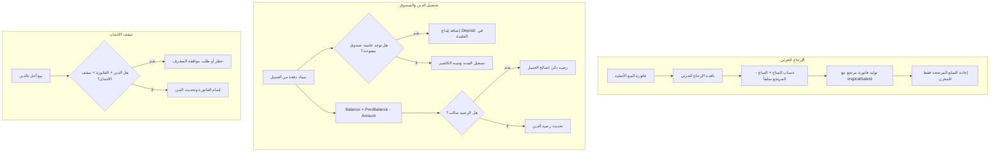

# وثيقة متطلبات المنتج (PRD)
# إدارة المرتجعات الجزئية، تحصيل الديون، والائتمان في نقطة البيع

**المشروع:** AN-POS (نظام نقطة البيع وإدارة المخازن)  
**المجال:** نقطة البيع (POS)، إدارة العملاء (Customers)، الصندوق والمناوبات (Cash Sessions)  
**الحالة:** مُقترح ومُعتمد للتنفيذ (Proposed & Planned)  
**تاريخ الإصدار:** سبتمبر 2026  

---

## 1. الخلفية ونطاق العمل (Background & Scope)

أظهرت المراجعة التشغيلية للنظام وجود 4 ثغرات جوهرية في منطق الحسابات وإدارة المعاملات المالية تؤثر مباشرة على دقة الصندوق والذمم المدينة للعملاء وحماية المخزون:

1. **المرتجع الجزئي (Partial Return)**: عند إرجاع فاتورة سابقة، يفرغ النظام كامل محتويات الفاتورة في السلة دفعة واحدة، مما يجبر الكاشير على الحذف والتعديل اليدوي بدون وجود واجهة مخصصة لاختيار السلع المرتجعة والكميات، ودون تتبع للمرتجع المسبق مما يسمح بإرجاع سلع أكثر من المباعة.
2. **تحصيل الديون وجلسات الصندوق (Debt Collection & Cash Sessions)**: دفعات العملاء النقدية تُسجل في جدول المدفوعات فقط، ولا يتم إيداعها في جلسة الصندوق النشطة (`cash_sessions`)، مما يسبب عجزاً وهمياً واختلافاً كبيراً بين النقد الفعلي بالدرج والنقد المحسوب بالنظام عند إغلاق المناوبة.
3. **معالجة الدفعة الفائضة (Overpayment Handling)**: الكود الحالي يقيد الرصيد الجديد بـ `Math.max(0, actualBalance - amount)`، مما يعني أن أي مبالغ إضافية يدفعها العميل زيادة عن دينه تُهدر بصمت وتضيع ولا تُقيد كرصيد دائن لصالحه.
4. **فرض سقف الائتمان (Credit Limit Enforcement)**: سقف الائتمان (`creditLimit`) مسجل كحقل شكلي فقط في بطاقة العميل، ولا يوجد أي فحص أو قيد يمنع البيع الآجل (الدين) بدون حدود.

---

## 2. المتطلبات الوظيفية التفصيلية (Functional Requirements)

### 2.1. واجهة وتدفق الإرجاع الجزئي المخصص (FR-RET-001)
* **المسار:** فتح الإرجاع من نقطة البيع (POS) أو من تبويب الفواتير في المبيعات.
* **المتطلبات:**
  1. عند اختيار فاتورة للإرجاع، تفتح نافذة مخصصة **"إرجاع جزئي / كلي من الفاتورة #{number}"** بدلاً من تفريغها عشوائياً بالسلة.
  2. تعرض النافذة قائمة بنود الفاتورة الأصلية:
     - اسم المنتج، الباركود، سعر البيع الأصلي في الفاتورة.
     - الكمية المباعة الأصلية.
     - الكميات التي تم إرجاعها مسبقاً من هذه الفاتورة (`alreadyReturnedQty`).
     - الكمية المتبقية المتاحة للإرجاع (`maxReturnableQty = soldQty - alreadyReturnedQty`).
     - حقل إدخال عددي وزرين (+ / -) لتحديد الكمية المرتجعة حالياً (مع تعطيل الإرجاع إذا كانت الكمية المتاحة 0).
  3. خيار "تحديد الكل للإرجاع الكامل" (Select All).
  4. تحديد سبب الإرجاع (بضاعة تالفة، مقاس/صنف خاطئ، رغبة العميل، أخرى).
  5. احتساب فوري لمبلغ الاسترداد المالي الإجمالي.
  6. خيار طريقة استرداد المبلغ:
     - **نقداً (Cash Refund)**: يخرج من الصندوق النقدي ويسجل كمرتجع نقدي.
     - **خصم من دين العميل / قيد كرصيد دائن**: إذا كانت الفاتورة مرتبطة بعميل.
  7. ربط الفاتورة المرتجعة بـ `originalSaleId` و `originalSaleNumber` لضمان عدم إمكانية تكرار الإرجاع أو إرجاع كميات تفوق الفاتورة الأصلية.

---

### 2.2. تسجيل تحصيل ديون العملاء في الصندوق النقدي (FR-CSH-001)
* **المسار:** شاشة العملاء (`CustomersPage`) -> سند قبض / سداد دفعة (`CustomerPaymentModal`).
* **المتطلبات:**
  1. عند تسجيل دفعة نقدية (`method === 'cash'`)، يتحقق النظام تلقائياً من وجود جلسة صندوق مفتوحة ونشطة للمستخدم الحالي.
  2. في حال وجود جلسة مفتوحة:
     - يتم قيد حركة إيداع في حقل `deposits` الخاص بجلسة الصندوق (`db.cash_sessions`):
       ```json
       {
         "amount": paymentAmount,
         "note": "تحصيل دين زبون: [اسم العميل] - سند رقم [ID]",
         "createdAt": "2026-09-18T..."
       }
       ```
     - يتم تحديث إجمالي النقد المتوقع بالدرج تلقائياً.
  3. طباعة إشعار فوري يوضح إيداع المبلغ في الصندوق برقم الجلسة الحالية.
  4. ظهور حركات تحصيل الديون في تقرير ومراجعة إغلاق الصندوق اليومي (Shift Reconciliation).

---

### 2.3. دعم الرصيد الدائن وحفظ الدفعات الفائضة (FR-OVP-001)
* **المسار:** محرك حساب رصيد العميل وسندات القبض وشاشة البيع.
* **المتطلبات:**
  1. إزالة دالة `Math.max(0, ...)` من حساب الرصيد عند استلام الدفعات.
  2. المعادلة المحاسبية المعتمدة: `newBalance = previousBalance - paidAmount`:
     - إذا كان `newBalance > 0`: العميل مدين للمتجر بمبلغ `newBalance` دج.
     - إذا كان `newBalance = 0`: الحساب خالص تماماً.
     - إذا كان `newBalance < 0`: العميل دائن (له رصيد مسبق لدى المتجر بقيمة `Math.abs(newBalance)` دج).
  3. واجهة المستخدم (UI):
     - تمييز لوني واضح في جدول وبطاقات العملاء:
       * الرصيد الموجب (دين على العميل): لون أحمر/برتقالي.
       * الرصيد الصفري (خالص): لون رمادي متناسق.
       * الرصيد السالب (رصيد دائن لصالح العميل): لون أخضر زمردي مع بادج `+X دج (رصيد دائن لصالح الزبون)`.
  4. التكامل مع الكاشير في نقطة البيع:
     - عند اختيار عميل يمتلك رصيداً دائناً، تظهر شارة خضراء تفيد بوجود رصيد مسبق، مع إمكانية استخدام هذا الرصيد لسداد الفاتورة الجديدة كلياً أو جزئياً.
  5. رسائل الواتساب وكشف الحساب:
     - منع إرسال رسائل تذكير بالمطالبة بالدين إذا كان الرصيد صفراً أو سالباً.

---

### 2.4. تطبيق سقف الائتمان ومنع تراكم الديون غير المحدودة (FR-CRD-001)
* **المسار:** نافذة الدفع في الكاشير (`PaymentModal`) وإتمام البيع (`useSaleCompletion`).
* **المتطلبات:**
  1. عند اختيار طريقة الدفع **"آجل / دين (Credit)"** وتحديد العميل:
     - يتم حساب الرصيد المتوقع: `projectedBalance = currentBalance + unpaidAmount`.
     - إذا كان العميل لديه سقف ائتمان محدد (`creditLimit > 0`):
       * عرض عداد ومؤشر استهلاك سقف الائتمان (الدين الحالي، السقف، الرصيد المتبقي المتاح).
       * إذا تجاوز الرصيد المتوقع سقف الائتمان (`projectedBalance > creditLimit`):
         - يظهر تنبيه تحذيري بارز باللون الأحمر يوضح قيمة التجاوز (`تجاوز السقف بـ X دج`).
  2. سياسة المنع والصلاحيات (Policy & Enforcement):
     - الوضع الافتراضي: منع إتمام البيع مع تعطيل زر التأكيد ما لم يكن لدى الكاشير صلاحية التجاوز أو إدخال رمز المدير (Manager Override PIN).
     - توفير خيار للمدير في الإعدادات: "السماح بتجاوز سقف الائتمان بعد التحذير" أو "حظر صارم عند بلوغ السقف".

---

## 3. التأثير المعماري وتعديلات النماذج (Architectural & Schema Impact)



---

## 4. خطة الاختبار وضمان الجودة (QA & Verification)

1. **المرتجع الجزئي**:
   - بيع 5 قطع من منتج، إرجاع قطعتين -> التأكد من زيادة المخزن بقطعتين فقط، وتقييد المتاح للإرجاع مستقبلاً بـ 3 قطع.
   - محاولة إرجاع كمية أكبر من المتبقي -> حظر العملية.
2. **تحصيل الدين والصندوق**:
   - فتح جلسة صندوق برصيد 5,000 دج.
   - تحصيل دفعة دين نقدية بقيمة 3,000 دج من عميل.
   - فحص جلسة الصندوق -> التأكد من ظهور 3,000 دج في قائمة الـ deposits وتطابق رصيد الإغلاق المتوقع.
3. **الدفعة الفائضة**:
   - عميل عليه دين 2,000 دج، دفع 3,000 دج -> الرصيد يصبح `-1000 دج` مع ظهور شارة رصيد دائن باللون الأخضر.
   - إجراء فاتورة جديدة بقيمة 1,000 دج لنفس العميل واستهلاك الرصيد الدائن -> الرصيد يصبح 0 دج.
4. **سقف الائتمان**:
   - عميل سقفه 10,000 دج وعليه دين 8,000 دج.
   - محاولة بيع آجل بقيمة 3,000 دج -> التحذير من تجاوز السقف بـ 1,000 دج وتطبيق سياسة المنع.
