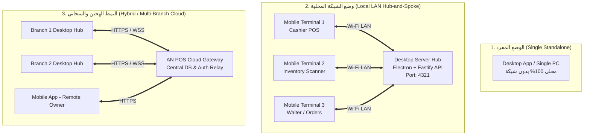
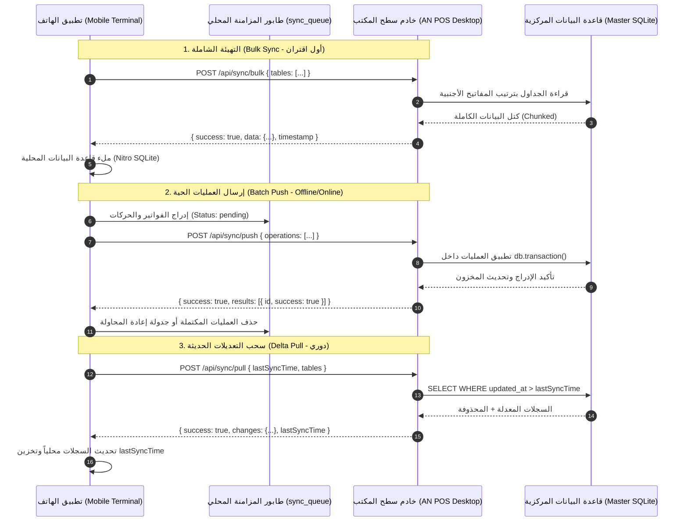
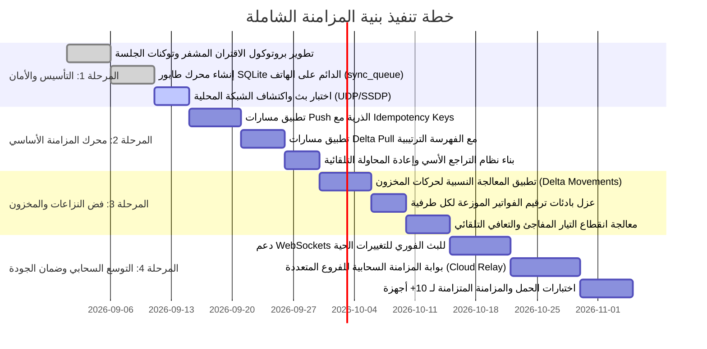

# 🔄 ميثاق وخطة معايير المزامنة الشاملة (AN POS Sync Architecture & Criteria Plan)

> **وثيقة معمارية ومعيارية رسمية تحدد القواعد، البروتوكولات، معايير حل النزاعات، وضمانات سلامة البيانات للمزامنة بين تطبيق سطح المكتب (AN POS Desktop) والأجهزة المحمولة والسحابية.**

---

## 📌 1. الملخص التنفيذي والأهداف الاستراتيجية (Executive Summary & Objectives)

يهدف نظام **AN POS** إلى تقديم بيئة تجارية فائقة السرعة والموثوقية، تجمع بين قوة المعالجة والتخزين المركزي على أجهزة الحاسوب المكتبية (Desktop Hub)، ومرونة المحطات الطرفية المحمولة (Mobile Terminals) للجرد والمبيعات، مع قابلية التوسع السحابي (Cloud Sync) للمتاجر متعددة الفروع.

### 🎯 الأهداف الأساسية لمعايير المزامنة:
1. **استمرارية العمل دون اتصال (100% Offline-First Resilience)**: تمكين نقاط البيع والهواتف من مواصلة البيع وإصدار الفواتير والجرد حتى في حال انقطاع شبكة Wi-Fi أو الإنترنت بشكل كامل، مع حفظ كافة العمليات في طابور محلي مشفر ودائم.
2. **صفر فقدان للبيانات والمالية (Zero Data & Financial Loss)**: ضمان ذرية العمليات (ACID Transactions) وعدم ضياع أي سنتيم من الصندوق أو أي حركة مخزنية أثناء المزامنة.
3. **منع التكرار المطلق (Strict Idempotency)**: منع تكرار خصم المخزون أو تسجيل الفاتورة أكثر من مرة عند إعادة إرسال الحزم الشبكية المعلقة.
4. **أدنى زمن تأخير (Sub-second Sync Latency)**: إتمام مزامنة التغييرات الحية عبر الشبكة المحلية في أقل من 500 ميلي ثانية فور استعادة الاتصال.
5. **معيار الحقيقة الموحد (Single Source of Truth - Desktop Centrality)**: يعتبر خادم سطح المكتب (أو السحابة في الفروع المتعددة) المرجع الموثوق والنهائي للترقيم التسلسلي، التوقيت، وتدقيق العمليات.

---

## 🏗️ 2. الأنماط التشغيلية وتوبولوجيا الشبكة (Operational Topologies & Modes)

يدعم النظام 4 أنماط تشغيلية محددة في إعدادات النظام `settings(sync_mode)`:



### 📋 مصفوفة الأنماط التشغيلية:

| النمط (`sync_mode`) | دور سطح المكتب (Desktop) | دور الهاتف (Mobile) | بيئة الاتصال | آلية التخزين |
|---|---|---|---|---|
| **`single`** | نظام POS مستقل كامل | غير متصل (أو وضع Standalone مستقل) | بدون شبكة | SQLite محلي على كل جهاز |
| **`lan`** | **الخادم المركزي الرئيسي (Main Hub)** | محطة طرفية فرعية (Terminal Node) | شبكة Wi-Fi محلية (LAN) | Desktop: Master DB / Mobile: Cache & Sync Queue |
| **`cloud`** | محطة فرعية مربوطة بالسحابة | محطة فرعية مربوطة بالسحابة | إنترنت خارجي (WAN) | Cloud: Master DB / Desktop & Mobile: Local Cache |
| **`hybrid`** | خادم محلي رئيسي + مزامنة سحابية دورية | يتصل محلياً بالـ Desktop وسحابياً خارج المحل | LAN + WAN تلقائي | Multi-Tier Sync (محلي سريع + ترحيل سحابي) |

---

## 🔐 3. معايير الاكتشاف والاقتران والتفويض (Discovery, Pairing & Auth Standards)

### 3.1. معيار الاكتشاف التلقائي عبر الشبكة (LAN Auto-Discovery Protocol)
- **البروتوكول**: بث حزم **UDP Broadcast** على المنفذ `4321` أو استجابة SSDP.
- **تردد البث**: سطح المكتب يبث نبضة اكتشاف كل **5 ثوانٍ** عند تفعيل خادم الشبكة.
- **هيكل حزمة الاكتشاف (Discovery Payload)**:
```json
{
  "service": "AN_POS_DESKTOP_SERVER",
  "version": "1.0.0",
  "shopName": "متجر البركة التجاري",
  "ip": "192.168.1.105",
  "port": 4321,
  "protocol": "http",
  "serverTime": "2026-08-30T10:15:30.000Z",
  "pairingOpen": true
}
```

### 3.2. معيار الاقتران السريع برمز الاستجابة السريعة (QR Code Pairing Standard)
- يعرض تطبيق سطح المكتب رمز QR في شاشة "الأجهزة المتصلة" يحتوي على URI مشفر وموقّع:
  `anpos://pair?host=192.168.1.105&port=4321&key=SEC_KEY_HASH_9981&shop=ElBaraka`
- **مفتاح الاتصال (`connectionKey`)**: رمز عشوائي مشفر بـ Cryptographic Random Bytes يتغير تلقائياً أو يعاد توليده بطلب المدير لمنع الاتصالات غير المصرح بها.

### 3.3. معيار المصادقة وتوليد التوكنات الآمنة (Handshake & Session Security)
1. **طلب الاقتران (Handshake Request)**:
   - يرسل الهاتف طلب `POST /api/pair` متضمناً:
     - `deviceName`: اسم الهاتف (مثل "Samsung Tab A9 - الكاشير 2").
     - `deviceType`: نوع الجهاز (`cashier`, `scanner`, `terminal`, `display`).
     - `connectionKey`: المفتاح الممسوح من الـ QR Code.
     - `macAddress` / `uniqueDeviceId`: المعرف الثابت للجهاز.
2. **التحقق الآمن (Constant-Time Verification)**:
   - استخدام دالة `timingSafeEqual` لمقارنة المفاتيح لمنع هجمات التوقيت (Timing Attacks).
3. **إصدار التوكن وحفظ الجلسة**:
   - توليد `session_token` مشفر بـ UUIDv4 عالي العشوائية وحفظه في جدول `device_sessions` و `connected_devices`.
   - تخزين التوكن في الهاتف داخل التخزين المشفر **`AnposSecureStore`** (EncryptedSharedPreferences / iOS Keychain).
4. **ترويسات المصادقة الإلزامية لكل طلب**:
   - `x-session-token`: توكن الجلسة الصالح.
   - `x-device-id`: معرف الجهاز المسجل.
   - `x-client-version`: إصدار تطبيق الهاتف لضمان توافق المخطط البرمجي.

---

## 📦 4. معايير تبادل وتدفق البيانات (Data Sync Protocols & Lifecycles)

تعتمد البنية المعمارية على نموذج ثلاثي المستويات لتبادل البيانات:



---

## 🗂️ 5. الترتيب الطوبولوجي للجداول (Topological Table Dependency Order)

لمنع حدوث أخطاء كسر قيود المفاتيح الأجنبية (`FOREIGN KEY constraint failed`) عند سحب أو تفريغ البيانات، **يجب التزام الترتيب الطوبولوجي الدقيق التالي**:

```
المستوى 1: الجداول المرجعية المستقلة (Level 1 - Core Roots)
  ├── settings (الإعدادات العامة)
  ├── warehouses (المستودعات)
  ├── categories (تصنيفات المنتجات)
  ├── roles (الأدوار والصلاحيات)
  └── print_templates (قوالب الطباعة)

المستوى 2: الكيانات الأساسية (Level 2 - Primary Entities)
  ├── users (المستخدمون - مرتبطة بـ roles)
  ├── customers (العملاء)
  ├── suppliers (الموردون)
  ├── printers (الطابعات)
  └── products (المنتجات - مرتبطة بـ categories, warehouses)

المستوى 3: ملحقات الكيانات والعروض (Level 3 - Entity Extensions)
  ├── product_barcodes (باركودات المنتجات المتعددة)
  ├── promotions (العروض الترويجية)
  ├── packs (الحزم والباقات)
  ├── printer_template_mappings (توزيع القوالب على الطابعات)
  └── cash_sessions (جلسات الصندوق - مرتبطة بـ users)

المستوى 4: العمليات والمعاملات الرئيسية (Level 4 - Transactions)
  ├── sales (فواتير المبيعات - مرتبطة بـ customers, cash_sessions, users)
  ├── purchases (فواتير المشتريات - مرتبطة بـ suppliers, warehouses)
  ├── stock_movements_v2 (حركات المخزون - مرتبطة بـ warehouses)
  ├── inventory_counts (عمليات الجرد)
  └── expenses (المصاريف التشغيلية - مرتبطة بـ cash_sessions)

المستوى 5: بنود العمليات وسندات القيود (Level 5 - Transaction Lines & Ledgers)
  ├── sale_items (بنود الفواتير - مرتبطة بـ sales, products)
  ├── purchase_items (بنود الشراء - مرتبطة بـ purchases, products)
  ├── stock_movement_lines (أسطر حركات المخزون)
  ├── inventory_count_lines (أسطر الجرد)
  ├── payments (سندات القبض والدفع - مرتبطة بـ customers, sales)
  ├── supplier_entries (قيود حسابات الموردين - مرتبطة بـ suppliers, purchases)
  ├── barcode_prints (سجلات طباعة الباركود)
  └── print_history (سجل عمليات الطباعة)
```

---

## ⚖️ 6. معايير فض النزاعات وتكامل المعاملات (Conflict Resolution & Consistency Criteria)

عند وجود تعديلات متزامنة على نفس البيانات من أجهزة متعددة، يتم تطبيق المعايير الصارمة التالية:

### 6.1. معيار منع التكرار المفتاحي (Idempotency Key Standard)
- لكل عملية منشأة على الهاتف (فاتورة، حركة مخزن، سند دفع) يتم توليد **UUIDv4 فريد محلياً** كمعرف أساسي `id`.
- عند وصول العملية إلى الخادم عبر `POST /api/sync/push`:
  1. يفحص الخادم وجود المعرف `id` مسبقاً في جدول الوجهة (`sales`, `payments`...).
  2. إذا كان السجل موجوداً بالفعل، يعتبر الخادم العملية ناجحة فوراً ويعيد `success: true` دون إعادة تنفيذ منطق الخصم المالي أو المخزني مرة ثانية.

### 6.2. معيار أسبقية التحديث الأحدث بالسيرفر (Server-Authoritative Timestamp LWW)
- **لبيانات الكتالوج والأسماء والإعدادات** (`products`, `categories`, `customers`, `settings`):
  - يعتمد النظام سياسة **Last-Write-Wins (LWW)** مع إعطاء الأولوية لتوقيت خادم سطح المكتب الموثق `updated_at`.
  - في حال تعارض تحديث حقلين مختلفين، يتم دمج الحقول على مستوى الكائن (Field-level Merging).

### 6.3. معيار الحركات التراكمية للمخزون والمالية (Delta Accumulators vs Snapshots)
- **المخزون (Stock Quantity)**:
  - ❌ **ممنوع قطيعاً**: قيام الهاتف بإرسال قيمة المخزون الجديدة كقيمة مطلقة جاهزة (مثل: `UPDATE products SET quantity = 10`).
  - ✅ **المعيار الإلزامي**: يرسل الهاتف حركة مخزنية بـ Delta نسبي (مثل: بيع 2 قطعة). يقوم خادم سطح المكتب بتنفيذ عملية الخصم الذرية:
    `UPDATE products SET quantity = quantity - 2 WHERE id = ?`
    مما يضمن دقة رصيد المخزون التراكمي حتى لو تزامن بيع نفس السلعة من 3 هواتف في نفس اللحظة.
- **الأرصدة المالية والديون (Customer Balances & Cash Shifts)**:
  - تُحسب الأرصدة عبر سجلات القيود وسندات الدفع الفردية (`payments`, `supplier_entries`) بدلاً من الكتابة المباشرة فوق رصيد الحساب.

### 6.4. استراتيجية ترقيم الفواتير الموزعة (Distributed Invoice Numbering Partitioning)
- لمنع تضارب أرقام الفواتير الرسمية عند البيع أوفلاين على عدة أجهزة:
  - **صيغة ترقيم سطح المكتب الرئيسي**: `INV-YYYYMM-000001`
  - **صيغة ترقيم الهاتف الطرفي 1**: `INV-M01-YYYYMM-000001`
  - **صيغة ترقيم الهاتف الطرفي 2**: `INV-M02-YYYYMM-000001`
- عند مزامنة الفاتورة إلى سطح المكتب، تحتفظ الفاتورة برقمها الأصلي المرجعي `invoice_number` مع وسمها بـ `device_id` و `synced_at`.

### 6.5. معيار الحذف اللطيف (Soft Deletes Sync Standard)
- الجداول القابلة للمزامنة تستخدم الحذف اللطيف (`deleted = 1` و `deleted_at = ISO_TIMESTAMP`).
- عند طلب الـ Delta Pull، يرسل الخادم السجلات التي تحتوي على `deleted = 1` كعملية من نوع `operation: 'delete'` ليقوم الهاتف بحذفها أو أرشفتها محلياً.

---

## 🛡️ 7. معايير الموثوقية والتخزين غير المتصل (Offline-First & Resilience Standards)

### 7.1. مواصفات جدول طابور المزامنة في الهاتف (`sync_queue`)
يُخزن الطابور في محرك SQLite المحلي لضمان عدم ضياع العمليات حتى لو نفدت بطارية الهاتف أو أعيد تشغيل الجهاز:

```sql
CREATE TABLE IF NOT EXISTS sync_queue (
  id            TEXT PRIMARY KEY,            -- UUID للعملية
  type          TEXT NOT NULL,               -- 'create' | 'update' | 'delete'
  table_name    TEXT NOT NULL,               -- اسم الجدول الهدف
  record_id     TEXT NOT NULL,               -- المعرف المحلي للسجل
  payload       TEXT NOT NULL,               -- حمولة البيانات بتنسيق JSON
  created_at    TEXT NOT NULL,               -- توقيت إنشاء العملية
  synced_at     TEXT,                        -- توقيت الإرسال الناجح
  retries       INTEGER NOT NULL DEFAULT 0,  -- عداد محاولات الإرسال
  max_retries   INTEGER NOT NULL DEFAULT 5,  -- الحد الأقصى للمحاولات
  status        TEXT NOT NULL DEFAULT 'pending', -- 'pending' | 'processing' | 'failed' | 'completed'
  error_message TEXT                         -- تفاصيل آخر خطأ إن وُجد
);

CREATE INDEX IF NOT EXISTS idx_sync_queue_status ON sync_queue(status, created_at);
```

### 7.2. استراتيجية التراجع الأسي مع العشوائية (Exponential Backoff with Jitter)
عند تعثر الاتصال بالخادم، لا يقوم التطبيق بإغراق الشبكة بالطلبات، بل يتبع خوارزمية تراجع أسي محسوبة:

$$\text{Delay} = \min(\text{BaseDelay} \times 2^{\text{retries}} + \text{Jitter}, \text{MaxDelay})$$

- **القيمة المبدئية (`BaseDelay`)**: $3000\text{ ms}$ (3 ثوانٍ).
- **الحد الأقصى (`MaxDelay`)**: $60000\text{ ms}$ (دقيقة واحدة).
- **عامل العشوائية (`Jitter`)**: قيمة عشوائية بين $0$ و $1500\text{ ms}$ لمنع تزامن طلبات جميع الهواتف في نفس اللحظة (Thundering Herd Problem).

### 7.3. فترات وتوقيتات نبضات المزامنة (Timing Matrix)

| الوظيفة / الحدث | التردد الزمني (Interval) | الشرط والآلية |
|---|---|---|
| **فحص نبض الاتصال (Health Ping)** | كل **15 ثانية** | طلب خفيف `GET /api/health` لقياس زمن الاستجابة والاتصال |
| **المزامنة التزايدية الدورية (Periodic Pull)** | كل **25 ثانية** | سحب التعديلات الحديثة من الخادم في الخلفية أثناء العمل |
| **الدفع الفوري (Instant Push)** | فور وقوع الحدث ($0\text{ ms}$) | عند تأكيد بيع أو إدخال سند، يدفع المحرك العملية فوراً إن وُجد اتصال |
| **استعادة الواجهة (App Foreground Resume)** | فوري عند فتح التطبيق | فحص فوري للحالة وتشغيل `processQueue()` ثم `pullUpdates()` |
| **حجم الحزمة الأقصى (Max Chunk Size)** | **500 سجل** للـ Pull / **2500 سجل** للـ Bulk | تقسيم البيانات لمنع استهلاك ذاكرة الهاتف وضعف الاستجابة |

---

## 👥 8. مصفوفة الصلاحيات والتحكم في وصول الأجهزة (Device Roles & Access Scopes)

| نوع الجهاز / الدور | صلاحيات المزامنة (Push Permissions) | صلاحيات الاستقبال (Pull Permissions) | القيود الأمنية |
|---|---|---|---|
| **Admin Terminal (جهاز المدير)** | قراءة وكتابة كاملة لكافة الـ 38 جدولاً | استقبال كافة البيانات والمؤشرات والأرباح | لا توجد قيود |
| **Cashier Terminal (كاشير نقطة بيع)** | `sales`, `sale_items`, `payments`, `cash_sessions`, `suspended_orders` | `products`, `categories`, `customers`, `promotions`, `packs`, `print_templates` | حظر قراءة أسعار الشراء، حظر تعديل المنتجات، حظر حذف الفواتير بعد إغلاق الجلسة |
| **Inventory Terminal (ماسح الجرد والمخزن)** | `inventory_counts`, `inventory_count_lines`, `stock_movements_v2` | `products`, `categories`, `warehouses`, `suppliers`, `product_barcodes` | حظر قراءة المبيعات المالية وأرباح المحل وحسابات الزبائن |
| **Waiter / Order Terminal (شاشة النادل/الطلبات)** | `sales (draft)`, `suspended_orders` | `products`, `categories`, `promotions` | إنشاء مسودات طلبات فقط دون صلاحية إغلاق الصندوق أو قبض الكريدي |

---

## 📊 9. الفهرس الشامل للجداول القابلة للمزامنة (38 Tables Classification)

| # | اسم الجدول | اتجاه المزامنة (Direction) | استراتيجية فض النزاع | الأولوية (Priority) |
|---|---|---|---|---|
| 1 | `settings` | Desktop $\rightarrow$ Mobile (Pull Only) | Desktop Authoritative | حرجة (Critical) |
| 2 | `categories` | Desktop $\leftrightarrow$ Mobile (Bidirectional) | LWW (Last-Write-Wins) | عالية (High) |
| 3 | `warehouses` | Desktop $\rightarrow$ Mobile (Pull Only) | Desktop Authoritative | عالية (High) |
| 4 | `products` | Desktop $\leftrightarrow$ Mobile (Bidirectional) | LWW مع Delta للمخزون | حرجة (Critical) |
| 5 | `product_barcodes` | Desktop $\leftrightarrow$ Mobile (Bidirectional) | Unique Barcode Constraint | عالية (High) |
| 6 | `customers` | Desktop $\leftrightarrow$ Mobile (Bidirectional) | LWW للبيانات + Cumulative للرصيد | عالية (High) |
| 7 | `suppliers` | Desktop $\leftrightarrow$ Mobile (Bidirectional) | LWW للبيانات + Cumulative للرصيد | متوسطة (Medium) |
| 8 | `promotions` | Desktop $\rightarrow$ Mobile (Pull Only) | Desktop Authoritative | متوسطة (Medium) |
| 9 | `packs` | Desktop $\rightarrow$ Mobile (Pull Only) | Desktop Authoritative | متوسطة (Medium) |
| 10 | `print_templates` | Desktop $\rightarrow$ Mobile (Pull Only) | Desktop Authoritative | منخفضة (Low) |
| 11 | `printers` | Desktop $\rightarrow$ Mobile (Pull Only) | Local Overwrite | منخفضة (Low) |
| 12 | `printer_template_mappings` | Desktop $\rightarrow$ Mobile (Pull Only) | Desktop Authoritative | منخفضة (Low) |
| 13 | `cash_sessions` | Desktop $\leftrightarrow$ Mobile (Bidirectional) | Session-Scoped Concurrency | حرجة (Critical) |
| 14 | `sales` | Mobile $\rightarrow$ Desktop (Push First) | Unique UUID + Partitioned Number | حرجة (Critical) |
| 15 | `sale_items` | Mobile $\rightarrow$ Desktop (Push First) | Cascade with Sale UUID | حرجة (Critical) |
| 16 | `suspended_orders` | Desktop $\leftrightarrow$ Mobile (Bidirectional) | LWW / Lock per Terminal | متوسطة (Medium) |
| 17 | `payments` | Mobile $\rightarrow$ Desktop (Push First) | Append-Only Ledger Entry | حرجة (Critical) |
| 18 | `purchases` | Desktop $\leftrightarrow$ Mobile (Bidirectional) | Draft $\rightarrow$ Confirmed State Machine | عالية (High) |
| 19 | `purchase_items` | Desktop $\leftrightarrow$ Mobile (Bidirectional) | Cascade with Purchase UUID | عالية (High) |
| 20 | `supplier_entries` | Desktop $\leftrightarrow$ Mobile (Bidirectional) | Append-Only Ledger Entry | عالية (High) |
| 21 | `expenses` | Mobile $\rightarrow$ Desktop (Push First) | Append-Only Expense Record | متوسطة (Medium) |
| 22 | `capital_entries` | Desktop $\rightarrow$ Mobile (Pull Only) | Desktop Authoritative | منخفضة (Low) |
| 23 | `stock_movements` | Desktop $\leftrightarrow$ Mobile (Bidirectional) | Append-Only Movement Stream | عالية (High) |
| 24 | `stock_movements_v2` | Desktop $\leftrightarrow$ Mobile (Bidirectional) | Append-Only Movement Stream | حرجة (Critical) |
| 25 | `stock_movement_lines` | Desktop $\leftrightarrow$ Mobile (Bidirectional) | Cascade with Movement UUID | حرجة (Critical) |
| 26 | `inventory_counts` | Desktop $\leftrightarrow$ Mobile (Bidirectional) | Audit Batch State Machine | عالية (High) |
| 27 | `inventory_count_lines` | Desktop $\leftrightarrow$ Mobile (Bidirectional) | Barcode Scanned Aggregation | عالية (High) |
| 28 | `barcode_prints` | Desktop $\leftrightarrow$ Mobile (Bidirectional) | Log Only | منخفضة (Low) |
| 29 | `print_history` | Desktop $\leftrightarrow$ Mobile (Bidirectional) | Append-Only Audit | منخفضة (Low) |
| 30 | `print_jobs` | Mobile $\rightarrow$ Desktop (Push Relay) | Queue FIFO | متوسطة (Medium) |
| 31 | `print_failure_counter` | Desktop Local Only | No Sync | محلية |
| 32 | `users` | Desktop $\rightarrow$ Mobile (Pull Only) | Desktop Authoritative (Hash Only) | حرجة (Critical) |
| 33 | `roles` | Desktop $\rightarrow$ Mobile (Pull Only) | Desktop Authoritative | عالية (High) |
| 34 | `user_activities` | Mobile $\rightarrow$ Desktop (Push Log) | Append-Only Audit Stream | متوسطة (Medium) |
| 35 | `audit_logs` | Mobile $\rightarrow$ Desktop (Push Log) | Append-Only Audit Stream | متوسطة (Medium) |
| 36 | `refresh_tokens` | Device Local Only | No Sync | أمنية محلية |
| 37 | `network_settings` | Desktop Local Only | No Sync | محلية |
| 38 | `connected_devices` | Desktop Master Ledger | Session State Tracking | عالية (High) |

---

## 🗺️ 10. خطة التنفيذ ومراحل التطوير (Implementation Roadmap & Milestones)



---

## 🧪 11. مصفوفة الاختبارات المعيارية وسيناريوهات الفشل (Testing & Edge-Case Matrix)

| السيناريو (Edge Case) | الخطر المتوقع | السلوك والمعيار الإلزامي للنظام |
|---|---|---|
| **انقطاع Wi-Fi أثناء دفع سلة مبيعات** | عدم وصول الفاتورة للحاسوب وخصم مكرر محلياً | تُحفظ الفاتورة في `sync_queue` بحالة `pending` وتُصدر محلياً برقمها الموزع، وتُدفع فور عودة الشبكة. |
| **بيع آخر قطعة من منتج في نفس اللحظة من هاتفين** | نفاد المخزون وحدوث عجز سالب | خادم سطح المكتب يعالج العمليتين تسلسلياً داخل `db.transaction()`؛ إذا كان `allow_negative_stock = 0` يرفض الخادم العملية الثانية ويعيد تنبيهاً بالتعارض. |
| **إغلاق تطبيق الهاتف بالقوة أثناء المزامنة** | ترك سجلات معلقة بحالة `processing` | عند إعادة تشغيل التطبيق، تُعاد السجلات المعلقة تلقائياً إلى حالة `pending` لإعادة فحصها وإرسالها. |
| **اختلاف توقيت الساعة بين الهاتف والحاسوب (Clock Skew)** | عدم سحب السجلات الحديثة بسبب فارق الوقت | يعتمد الـ Pull دائماً على توقيت الخادم المرجع `serverTime` العائد في آخر استجابة بدلاً من ساعة الهاتف المحلية. |
| **إعادة تشغيل راوتر Wi-Fi وتغير عنوان IP الخادم** | فقدان الهاتف للاتصال بالكمبيوتر | تبدأ وحدة `AnposNetwork` و `discovery.ts` فوراً بالبحث التلقائي عن العنوان الجديد وإعادة الاتصال بالخلفية بدون تدخل الكاشير. |

---

## 📝 12. ملخص التحقق والاعتماد المعماري (Architectural Sign-off)

- **حالة الميثاق**: معتمد للتنفيذ والتطوير الميداني (Approved for Implementation).
- **التوافق**: متطابق 100% مع مخطط قواعد بيانات سطح المكتب [`DATABASE_SCHEMA_DESKTOP.md`](file:///home/ammar/AN-POS-TEST/DATABASE_SCHEMA_DESKTOP.md)، وثيقة المتطلبات [`POS-PRD (1).md`](file:///home/ammar/AN-POS-TEST/POS-PRD%20%281%29.md)، والتحليل المعماري لتطبيق الهاتف [`mobile-rn/SYSTEM_ANALYSIS_STANDALONE_VS_CONNECTED.md`](file:///home/ammar/AN-POS-TEST/mobile-rn/SYSTEM_ANALYSIS_STANDALONE_VS_CONNECTED.md).
