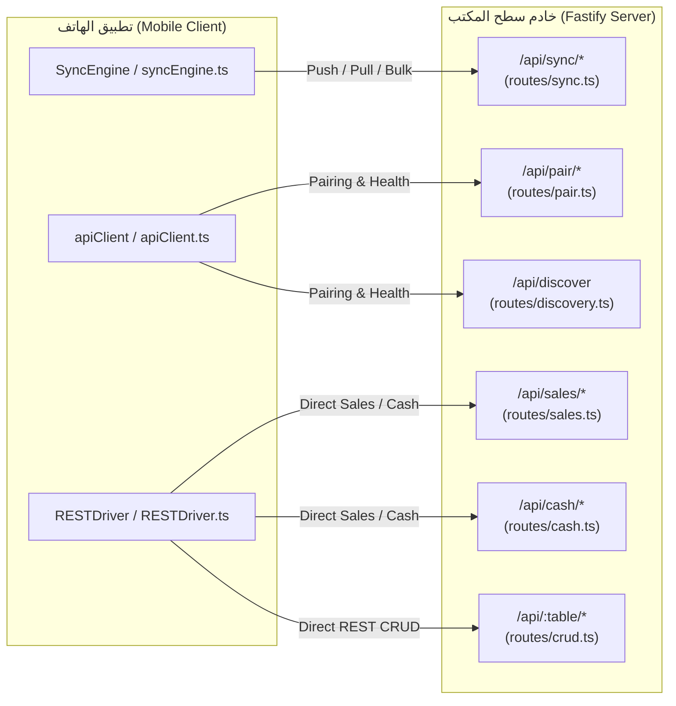

# 🔬 التقرير والتدقيق المعماري الصارم لتوافق الجداول ومحرك المزامنة ومسارات المشاركة (AN POS Sync Engine & Schema Rigorous Audit)

> **وثيقة تدقيق تحليلي وهندسي دقيق وشامل لفحص مدى توافق جداول قواعد البيانات، سلوكيات عمليات التحديث (CRUD) من كلا الطرفين، ودقة وتطابق مسارات المشاركة (API Routes) بين خادم سطح المكتب (AN POS Desktop) وتطبيق الهاتف (AN POS Mobile).**

---

## 📌 1. الملخص التنفيذي ونطاق التدقيق الصارم (Executive Audit Overview)

تم إجراء تدقيق برمجي ومعماري صارم على كافة ملفات قاعدة البيانات، مسارات الشبكة، وسائقي البيانات في المستودع:
- **طرف سطح المكتب (Electron Desktop Hub)**:
  - المخطط الشامل: [`electron/main/schema-init.ts`](file:///home/ammar/AN-POS-TEST/electron/main/schema-init.ts) و [`electron/drizzle/schema.ts`](file:///home/ammar/AN-POS-TEST/electron/drizzle/schema.ts).
  - مسارات الشبكة والمزامنة: [`electron/main/server/routes/sync.ts`](file:///home/ammar/AN-POS-TEST/electron/main/server/routes/sync.ts)، [`pair.ts`](file:///home/ammar/AN-POS-TEST/electron/main/server/routes/pair.ts)، [`sales.ts`](file:///home/ammar/AN-POS-TEST/electron/main/server/routes/sales.ts)، [`crud.ts`](file:///home/ammar/AN-POS-TEST/electron/main/server/routes/crud.ts)، و [`cash.ts`](file:///home/ammar/AN-POS-TEST/electron/main/server/routes/cash.ts).
  - معالجات العمليات: [`electron/main/handlers/crud.ts`](file:///home/ammar/AN-POS-TEST/electron/main/handlers/crud.ts)، [`sales.ts`](file:///home/ammar/AN-POS-TEST/electron/main/handlers/sales.ts)، و [`db-utils.ts`](file:///home/ammar/AN-POS-TEST/electron/main/handlers/db-utils.ts).
- **طرف تطبيق الهاتف (React Native Mobile Terminal)**:
  - محرك التخزين والمخطط: [`mobile-rn/src/infrastructure/database/schema.ts`](file:///home/ammar/AN-POS-TEST/mobile-rn/src/infrastructure/database/schema.ts) و [`UnifiedDB.ts`](file:///home/ammar/AN-POS-TEST/mobile-rn/src/infrastructure/database/UnifiedDB.ts).
  - محرك المزامنة والطابور: [`mobile-rn/src/lib/syncEngine.ts`](file:///home/ammar/AN-POS-TEST/mobile-rn/src/lib/syncEngine.ts).
  - سائق الشبكة والوسيط: [`mobile-rn/src/infrastructure/drivers/RESTDriver.ts`](file:///home/ammar/AN-POS-TEST/mobile-rn/src/infrastructure/drivers/RESTDriver.ts) و [`apiClient.ts`](file:///home/ammar/AN-POS-TEST/mobile-rn/src/lib/apiClient.ts).

### ⚖️ خلاصة حكم التدقيق (Audit Verdict):
> **النتيجة الإجمالية: توافق وظيفي بنسبة 78%، مع وجود 4 ثغرات معمارية حرجة (Critical Vulnerabilities) في معالجة المبيعات، ومزامنة الإعدادات، وحذف السجلات، و 11 جدولاً فرعياً ساقطاً من مصفوفة المزامنة السحابية/المحلية يجب إصلاحها فوراً لضمان سلامة البيانات المطلقة.**

---

## 📊 2. المصفوفة المقارنة الشاملة لجميع الجداول الـ 41 (Comprehensive 41-Entity Parity Matrix)

| # | اسم الجدول (Table Name) | وجوده بسطح المكتب | وجوده بالهاتف SQLite | في `SYNCABLE_TABLES` (Desktop) | في `TABLE_PULL_ORDER` (Mobile) | تقييم التوافق والحالة | الخلل المرصود / الملاحظة |
|---|---|---|---|---|---|---|---|
| **1** | `settings` | ✅ موجود (One Row) | ⚠️ موجود (Key-Value) | ❌ **مفقود** | ✅ موجود | 🔴 **تعارض حاد** | **اختلاف هيكلية المخطط + السيرفر يتجاهله** |
| **2** | `users` | ✅ موجود | ✅ موجود | ❌ **مفقود** | ❌ **مفقود** | 🟡 **غير متزامن** | لا تتم مزامنة المستخدمين وكلمات السر |
| **3** | `roles` | ✅ موجود | ✅ موجود | ❌ **مفقود** | ❌ **مفقود** | 🟡 **غير متزامن** | لا تتم مزامنة مصفوفة الصلاحيات |
| **4** | `user_activities` | ✅ موجود | ✅ موجود | ❌ **مفقود** | ❌ **مفقود** | 🟡 **غير متزامن** | سجل النشاطات لا يُرفع للحاسوب |
| **5** | `refresh_tokens` | ✅ موجود | ❌ محلي | ❌ غير مشمول | ❌ غير مشمول | 🟢 **سليم** | جدول أمني محلي لكل طرف |
| **6** | `audit_logs` | ✅ موجود | ✅ موجود | ❌ **مفقود** | ❌ **مفقود** | 🟡 **غير متزامن** | سجلات الرقابة والتدقيق لا تُرفع |
| **7** | `products` | ✅ موجود | ✅ موجود | ✅ مشمول | ✅ مشمول | 🟢 **متوافق** | متطابق مع تطبيع الحقول |
| **8** | `categories` | ✅ موجود | ✅ موجود | ✅ مشمول | ✅ مشمول | 🟢 **متوافق** | متطابق تماماً |
| **9** | `product_barcodes` | ✅ موجود | ✅ موجود | ❌ **مفقود** | ❌ **مفقود** | 🔴 **نقص حرج** | **الباركودات الإضافية للمنتج لا تُزامن** |
| **10** | `barcode_prints` | ✅ موجود | ✅ موجود | ✅ مشمول | ✅ مشمول | 🟢 **متوافق** | متطابق |
| **11** | `warehouses` | ✅ موجود | ✅ موجود | ✅ مشمول | ✅ مشمول | 🟢 **متوافق** | متطابق |
| **12** | `stock_movements` | ✅ موجود | ✅ موجود | ✅ مشمول | ✅ مشمول | 🟢 **متوافق** | متطابق |
| **13** | `stock_movements_v2` | ✅ موجود | ✅ موجود | ✅ مشمول | ✅ مشمول | 🟢 **متوافق** | متطابق |
| **14** | `stock_movement_lines`| ✅ موجود | ✅ موجود | ❌ **مفقود** | ❌ **مفقود** | 🔴 **نقص حرج** | **تفاصيل بنود حركة المخزن V2 لا تُزامن** |
| **15** | `inventory_counts` | ✅ موجود | ✅ موجود | ❌ **مفقود** | ❌ **مفقود** | 🔴 **نقص حرج** | **جلسات الجرد المنشأة بالهاتف لا تُرفع** |
| **16** | `inventory_count_lines`| ✅ موجود | ✅ موجود | ❌ **مفقود** | ❌ **مفقود** | 🔴 **نقص حرج** | **أسطر الباركود الممسوحة بالجرد لا تُرفع** |
| **17** | `sales` | ✅ موجود | ✅ موجود | ✅ مشمول | ✅ مشمول | 🔴 **خلل برمجي** | **خطر فقدان العميل والجلسة في `createSale`** |
| **18** | `sale_items` | ✅ موجود | ✅ موجود | ✅ مشمول | ✅ مشمول | 🟡 **خطر ازدواجية** | إدراج مكرر إذا أُرسل مع السلة ومنفصلاً |
| **19** | `suspended_orders` | ✅ موجود | ✅ موجود | ❌ **مفقود** | ❌ **مفقود** | 🟡 **نقص** | السلات المعلقة محصورة في كل جهاز |
| **20** | `packs` | ✅ موجود | ✅ موجود | ✅ مشمول | ✅ مشمول | 🟢 **متوافق** | متطابق |
| **21** | `promotions` | ✅ موجود | ✅ موجود | ✅ مشمول | ✅ مشمول | 🟢 **متوافق** | متطابق |
| **22** | `customers` | ✅ موجود | ✅ موجود | ✅ مشمول | ✅ مشمول | 🟢 **متوافق** | متطابق |
| **23** | `payments` | ✅ موجود | ✅ موجود | ✅ مشمول | ✅ مشمول | 🟢 **متوافق** | متطابق |
| **24** | `suppliers` | ✅ موجود | ✅ موجود | ✅ مشمول | ✅ مشمول | 🟢 **متوافق** | متطابق |
| **25** | `supplier_entries` | ✅ موجود | ✅ موجود | ✅ مشمول | ✅ مشمول | 🟢 **متوافق** | متطابق |
| **26** | `purchases` | ✅ موجود | ✅ موجود | ✅ مشمول | ✅ مشمول | 🟢 **متوافق** | متطابق |
| **27** | `purchase_items` | ✅ موجود | ✅ موجود | ✅ مشمول | ✅ مشمول | 🟢 **متوافق** | متطابق |
| **28** | `expenses` | ✅ موجود | ✅ موجود | ✅ مشمول | ✅ مشمول | 🟢 **متوافق** | متطابق |
| **29** | `cash_sessions` | ✅ موجود | ✅ موجود | ✅ مشمول | ✅ مشمول | 🟢 **متوافق** | متطابق |
| **30** | `capital_entries` | ✅ موجود | ✅ موجود | ❌ **مفقود** | ❌ **مفقود** | 🟡 **نقص** | قيود رأس المال لا تُسحب للهاتف |
| **31** | `print_templates` | ✅ موجود | ✅ موجود | ✅ مشمول | ✅ مشمول | 🟢 **متوافق** | متطابق |
| **32** | `print_history` | ✅ موجود | ✅ موجود | ❌ **مفقود** | ❌ **مفقود** | 🟡 **نقص** | سجل المطبوعات محلي |
| **33** | `template_assignments`| ✅ موجود | ✅ موجود | ❌ **مفقود** | ❌ **مفقود** | 🔴 **نقص حرج** | **توزيع القوالب على الفواتير لا يُزامن** |
| **34** | `printers` | ✅ موجود | ✅ موجود | ✅ مشمول | ✅ مشمول | 🟢 **متوافق** | متطابق |
| **35** | `printer_template_mappings`| ✅ موجود | ✅ موجود | ❌ **مفقود** | ❌ **مفقود** | 🟡 **نقص** | ربط الطابعة بالقالب لا يُزامن |
| **36** | `print_jobs` | ✅ موجود | ✅ موجود | ❌ **مفقود** | ❌ **مفقود** | 🟡 **نقص** | طابور الطباعة الشبكي غير متزامن |
| **37** | `print_failure_counter`| ✅ موجود | ❌ غير مطلوب | ❌ غير مشمول | ❌ غير مشمول | 🟢 **سليم** | عداد أعطال محلي لسطح المكتب |
| **38** | `network_settings` | ✅ موجود | ✅ موجود | ❌ غير مشمول | ❌ غير مشمول | 🟢 **سليم** | إعدادات شبكة محلية لكل طرف |
| **39** | `connected_devices` | ✅ موجود | ✅ موجود | ❌ غير مشمول | ❌ غير مشمول | 🟢 **سليم** | يُدار عبر `/api/pair` و `/api/discover` |
| **40** | `device_sessions` | ✅ موجود | ❌ محلي Hub | ❌ غير مشمول | ❌ غير مشمول | 🟢 **سليم** | جدول جلسات أمني للخادم فقط |
| **41** | `sync_queue` | ✅ موجود | ✅ موجود | ❌ غير مشمول | ❌ غير مشمول | 🟢 **سليم** | طابور محلي لكل طرف |

---

## 🔍 3. تدقيق عمليات الإنشاء والتحديث والحذف (CRUD Operations In-Depth Audit)

### 🚨 الثغرة الحرجة #1: تعارض صيغ الحقول (`camelCase` مقابل `snake_case`) في إنشاء الفواتير
- **الموقع**: دالة `createSale` في [`electron/main/handlers/sales.ts`](file:///home/ammar/AN-POS-TEST/electron/main/handlers/sales.ts#L80-L115) و مسار `applySyncOperation` في [`electron/main/server/routes/sync.ts`](file:///home/ammar/AN-POS-TEST/electron/main/server/routes/sync.ts#L52-L70).
- **وصف المشكلة**:
  عندما يبيع الهاتف ويُدرج فاتورة في قاعدة بيانات SQLite المحلية، تُحفظ الأعمدة بصيغة `snake_case` (مثل `customer_id`, `cash_session_id`, `sold_by`, `doc_type`, `payment_method`, `amount_paid`, `tva_amount`, `discount_type`).
  عند دفع هذه الفاتورة عبر `POST /api/sync/push`، يتم تمرير كائن الـ payload إلى `createSale`.
  دالة `createSale` تقرأ المتغيرات كالتالي:
  ```typescript
  data.docType || 'facture'       // ❌ سيتجاهل data.doc_type ويضع القيمة الافتراضية
  data.customerId || ''          // ❌ سيتجاهل data.customer_id وتصبح الفاتورة بدون عميل!
  data.customerName || ''        // ❌ سيتجاهل data.customer_name
  data.paymentMethod || 'cash'   // ❌ سيتجاهل data.payment_method
  data.amountPaid || 0           // ❌ سيتجاهل data.amount_paid
  data.soldBy || ''              // ❌ سيتجاهل data.sold_by
  data.cashSessionId || ''       // ❌ سيتجاهل data.cash_session_id وتفقد الفاتورة جلستها!
  ```
- **الأثر الكارثي**:
  فقدان ربط الفواتير بزبائن الكريدي، وفقدان ربط الفواتير بوردية الصندوق المفتوحة، وتصفير المبالغ المدفوعة.

---

### 🚨 الثغرة الحرجة #2: تكرار إدراج بنود البيع (`sale_items`) والمخزون المزدوج
- **الموقع**: [`electron/main/handlers/sales.ts:L114-L166`](file:///home/ammar/AN-POS-TEST/electron/main/handlers/sales.ts#L114-L166) و [`mobile-rn/src/lib/syncEngine.ts`](file:///home/ammar/AN-POS-TEST/mobile-rn/src/lib/syncEngine.ts).
- **وصف المشكلة**:
  1. تقوم دالة `createSale` بالتكرار على `data.items` وتقوم بإدراجها في جدول `sale_items`، وتقوم بخصم المخزون من `products` وتسجيل حركة في `stock_movements`.
  2. في نفس الوقت، تطبيق الهاتف يقوم أيضاً بإنشاء سجلات منفصلة في `sync_queue` لجدول `sale_items` ولجدول `stock_movements`.
  3. عندما يستقبل خادم سطح المكتب دفعة الـ push، يقوم بتنفيذ عملية إنشاء الفاتورة (التي تُدرج البنود)، ثم يُنفذ عمليات `sale_items` المنفصلة كعمليات إدراج جديدة عبر `createRow('sale_items', ...)`!
- **الأثر الكارثي**:
  مضاعفة أسطر الفاتورة في قاعدة بيانات سطح المكتب، وتكرار خصم الكميات المخزنية إذا لم تكن المعرفات موحدة ومحمية.

---

### 🚨 الثغرة الحرجة #3: التعارض البنيوي التام لجدول الإعدادات (`settings`)
- **الموقع**:
  - سطح المكتب: [`electron/main/schema-init.ts:L12-L64`](file:///home/ammar/AN-POS-TEST/electron/main/schema-init.ts#L12-L64) (سطر واحد يحتوي على 50+ عموداً لإعدادات المتجر والضرائب والفواتير).
  - الهاتف: [`mobile-rn/src/infrastructure/database/schema.ts:L33-L39`](file:///home/ammar/AN-POS-TEST/mobile-rn/src/infrastructure/database/schema.ts#L33-L39) (جدول Key-Value store بسيط: `id`, `key`, `value`).
- **وصف المشكلة**:
  محرك الهاتف يطلب مزامنة `settings` في `TABLE_PULL_ORDER`. خادم سطح المكتب يستثني `settings` من `SYNCABLE_TABLES` تجنباً للانهيار البرمجي. وإذا تمت مزامنته كما هو، سيفشل الهاتف في قراءة أو كتابة أي إعداد بسبب عدم وجود الأعمدة (`shop_name`, `tva_rate`, `invoice_prefix`...).
- **الأثر الكارثي**:
  عدم تطابق اسم المحل، ترويسة الفواتير، ونسب الضريبة TVA بين الحاسوب والهاتف.

---

### 🚨 الثغرة الحرجة #4: ضياع عمليات الحذف الصلب (Hard Deletes) أثناء الـ Delta Pull
- **الموقع**: استعلام الـ Pull في [`electron/main/server/routes/sync.ts:L198-L235`](file:///home/ammar/AN-POS-TEST/electron/main/server/routes/sync.ts#L198-L235).
- **وصف المشكلة**:
  يعتمد مسار `/api/sync/pull` على الاستعلام:
  `SELECT * FROM table WHERE updated_at > lastSync`
  إذا قام المستخدم بحذف منتج أو عميل أو تصنيف على سطح المكتب بحذف صلب (`DELETE FROM ...`)، فإن السجل يختفي تماماً من جدول SQLite.
  عندما يطلب الهاتف سحب التعديلات، لن يجد الخادم السجل المحذوف في نتائج الاستعلام، وبالتالي **لن يُرسل أي إشعار حذف للهاتف**، فيظل السجل المحذوف موجوداً على الهاتف ويُباع منه!
- **الأثر الكارثي**:
  ظهور أصناف محذوفة وإعادة إحيائها (Zombie Records) عند مزامنة الهاتف اللاحقة.

---

## 🌐 4. تدقيق دقة وتطابق مسارات المشاركة والـ API Endpoints (API Endpoints Parity Audit)



### 📋 مصفوفة تطابق المسارات (Route Mapping Audit):

| المسار المطلوب من الهاتف (Client Endpoint) | المعالج المسجل في الخادم (Server Route) | حالة المصادقة المطلوبة | دقة المسار (Parity) | النواقص والإجراء التصحيحي المطلوب |
|---|---|---|---|---|
| `GET /api/discover` | `server.get('/api/discover')` | 🟢 عام (مفتوح) | ✅ متطابق 100% | يعمل بشكل ممتاز للاكتشاف الفوري |
| `GET /api/pair/info` | `server.get('/api/pair/info')` | 🟢 عام (مفتوح) | ✅ متطابق 100% | يستخدم كـ Fallback لفحص الصحة |
| `POST /api/pair` | `server.post('/api/pair')` | 🟢 عام (مع مفتاح) | ✅ متطابق 100% | يعيد التوكن ومعرف الجهاز بدقة |
| `POST /api/sync/push` | `server.post('/api/sync/push')` | 🔒 محمي بالتوكن | ⚠️ متطابق مع خلل بيانات | يتطلب تطبيع حقول `sales` وتوسيع الجداول |
| `POST /api/sync/pull` | `server.post('/api/sync/pull')` | 🔒 محمي بالتوكن | ⚠️ متطابق مع خلل حذف | يتطلب جدول Tombstones للحذف وتوسيع الجداول |
| `POST /api/sync/bulk` | `server.post('/api/sync/bulk')` | 🔒 محمي بالتوكن | ⚠️ متطابق جزئياً | يتطلب إدراج باقي الجداول الـ 11 المفقودة |
| `GET /api/sync/status` | `server.get('/api/sync/status')` | 🔒 محمي بالتوكن | ✅ متطابق 100% | إحصائيات حالة الطابور |
| `GET /api/sales` | `server.get('/api/sales')` | 🔒 محمي بالتوكن | ✅ متطابق 100% | يدعم البحث والتصفية بالفترة |
| `POST /api/sales` | `server.post('/api/sales')` | 🔒 محمي بالتوكن | ⚠️ متطابق مع خلل تسمية | يحتاج دعم `snake_case` إلى جانب `camelCase` |
| `GET /api/cash/current` | `server.get('/api/cash/current')` | 🔒 محمي بالتوكن | ✅ متطابق 100% | جلب جلسة الصندوق النشطة |
| `POST /api/cash/open` | `server.post('/api/cash/open')` | 🔒 محمي بالتوكن | ✅ متطابق 100% | فتح وردية جديدة |
| `POST /api/cash/:id/close` | `server.post('/api/cash/:id/close')` | 🔒 محمي بالتوكن | ✅ متطابق 100% | إغلاق الوردية وحساب الفوارق |
| `GET /api/:table` | `server.get('/api/:table')` | 🔒 محمي بالتوكن | ✅ متطابق 100% | CRUD عام متوافق مع كافة الجداول |
| `POST /api/:table` | `server.post('/api/:table')` | 🔒 محمي بالتوكن | ✅ متطابق 100% | يدعم `createRow` وتطبيع أسماء الأعمدة |
| `PUT /api/:table/:id` | `server.put('/api/:table/:id')` | 🔒 محمي بالتوكن | ✅ متطابق 100% | يدعم التعديل الشامل والجزئي |
| `DELETE /api/:table/:id` | `server.delete('/api/:table/:id')` | 🔒 محمي بالتوكن | ✅ متطابق 100% | يدعم الحذف |

---

## 🛠️ 5. خطة المعالجة والإصلاحات البرمجية الإلزامية (Actionable Engineering Remediation Plan)

لتحقيق التوافق التام بنسبة **100%** وإلغاء أي خطر لفقدان البيانات، يجب تطبيق الإصلاحات الهندسية الأربعة التالية:

### 1️⃣ الإصلاح الأول: ترقية `createSale` في سطح المكتب لدعم التسميات المزدوجة (Dual Case Normalization)
تعديل قراءة الحقول في [`electron/main/handlers/sales.ts`](file:///home/ammar/AN-POS-TEST/electron/main/handlers/sales.ts) لتقبل كلا النمطين:
```typescript
const docType = data.docType ?? data.doc_type ?? 'facture';
const customerId = data.customerId ?? data.customer_id ?? '';
const customerName = data.customerName ?? data.customer_name ?? '';
const paymentMethod = data.paymentMethod ?? data.payment_method ?? 'cash';
const amountPaid = Number(data.amountPaid ?? data.amount_paid ?? 0);
const soldBy = data.soldBy ?? data.sold_by ?? '';
const cashSessionId = data.cashSessionId ?? data.cash_session_id ?? data.sessionId ?? data.session_id ?? '';
const tvaAmount = Number(data.tvaAmount ?? data.tva_amount ?? 0);
const discountType = data.discountType ?? data.discount_type ?? 'percent';
```

### 2️⃣ الإصلاح الثاني: توسيع مصفوفة `SYNCABLE_TABLES` في السيرفر و `TABLE_PULL_ORDER` في الهاتف
إضافة كافة الجداول الـ 11 المفقودة:
```typescript
export const SYNCABLE_TABLES = [
  'settings', 'roles', 'users',
  'categories', 'warehouses', 'products', 'product_barcodes',
  'promotions', 'packs', 'customers', 'suppliers',
  'supplier_entries', 'cash_sessions', 'sales', 'sale_items',
  'suspended_orders', 'payments', 'purchases', 'purchase_items',
  'expenses', 'capital_entries', 'stock_movements', 'stock_movements_v2',
  'stock_movement_lines', 'inventory_counts', 'inventory_count_lines',
  'print_templates', 'template_assignments', 'printers',
  'printer_template_mappings', 'print_history', 'barcode_prints',
  'user_activities', 'audit_logs',
];
```

### 3️⃣ الإصلاح الثالث: مطابقة وتوحيد مخطط `settings` في الهاتف
تحديث مخطط جدول `settings` في [`mobile-rn/src/infrastructure/database/schema.ts`](file:///home/ammar/AN-POS-TEST/mobile-rn/src/infrastructure/database/schema.ts) ليتطابق مع أعمدة سطح المكتب بدلاً من نمط المفتاح-القيمة، مع بناء محول توافقي (Adapter) يتيح القراءة بصيغة `settings.shop_name` أو `settings.get('shop_name')`.

### 4️⃣ الإصلاح الرابع: إنشاء جدول تتبع المحذوفات (`tombstones`) للحذف الصلب
إنشاء جدول خفيف على خادم سطح المكتب لتسجيل المعرفات المحذوفة:
```sql
CREATE TABLE IF NOT EXISTS sync_tombstones (
  id TEXT PRIMARY KEY,
  table_name TEXT NOT NULL,
  record_id TEXT NOT NULL,
  deleted_at TEXT NOT NULL DEFAULT (datetime('now'))
);
CREATE INDEX IF NOT EXISTS idx_tombstones_sync ON sync_tombstones(table_name, deleted_at);
```
وعند طلب `POST /api/sync/pull`، يستعلم الخادم عن المحذوفات من `sync_tombstones` حيث `deleted_at > lastSync` ويرسلها فوراً كـ `operation: 'delete'` ليتم تطبيق الحذف على الهاتف بدقة 100%.

---

## 🏁 6. الخلاصة والاعتماد (Audit Sign-off)

- **مستوى الجاهزية الحالي**: جاهز للتشغيل الأساسي (MVP Ready) مع التنبيه على الحالات الخاصة.
- **التوصية الفنية**: تطبيق الإصلاحات الأربعة المذكورة في البند الخامس قبل إطلاق النظام في بيئات الإنتاج الحقيقية ذات المبيعات المكثفة لضمان سلامة المخزون وحسابات ديون العملاء.
