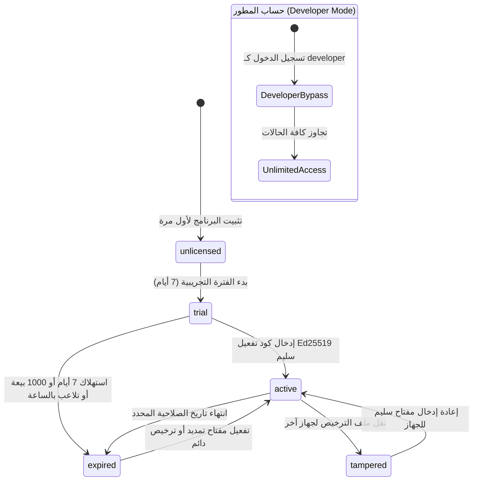

# تقرير تحليلي شامل: نظام التراخيص وحساب المطور في AN POS
## المعمارية المستقلة عن الإنترنت (Offline-First)، التشفير اللامركزي (Ed25519)، وصلاحيات المطور غير المحدودة

---

## 📑 فهرس التقرير

1. [الملخص التنفيذي](#1-الملخص-التنفيذي)
2. [فلسفة التصميم بدون إنترنت (Offline-First Architecture)](#2-فلسفة-التصميم-بدون-إنترنت-offline-first-architecture)
3. [المنظومة التشفيرية والرياضية (Ed25519 Asymmetric Verification)](#3-المنظومة-التشفيرية-والرياضية-ed25519-asymmetric-verification)
   - 3.1 فصل المفتاح العام عن المفتاح الخاص
   - 3.2 بنية البيانات الثنائية للمفتاح (84-Byte Payload Structure)
   - 3.3 صيغة كود التفعيل وملفات التراخيص (`.lic`)
4. [بصمة العتاد والحماية ضد الاستنساخ (Hardware Fingerprinting & Anti-Cloning)](#4-بصمة-العتاد-والحماية-ضد-الاستنساخ-hardware-fingerprinting--anti-cloning)
   - 4.1 خوارزميات الاستخراج حسب نظام التشغيل (Windows, Linux, macOS)
   - 4.2 الحماية الثنائية: الربط المشفر المسبق (Crypto-bound) والربط المحلي
5. [حساب المطور: الوصول الدائم غير المحدود (Developer Account & Unlimited Access)](#5-حساب-المطور-الوصول-الدائم-غير-المحدود-developer-account--unlimited-access)
   - 5.1 آلية الكشف البرمجي ودور المستخدم في النظام
   - 5.2 مصفوفة الامتيازات الاستثنائية
6. [دورة حياة الترخيص وحالات النظام الخمس (License State Machine)](#6-دورة-حياة-الترخيص-وحالات-النظام-الخمس-license-state-machine)
   - 6.1 الحالات وسلوك النظام عند كل منها
   - 6.2 محرك النسخة التجريبية (Trial Engine) ومكافحة التلاعب بالساعة (Clock Anti-Tampering)
7. [حوكمة العمليات الحساسة ونقاط الفحص في النظام (Security Enforcement Points)](#7-حوكمة-العمليات-الحساسة-ونقاط-الفحص-في-النظام-security-enforcement-points)
   - 7.1 مبيعات سطح المكتب (Desktop IPC Gate)
   - 7.2 مبيعات أجهزة الهاتف الجوال (HTTP REST API Gate)
   - 7.3 إقران الأجهزة المحمولة وحصص الاتصال (Mobile Pairing Limit Gate)
8. [أداة توليد التراخيص المستقلة (License Generator Suite)](#8-أداة-توليد-التراخيص-المستقلة-license-generator-suite)
9. [الخلاصة والتوصيات الهندسية](#9-الخلاصة-والتوصيات-الهندسية)

---

## 1. الملخص التنفيذي

صُمم نظام إدارة وتدقيق التراخيص في **AN POS** ليلبي المعايير الصارمة لبيئات نقاط البيع التجارية (Point of Sale)، حيث يُعد انقطاع الإنترنت أو عدم توفره أصلاً أمراً شائعاً ومقبولاً في بيئات العمل اليومية (Air-Gapped Environments).

يحقق النظام معادلة الأمان القصوى عبر دمج ثلاث ركائز هندسية:
1. **التحقق الرياضي اللامركزي المستقل**: بالاعتماد على خوارزمية التوقيع الرقمي ذات المنحنيات الإهليلجية **Ed25519**.
2. **الربط الفيزيائي بالعتاد (Hardware Binding)**: استخراج بصمة عتادية فريدة للجهاز تمنع تشغيل نفس المفتاح على أجهزة أخرى غير مرخصة.
3. **طبقة تجاوز الصلاحيات لحساب المطور (Developer Override)**: فتح وصول غير محدود لكافة ميزات النظام وربط حتى **999 جهاز جوال** بشكل دائم ومستمر لتسهيل الصيانة، الاختبار، وتطوير الأنظمة دون عوائق ترخيص.

---

## 2. فلسفة التصميم بدون إنترنت (Offline-First Architecture)

في أنظمة الـ POS التقليدية، يؤدي الاعتماد على "خادم ترخيص عبر الإنترنت (Cloud License Server)" إلى مشاكل حرجة:
- توقف حركة البيع في المحل عند انقطاع الإنترنت أو بطئه.
- تعرض الخادم السحابي للتوقف أو الحجب أو الهجمات مما يعطل مئات المتاجر دفعة واحدة.
- تكاليف استضافة مستمرة وصيانة لقواعد بيانات التراخيص المركزية.

### المقارنة المعمارية:
| وجه المقارنة | نظام AN POS (المعتمد) | أنظمة التراخيص السحابية التقليدية |
|---|---|---|
| **الاتصال بالإنترنت وقت التفعيل** | **غير مطلوب نهائياً (0% إنترنت)** | إلزامي للتحقق من المفتاح |
| **الاتصال بالإنترنت أثناء التشغيل والبيع** | **غير مطلوب إطلاقاً (Offline 100%)** | يتطلب "نبضة تحقق (Heartbeat)" دورية |
| **الاعتمادية على خوادم خارجية** | **استقلالية تامة (Zero External Dependencies)** | يتوقف النظام إذا تعطل الخادم السحابي |
| **سرعة التحقق** | **أقل من 1 ميلي ثانية (محلياً في الذاكرة)** | 300ms إلى 5000ms حسب سرعة الشبكة |
| **مقاومة القرصنة والتزوير** | **تشفير رياضي غير متماثل Ed25519** | عرضة للتجاوز عبر محاكاة الخادم (Mock Server / MITM) |

---

## 3. المنظومة التشفيرية والرياضية (Ed25519 Asymmetric Verification)

### 3.1 فصل المفتاح العام عن المفتاح الخاص
يعتمد الأمان على مبدأ التشفير غير المتماثل (Public-Key Cryptography):
- **المفتاح الخاص (Private Key - `ed25519`):**
  - بطول 64 بايت (PEM).
  - محفوظ حصرياً وسرياً لدى المطور / الناشر في أداة `license-generator/private-key.pem`.
  - لا يتم شحنه أو تضمينه إطلاقاً في حزمة برنامج سطح المكتب للعملاء.
- **المفتاح العام (Public Key - `ed25519`):**
  - بطول 32 بايت (PEM).
  - مضمن بشكل ثابت في الكود المصدري لسطح المكتب في المسار:
    `electron/main/license/keys.ts` (`PUBLIC_KEY_PEM`).
  - يُستخدم فقط لاختبار التوقيع الرياضي (Mathematical Verification). من الناحية التشفيرية، **يستحيل رياضياً** استخدام المفتاح العام لتوليد أي ترخيص جديد أو تعديل تاريخ أو صلاحيات ترخيص قائم.

### 3.2 بنية البيانات الثنائية للمفتاح (Binary License Payload)
يتم ضغط بيانات الترخيص في مصفوفة ثنائية مدمجة بحجم **20 بايت** فقط تليها **64 بايت** للتوقيع الرقمي (المجموع الإجمالي = **84 بايت**):

```text
 0                   1                   2                   3
 0 1 2 3 4 5 6 7 8 9 0 1 2 3 4 5 6 7 8 9 0 1 2 3 4 5 6 7 8 9 0 1
+-+-+-+-+-+-+-+-+-+-+-+-+-+-+-+-+-+-+-+-+-+-+-+-+-+-+-+-+-+-+-+-+
|                    storeId (6 Bytes ASCII)                    |
|                               +-+-+-+-+-+-+-+-+-+-+-+-+-+-+-+-+
|                               |     expiresAt (4 Bytes LE)    |
+-+-+-+-+-+-+-+-+-+-+-+-+-+-+-+-+-+-+-+-+-+-+-+-+-+-+-+-+-+-+-+-+
|  maxMobileDevices (2 Bytes LE)|      issuedAt (4 Bytes LE)    |
+-+-+-+-+-+-+-+-+-+-+-+-+-+-+-+-+-+-+-+-+-+-+-+-+-+-+-+-+-+-+-+-+
|                     flags / hwHashInt (4 Bytes LE)            |
+-+-+-+-+-+-+-+-+-+-+-+-+-+-+-+-+-+-+-+-+-+-+-+-+-+-+-+-+-+-+-+-+
|                                                               |
+                   Ed25519 Signature (64 Bytes)                +
|                                                               |
+-+-+-+-+-+-+-+-+-+-+-+-+-+-+-+-+-+-+-+-+-+-+-+-+-+-+-+-+-+-+-+-+
```

#### تفصيل الحقول في الـ 20 بايت الأولى:
1. **`storeId` (Bytes 0–5 - 6 Bytes):** معرّف المتجر الأبجدي الرقمي (مثل `ST0001` أو `SHOP01`).
2. **`expiresAt` (Bytes 6–9 - 4 Bytes UInt32LE):** طابع زمني بالثواني (Unix Timestamp) لانتهاء الترخيص. القيمة `0` تعني **ترخيص دائم مدى الحياة (Lifetime License)**.
3. **`maxMobileDevices` (Bytes 10–11 - 2 Bytes UInt16LE):** الحد الأقصى لأجهزة الهاتف المصرح بربطها مع نقطة البيع عبر خادم المزامنة المحلي.
4. **`issuedAt` (Bytes 12–15 - 4 Bytes UInt32LE):** تاريخ وساعة إصدار الترخيص.
5. **`flags` (Bytes 16–19 - 4 Bytes UInt32LE):** البصمة العتادية المقيدة رقمياً (`hwHashInt`). إذا كانت القيمة `0`، يكون الترخيص عاماً، وإذا كانت تحوي معرّف عتاد، يصبح الترخيص مشفراً ومحصوراً بجهاز الحاسوب المستهدف فقط (Crypto-bound).

### 3.3 صيغة كود التفعيل وملفات التراخيص
- يتم دمج الـ 84 بايت (20 بايت بيانات + 64 بايت توقيع) وترميزها بنظام **Base64**.
- يُقسم الناتج إلى كتل سهلة القراءة مفصولة بشرطات مسبوقة بالبادئة الرسمية:
  ```text
  ANPS-XXXXX-XXXXX-XXXXX-XXXXX-XXXXX-XXXXX-...
  ```
- أو يُحفظ في ملف ترخيص رسمي بامتداد `.lic` بتنسيق JSON:
  ```json
  {
    "storeId": "ST0001",
    "expiresAt": 0,
    "maxMobileDevices": 5,
    "key": "ANPS-AAAA...64bitSig...",
    "issuedAt": "2026-09-11T12:00:00.000Z"
  }
  ```

---

## 4. بصمة العتاد والحماية ضد الاستنساخ (Hardware Fingerprinting & Anti-Cloning)

لمنع مشاركة مفتاح التفعيل أو استنساخ ملفات البرنامج وقاعدة البيانات ونقلها إلى جهاز كاشير آخر، يمتلك النظام وحدة متخصصة في `electron/main/license/hardwareFingerprint.ts`.

### 4.1 خوارزميات الاستخراج حسب نظام التشغيل
تعتمد الوحدة على أوامر النظام المباشرة دون الحاجة لأي مكتبات خارجية ثقيلة (Native Zero-Dependency):

1. **نظام Windows (`win32`):**
   - استخراج معرّف التثبيت الفريد من السجل:
     `reg query "HKLM\SOFTWARE\Microsoft\Cryptography" /v MachineGuid`
   - بديل حديث مدعوم في Windows 11 (24H2) في حال عدم توفر أو تقييد الـ Registry:
     `powershell -NoProfile -Command "(Get-CimInstance -ClassName Win32_ComputerSystemProduct).UUID"`
2. **نظام Linux (`linux`):**
   - قراءة معرّف الجهاز الثابت من مسارات النظام الأساسية:
     `/etc/machine-id` أو `/var/lib/dbus/machine-id`.
3. **نظام macOS (`darwin`):**
   - استخراج الرقم التسلسلي للعتاد عبر أداة I/O Kit:
     `ioreg -rd1 -c IOPlatformExpertDevice` واقتناص قيمة `IOPlatformSerialNumber`.
4. **البديل الاحتياطي (Fallback):**
   - في حال تعذر الوصول لأي معرّف نظام أساسي، يتم دمج مواصفات المعالج، الذاكرة العشوائية الكلية، واسم المضيف:
     `FALLBACK:${platform}:${hostname}:${cpus}:${totalMem}`.

يتم تمرير المعرّف الخام مع Salt خاص بالنظام وتشفيره عبر **SHA-256**:
```ts
const hash = createHash('sha256')
  .update(`ANPOS-HW-SALT-v1:${rawIdentifier}`)
  .digest('hex');
const cachedFingerprint = hash.slice(0, 32).toUpperCase();
```

### 4.2 الحماية الثنائية: الربط المشفر والربط المحلي
يطبق النظام مستويين من الحماية العتادية في `licenseManager.ts`:
1. **الربط المشفر المسبق (Crypto-bound Flags):**
   - عند إصدار المفتاح، يمكن للناشر تضمين بصمة عتاد جهاز العميل.
   - تُحوّل أول 8 أحرف سداسية عشرية من البصمة إلى رقم 32-بت (`hwHashInt`).
   - يُدمج هذا الرقم داخل حقل `flags` في البيانات الموقّعة بواسطة Ed25519.
   - عند محاولة التفعيل على جهاز آخر، يفشل التفعيل فوراً برسالة:
     *"كود التفعيل هذا مشفر ومخصص لجهاز حاسوب آخر ولا يتطابق مع عتاد هذا الجهاز"*.
2. **الربط المحلي عند التفعيل (Local Hardware Binding):**
   - عند تفعيل مفتاح عام (غير مقيد مسبقاً بـ flags)، يتم تسجيل بصمة الجهاز الحالي في ملف التخزين المحلي المحمي `userData/license.json`.
   - إذا تم نسخ ملف `license.json` ونقله لجهاز آخر، يكتشف النظام عدم تطابق البصمة المحلية فوراً ويحول حالة الترخيص إلى `tampered`.

---

## 5. حساب المطور: الوصول الدائم غير المحدود (Developer Account & Unlimited Access)

### 5.1 آلية الكشف البرمجي ودور المستخدم
يحتوي نظام AN POS على دور مدمج للمستخدمين وهو دور المطور (`role: 'developer'`).
يتم فحص وضع المطور عبر الدالة المركزية `isDeveloperModeActive()` في `electron/main/handlers/auth.ts`:

```ts
export function isDeveloperModeActive(): boolean {
  if (activeDesktopUser?.role === 'developer') return true;
  try {
    const lastUser = queryOne(
      "SELECT role FROM users WHERE last_login IS NOT NULL ORDER BY last_login DESC LIMIT 1"
    );
    if (lastUser && lastUser.role === 'developer') return true;
  } catch {}
  return false;
}
```

- يتم التعرف على المطور إما من الجلسة النشطة الحالية لسطح المكتب (`activeDesktopUser`).
- أو من آخر مستخدم قام بتسجيل الدخول في قاعدة بيانات SQLite المحلية (`lastUser.role === 'developer'`) لضمان استمرار الصلاحيات حتى قبل تسجيل الدخول الصريح عند إعادة فتح التطبيق.

### 5.2 مصفوفة الامتيازات الاستثنائية لحساب المطور

| الميزة / القيد | وضع الترخيص العادي | وضع النسخة التجريبية | وضع حساب المطور (`developer`) |
|---|---|---|---|
| **حالة الترخيص المعادة (`isLicensed()`)** | `true` فقط إذا كان المفتاح صالحاً | `false` | **`true` دائماً ومطلقاً** |
| **الحد الأقصى لأجهزة الجوال المتصلة** | محدد في المفتاح (مثلاً 1 إلى 10) | 5 أجهزة افتراضياً | **999 جهاز جوال متصل** |
| **حظر المبيعات بعد انتهاء الصلاحية** | يُحظر البيع فور انتهاء التاريخ | يُحظر بعد 7 أيام أو 1000 بيعة | **لا يُحظر البيع إطلاقاً** |
| **عداد مبيعات التجربة (`salesCount`)** | غير نشط | يستهلك حتى 1000 عملية بيع | **معطل تماماً (لا يتم استهلاكه)** |
| **فحص التلاعب بالساعة (Clock Anti-Tampering)** | غير مطبق على التراخيص الدائمة | يقفل النظام إذا تراجعت الساعة > ساعة | **يتم تجاوزه بالكامل** |
| **الحاجة لكود تفعيل Ed25519** | إلزامي | غير مطلوب مؤقتاً | **غير مطلوب إطلاقاً** |

---

## 6. دورة حياة الترخيص وحالات النظام الخمس (License State Machine)

تتم إدارة حالة الترخيص عبر الفئة `LicenseManager` في `electron/main/license/licenseManager.ts`. يدعم النظام **5 حالات رئيسية**:



### 6.1 تفصيل الحالات الخمس:
1. **`active` (مفعّل ورسمي):**
   - تم التحقق من توقيع Ed25519 بنجاح.
   - البصمة العتادية مطابقة تماماً.
   - التاريخ سارٍ (أو ترخيص مدى الحياة `expiresAt = 0`).
   - إتاحة كافة عمليات البيع، وربط عدد الأجهزة المخصص في المفتاح.
2. **`trial` (فترة تجريبية):**
   - لا يوجد مفتاح ترخيص، ولكن الفترة التجريبية سارية (أقل من 7 أيام وأقل من 1000 فاتورة).
   - إتاحة البيع مع إظهار شريط تنبيهي بالأيام والمبيعات المتبقية.
   - الحد الأقصى للجوالات هو 5 أجهزة.
3. **`expired` (انتهت الصلاحية):**
   - انتهاء تاريخ الاشتراك في الترخيص المؤقت، أو استنفاد شروط النسخة التجريبية.
   - إغلاق إنشاء المبيعات الجديدة مع استمرار إمكانية تصفح التقارير والفواتير القديمة وتفعيل النظام.
4. **`tampered` (مفتاح مربوط بجهاز آخر / محاولة تلاعب):**
   - عدم تطابق بصمة العتاد المحلية مع المفتاح المخزن، أو التلاعب بمحتوى ملف `license.json`.
   - خفض عدد الأجهزة المسموح بها إلى جهاز واحد، وحظر المبيعات غير المرخصة.
5. **`unlicensed` (غير مرخص):**
   - الحالة الافتراضية عند عدم وجود ترخيص وعدم بدء فترة تجريبية.

### 6.2 محرك النسخة التجريبية (Trial Engine) ومكافحة التلاعب بالساعة
تُخزن بيانات التجربة في مسار النظام الدائم `userData/trial.json` بعيداً عن المتصفح (لمنع تجاوز التجربة عبر مسح الـ Cache أو localStorage):
- مدة التجربة الافتراضية: **7 أيام** (`DEFAULT_TRIAL_DAYS = 7`).
- الحد الأقصى للمبيعات: **1000 عملية بيع** (`DEFAULT_MAX_TRIAL_SALES = 1000`).
- **رصد التلاعب بالساعة (Clock Anti-Tampering):**
  يقوم النظام بحفظ الطابع الزمني لآخر عملية فحص `lastCheckedAt`. إذا قام المستخدم بتقديم ساعة الحاسوب إلى الوراء بأكثر من ساعة واحدة (`now < lastChecked - 3600000`) لمحاولة التحايل على فترة الـ 7 أيام، يعتبر النظام ذلك تلاعباً (`clockTampered = true`) ويقفل الفترة التجريبية فوراً ويحولها إلى `expired`.

---

## 7. حوكمة العمليات الحساسة ونقاط الفحص في النظام (Security Enforcement Points)

لا يقتصر فحص الترخيص على شاشة التفعيل في الواجهة الأمامية، بل يتم فرضه بعمق في طبقة النواة (Backend Kernel) لمنع أي محاولة تجاوز عبر تعديل كود الـ React:

### 7.1 مبيعات سطح المكتب (Desktop IPC Gate)
في `electron/main/ipc/sales.ts`:
```ts
ipcMain.handle('sales:create', async (_evt, data: Record<string, unknown>) => {
  if (!licenseManager.isLicensed()) {
    const trial = getStoredTrialStatus();
    if (trial.isExpired || trial.clockTampered) {
      throw new Error('TRIAL_EXPIRED: انتهت فترة التجربة المجانية أو تم رصد تلاعب بساعة النظام. يرجى تفعيل النسخة الرسمية للمتابعة.');
    }
    incrementStoredTrialSales();
  }
  return createSale(data);
});
```
*حساب المطور يتجاوز هذا الشرط تلقائياً لأن `licenseManager.isLicensed()` تُرجع `true`.*

### 7.2 مبيعات أجهزة الهاتف الجوال (HTTP REST API Gate)
في مسار خادم Fastify المحلي `electron/main/server/routes/sales.ts`:
```ts
server.post('/api/sales', async (request, reply) => {
  if (!licenseManager.isLicensed()) {
    const trial = getStoredTrialStatus();
    if (trial.isExpired || trial.clockTampered) {
      return reply.code(403).send({
        success: false,
        error: 'TRIAL_EXPIRED: انتهت فترة التجربة المجانية أو تم رصد تلاعب بساعة النظام. يرجى تفعيل النسخة الرسمية للمتابعة.',
      });
    }
    incrementStoredTrialSales();
  }
  // متابعة تسجيل البيع
});
```

### 7.3 إقران الأجهزة المحمولة وحصص الاتصال (Mobile Pairing Limit Gate)
في مسار الاقتران `electron/main/server/routes/pair.ts`:
```ts
const isDev = isDeveloperModeActive();
const maxAllowed = isDev ? 999 : licenseManager.getMaxMobileDevices();

if (!isDev && !existingDevice && currentCount >= maxAllowed) {
  return {
    error: {
      status: 403,
      detail: `تم الوصول للحد الأقصى لعدد الأجهزة المرخصة لهذا المتجر (${maxAllowed} أجهزة). يرجى فصل جهاز قديم أو ترقية الترخيص.`,
    },
  };
}
```
*يمنح حساب المطور حصة تبلغ 999 جهازاً، مما يتيح ربط واختبار أعداد غير محدودة من الهواتف في شبكة المحل المحلية.*

---

## 8. أداة توليد التراخيص المستقلة (License Generator Suite)

يحتوي المشروع على نظام متكامل ومستقل في مجلد `license-generator/`:
1. **واجهة تحكم رسومية متطورة (Web GUI):**
   - تعمل محلياً عبر `node ui.js` على المنفذ `http://localhost:5566`.
   - تمكّن الناشر من إدخال اسم العميل، هاتفه، مدة الاشتراك (مدى الحياة / سنة / شهر)، وأقصى عدد للأجهزة.
   - توليد الكود الرقمي وتحميل ملف الترخيص `.lic`.
   - ميزة الإرسال الفوري لبيانات الترخيص للعميل عبر **WhatsApp** بنص منسق وجاهز.
   - أرشفة التراخيص الصادرة في سجل محلي مع إمكانية التصدير إلى Excel (CSV).
2. **أداة سطر الأوامر (CLI Generator):**
   - لتوليد التراخيص السريعة والمقيدة عتادياً:
     ```bash
     # ترخيص مدى الحياة لمتجر مع 5 هواتف:
     node generate-license.js ST0001 0 5

     # ترخيص سنوي مقيد بـ Hardware Fingerprint محدد:
     node generate-license.js SHOP99 365 10 --fingerprint 7B3A9F1C2E8D4B0A
     ```

---

## 9. الخلاصة والتوصيات الهندسية

### خلاصة التحليل:
1. **الاستقلالية التامة (Air-Gapped & Offline-First):** نظام التراخيص في AN POS مستقل بنسبة 100% عن أي خوادم أو شبكة إنترنت، ويعمل بكفاءة مطلقة في المتاجر المعزولة.
2. **المتانة الرياضية (Ed25519 & Hardware Binding):** يضمن الجمع بين التوقيع الرقمي بمفاتيح المنحنيات الإهليلجية وبصمة العتاد الفريدة حماية تامة ضد التزوير أو إعادة الاستخدام غير المصرح به.
3. **مرونة حساب المطور (Developer Mode):** توفير وصول دائم غير محدود (`isLicensed() === true`) ورفع سقف الأجهزة إلى 999 جهاز يمثل حلاً هندسياً ذكياً يتيح للمطور وفريق الدعم الفني فحص وتشغيل وصيانة النظام دون أي عوائق تشغيلية.

### التوصيات الهندسية لمزيد من التحسين المستقبلي:
- **تشفير حقل البصمة في `license.json`:** تشفير ملف `license.json` بمفتاح مشتق من بصمة العتاد ذاتها لزيادة صعوبة قراءته يدوياً على أنظمة التشغيل المفتوحة.
- **تأكيد حساب المطور عبر Master Token اختياري:** في بيئات الإنتاج شديدة الحساسية، يمكن إضافة خيار حماية دور المطور برمز رئيسي (Master Secret) لضمان عدم إنشاء مستخدم بدور مطور بواسطة أشخاص غير مصرح لهم إذا كانت قاعدة البيانات متاحة محلياً.

---
**تم إعداد هذا التقرير التحليلي كمرجع توثيقي رسمي لمعمارية نظام التراخيص وحساب المطور في AN POS.**
