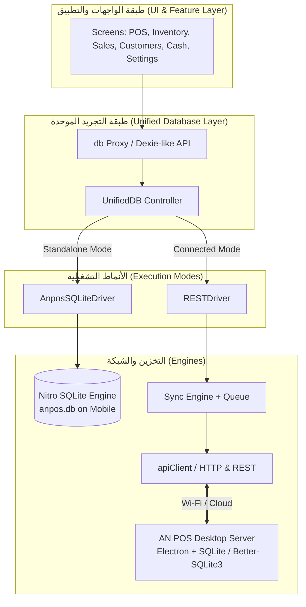
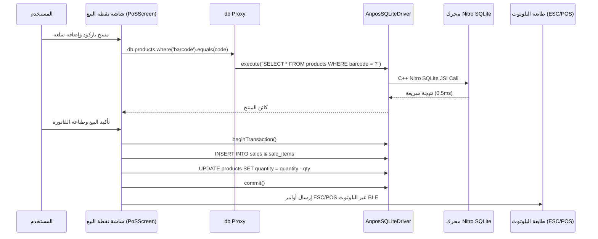
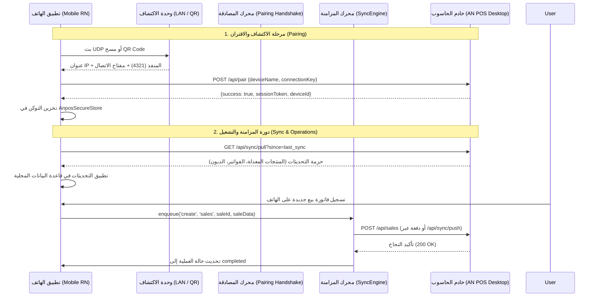
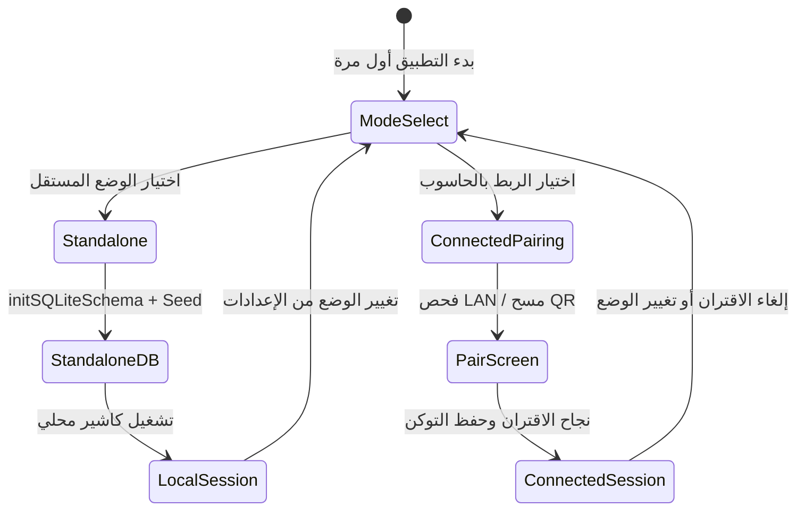

# التحليل المعماري والتقني الشامل: الوضع المستقل (Standalone) ونظام الربط مع الحاسوب (Connected Sync) في AN POS Mobile

---

## 1. الملخص التنفيذي (Executive Summary)

تم تصميم وتطوير تطبيق **AN POS Mobile** ليعمل بنظام معمارية هجينة ومرنة (**Hybrid Dual-Architecture**) تمنح أصحاب المتاجر والأنشطة التجارية حرية الاختيار بين نمطين تشغيليين رئيسيين:

1. **الوضع المستقل (Standalone Mode)**: تشغيل كامل ومستقل 100% على الهاتف الذكي، بدون الحاجة إلى جهاز كمبيوتر أو اتصال بالإنترنت، معتمداً على محرك قاعدة بيانات محلية فائقة السرعة (**Nitro SQLite**).
2. **وضع الربط والمزامنة مع الحاسوب (Desktop Connected & Sync Mode)**: تحويل الهاتف إلى محطة طرفية (Terminal)، أو جهاز كاشير إضافي، أو ماسح جرد متنقل مرتبط بالخادم الرئيسي لبرنامج **AN POS Desktop** عبر الشبكة المحلية (Wi-Fi/LAN) أو السحابة.



---

## 2. المعمارية الهندسية ومبادئ التصميم (Architecture & Core Principles)

### 2.1. طبقة التجريد الموحدة (`UnifiedDB` & `DataDriver`)
يستخدم النظام نمط التصميم **Strategy Pattern** و **Proxy Pattern** بحيث لا تحتاج شاشات التطبيق (مثل `PoSScreen`, `InventoryScreen`, `SalesScreen`) إلى معرفة ما إذا كانت البيانات تُقرأ من قاعدة بيانات SQLite المحلية على الهاتف أو من خادم الكمبيوتر عن طريق الشبكة:

* **واجهة المشغّل (`DataDriver`)**:
  تُعرّف عمليات البيانات الأساسية:
  ```typescript
  export interface DataDriver {
    type: 'sqlite' | 'rest';
    initialize(): Promise<void>;
    list<T>(table: string, options?: ListOptions): Promise<ListResult<T>>;
    get<T>(table: string, id: string): Promise<T | null>;
    create<T, R = T>(table: string, data: T): Promise<R>;
    update<T>(table: string, id: string, data: T): Promise<boolean>;
    remove(table: string, id: string): Promise<boolean>;
    batchCreate<T, R = T>(table: string, records: T[]): Promise<R[]>;
    batchUpdate<T>(table: string, records: T[]): Promise<number>;
    execute?(sql: string, params?: unknown[]): Promise<void>;
    beginTransaction?(): Promise<void>;
    commit?(): Promise<void>;
    rollback?(): Promise<void>;
  }
  ```

* **البروكسي السلس (`db Proxy`)**:
  يوفر صياغة برمجية تشبه مكتبة `Dexie.js` مع دعم دوال البحث والتصفية المباشرة:
  `await db.products.where('barcode').equals('123456').toArray()`
  يقوم البروكسي بتوجيه الاستعلام تلقائياً إلى المشغّل النشط (`AnposSQLiteDriver` أو `RESTDriver`).

---

## 3. التحليل المعماري للوضع المستقل (Standalone Mode Deep-Dive)

### 3.1. آلية العمل (Mechanics)
في هذا الوضع، يعمل الهاتف كنظام POS متكامل ومستقل بذاته دون أي ارتباط خارجي.



### 3.2. المكونات التقنية للوضع المستقل
1. **محرك البيانات (`react-native-nitro-sqlite`)**:
   - أداء فائق مبني على **JSI (JavaScript Interface)** المباشر بلغة C++ دون المرور عبر جسر React Native Bridge التقليدي.
   - دعم الترحيل الآلي للمخطط (`Schema Migrations`) مع دوال الأمان `CREATE_TABLES_SQL` و `ALTER TABLE`.
   - فهرسة كاملة (`Indexes`) على الأعمدة الحساسة (`barcode`, `sku`, `category_id`, `created_at`).
2. **البيانات الأولية والتجهيز الذاتي (`Seed & Provisioning`)**:
   - عند تشغيل التطبيق لأول مرة في الوضع المستقل، يتم تجهيز حساب المدير الافتراضي (`admin` / `1234`) مع صلاحيات كاملة `['*']`.
   - تجهيز قوالب الطباعة الافتراضية، تصنيفات تجريبية، ومستودع افتراضي رئيسي.
3. **الطباعة الحرارية المستقلة**:
   - الاتصال المباشر بطابعات الفواتير وملصقات الباركود الحرارية عبر **Bluetooth BLE / Bluetooth Classic** بمعيار `ESC/POS` أو `CPCL/TSPL`.

### 3.3. نقاط القوة (Strengths)
* **استقلالية مطلقة 100%**: لا يعتمد على اتصال شبكة، راوتر، أو خادم كمبيوتر.
* **سرعة واستجابة فورية (Zero Latency)**: قراءة وكتابة محلية في أجزاء من الميلي ثانية.
* **مثالي للمتاجر الصغيرة والمتنقلة**: سيارات التوزيع، الأكشاك، المعارض، والأنشطة الحرة.

### 3.4. التحديات والحدود (Limitations)
* تخزين البيانات محصور في الذاكرة المحلية للهاتف (يتطلب استخدام خاصية النسخ الاحتياطي اليدوي `Backup & Restore`).
* صعوبة تعدد البائعين المتزامنين على نفس المخزون دون جهاز مركزي.

---

## 4. التحليل المعماري لنظام الربط مع الحاسوب (Desktop Connected & Sync Mode)

### 4.1. آلية العمل (Mechanics)
في هذا الوضع، يكون خادم **AN POS Desktop** (المبني على Electron + Express API / WebSockets) هو **مصدر الحقيقة الموحد (Single Source of Truth)**.



### 4.2. بروتوكولات الاتصال والاقتران الأربعة (4 Pairing Protocols)

1. **البحث التلقائي في الشبكة المحلية (Auto LAN Discovery)**:
   - إرسال واستقبال حزم **UDP Broadcast / SSDP** على منفذ مخصص للتعرف الفوري على خوادم AN POS المفتوحة في المحل مع قياس زمن الاستجابة (Latency).
2. **مسح رمز الاستجابة السريعة (QR Code Pairing)**:
   - مسح الكود المعروض على شاشة الكمبيوتر، والذي يحتوي على صيغة مشفرة:
     `anpos://pair?host=192.168.1.100&port=4321&key=SEC_KEY_123`
3. **الإدخال اليدوي للعنوان (Manual IP & Port)**:
   - إدخال عنوان IP ومنفذ الخادم يدوياً مع إمكانية فحص الاتصال واختبار المنفذ.
4. **الربط السحابي (Cloud Relay / AN POS Cloud)**:
   - اتصال عبر الإنترنت باستخدام خادم وسيط (Cloud Relay) لإدارة الفروع المتعددة ومتابعة النشاط عن بعد.

### 4.3. محرك المزامنة وإدارة الطوابير (`SyncEngine`)
يمتلك التطبيق محرك مزامنة ذكي يتعامل مع انقطاع الشبكة بسلاسة:
* **طابور العمليات غير المتزامنة (`Queue`)**:
  عند إنشاء فاتورة أو تعديل عميل أثناء انقطاع إشارة Wi-Fi، يتم تسجيل العملية بحالة `pending` وتخزينها محلياً.
* **المعالجة الآلية عند عودة الاتصال (`processQueue`)**:
  بمجرد استعادة الاتصال، يقوم المحرك بجدولة دفع العمليات (`Push`) مع دعم إعادة المحاولة الآلية (`Exponential Backoff`) بحد أقصى 3 محاولات.
* **فض النزاعات (`Conflict Resolution`)**:
  يعتمد النظام سياسة الطابع الزمني وتحديثات الحقول (`Timestamp-based Last-Write-Wins`) مع تسجيل سجلات التدقيق (`audit_logs`) على جهاز الكمبيوتر.

---

## 5. مصفوفة المقارنة التقنية الشاملة (Technical Comparison Matrix)

| معيار المقارنة | الوضع المستقل (Standalone) | وضع الربط مع الحاسوب (Connected Sync) |
| :--- | :--- | :--- |
| **مصدر البيانات (Data Source)** | محلي على الهاتف (`SQLite anpos.db`) | خادم الكمبيوتر المركزي (`Desktop Backend`) |
| **الاعتمادية على الشبكة** | **0%** (يعمل بدون شبكة إطلاقاً) | يحتاج Wi-Fi للمزامنة المباشرة، مع دعم العمل أوفلاين |
| **زمن استجابة الاستعلامات** | فائق السرعة (< 1 ميلي ثانية) | سريع جداً محلياً (1-5 ميلي ثانية عبر Wi-Fi) |
| **تعدد نقاط البيع (Multi-POS)** | لا (جهاز واحد فقط) | **نعم** (عدة هواتف + حواسيب متصلة بنفس القاعدة) |
| **الطباعة (Printing)** | طابعات بلوتوث محمولة (BLE) | طابعات بلوتوث + طابعات الكمبيوتر المشتركة (USB/LAN) |
| **إدارة المخزون** | جرد ومبيعات محلية على الهاتف | مزامنة حية للمخزون ومنع البيع المزدوج |
| **الأمان وتشفير الجلسة** | تخزين محلي آمن في الهاتف | توكنات جلسة `x-session-token` + معرف الجهاز `x-device-id` |
| **النسخ الاحتياطي** | يدوي من شاشة النسخ الاحتياطي | مركزي وتلقائي على الحاسوب والسحابة |
| **حالات الاستخدام المثالية** | المتاجر الصغيرة، الباعة المتجولون، التوصيل | السوبرماركت، متاجر الملابس، نقاط البيع المتعددة |

---

## 6. دورة حياة التبديل بين الوضعين (Mode Switching Lifecycle)

يتيح التطبيق عبر شاشة **`ModeSelectScreen`** التبديل بين النمطين بمرونة عالية:



1. **التحويل إلى الوضع المستقل (`switchToStandalone`)**:
   - إغلاق جلسة RESTDriver.
   - تهيئة قاعدة بيانات SQLite المحلية وتطبيق أي هجرات جديدة.
   - حفظ النمط `standalone` في `AnposSecureStore`.
2. **التحويل إلى الوضع المتصل (`switchToConnected`)**:
   - حفظ عنوان الخادم `anpos_server_url`.
   - تهيئة مشغّل `RESTDriver` وبدء أول عملية سحب بيانات (`Initial Pull Sync`).
   - حفظ النمط `connected` في `AnposSecureStore`.

---

## 7. التوصيات الهندسية والتحسينات المستقبلية (Future Roadmap)

1. **دعم WebSocket / Server-Sent Events (SSE)**:
   - استبدال آلية الاستطلاع الدوري (`Polling Interval 30s`) بقنوات WebSocket حية لدفع تغييرات المخزون فورياً بين الأجهزة بأقل استهلاك للبطارية.
2. **مزامنة الفوارق المضغوطة (Delta Sync & CDC)**:
   - إرسال التغييرات فقط (`Changed fields only`) بدلاً من السجلات الكاملة لتقليل استهلاك بيانات الشبكة.
3. **محرك حسم النزاعات المتقدم (CRDT / Operational Transformation)**:
   - دعم التعديل المشترك على الفواتير المعلقة والطلبات السريعة دون أي تعارضات بيانية.
